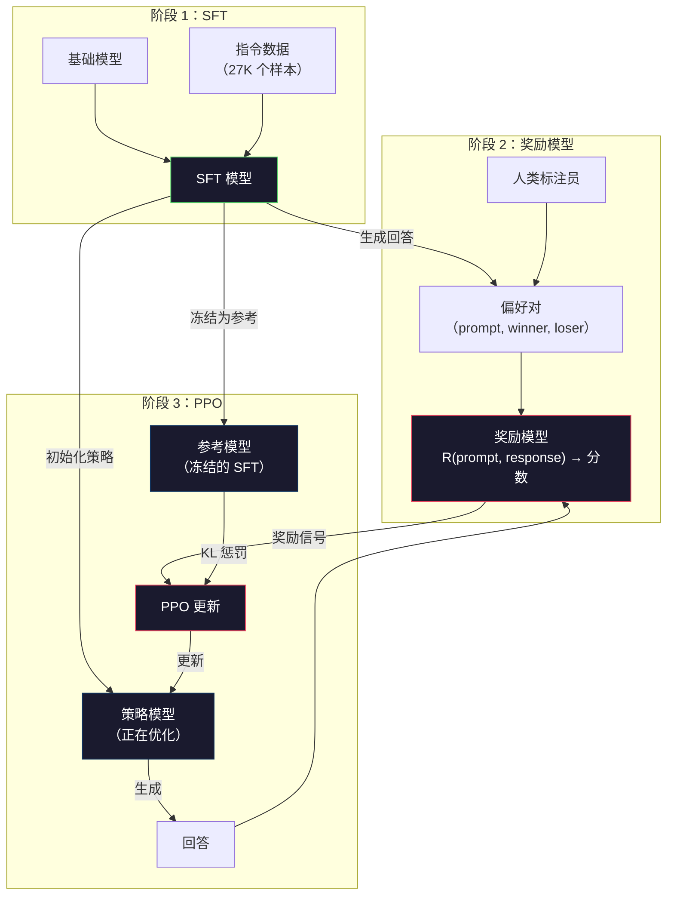
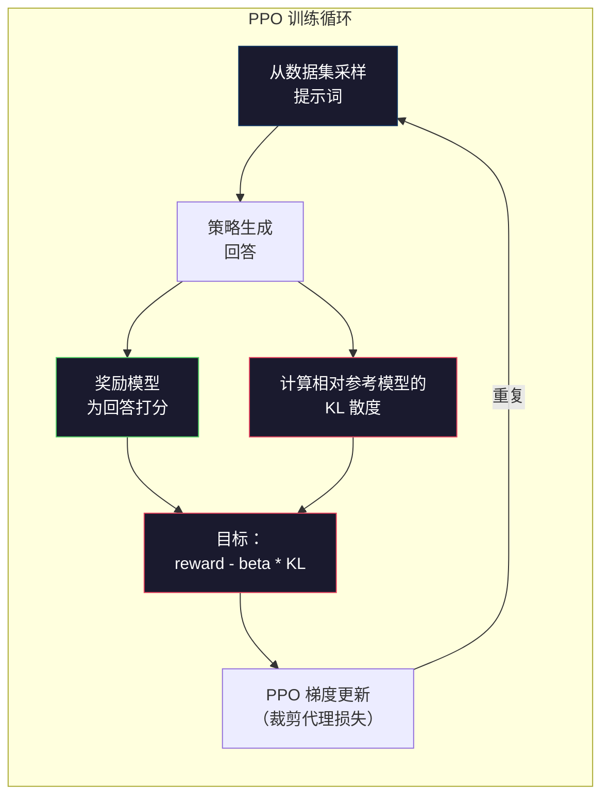

# RLHF：奖励模型（Reward Model）+ PPO

> 监督微调（SFT）会教模型遵循指令。但它不会教模型哪一个回答“更好”。两个语法正确、事实准确的答案，在有用性上可能天差地别。RLHF 就是把人类判断编码进模型行为的方法。这也是 Claude 更有帮助、GPT 更有礼貌的原因。

**类型：** 构建
**语言：** Python（使用 numpy）
**前置条件：** 第 10 阶段，第 06 课（指令微调 / SFT）
**时间：** ~90 分钟

## 学习目标

- 构建一个奖励模型（reward model），利用人类偏好对（首选 vs 拒绝）为回答质量打分
- 实现 PPO 训练循环，用 KL 惩罚让语言模型的策略（policy）针对奖励模型进行优化
- 解释为什么 RLHF 需要三个模型（SFT、奖励、策略），以及 KL 约束如何防止奖励黑客（reward hacking）
- 通过比较偏好优化前后的回答质量，评估 RLHF 的效果

## 问题

如果你让模型“解释量子计算”，它可能会输出：

**回答 A：** “量子计算使用量子比特（qubits），它们可以处于叠加态，这意味着它们可以同时是 0、1 或两者兼有。这使量子计算机能够在某些计算上比经典计算机快指数级。关键算法包括用于大数分解的 Shor 算法，以及用于搜索无序数据库的 Grover 算法。”

**回答 B：** “量子计算是一种利用量子力学现象的计算方式。它最早在 20 世纪 80 年代被提出。Richard Feynman 提出量子系统可以由量子计算机模拟。此后该领域有了显著发展。现在许多公司都在研究量子计算机。IBM、Google 等都取得了进展。Google 在 2019 年宣称实现了量子霸权。”

两个回答在事实层面都正确，语法也都没问题，也都遵循了指令。但回答 A 显然更好：它更简洁、信息量更高、结构也更清晰。人类每次都会选择 A。

SFT 无法捕捉这种区别。它会在“正确”的回答上训练模型，但没有机制表示“这个回答比那个更好”。它把每个训练样本都视为同样优秀。如果 A 和 B 都出现在 SFT 数据集中，模型会同等地从两者学习。

RLHF 解决了这个问题。它先训练一个奖励模型来预测人类会偏好哪种回答，再利用这个奖励信号推动语言模型朝着更高质量的输出移动。InstructGPT（ChatGPT 的前身）就使用 RLHF 显著提升了 GPT-3 的有用性、真实性和无害性。OpenAI 的内部评估者有 85% 的时间更偏好 InstructGPT 的输出，而 InstructGPT 的规模却小了 135 倍（13 亿 vs 1750 亿参数）。

## 概念

### 三个阶段

RLHF 不是一次单独的训练运行，而是一条由三个顺序阶段组成的流水线，每个阶段都建立在前一个阶段之上。

**阶段 1：SFT。** 在指令-回答对上训练基础模型（第 06 课）。这样你会得到一个能够遵循指令的模型，但它并不知道哪些回答比其他回答更好。

**阶段 2：奖励模型。** 收集人类偏好数据：向标注员展示同一个提示词（prompt）的两个回答，并问“哪个更好？”然后训练一个模型来预测这些偏好。奖励模型接收 (prompt, response) 作为输入，并输出一个标量分数。

**阶段 3：PPO。** 使用奖励模型为语言模型生成训练信号。语言模型生成回答，奖励模型为其打分，然后 PPO 更新语言模型，使其产生更高分的回答。KL 散度（KL divergence）惩罚会阻止语言模型偏离 SFT 检查点太远。



### 奖励模型

奖励模型是被重新用作评分器的语言模型。拿 SFT 模型来说，只需把语言建模头（language modeling head，输出词表分布）替换为标量头（scalar head，只输出一个数字）。除最后一层外，整个架构完全相同。

输入：一个提示词与回答拼接而成的序列。输出：一个标量奖励分数。

训练数据是人类偏好对。对于每个提示词，标注员会看到两个回答，并选出更好的那个。这会形成训练三元组：(prompt, preferred_response, rejected_response)。

损失函数使用 Bradley-Terry 成对偏好模型：

```
loss = -log(sigmoid(reward(preferred) - reward(rejected)))
```

这是关键方程。`sigmoid(reward(A) - reward(B))` 给出回答 A 胜过回答 B 的概率。这个损失会推动奖励模型给偏好回答分配更高分。

为什么使用成对比较，而不是绝对分数？因为人类很不擅长打绝对质量分（“这个回答是 10 分里的 7.3 还是 7.5？”），但非常擅长相对比较（“A 比 B 更好吗？”）。Bradley-Terry 模型会把相对比较转换成一致的绝对评分系统。

**InstructGPT 数据：** OpenAI 从 40 名合同工那里收集了 33,000 组比较对。每次比较大约耗时 5 分钟。这意味着仅奖励模型训练数据就花费了 2,750 小时的人类劳动。

### PPO：近端策略优化（Proximal Policy Optimization）

PPO 是一种强化学习算法。在 RLHF 中，“环境”是奖励模型，“智能体”是语言模型，“动作”是生成一个词元（token）。

目标函数：

```
maximize: E[R(prompt, response)] - beta * KL(policy || reference)
```

第一项推动模型生成高奖励回答。第二项（KL 散度惩罚）阻止模型偏离 SFT 检查点太远。

为什么需要 KL 惩罚？没有它，模型会找到退化解。奖励模型只是在有限的人类偏好数据集上训练出来的，它存在盲点。语言模型会利用这些盲点——找到那些在奖励模型上得分很高、但实际上毫无意义的输出。经典例子包括：

- 不断重复“我非常有帮助而且无害！”会在有用性/无害性奖励模型上得到高分
- 生成冗长、听起来正式却空洞的回答，只是模式匹配到了“高质量”
- 利用训练数据中恰好与高奖励相关的特定短语

KL 惩罚的意思是：你可以改进，但不能变成一个完全不同的模型。保持接近已经相当合理的 SFT 版本。一旦偏离过远，KL 成本就会压过奖励。

**InstructGPT 数据：** PPO 训练使用 lr=1.5e-5、KL 系数 beta=0.02、256K 个回合（episode，prompt-response 对），每个批次（batch）做 4 个 PPO 轮次（epoch）。整个 RLHF 流水线在一组 GPU 上跑了数天。



### PPO 目标详解

PPO 使用“裁剪代理目标（clipped surrogate objective）”来防止更新幅度过大。新策略和旧策略概率之间的比值会被裁剪到 [1 - epsilon, 1 + epsilon] 区间内，其中 epsilon 通常为 0.2。

```
ratio = pi_new(action | state) / pi_old(action | state)
clipped_ratio = clip(ratio, 1 - epsilon, 1 + epsilon)
loss = -min(ratio * advantage, clipped_ratio * advantage)
```

优势函数（advantage function）用于估计当前回答比预期质量好多少。在 RLHF 中：

```
advantage = reward(prompt, response) - baseline
```

基线（baseline）往往是最近一批回答的平均奖励。正的 advantage 表示该回答高于平均水平；负的 advantage 表示它低于平均水平。PPO 会提高高于平均水平回答的概率，并降低低于平均水平回答的概率。

裁剪机制可以防止灾难性更新。如果某一个回答拿到了异常高的奖励，未裁剪的 ratio 可能会非常大，导致模型朝着该回答剧烈偏移。裁剪会给更新设上限，从而保持训练稳定。

### 奖励黑客

这是 RLHF 的阴暗面。语言模型针对奖励模型进行优化，而奖励模型只是人类偏好的不完美代理。随着语言模型越来越擅长最大化奖励，它会开始利用奖励模型的弱点。

常见失败模式：

| 失败模式 | 会发生什么 | 原因 |
|---------|-------------|-----|
| 冗长 | 模型生成越来越长的回答 | 人类标注员往往更偏好更长、更详细的回答，所以奖励模型会给长度更高的分数 |
| 迎合 | 模型认同用户说的一切 | 标注员更偏好与问题前提保持一致的回答 |
| 回避表态 | 模型拒绝明确给出答案 | 模糊保守的回答（“这是一个复杂话题，有很多不同视角……”）很少被判错 |
| 格式投机 | 模型过度使用项目符号和标题 | 带格式的回答在标注员看来更“精致” |

缓解策略包括：更强的 KL 惩罚（阻止模型偏离到足以利用弱点的程度）、在对抗样本上训练奖励模型（修补已知失败模式），以及使用多个不同架构的奖励模型（让模型更难同时全部钻空子）。

### 真实 RLHF 流水线

| 模型 | 对比对数 | 标注员 | RM 大小 | PPO 步数 | KL 系数 |
|-------|-----------------|------------|---------|-----------|----------|
| InstructGPT | 33K | 40 | 6B | 256K | 0.02 |
| Llama 2 Chat | ~1M | 未披露 | 70B | 未披露 | 0.01 |
| Claude | 未披露 | 未披露 | 未披露 | 未披露 | 未披露 |
| Anthropic RLHF 论文 | 22K | 20 | 52B | 50K | 0.001 |

Anthropic 在 2022 年的论文中，用 22,000 组比较对训练了一个 52B 的奖励模型。更大的奖励模型能产生更可靠的信号，从而让 PPO 训练更稳定。用一个小奖励模型去训练大型语言模型风险很高——奖励模型的容量不足以捕捉好回答与坏回答之间的细微差别。

## 动手构建

### 第 1 步：合成偏好数据

在生产环境中，偏好数据由人工标注员创建。这里我们创建一些合成样本对，其中“preferred”回答在客观上更好（更简洁、更准确、更有帮助）。

```python
import numpy as np

PREFERENCE_DATA = [
    {
        "prompt": "What is the capital of France?",
        "preferred": "The capital of France is Paris.",
        "rejected": "France is a country in Europe. It has many cities. The capital is Paris. Paris is known for the Eiffel Tower.",
    },
    {
        "prompt": "Explain gravity in one sentence.",
        "preferred": "Gravity is the force that attracts objects with mass toward each other.",
        "rejected": "Gravity is something that makes things fall down when you drop them.",
    },
    {
        "prompt": "What is 15 times 7?",
        "preferred": "15 times 7 is 105.",
        "rejected": "Let me think about this. 15 times 7. Well, 10 times 7 is 70, and 5 times 7 is 35, so the answer might be around 105.",
    },
    {
        "prompt": "Name three programming languages.",
        "preferred": "Python, Rust, and TypeScript.",
        "rejected": "There are many programming languages. Some popular ones include various languages like Python and others.",
    },
    {
        "prompt": "What year did World War II end?",
        "preferred": "World War II ended in 1945.",
        "rejected": "World War II was a major global conflict. It involved many countries. The war ended in the mid-1940s, specifically in 1945.",
    },
    {
        "prompt": "Define machine learning.",
        "preferred": "Machine learning is a field where algorithms learn patterns from data to make predictions without being explicitly programmed.",
        "rejected": "Machine learning is a type of AI. AI stands for artificial intelligence. Machine learning uses data to learn.",
    },
]
```

首选回答简洁直接。被拒绝的回答则体现了常见失败模式：不必要的填充、模糊保守、重复解释以及不精确。这正是 SFT 无法捕捉、但 RLHF 可以捕捉的那类区别。

### 第 2 步：奖励模型架构

奖励模型复用了 mini GPT 的 Transformer（transformer）架构，但把按词表大小输出的头替换成了单个标量投影。

```python
import sys
import os
sys.path.insert(0, os.path.join(os.path.dirname(__file__), "..", "..", "04-pre-training-mini-gpt", "code"))
from main import MiniGPT, LayerNorm, Embedding, TransformerBlock


class RewardModel:
    def __init__(self, vocab_size=256, embed_dim=128, num_heads=4,
                 num_layers=4, max_seq_len=128, ff_dim=512):
        self.embedding = Embedding(vocab_size, embed_dim, max_seq_len)
        self.blocks = [
            TransformerBlock(embed_dim, num_heads, ff_dim)
            for _ in range(num_layers)
        ]
        self.ln_f = LayerNorm(embed_dim)
        self.reward_head = np.random.randn(embed_dim) * 0.02

    def forward(self, token_ids):
        seq_len = token_ids.shape[-1]
        mask = np.triu(np.full((seq_len, seq_len), -1e9), k=1)

        x = self.embedding.forward(token_ids)
        for block in self.blocks:
            x = block.forward(x, mask)
        x = self.ln_f.forward(x)

        last_hidden = x[:, -1, :]
        reward = last_hidden @ self.reward_head

        return reward
```

奖励模型会取**最后一个** token 位置的隐藏状态，并将其投影成一个标量。为什么是最后一个 token？因为因果注意力掩码（causal attention mask）意味着最后一个位置已经看过此前的所有 token。它拥有对整个（prompt, response）序列最完整的表示。

### 第 3 步：Bradley-Terry 损失

使用 Bradley-Terry 成对损失，在偏好对上训练奖励模型。

```python
def tokenize_for_reward(prompt, response, vocab_size=256):
    prompt_tokens = [min(t, vocab_size - 1) for t in list(prompt.encode("utf-8"))]
    response_tokens = [min(t, vocab_size - 1) for t in list(response.encode("utf-8"))]
    return prompt_tokens + [0] + response_tokens


def sigmoid(x):
    return np.where(
        x >= 0,
        1.0 / (1.0 + np.exp(-x)),
        np.exp(x) / (1.0 + np.exp(x))
    )


def bradley_terry_loss(reward_preferred, reward_rejected):
    diff = reward_preferred - reward_rejected
    loss = -np.log(sigmoid(diff) + 1e-8)
    return loss


def train_reward_model(rm, preference_data, num_epochs=10, lr=1e-4, max_seq_len=128):
    print(f"Training Reward Model: {len(preference_data)} preference pairs, {num_epochs} epochs")
    print()

    losses = []
    accuracies = []

    for epoch in range(num_epochs):
        epoch_loss = 0.0
        epoch_correct = 0
        num_pairs = 0

        indices = np.random.permutation(len(preference_data))

        for idx in indices:
            pair = preference_data[idx]

            preferred_tokens = tokenize_for_reward(pair["prompt"], pair["preferred"])
            rejected_tokens = tokenize_for_reward(pair["prompt"], pair["rejected"])

            preferred_tokens = preferred_tokens[:max_seq_len]
            rejected_tokens = rejected_tokens[:max_seq_len]

            preferred_ids = np.array(preferred_tokens).reshape(1, -1)
            rejected_ids = np.array(rejected_tokens).reshape(1, -1)

            r_preferred = rm.forward(preferred_ids)[0]
            r_rejected = rm.forward(rejected_ids)[0]

            loss = bradley_terry_loss(r_preferred, r_rejected)

            if r_preferred > r_rejected:
                epoch_correct += 1

            diff = r_preferred - r_rejected
            grad = sigmoid(diff) - 1.0

            rm.reward_head -= lr * grad * rm.ln_f.forward(
                rm.embedding.forward(preferred_ids)
            )[:, -1, :].flatten()

            epoch_loss += loss
            num_pairs += 1

        avg_loss = epoch_loss / max(num_pairs, 1)
        accuracy = epoch_correct / max(num_pairs, 1)
        losses.append(avg_loss)
        accuracies.append(accuracy)

        if epoch % 2 == 0:
            print(f"  Epoch {epoch + 1:3d} | Loss: {avg_loss:.4f} | Accuracy: {accuracy:.1%}")

    return rm, losses, accuracies
```

准确率指标很直接：奖励模型把多少比例的偏好对排对了顺序？随机模型大约是 50%。在干净数据上训练良好的奖励模型应该能超过 70%。InstructGPT 的奖励模型在留出比较集上达到了大约 72% 的准确率，听起来不高，但其实已经不错——很多偏好对即使对人类来说也很模糊（标注员间一致性大约只有 73%）。

### 第 4 步：简化版 PPO 循环

完整的 PPO 很复杂。这个实现抓住了核心机制：生成回答、为其打分、计算优势（advantage），然后用 KL 惩罚更新策略。

```python
def compute_kl_divergence(policy_logits, reference_logits):
    policy_probs = np.exp(policy_logits - policy_logits.max(axis=-1, keepdims=True))
    policy_probs = policy_probs / policy_probs.sum(axis=-1, keepdims=True)
    policy_probs = np.clip(policy_probs, 1e-10, 1.0)

    ref_probs = np.exp(reference_logits - reference_logits.max(axis=-1, keepdims=True))
    ref_probs = ref_probs / ref_probs.sum(axis=-1, keepdims=True)
    ref_probs = np.clip(ref_probs, 1e-10, 1.0)

    kl = np.sum(policy_probs * np.log(policy_probs / ref_probs), axis=-1)
    return kl.mean()


def generate_response(model, prompt_tokens, max_new_tokens=30, temperature=0.8, max_seq_len=128):
    tokens = list(prompt_tokens)

    for _ in range(max_new_tokens):
        context = np.array(tokens[-max_seq_len:]).reshape(1, -1)
        logits = model.forward(context)
        next_logits = logits[0, -1, :]

        next_logits = next_logits / max(temperature, 1e-8)
        probs = np.exp(next_logits - next_logits.max())
        probs = probs / probs.sum()
        probs = np.clip(probs, 1e-10, 1.0)
        probs = probs / probs.sum()

        next_token = np.random.choice(len(probs), p=probs)
        tokens.append(int(next_token))

    return tokens


def copy_model_weights(source, target):
    target.embedding.token_embed = source.embedding.token_embed.copy()
    target.embedding.pos_embed = source.embedding.pos_embed.copy()
    target.ln_f.gamma = source.ln_f.gamma.copy()
    target.ln_f.beta = source.ln_f.beta.copy()
    for s_block, t_block in zip(source.blocks, target.blocks):
        t_block.attn.W_q = s_block.attn.W_q.copy()
        t_block.attn.W_k = s_block.attn.W_k.copy()
        t_block.attn.W_v = s_block.attn.W_v.copy()
        t_block.attn.W_out = s_block.attn.W_out.copy()
        t_block.ffn.W1 = s_block.ffn.W1.copy()
        t_block.ffn.W2 = s_block.ffn.W2.copy()
        t_block.ffn.b1 = s_block.ffn.b1.copy()
        t_block.ffn.b2 = s_block.ffn.b2.copy()
        t_block.ln1.gamma = s_block.ln1.gamma.copy()
        t_block.ln1.beta = s_block.ln1.beta.copy()
        t_block.ln2.gamma = s_block.ln2.gamma.copy()
        t_block.ln2.beta = s_block.ln2.beta.copy()


def ppo_training(policy_model, reference_model, reward_model, prompts,
                 num_episodes=20, lr=1.5e-5, kl_coeff=0.02, max_seq_len=128):
    print(f"PPO Training: {num_episodes} episodes, lr={lr}, KL coeff={kl_coeff}")
    print()

    rewards_history = []
    kl_history = []

    for episode in range(num_episodes):
        prompt_text = prompts[episode % len(prompts)]
        prompt_tokens = [min(t, 252) for t in list(prompt_text.encode("utf-8"))]

        response_tokens = generate_response(
            policy_model, prompt_tokens,
            max_new_tokens=20, temperature=0.8, max_seq_len=max_seq_len
        )

        response_ids = np.array(response_tokens[:max_seq_len]).reshape(1, -1)
        reward = reward_model.forward(response_ids)[0]

        policy_logits = policy_model.forward(response_ids)
        ref_logits = reference_model.forward(response_ids)
        kl = compute_kl_divergence(policy_logits, ref_logits)

        total_reward = reward - kl_coeff * kl

        rewards_history.append(float(reward))
        kl_history.append(float(kl))

        for block in policy_model.blocks:
            update_scale = lr * total_reward
            block.ffn.W1 += update_scale * np.random.randn(*block.ffn.W1.shape) * 0.01
            block.ffn.W2 += update_scale * np.random.randn(*block.ffn.W2.shape) * 0.01

        if episode % 5 == 0:
            avg_reward = np.mean(rewards_history[-5:]) if rewards_history else 0
            avg_kl = np.mean(kl_history[-5:]) if kl_history else 0
            print(f"  Episode {episode:3d} | Reward: {reward:.4f} | KL: {kl:.4f} | "
                  f"Avg Reward: {avg_reward:.4f}")

    return policy_model, rewards_history, kl_history
```

核心循环是：（1）采样一个提示词，（2）生成一个回答，（3）用奖励模型为它打分，（4）相对于冻结参考模型计算 KL 散度，（5）计算调整后的奖励（奖励减去 KL 惩罚），（6）更新策略。随着策略逐渐偏离参考模型，KL 惩罚会增大，从而自动阻止奖励黑客。

### 第 5 步：奖励分数对比

经过 RLHF 之后，策略模型的回答在奖励模型上的得分应该高于原始 SFT 模型的回答。

```python
def compare_models(sft_model, rlhf_model, reward_model, prompts, max_seq_len=128):
    print("Model Comparison (reward scores)")
    print("-" * 60)
    print(f"  {'Prompt':<35} {'SFT':>10} {'RLHF':>10}")
    print("  " + "-" * 55)

    sft_total = 0.0
    rlhf_total = 0.0

    for prompt in prompts:
        prompt_tokens = [min(t, 252) for t in list(prompt.encode("utf-8"))]

        sft_response = generate_response(
            sft_model, prompt_tokens,
            max_new_tokens=20, temperature=0.6, max_seq_len=max_seq_len
        )
        rlhf_response = generate_response(
            rlhf_model, prompt_tokens,
            max_new_tokens=20, temperature=0.6, max_seq_len=max_seq_len
        )

        sft_ids = np.array(sft_response[:max_seq_len]).reshape(1, -1)
        rlhf_ids = np.array(rlhf_response[:max_seq_len]).reshape(1, -1)

        sft_reward = reward_model.forward(sft_ids)[0]
        rlhf_reward = reward_model.forward(rlhf_ids)[0]

        sft_total += sft_reward
        rlhf_total += rlhf_reward

        truncated_prompt = prompt[:33] + ".." if len(prompt) > 35 else prompt
        print(f"  {truncated_prompt:<35} {sft_reward:>10.4f} {rlhf_reward:>10.4f}")

    n = len(prompts)
    print("  " + "-" * 55)
    print(f"  {'Average':<35} {sft_total/n:>10.4f} {rlhf_total/n:>10.4f}")

    return sft_total / n, rlhf_total / n
```

## 使用它

### 完整 RLHF 流水线演示

```python
if __name__ == "__main__":
    np.random.seed(42)

    print("=" * 70)
    print("RLHF PIPELINE: REWARD MODEL + PPO")
    print("=" * 70)
    print()

    print("STAGE 1: SFT Model (from Lesson 06)")
    print("-" * 40)
    sft_model = MiniGPT(
        vocab_size=256, embed_dim=128, num_heads=4,
        num_layers=4, max_seq_len=128, ff_dim=512
    )
    print(f"  Parameters: {sft_model.count_parameters():,}")
    print()

    print("STAGE 2: Train Reward Model")
    print("-" * 40)
    rm = RewardModel(
        vocab_size=256, embed_dim=128, num_heads=4,
        num_layers=4, max_seq_len=128, ff_dim=512
    )

    rm, rm_losses, rm_accuracies = train_reward_model(rm, PREFERENCE_DATA, num_epochs=10, lr=1e-4)
    print()

    print("Reward Model Evaluation:")
    print("-" * 40)
    correct = 0
    for pair in PREFERENCE_DATA:
        pref_tokens = tokenize_for_reward(pair["prompt"], pair["preferred"])[:128]
        rej_tokens = tokenize_for_reward(pair["prompt"], pair["rejected"])[:128]

        r_pref = rm.forward(np.array(pref_tokens).reshape(1, -1))[0]
        r_rej = rm.forward(np.array(rej_tokens).reshape(1, -1))[0]

        if r_pref > r_rej:
            correct += 1
        print(f"  Preferred: {r_pref:+.4f} | Rejected: {r_rej:+.4f} | {'Correct' if r_pref > r_rej else 'Wrong'}")

    print(f"\n  Accuracy: {correct}/{len(PREFERENCE_DATA)} = {correct/len(PREFERENCE_DATA):.1%}")
    print()

    print("STAGE 3: PPO Training")
    print("-" * 40)

    policy_model = MiniGPT(
        vocab_size=256, embed_dim=128, num_heads=4,
        num_layers=4, max_seq_len=128, ff_dim=512
    )
    reference_model = MiniGPT(
        vocab_size=256, embed_dim=128, num_heads=4,
        num_layers=4, max_seq_len=128, ff_dim=512
    )

    copy_model_weights(sft_model, policy_model)
    copy_model_weights(sft_model, reference_model)

    train_prompts = [pair["prompt"] for pair in PREFERENCE_DATA]

    policy_model, rewards, kls = ppo_training(
        policy_model, reference_model, rm,
        train_prompts, num_episodes=20, lr=1.5e-5, kl_coeff=0.02
    )
    print()

    print("=" * 70)
    print("COMPARISON: SFT vs RLHF")
    print("=" * 70)
    print()

    eval_prompts = [
        "What is the capital of France?",
        "Explain gravity.",
        "Name three programming languages.",
    ]

    sft_avg, rlhf_avg = compare_models(sft_model, policy_model, rm, eval_prompts)
    print()

    print("=" * 70)
    print("KL DIVERGENCE ANALYSIS")
    print("=" * 70)
    print()

    if kls:
        print(f"  Initial KL: {kls[0]:.4f}")
        print(f"  Final KL:   {kls[-1]:.4f}")
        print(f"  Max KL:     {max(kls):.4f}")
        kl_threshold = 0.1
        print(f"  KL > {kl_threshold}: {'Yes (model drifted significantly)' if max(kls) > kl_threshold else 'No (model stayed close to reference)'}")
```

## 交付成果

这一课会产出 `outputs/prompt-reward-model-designer.md`——一个用于设计奖励模型训练流水线的提示词。给定目标行为（有用性、编码能力、安全性），它会生成数据收集协议、标注员指南以及奖励模型评估标准。

## 练习

1. 修改奖励模型，让它使用所有隐藏状态的均值，而不是只使用最后一个位置。比较准确率。均值池化方法会给每个 token 相同的权重，而最后位置方法依赖因果注意力来聚合信息。请在这 6 组偏好对上测试，并报告哪种方法准确率更高。

2. 实现奖励模型校准。训练结束后，把所有偏好对送入奖励模型，并计算：（a）偏好回答的平均奖励，（b）拒绝回答的平均奖励，（c）两者的间隔（偏好减去拒绝）。一个校准良好的模型应该有清晰的间隔。然后再加入 4 组新的偏好对，检查这个间隔在未见数据上是否仍然成立。

3. 模拟奖励黑客。创建一个会给长回答高分的奖励模型（reward = len(response) / 100）。使用这个有缺陷的奖励模型运行 PPO，观察策略模型如何生成越来越长、越来越重复的输出。然后加入 0.1 的 KL 惩罚，并展示它如何阻止这种退化行为。

4. 实现多目标奖励。训练两个奖励模型——一个针对有用性，一个针对简洁性。将它们组合为 R = 0.7 * R_helpful + 0.3 * R_concise。展示组合目标如何产生既有帮助又简洁的回答，从而避开单一有用性奖励带来的冗长陷阱。

5. 比较不同的 KL 系数。分别用 beta=0.001（太低，会奖励黑客）、beta=0.02（标准）、beta=0.5（太高，几乎学不到东西）运行 PPO。为每次运行绘制奖励曲线和 KL 曲线。beta=0.02 的运行应该表现为奖励稳步提升，同时 KL 保持有界。

## 关键术语

| 术语 | 人们怎么说 | 实际含义 |
|------|-----------|----------|
| RLHF | “用人类反馈训练” | 基于人类反馈的强化学习（Reinforcement Learning from Human Feedback）：一个三阶段流水线（SFT、奖励模型、PPO），利用人类偏好信号来优化语言模型输出 |
| 奖励模型（Reward model） | “给回答打分的模型” | 一个带有标量输出头的 Transformer 模型，使用 Bradley-Terry 损失在成对人类偏好上训练 |
| Bradley-Terry | “比较模型” | 一个概率模型，其中 P(A > B) = sigmoid(score(A) - score(B))，把成对偏好转换为一致的评分函数 |
| PPO | “那个 RL 算法” | 近端策略优化（Proximal Policy Optimization）：更新策略以最大化奖励，同时裁剪更新幅度以防止不稳定 |
| KL 散度（KL divergence） | “两个分布有多不一样” | 衡量策略模型 token 分布与参考模型之间差异的度量——在这里被用作惩罚项，以防止奖励黑客 |
| KL 惩罚（KL penalty） | “拴住模型的绳子” | 从奖励信号中减去 Beta * KL(policy \|\| reference)——防止策略偏离 SFT 检查点太远 |
| 奖励黑客（Reward hacking） | “钻奖励空子” | 当策略通过利用奖励模型的弱点，而不是真正提升质量，来找到退化但高奖励的输出 |
| 偏好对（Preference pair） | “A 和 B 哪个更好？” | 一个由 (prompt, preferred_response, rejected_response) 组成的训练样本——RLHF 训练数据的基本单位 |
| 参考模型（Reference model） | “冻结的 SFT 检查点” | SFT 模型的一份拷贝，其权重永不变化——作为 KL 散度计算的锚点 |

## 延伸阅读

- [Ouyang et al., 2022 -- Training language models to follow instructions with human feedback (InstructGPT)](https://arxiv.org/abs/2203.02155) —— 让 RLHF 在大型语言模型上真正落地的论文
- [Schulman et al., 2017 -- Proximal Policy Optimization Algorithms](https://arxiv.org/abs/1707.06347) —— OpenAI 最初的 PPO 论文
- [Bai et al., 2022 -- Training a Helpful and Harmless Assistant with Reinforcement Learning from Human Feedback](https://arxiv.org/abs/2204.05862) —— Anthropic 的 RLHF 论文，详细分析了奖励黑客和 KL 惩罚
- [Stiennon et al., 2020 -- Learning to summarize with human feedback](https://arxiv.org/abs/2009.01325) —— 将 RLHF 应用于摘要任务，展示奖励模型可以捕捉细腻的质量判断
- [Christiano et al., 2017 -- Deep reinforcement learning from human preferences](https://arxiv.org/abs/1706.03741) —— 从人类比较中学习奖励函数的奠基性工作
