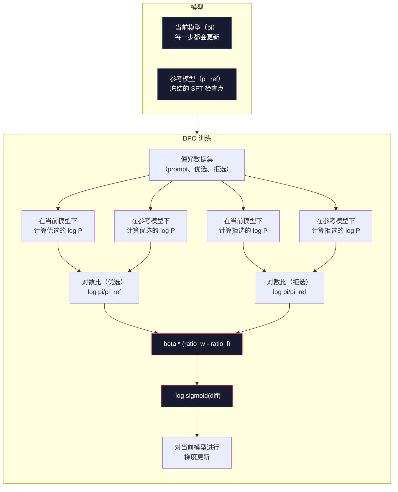

# DPO：直接偏好优化（Direct Preference Optimization）

> RLHF（基于人类反馈的强化学习）有效。但它还要求训练三个模型（SFT、奖励模型（reward model）、策略（policy）），管理 PPO 的不稳定性，并调节 KL 惩罚。DPO 提出一个问题：如果你可以跳过这一切，会怎样？DPO 直接在偏好对（preference pairs）上优化语言模型。没有奖励模型。没有 PPO。一个训练循环（training loop）。相近的结果。

**类型：** 构建
**语言：** Python（使用 numpy）
**前置条件：** 第 10 阶段，第 07 课（RLHF）
**耗时：** ~90 分钟

## 学习目标

- 实现 DPO 训练，在没有单独奖励模型的情况下，直接在偏好对上优化语言模型
- 推导 DPO 损失函数，并解释它如何通过策略的对数概率隐式表示奖励模型
- 从训练稳定性、计算成本和所需模型数量等方面比较 DPO 与 RLHF
- 调整 beta 参数，控制训练后的策略与参考模型之间的偏离程度

## 问题

你在第 07 课中构建了一个 RLHF 流水线。三个阶段。三个模型。SFT 模型、奖励模型，以及用 PPO 优化的策略模型。仅奖励模型本身就需要数千个人类偏好对和一个单独的训练循环。PPO 则需要仔细调节 KL 系数、学习率、裁剪比率和训练轮数。

在实践中，PPO 训练以极不稳定而闻名。超参数稍有变化，训练就会发散。奖励模型只是人类偏好的不完美代理，而策略总能找到办法利用它的弱点。KL 惩罚有所帮助，但它本身也需要调参——太低会出现奖励黑客（reward hacking），太高则模型几乎学不到东西。

这种复杂性正是为什么在 InstructGPT 发布后的许多年里，大多数开源模型在 RLHF 上都步履维艰。这个三阶段流水线很脆弱。每个阶段都有自己的失效模式，而错误会层层累积。

2023 年 5 月，Stanford 的 Rafael Rafailov、Archit Sharma 及其同事发表了论文《Direct Preference Optimization: Your Language Model is Secretly a Reward Model》。其中的关键洞见是：你并不需要单独的奖励模型。最优奖励函数可以由语言模型自身的词元（token）概率在数学上确定。你可以完全跳过奖励模型，直接在偏好对上优化语言模型。

DPO 将 RLHF 简化为一个监督学习（supervised learning）步骤。一个模型。一个损失函数。一个训练循环。没有强化学习。Zephyr-7B 是最早大规模使用 DPO 的模型之一，它在多个基准上追平甚至超过了使用完整 RLHF 训练的模型。Meta 在 Llama 3 的对齐流水线中使用了 DPO。Anthropic 也在其对齐研究中提到过 DPO 风格的方法。

## 概念

### 核心洞见

RLHF 优化的目标是：

```
maximize: E[R(x, y)] - beta * KL(pi || pi_ref)
```

其中，R 是奖励模型，pi 是策略，pi_ref 是参考模型（reference model），beta 是 KL 系数。

DPO 论文表明，这个目标有一个闭式最优解。对于任意奖励函数 R，最优策略是：

```
pi*(y | x) = pi_ref(y | x) * exp(R(x, y) / beta) / Z(x)
```

其中 Z(x) 是一个归一化常数。整理可得：

```
R(x, y) = beta * log(pi*(y | x) / pi_ref(y | x)) + beta * log Z(x)
```

这就是突破点。奖励完全可以用策略模型的概率和参考模型的概率来表示。你不需要训练单独的奖励模型。奖励被*隐式*编码在概率比中。

将它代入 Bradley-Terry 偏好模型：

```
P(y_w > y_l | x) = sigmoid(R(x, y_w) - R(x, y_l))
                  = sigmoid(beta * (log pi(y_w|x)/pi_ref(y_w|x) - log pi(y_l|x)/pi_ref(y_l|x)))
```

由于两个响应都以同一个提示词 x 为条件，Z(x) 项会相互抵消。剩下的只与策略模型和参考模型在优选响应与拒选响应上的对数概率有关。

### DPO 损失

```
L_DPO = -log(sigmoid(beta * (log pi(y_w|x)/pi_ref(y_w|x) - log pi(y_l|x)/pi_ref(y_l|x))))
```

我们逐项拆解：

- **y_w** = 优选（胜出）响应
- **y_l** = 拒选（落败）响应
- **x** = 提示词
- **pi** = 当前模型（正在训练）
- **pi_ref** = 参考模型（冻结的 SFT 检查点）
- **beta** = 控制相对参考模型偏离程度的温度参数（通常为 0.1 到 0.5）

比值 `log pi(y|x) / pi_ref(y|x)` 是对数概率比（log-probability ratio）。当这个比值为正时，表示当前模型为响应 y 分配的概率高于参考模型；为负时，则表示当前模型分配的概率更低。

DPO 损失会推动模型提高优选响应的对数概率比，并降低拒选响应的对数概率比。beta 参数控制模型可以多激进地偏离参考模型——beta 小表示允许更大偏离，beta 大则让模型更贴近参考模型。



### 为什么 DPO 更简单

| 方面 | RLHF（PPO） | DPO |
|--------|-----------|-----|
| 需要训练的模型 | 3（SFT + 奖励 + 策略） | 1（仅策略） |
| 训练循环 | 3（SFT、RM 训练、PPO） | 2（SFT、DPO） |
| 超参数 | lr、KL 系数、裁剪比率、RM lr、轮数 x3 | lr、beta、轮数 |
| 奖励模型 | 必需（单独训练） | 隐式存在于模型概率中 |
| 强化学习算法 | PPO（复杂、不稳定） | 监督学习（稳定） |
| GPU 内存 | PPO 期间内存中有 3-4 个模型 | 2 个模型（当前 + 参考） |
| 训练稳定性 | 对超参数敏感 | 稳健，接近 SFT |

DPO 在训练期间需要两个模型驻留在内存中——当前模型和冻结的参考模型。RLHF 则需要三个或四个：策略、参考模型、奖励模型，以及可选的值函数基线（value function baseline）。对于一个 70B 模型来说，每个 FP16 副本都要占用 140GB。去掉奖励模型所节省的内存非常可观。

### DPO 何时优于 RLHF

**小数据集。** 当你只有 5,000 到 20,000 个偏好对时，DPO 往往能追平甚至超过 RLHF。RLHF 中的奖励模型需要足够的数据才能泛化——数据有限时，它会过拟合并产生不可靠的奖励信号。DPO 因为根本不需要奖励模型，直接绕开了这个问题。

**算力有限。** DPO 所需的计算量大约只有完整 RLHF 的三分之一（一个训练循环，而不是三个）。对于没有大规模 GPU 集群的团队来说，这是更现实的选择。

**快速迭代。** 想尝试 10 个不同的偏好数据集，看看哪个能产出最好的模型？DPO 可以让你在几小时内跑完每个实验。RLHF 则要求你为每个数据集都重新训练奖励模型。

### RLHF 何时优于 DPO

**大规模训练。** 在 GPT-4 或 Claude 这样的规模上，RLHF 的独立奖励模型能够捕捉更细腻的偏好信号。奖励模型相当于一个学出来的损失函数，可以适应复杂的质量标准。

**复杂奖励信号。** 当“更好”涉及多个维度（有帮助、无害、诚实）时，奖励模型可以学习这种多目标权衡。DPO 把每个偏好对都视为一个二元信号——一个更好，一个更差——却不会建模“为什么”。

**迭代式对齐。** RLHF 流水线可以用当前策略生成新响应，让人类对其评分，并在在线循环中重新训练奖励模型。DPO 则是在一个固定的偏好对数据集上工作。Constitutional AI（宪法 AI，Anthropic 的方法）就大量使用了 RLHF 的这种迭代特性。

### 超越 DPO：KTO、ORPO、SimPO

DPO 启发出了一整类更简化的对齐方法。

**KTO（卡尼曼-特沃斯基优化，Kahneman-Tversky Optimization，2024）：** 你甚至不需要成对数据。KTO 使用非配对反馈——只需把每个响应标记为“好”或“坏”，而无需与另一个候选进行比较。这大幅简化了数据收集。你不再是给标注员展示两个响应并问“哪个更好？”，而是展示一个响应并问“这个好吗？” 它的损失函数从前景理论中引入了损失厌恶：坏响应受到的惩罚比好响应获得的奖励更大。

**ORPO（赔率比偏好优化，Odds Ratio Preference Optimization，2024）：** 将 SFT 和对齐合并为单个训练步骤。与其先做 SFT 再做 DPO，ORPO 会修改 SFT 损失，把偏好信号纳入其中。这个损失有两项：一项是优选响应上的标准下一个词元预测损失（next-token prediction loss），另一项是赔率比（odds ratio）项，用来扩大优选响应与拒选响应概率之间的差距。一个训练循环，而不是两个。

**SimPO（简单偏好优化，Simple Preference Optimization，2024）：** 完全移除参考模型。SimPO 不再针对冻结参考模型计算对数概率比，而是直接使用响应的平均对数概率（按长度归一化）作为隐式奖励。这节省了内存（不再需要参考模型），也简化了训练。长度归一化还能防止模型偏向更短的响应。

| 方法 | 年份 | 内存中的模型数 | 需要成对数据？ | 需要参考模型？ | 训练循环 |
|--------|------|-----------------|-------------|-----------------|----------------|
| RLHF | 2022 | 3-4 | 是（对 RM 而言） | 是 | 3 |
| DPO | 2023 | 2 | 是 | 是 | 2 |
| KTO | 2024 | 2 | 否（非配对） | 是 | 2 |
| ORPO | 2024 | 1 | 是 | 否 | 1 |
| SimPO | 2024 | 1 | 是 | 否 | 1 |

趋势很明显：每一种方法都再消掉一个复杂部件。RLHF 需要奖励模型和 PPO。DPO 同时去掉了这两者。KTO 去掉了成对数据。ORPO 去掉了独立的 SFT 阶段。SimPO 去掉了参考模型。所谓对齐税（alignment tax）——也就是从基础模型走向对齐模型所需额外算力与复杂度的成本——正在持续下降。

### 真实世界中的 DPO 部署

**Zephyr-7B（HuggingFace，2023 年 10 月）：** 基于 Mistral 7B 基座模型，先在 UltraChat（20 万条样本）上做 SFT，再在 UltraFeedback（6 万个偏好对）上做 DPO。在 MT-Bench 上拿到 6.47——这是当时得分最高的 7B 模型。作为对比，Llama 2 Chat 70B 的得分是 6.86，这意味着 Zephyr 仅靠 DPO 对齐，就达到了一个体量大 10 倍模型的 94% 水平。

**Llama 3（Meta，2024 年 4 月）：** 在初始 RLHF 阶段之后继续使用 DPO。这种组合表明，DPO 和 RLHF 可以互为补充——RLHF 负责广泛对齐，DPO 负责定向精修。

**Neural Magic / nm-chat（2024）：** 将 DPO 应用于多个开源模型，在对齐基准上相较仅做 SFT 的基线稳定带来 5% 到 15% 的提升。

## 动手构建

### 第 1 步：偏好数据集

格式与 RLHF 相同——`(prompt, preferred, rejected)` 三元组。DPO 直接消费这些数据，不需要中间奖励模型。

```python
import numpy as np
import sys
import os
sys.path.insert(0, os.path.join(os.path.dirname(__file__), "..", "..", "04-pre-training-mini-gpt", "code"))
from main import MiniGPT, LayerNorm, Embedding, TransformerBlock

PREFERENCE_DATA = [
    {
        "prompt": "What is the capital of France?",
        "preferred": "The capital of France is Paris.",
        "rejected": "France is a country in Europe. It has many cities. The capital is Paris. Paris is known for the Eiffel Tower.",
    },
    {
        "prompt": "Explain gravity in one sentence.",
        "preferred": "Gravity is the force that attracts objects with mass toward each other.",
        "rejected": "Gravity is something that makes things fall down when you drop them.",
    },
    {
        "prompt": "What is 15 times 7?",
        "preferred": "15 times 7 is 105.",
        "rejected": "Let me think about this. 15 times 7. Well, 10 times 7 is 70, and 5 times 7 is 35, so the answer might be around 105.",
    },
    {
        "prompt": "Name three programming languages.",
        "preferred": "Python, Rust, and TypeScript.",
        "rejected": "There are many programming languages. Some popular ones include various languages like Python and others.",
    },
    {
        "prompt": "What year did World War II end?",
        "preferred": "World War II ended in 1945.",
        "rejected": "World War II was a major global conflict. It involved many countries. The war ended in the mid-1940s, specifically in 1945.",
    },
    {
        "prompt": "Define machine learning.",
        "preferred": "Machine learning is a field where algorithms learn patterns from data to make predictions without being explicitly programmed.",
        "rejected": "Machine learning is a type of AI. AI stands for artificial intelligence. Machine learning uses data to learn.",
    },
]
```

### 第 2 步：序列对数概率

DPO 损失需要计算：在给定提示词的条件下，一个响应的总对数概率。这意味着要在完整的（prompt + response）序列上运行模型，并把每个响应 token 的对数概率加总起来。

```python
def tokenize_sequence(text, vocab_size=256):
    return [min(t, vocab_size - 1) for t in list(text.encode("utf-8"))]


def compute_sequence_log_prob(model, prompt_tokens, response_tokens, max_seq_len=128):
    full_sequence = prompt_tokens + response_tokens
    if len(full_sequence) > max_seq_len:
        full_sequence = full_sequence[:max_seq_len]

    if len(full_sequence) < 2:
        return 0.0

    input_ids = np.array(full_sequence[:-1]).reshape(1, -1)
    target_ids = np.array(full_sequence[1:])

    logits = model.forward(input_ids)
    logits = logits[0]

    max_logits = logits.max(axis=-1, keepdims=True)
    log_probs = logits - max_logits - np.log(
        np.exp(logits - max_logits).sum(axis=-1, keepdims=True)
    )

    prompt_len = len(prompt_tokens)
    response_start = max(0, prompt_len - 1)
    response_end = len(target_ids)

    if response_start >= response_end:
        return 0.0

    response_log_probs = log_probs[response_start:response_end, :]
    response_targets = target_ids[response_start:response_end]

    total_log_prob = 0.0
    for i, target in enumerate(response_targets):
        total_log_prob += response_log_probs[i, target]

    return total_log_prob
```

这个函数是 DPO 的核心工作马。对每个偏好对，它都会运行四次：模型在优选响应上一次、模型在拒选响应上一次、参考模型在优选响应上一次、参考模型在拒选响应上一次。也就是说，每个训练样本需要 4 次前向传播；而 RLHF 需要的是“生成 + 奖励打分 + 价值估计（value estimation）+ PPO 更新”。更简单、更快、更稳定。

### 第 3 步：DPO 损失

论文核心被浓缩成代码。一个函数。一个损失。没有奖励模型。

```python
def sigmoid(x):
    return np.where(
        x >= 0,
        1.0 / (1.0 + np.exp(-x)),
        np.exp(x) / (1.0 + np.exp(x))
    )


def dpo_loss(policy_logprob_preferred, policy_logprob_rejected,
             ref_logprob_preferred, ref_logprob_rejected, beta=0.1):
    preferred_ratio = policy_logprob_preferred - ref_logprob_preferred
    rejected_ratio = policy_logprob_rejected - ref_logprob_rejected

    logit = beta * (preferred_ratio - rejected_ratio)

    loss = -np.log(sigmoid(logit) + 1e-8)

    preferred_reward = beta * preferred_ratio
    rejected_reward = beta * rejected_ratio

    return loss, {
        "preferred_ratio": float(preferred_ratio),
        "rejected_ratio": float(rejected_ratio),
        "logit": float(logit),
        "implicit_preferred_reward": float(preferred_reward),
        "implicit_rejected_reward": float(rejected_reward),
        "reward_margin": float(preferred_reward - rejected_reward),
    }
```

`preferred_ratio` 和 `rejected_ratio` 是 DPO 推导中的对数概率比。当当前模型相对参考模型给优选响应分配更高概率、同时给拒选响应分配更低概率时，logit 就是正的，损失也会更低。训练信号会把模型精确地推向这个方向。

`implicit_preferred_reward` 和 `implicit_rejected_reward` 是 DPO 损失隐式分配出来的奖励。你可以把它们提取出来，用于验证训练是否真的在起作用——优选奖励与拒选奖励之间的边际应该在训练过程中持续增大。

### 第 4 步：DPO 训练循环

一个标准的监督训练循环。没有 PPO。没有奖励模型。只有前向传播和梯度更新。

```python
def copy_model_weights(source, target):
    target.embedding.token_embed = source.embedding.token_embed.copy()
    target.embedding.pos_embed = source.embedding.pos_embed.copy()
    target.ln_f.gamma = source.ln_f.gamma.copy()
    target.ln_f.beta = source.ln_f.beta.copy()
    for s_block, t_block in zip(source.blocks, target.blocks):
        t_block.attn.W_q = s_block.attn.W_q.copy()
        t_block.attn.W_k = s_block.attn.W_k.copy()
        t_block.attn.W_v = s_block.attn.W_v.copy()
        t_block.attn.W_out = s_block.attn.W_out.copy()
        t_block.ffn.W1 = s_block.ffn.W1.copy()
        t_block.ffn.W2 = s_block.ffn.W2.copy()
        t_block.ffn.b1 = s_block.ffn.b1.copy()
        t_block.ffn.b2 = s_block.ffn.b2.copy()
        t_block.ln1.gamma = s_block.ln1.gamma.copy()
        t_block.ln1.beta = s_block.ln1.beta.copy()
        t_block.ln2.gamma = s_block.ln2.gamma.copy()
        t_block.ln2.beta = s_block.ln2.beta.copy()


def dpo_train(policy_model, reference_model, preference_data,
              num_epochs=5, lr=5e-6, beta=0.1, max_seq_len=128):
    print(f"DPO Training: {len(preference_data)} pairs, {num_epochs} epochs, "
          f"lr={lr}, beta={beta}")
    print()

    losses = []
    margins = []

    for epoch in range(num_epochs):
        epoch_loss = 0.0
        epoch_margin = 0.0
        num_examples = 0

        indices = np.random.permutation(len(preference_data))

        for idx in indices:
            pair = preference_data[idx]

            prompt_tokens = tokenize_sequence(pair["prompt"])
            preferred_tokens = tokenize_sequence(pair["preferred"])
            rejected_tokens = tokenize_sequence(pair["rejected"])

            pi_logprob_w = compute_sequence_log_prob(
                policy_model, prompt_tokens, preferred_tokens, max_seq_len
            )
            pi_logprob_l = compute_sequence_log_prob(
                policy_model, prompt_tokens, rejected_tokens, max_seq_len
            )
            ref_logprob_w = compute_sequence_log_prob(
                reference_model, prompt_tokens, preferred_tokens, max_seq_len
            )
            ref_logprob_l = compute_sequence_log_prob(
                reference_model, prompt_tokens, rejected_tokens, max_seq_len
            )

            loss, metrics = dpo_loss(
                pi_logprob_w, pi_logprob_l,
                ref_logprob_w, ref_logprob_l, beta
            )

            update_direction = 1.0 if metrics["logit"] < 0 else -0.1
            for block in policy_model.blocks:
                block.ffn.W1 += lr * update_direction * np.random.randn(*block.ffn.W1.shape) * 0.01
                block.ffn.W2 += lr * update_direction * np.random.randn(*block.ffn.W2.shape) * 0.01

            epoch_loss += loss
            epoch_margin += metrics["reward_margin"]
            num_examples += 1
            losses.append(float(loss))
            margins.append(metrics["reward_margin"])

        avg_loss = epoch_loss / max(num_examples, 1)
        avg_margin = epoch_margin / max(num_examples, 1)

        print(f"  Epoch {epoch + 1}/{num_epochs} | Loss: {avg_loss:.4f} | "
              f"Avg Margin: {avg_margin:.4f}")

    return policy_model, losses, margins
```

与 RLHF 相比，这个训练循环简单得令人耳目一新。对于每个偏好对：计算四个对数概率（两个模型、两个响应），把它们代入 DPO 损失，计算梯度，更新策略。没有生成步骤。没有奖励模型推理。没有优势估计。没有裁剪。

### 第 5 步：比较 DPO 与 RLHF

测量隐式奖励边际和对数概率偏移，把 DPO 与第 07 课中的 RLHF 模型进行比较。

```python
def evaluate_preference_accuracy(model, reference_model, preference_data, beta=0.1, max_seq_len=128):
    correct = 0
    total = 0

    for pair in preference_data:
        prompt_tokens = tokenize_sequence(pair["prompt"])
        preferred_tokens = tokenize_sequence(pair["preferred"])
        rejected_tokens = tokenize_sequence(pair["rejected"])

        pi_w = compute_sequence_log_prob(model, prompt_tokens, preferred_tokens, max_seq_len)
        pi_l = compute_sequence_log_prob(model, prompt_tokens, rejected_tokens, max_seq_len)
        ref_w = compute_sequence_log_prob(reference_model, prompt_tokens, preferred_tokens, max_seq_len)
        ref_l = compute_sequence_log_prob(reference_model, prompt_tokens, rejected_tokens, max_seq_len)

        preferred_reward = beta * (pi_w - ref_w)
        rejected_reward = beta * (pi_l - ref_l)

        if preferred_reward > rejected_reward:
            correct += 1
        total += 1

    return correct / max(total, 1)


def analyze_implicit_rewards(model, reference_model, preference_data, beta=0.1, max_seq_len=128):
    print("Implicit Reward Analysis:")
    print("-" * 65)
    print(f"  {'Prompt':<30} {'Pref Reward':>12} {'Rej Reward':>12} {'Margin':>10}")
    print("  " + "-" * 60)

    for pair in preference_data:
        prompt_tokens = tokenize_sequence(pair["prompt"])
        preferred_tokens = tokenize_sequence(pair["preferred"])
        rejected_tokens = tokenize_sequence(pair["rejected"])

        pi_w = compute_sequence_log_prob(model, prompt_tokens, preferred_tokens, max_seq_len)
        pi_l = compute_sequence_log_prob(model, prompt_tokens, rejected_tokens, max_seq_len)
        ref_w = compute_sequence_log_prob(reference_model, prompt_tokens, preferred_tokens, max_seq_len)
        ref_l = compute_sequence_log_prob(reference_model, prompt_tokens, rejected_tokens, max_seq_len)

        pref_reward = beta * (pi_w - ref_w)
        rej_reward = beta * (pi_l - ref_l)
        margin = pref_reward - rej_reward

        truncated = pair["prompt"][:28] + ".." if len(pair["prompt"]) > 30 else pair["prompt"]
        print(f"  {truncated:<30} {pref_reward:>12.4f} {rej_reward:>12.4f} {margin:>10.4f}")

    print()
```

### 第 6 步：beta 敏感性分析

beta 参数是 DPO 中与 RLHF 里的 KL 系数对应的量。它控制模型可以偏离参考模型多少。这个实验会展示它的影响。

```python
def beta_sensitivity_analysis(sft_model, preference_data, betas, max_seq_len=128):
    print("Beta Sensitivity Analysis")
    print("-" * 60)
    print(f"  {'Beta':>8} {'Final Loss':>12} {'Final Margin':>14} {'Accuracy':>10}")
    print("  " + "-" * 55)

    results = []

    for beta in betas:
        policy = MiniGPT(
            vocab_size=256, embed_dim=128, num_heads=4,
            num_layers=4, max_seq_len=max_seq_len, ff_dim=512
        )
        reference = MiniGPT(
            vocab_size=256, embed_dim=128, num_heads=4,
            num_layers=4, max_seq_len=max_seq_len, ff_dim=512
        )
        copy_model_weights(sft_model, policy)
        copy_model_weights(sft_model, reference)

        policy, losses, margins_list = dpo_train(
            policy, reference, preference_data,
            num_epochs=3, lr=5e-6, beta=beta, max_seq_len=max_seq_len
        )

        accuracy = evaluate_preference_accuracy(
            policy, reference, preference_data, beta, max_seq_len
        )

        final_loss = losses[-1] if losses else 0
        final_margin = margins_list[-1] if margins_list else 0

        print(f"  {beta:>8.3f} {final_loss:>12.4f} {final_margin:>14.4f} {accuracy:>10.1%}")
        results.append({
            "beta": beta,
            "final_loss": final_loss,
            "final_margin": final_margin,
            "accuracy": accuracy,
        })

        print()

    return results
```

较小的 beta（0.01）会让模型更自由地偏离参考模型——学习更快，但也更容易出现退化解。较大的 beta（1.0）会让模型更贴近参考模型——更稳定，但学习更慢。对大多数应用来说，最佳区间通常在 0.1 到 0.3 之间。

## 运行它

### 完整 DPO 流水线演示

```python
if __name__ == "__main__":
    np.random.seed(42)

    print("=" * 70)
    print("DPO: DIRECT PREFERENCE OPTIMIZATION")
    print("=" * 70)
    print()

    print("STEP 1: Initialize SFT Model (from Lesson 06)")
    print("-" * 50)
    sft_model = MiniGPT(
        vocab_size=256, embed_dim=128, num_heads=4,
        num_layers=4, max_seq_len=128, ff_dim=512
    )
    print(f"  Parameters: {sft_model.count_parameters():,}")
    print()

    print("STEP 2: DPO Training")
    print("-" * 50)

    policy_model = MiniGPT(
        vocab_size=256, embed_dim=128, num_heads=4,
        num_layers=4, max_seq_len=128, ff_dim=512
    )
    reference_model = MiniGPT(
        vocab_size=256, embed_dim=128, num_heads=4,
        num_layers=4, max_seq_len=128, ff_dim=512
    )
    copy_model_weights(sft_model, policy_model)
    copy_model_weights(sft_model, reference_model)

    policy_model, losses, margins = dpo_train(
        policy_model, reference_model, PREFERENCE_DATA,
        num_epochs=5, lr=5e-6, beta=0.1
    )
    print()

    print("=" * 70)
    print("STEP 3: Evaluate")
    print("=" * 70)
    print()

    pre_accuracy = evaluate_preference_accuracy(
        sft_model, reference_model, PREFERENCE_DATA, beta=0.1
    )
    post_accuracy = evaluate_preference_accuracy(
        policy_model, reference_model, PREFERENCE_DATA, beta=0.1
    )

    print(f"  Preference accuracy (pre-DPO):  {pre_accuracy:.1%}")
    print(f"  Preference accuracy (post-DPO): {post_accuracy:.1%}")
    print()

    analyze_implicit_rewards(policy_model, reference_model, PREFERENCE_DATA, beta=0.1)

    print("=" * 70)
    print("STEP 4: Training Dynamics")
    print("=" * 70)
    print()

    if losses:
        print("  Loss curve:")
        window = max(1, len(losses) // 5)
        for i in range(0, len(losses), window):
            chunk = losses[i:i + window]
            avg = sum(chunk) / len(chunk)
            print(f"    Steps {i:3d}-{i + len(chunk) - 1:3d}: loss = {avg:.4f}")
        print()

    if margins:
        print("  Reward margin curve:")
        window = max(1, len(margins) // 5)
        for i in range(0, len(margins), window):
            chunk = margins[i:i + window]
            avg = sum(chunk) / len(chunk)
            print(f"    Steps {i:3d}-{i + len(chunk) - 1:3d}: margin = {avg:.4f}")
        print()

    print("=" * 70)
    print("STEP 5: Beta Sensitivity")
    print("=" * 70)
    print()

    beta_results = beta_sensitivity_analysis(
        sft_model, PREFERENCE_DATA, betas=[0.01, 0.1, 0.3, 1.0]
    )

    print("=" * 70)
    print("DPO vs RLHF COMPARISON")
    print("=" * 70)
    print()
    print("  DPO advantages:")
    print("    - 1 training loop (vs 3 for RLHF)")
    print("    - 2 models in memory (vs 3-4 for RLHF)")
    print("    - Supervised learning (vs RL, more stable)")
    print("    - No reward model to train or maintain")
    print()
    print("  RLHF advantages:")
    print("    - Separate reward model captures complex preferences")
    print("    - Online learning: generate, rate, retrain")
    print("    - Better for multi-objective alignment")
    print("    - Proven at largest scales (GPT-4, Claude)")
    print()
    print("  Practical guidance:")
    print("    - Start with DPO. It's simpler and often sufficient.")
    print("    - Switch to RLHF if DPO plateaus on your eval metrics.")
    print("    - Many production systems use both: RLHF first, DPO to refine.")
```

## 交付成果

本课会产出 `outputs/prompt-alignment-method-selector.md`——一个帮助你为自身用例选择合适对齐方法（SFT、RLHF、DPO、KTO、ORPO、SimPO）的提示词。它会根据你的数据可用性、算力预算和对齐目标，推荐一种方法与训练计划。

## 练习

1. 实现 KTO（Kahneman-Tversky Optimization）。KTO 不需要成对数据——只需把每个响应标记为“好”或“坏”。对于好响应，损失是 `-log(sigmoid(beta * log_ratio))`；对于坏响应，损失是 `-log(1 - sigmoid(beta * log_ratio))`，并在坏响应损失上乘一个损失厌恶系数（通常为 1.5x）。在同一份数据上训练（把 preferred 独立视为“好”，把 rejected 独立视为“坏”），并将准确率与 DPO 对比。

2. 实现长度归一化 DPO。不要直接使用原始对数概率，而是除以响应 token 数：`normalized_logprob = total_logprob / num_tokens`。这样可以防止模型偏向更短的响应（因为它们的总对数概率更高）。比较归一化前后隐式奖励边际的差异。

3. 构建一个 ORPO 风格的组合损失。把优选响应上的标准下一个词元预测损失加到 DPO 损失上：`L = L_sft(preferred) + alpha * L_dpo`。尝试 alpha 取值 0.1、0.5 和 1.0。这个组合损失应当能产生一个既会遵循指令（来自 SFT 项）又偏好更优响应（来自 DPO 项）的模型，从而消除单独 SFT 阶段的必要性。

4. 实现迭代式 DPO。先运行 3 个 epoch 的 DPO，然后从训练后的模型生成新响应，把它们与原始优选响应重新配对成新的偏好对，再跑一次 DPO。完成两轮这种“自对弈（self-play）”过程。比较第 1 轮和第 2 轮后的偏好准确率，看看迭代式精修是否有帮助。

5. 使用不同参考模型比较 DPO。不要把 SFT 检查点作为参考，而是尝试：(a) 基础模型（pre-SFT），(b) DPO 第 1 个 epoch 的检查点，(c) 策略模型的指数滑动平均。报告哪一种参考模型能带来最高的偏好准确率，以及最稳定的训练曲线。

## 关键术语

| 术语 | 人们会怎么说 | 实际含义 |
|------|----------------|----------------------|
| DPO | “没有 RL 的 RLHF” | 直接偏好优化（Direct Preference Optimization）：一种监督学习算法，直接在偏好对上优化语言模型，绕过奖励模型和 PPO |
| 隐式奖励 | “奖励就在模型里” | 奖励函数由策略模型和参考模型之间的对数概率比决定——不需要单独的奖励模型 |
| Beta（DPO） | “那个温度参数” | 控制策略可以偏离参考模型多远——beta 小允许大幅偏离，beta 大会让模型保持接近 |
| 对数概率比 | “模型变化了多少” | `log pi(y\|x) - log pi_ref(y\|x)`——为正表示当前模型赋予的概率高于参考模型 |
| 参考模型 | “冻结的检查点” | SFT 模型的一个副本，其权重永远不会变化——作为计算概率比的锚点 |
| KTO | “不需要成对数据的 DPO” | 卡尼曼-特沃斯基优化（Kahneman-Tversky Optimization）：使用非配对的“好”或“坏”标签，而不是必须依赖偏好对 |
| ORPO | “一步完成对齐” | 赔率比偏好优化（Odds Ratio Preference Optimization）：把 SFT 和对齐合并进单个训练循环，通过在 SFT 损失中加入偏好项来实现 |
| SimPO | “不需要参考模型” | 简单偏好优化（Simple Preference Optimization）：使用按长度归一化的平均对数概率作为隐式奖励，从而移除参考模型 |
| 对齐税 | “让模型变安全的成本” | 从基础模型到对齐模型所需的额外算力、数据和复杂度——DPO 显著降低了这部分成本 |

## 延伸阅读

- [Rafailov et al., 2023 -- "Direct Preference Optimization: Your Language Model is Secretly a Reward Model"](https://arxiv.org/abs/2305.18290) —— 这篇 DPO 论文把对齐从 RLHF 简化成了监督学习
- [Tunstall et al., 2023 -- "Zephyr: Direct Distillation of LM Alignment"](https://arxiv.org/abs/2310.16944) —— Zephyr-7B，展示了在 UltraFeedback 上使用 DPO 能在基准测试中匹敌 RLHF
- [Ethayarajh et al., 2024 -- "KTO: Model Alignment as Prospect Theoretic Optimization"](https://arxiv.org/abs/2402.01306) —— 去掉对成对偏好的需求
- [Hong et al., 2024 -- "ORPO: Monolithic Preference Optimization without Reference Model"](https://arxiv.org/abs/2403.07691) —— 将 SFT 和对齐合并为一步
- [Meng et al., 2024 -- "SimPO: Simple Preference Optimization with a Reference-Free Reward"](https://arxiv.org/abs/2405.14734) —— 完全移除参考模型
- [Llama 3 Technical Report](https://arxiv.org/abs/2407.21783) —— Meta 将 RLHF 与 DPO 结合的对齐流水线
