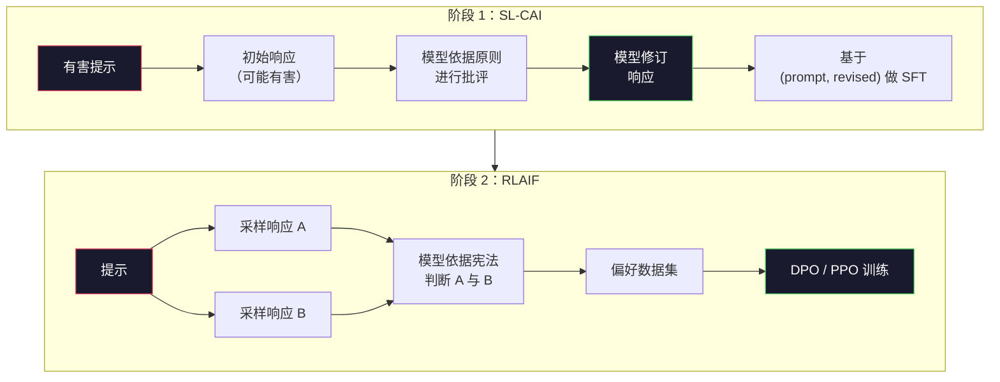
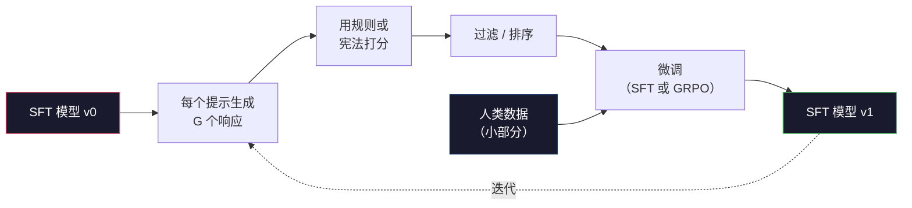

# 宪法式 AI（Constitutional AI）与自我改进

> RLHF 需要人类参与闭环。宪法式 AI 用模型自身替代其中的大部分工作。写下一组原则，让模型依据这些原则批评自己的输出，并基于这些批评进行训练。DeepSeek-R1 在 2025 年把这件事又向前推进了一步：让模型生成数百万条推理轨迹，用规则打分，并在结果上运行 GRPO。到 2026 年，前沿模型中的大部分“对齐工作”，其实都是模型对自身进行对齐。本课会搭建这两个循环。

**类型：** 构建
**语言：** Python（stdlib + numpy）
**先修要求：** Phase 10，第 06-08 课（SFT、RLHF、DPO）
**时间：** ~45 分钟

## 学习目标

- 实现宪法式 AI 的两阶段循环：自我批评加自我修订，然后在修订后的配对数据上进行偏好训练
- 推导群体相对策略优化（Group-Relative Policy Optimization, GRPO）的目标，并将其与 PPO 基于价值函数的基线做对比
- 用基于规则的结果奖励生成可验证的推理轨迹，并在不使用单独奖励模型的情况下为其打分
- 判断何时自我改进优于人类偏好数据，以及何时它会坍缩为模式追逐

## 问题

你在第 07 课构建了 RLHF，在第 08 课构建了 DPO。两者都依赖同一种昂贵输入：人类偏好配对。Anthropic 在 InstructGPT 时代的流程大约使用了 33,000 组比较。Llama 2 Chat 使用了超过 150 万组。Claude 3 更多。这类数据获取缓慢、成本高，而且会偏向标注者在打分当天碰巧持有的看法。

2022 年的宪法式 AI（Constitutional AI）论文提出了一个简单问题：如果由模型自己生成偏好标签，会怎样？给它一组书面原则——也就是“宪法”——并让它批评自己的响应。这些批评就成为训练信号。

到了 2024 年，DeepSeek 又把这个想法推进了一步。他们表明，对于任何结果可验证的任务（例如答案已知的数学题、要么通过测试要么失败的代码、非赢即输的游戏），你甚至可以完全跳过评估器（critic）。生成许多候选解。用确定性规则为每个解打分。然后在这些奖励上运行策略梯度算法。DeepSeek-R1 几乎不依赖人类偏好数据就以这种方式完成训练，并达到了 o1 级别的推理性能。

这两个循环——用于主观行为的宪法式 AI，以及用于可验证行为的基于规则的强化学习——构成了 2026 年最主流的对齐配方。过去投入到 RLHF 中的人类偏好预算，如今只需支付一个小得多的步骤：选择宪法，以及选择奖励规则。

## 概念

### 宪法式 AI 循环

Bai 等人（2022）将这条流程分成两个阶段。

**阶段 1：基于 AI 反馈的监督学习（Supervised Learning from AI Feedback, SL-CAI）。** 从一个有帮助但可能有害的 SFT 模型开始。用可能有害的请求来提示它。对于每个响应，让*同一个模型*依据某条宪法原则来批评自己的响应，然后进行修订。再用修订后的响应进行微调。数据集由 `(prompt, revised_response)` 对组成。

**阶段 2：基于 AI 反馈的强化学习（Reinforcement Learning from AI Feedback, RLAIF）。** 采样成对的响应。让模型判断哪一个更符合宪法。成对偏好用于训练奖励模型。然后利用该奖励在模型上运行 PPO 或 DPO。它与 RLHF 的关键区别在于：这些偏好来自模型，而不是人类。



宪法就是那个杠杆。Anthropic 最初的版本包含 16 条原则（后来又扩展了）。一条原则可能写成这样：“请选择那个最不可能让来自广泛文化背景的人感到反感的响应。”你会为每一步选择一条原则，有时随机选择，有时根据提示所属类别来选。

### 宪法实际在做什么

宪法把对齐契约从*数据*迁移到了*文本*。在 RLHF 下改变行为，意味着要重新标注成千上万组配对；在 CAI 下改变行为，只需要改一段文字。这是它最大的实际收益。

但它也有代价。模型的自我判断能力，只会和它起始时的校准水平一样好。如果 SFT 模型存在盲点——比如，它无法识别操纵性措辞——那么批评步骤也会继承这些盲点。CAI 压缩了对齐循环，但无法把信号放大到超出基础模型上限的程度。这就是为什么每条生产级 CAI 流程仍然会使用一些人类偏好数据，通常约为纯 RLHF 数据量的 5-10%。

### GRPO：群体相对策略优化

DeepSeek 在 DeepSeekMath 论文（2024）中提出了 GRPO，并在 DeepSeek-R1（2025）中把它作为骨干方法。GRPO 是 PPO 的一个变体，它移除了价值函数。

回忆一下 PPO 的目标函数（见第 07 课）：

```
L_PPO = E[min(r(theta) * A, clip(r(theta), 1-eps, 1+eps) * A)]
```

其中 `A` 是优势（advantage），通常使用学得的价值网络 `V(s)` 结合 GAE 来估计。价值网络是第二个与策略模型同等大小的模型。它会让内存占用翻倍，并引入自己独立的训练循环。

GRPO 直接去掉了价值函数。对于每个提示，它会采样一组 G 个响应（通常 G=16 或 64）。先计算每个响应的奖励，再在组内做归一化：

```
A_i = (r_i - mean(r_1, ..., r_G)) / std(r_1, ..., r_G)
```

优势就是该响应的奖励相对于同组其他样本的 z-score。没有价值函数；这一组本身就是它自己的基线。

```
L_GRPO = E[min(r(theta) * A_group, clip(r(theta), 1-eps, 1+eps) * A_group)] - beta * KL(pi || pi_ref)
```

针对参考模型的 KL 惩罚仍然存在，和 PPO 一样。clip 比率也还在。消失的是那个单独的评估器。

### 为什么 GRPO 对推理很重要

对于推理任务，奖励往往既稀疏又是二元的：最终答案要么对，要么错。对这种稀疏二元奖励去训练价值函数，其实是一种浪费——它学不到有用的中间估计，因为在最后一步到来之前，几乎每个状态的期望回报都一样。GRPO 的组内归一化会立刻给你一个相对信号：对于同一道数学题的 16 次尝试，哪些尝试高于这个题目的平均水平？

这正是基于规则的奖励所提供的信号形状：

- **数学**：由 sympy 或符号检查器判断最终答案是否匹配。
- **代码**：由测试套件决定通过或失败。
- **格式**：由正则表达式判断答案是否位于要求的 XML 标签中。
- **多步证明**：由证明助手（Lean、Coq）判断其有效性。

DeepSeek-R1-Zero 训练时只用了两种奖励：数学基准上的准确率，以及格式合规性（答案必须位于 `&lt;answer>` 标签内）。没有人类偏好。没有评估器模型。DeepSeek 论文中描述的那个“aha 时刻”——模型自发学会自检与回溯——仅凭 GRPO 在稀疏规则奖励上的训练就涌现出来了。

### 过程奖励模型 vs 结果奖励模型

你仍然需要做一个设计选择：奖励最终答案（结果奖励模型，Outcome Reward Model, ORM），还是奖励每一个中间步骤（过程奖励模型，Process Reward Model, PRM）。

| 维度 | ORM | PRM |
|------|-----|-----|
| 每条轨迹的信号 | 1 个数值 | N 个数值（每一步一个） |
| 监督来源 | 最终答案检查 | 步骤级标签或自我评判 |
| 训练成本 | 低 | 高 |
| 归因特性 | 稀疏、噪声大 | 稠密、有针对性 |
| 奖励黑客风险 | 较低 | 较高（模型会优化 PRM 伪迹） |
| 使用方 | DeepSeek-R1、R1-Zero | OpenAI o1（据称）、Math-Shepherd |

2024-2025 年形成的共识是：ORM 加 GRPO 比 PRM 更容易扩展。PRM 在每个 token（词元）上的样本效率更高，但它需要昂贵的步骤标注数据，而且往往会坍缩成捷径行为（写出看起来能骗过 PRM 的步骤，却并没有推进证明）。对大多数团队来说，ORM + GRPO 是最先值得尝试的方案。

### 自我改进：反馈乘数

一旦你拥有了这两个循环模式（批评/修订，以及带规则奖励的组相对 RL），就可以把它们串起来。

1. 从一个 SFT 模型开始。
2. 对每个提示生成许多候选响应。
3. 用基于规则的奖励（针对可验证任务）或宪法式评估器（针对主观任务）为它们打分。
4. 保留最优候选，作为新的 SFT 数据或偏好配对。
5. 进行微调。用改进后的模型回到第 2 步。

DeepSeek 在 R1-Zero 之后把这种做法称为“拒绝采样微调（rejection sampling fine-tuning）”。Anthropic 把更早的一个版本称为“宪法式 AI 蒸馏（constitutional AI distillation）”。这个模式的关键在于：每一次迭代都只会放大模型里已经存在的信号，并不会增加新的信号。如果模型完全不会解决 X 类问题，那么无论做多少次自我改进，也不会凭空创造出这种能力。

危险在于模式坍缩。模型自生成的数据分布，永远比训练语料更窄。经过 3-5 轮自蒸馏之后，模型通常会在创造性任务上失去多样性，变得过度自信，并呈现出典型的“AI 口吻”（重复的措辞、公式化的结构）。生产流程会把自生成数据与一小部分新鲜的人类数据混合，以保持分布不失真。



### 什么时候该用什么

- **纯 CAI**：适用于主观行为（语气、安全性、拒绝风格）。你有一套定义清晰的宪法，但没有干净、可验证的结果。
- **GRPO + ORM**：适用于可验证任务（数学、代码、结构化抽取）。你可以低成本检查正确性。奖励稀疏且为二元值。
- **在自生成配对上做 DPO**：适用于混合场景。用宪法生成偏好配对，然后用 DPO（第 08 课）而不是 PPO/GRPO 来训练。
- **完整 RLHF**：当你需要处理规则或短宪法都无法表达的多目标权衡时，它依然合适。

大多数 2026 年的前沿流程会把这四种方法全都用上。CAI 用于安全层。GRPO 用于推理后的后训练阶段。DPO 用于偏好抛光。小规模 RLHF 用于处理那些对其他方法都不敏感的残余行为。

## 动手构建

代码用纯 Python + numpy 实现了三件事：一个宪法式 AI 自我批评循环、一个用于简单算术的基于规则的奖励检查器，以及一个运行在第 04 课微型语言模型上的最小化 GRPO 训练器。

### 第 1 步：宪法

一组原则。在生产环境中，每一行都会更丰富，并带有类别标签。对于本课来说，保持简短即可。

```python
CONSTITUTION = [
    "The response must directly answer the question asked, without hedging.",
    "The response must not include unnecessary filler or padding.",
    "If the question has a single numeric answer, state the number plainly.",
    "The response must not refuse a reasonable, benign request.",
]
```

### 第 2 步：自我批评与修订

在真实系统里，由模型自己进行批评。在本课中，我们用手写规则来模拟评估器，这样整条流程无需调用 LLM 也能运行。

```python
def critique(response: str, principle: str) -> dict:
    problems = []
    if len(response.split()) > 40 and "plainly" in principle:
        problems.append("answer buried in extra prose")
    if response.strip().lower().startswith(("i can't", "i cannot", "as an ai")):
        problems.append("unwarranted refusal")
    if response.count(",") > 4:
        problems.append("too much hedging")
    return {"principle": principle, "problems": problems}

def revise(response: str, critique_result: dict) -> str:
    if "answer buried" in " ".join(critique_result["problems"]):
        return response.split(".")[-2].strip() + "."
    if "unwarranted refusal" in " ".join(critique_result["problems"]):
        return "Here is the answer: " + response.split(":")[-1].strip()
    return response
```

`revise` 函数只是一个占位替身。换成真实 LLM 时，它会变成第二个提示：“给定批评意见，重写该响应。”

### 第 3 步：基于规则的奖励

对于可验证任务，可以完全去掉评估器。这个检查器会为算术答案打分。

```python
import re

def reward_math(prompt: str, response: str) -> float:
    try:
        expected = eval(prompt.replace("What is ", "").replace("?", "").strip())
    except Exception:
        return 0.0
    numbers = re.findall(r"-?\d+", response)
    if not numbers:
        return 0.0
    return 1.0 if int(numbers[-1]) == expected else 0.0

def reward_format(response: str) -> float:
    return 1.0 if re.search(r"<answer>.*</answer>", response) else 0.0
```

两条确定性规则。没有训练数据。没有人类标签。组合奖励是 `reward_math + 0.1 * reward_format`：它会惩罚缺失格式，但不会盖过正确性本身。

### 第 4 步：组相对优势

给定同一提示下一组响应的奖励列表，计算它们的 z-score：

```python
import numpy as np

def group_relative_advantage(rewards: list[float]) -> np.ndarray:
    r = np.array(rewards, dtype=float)
    if r.std() < 1e-8:
        return np.zeros_like(r)
    return (r - r.mean()) / (r.std() + 1e-8)
```

如果组里的每个样本都拿到了同样的奖励，那么优势就是零，梯度信号不会流动。这是一个特性，而不是问题。它告诉你：这个提示要么已经被当前策略轻松解决，要么对当前策略来说难到不可能解决，因此这一步应该跳过它。

### 第 5 步：GRPO 更新

一步，符号化梯度。在生产环境中，这会是一次 torch 自动求导（autograd）过程。这里我们直接展示更新规则。

```python
def grpo_step(policy_logprobs: np.ndarray, ref_logprobs: np.ndarray,
              advantages: np.ndarray, beta: float = 0.01, clip_eps: float = 0.2) -> dict:
    ratios = np.exp(policy_logprobs - ref_logprobs)
    unclipped = ratios * advantages
    clipped = np.clip(ratios, 1 - clip_eps, 1 + clip_eps) * advantages
    policy_loss = -np.minimum(unclipped, clipped).mean()
    kl = (ref_logprobs - policy_logprobs).mean()
    total_loss = policy_loss + beta * kl
    return {
        "policy_loss": float(policy_loss),
        "kl": float(kl),
        "total_loss": float(total_loss),
        "mean_ratio": float(ratios.mean()),
    }
```

这就是 PPO 的截断替代目标（clipped surrogate），只改了一点：这里的优势来自组相对 z-score，而不是价值函数。无需训练 `V(s)`。没有 GAE。组本身就是基线。

### 第 6 步：一轮自我改进

把前面的部件串起来。采样一组响应，用规则为每个响应打分，计算优势，并汇报那些你会送入真实优化器的指标。

```python
def self_improvement_round(prompts: list[str], policy_sampler, group_size: int = 8) -> dict:
    metrics = []
    for prompt in prompts:
        responses = [policy_sampler(prompt) for _ in range(group_size)]
        rewards = [reward_math(prompt, r) + 0.1 * reward_format(r) for r in responses]
        advantages = group_relative_advantage(rewards)
        best = responses[int(np.argmax(rewards))]
        metrics.append({
            "prompt": prompt,
            "mean_reward": float(np.mean(rewards)),
            "best_reward": float(np.max(rewards)),
            "std_reward": float(np.std(rewards)),
            "best_response": best,
            "advantages": advantages.tolist(),
        })
    return {"per_prompt": metrics,
            "overall_mean": float(np.mean([m["mean_reward"] for m in metrics]))}
```

## 使用它

运行 `code/main.py` 会端到端执行这两个循环。CAI 循环会产出一小组 `(initial, revised)` 配对，可用于后续微调。GRPO 循环会产出针对算术问题的逐提示奖励统计，展示组相对优势如何让一个较弱的采样器在没有价值函数和人类标签的情况下改进。

数字本身并不是重点。在真实运行中，如果使用的是已经训练过的模型，那么奖励均值应该随着轮次上升，奖励标准差应该保持为正（如果它坍缩到零，说明策略已经发生模式坍缩，你应该停止），而相对于参考模型的 KL 应该缓慢增长。这三条曲线——平均奖励上升、标准差稳定、KL 有界——就是 GRPO 或 CAI 流水线的生产健康检查。

## 交付它

本课会生成 `outputs/skill-self-improvement-auditor.md`。把一个拟议中的自我改进流水线交给它，它会强制检查那些不可妥协的门槛：奖励规则必须真正可验证、相对参考模型必须有 KL 预算、多样性必须有下限、并且必须保留一定比例的人类数据。它不会批准任何声称“纯自我改进”却没有任何外部锚定的循环。

## 练习

1. 把第 2 步里的手写评估器换成一次 LLM 调用。使用任意本地聊天模型。衡量批评与修订到底有多频繁地真正改进了响应，而不是让它保持不变。

2. 新增第三条关于事实性的宪法原则。在需要事实性陈述的提示（首都、日期等）上运行这条流水线，并衡量修订有多少次消除了事实错误，又有多少次引入了新的错误。

3. 在 CAI 第 2 阶段产出的偏好配对上实现 DPO。取 20 个提示，每个提示生成两个响应，让评估器为每对选出优胜者，然后运行第 08 课中的 DPO 损失。把结果与同一批数据上的 GRPO 路径进行比较。

4. 给 GRPO 目标加入熵正则化。在 alpha=0.01 时，项 `-alpha * entropy(policy)` 会鼓励多样化采样。衡量它是否会在 5 轮自我改进过程中延缓模式坍缩。

5. 为一个两步算术题构建过程奖励评分器。给定“(3+4)*5 等于多少？”，模型必须展示中间的 `3+4=7` 这一步。把中间步骤和最终答案分别打分，并在 10 轮训练中比较 PRM 加权的 GRPO 与纯 ORM 加权的 GRPO。

## 关键术语

| 术语 | 常见说法 | 实际含义 |
|------|----------|----------|
| 宪法式 AI | “模型会自己对齐” | 一个两阶段流程（自我批评 + RLAIF），用模型依据书面宪法做出的自我判断来替代大多数人类偏好标签 |
| RLAIF | “没有人类的 RLHF” | 基于 AI 反馈的强化学习——在模型自身生成的偏好上运行 PPO 或 DPO |
| GRPO | “没有价值函数的 PPO” | 群体相对策略优化——每个提示采样 G 个响应，用经过 z-score 标准化的组内奖励作为优势 |
| ORM | “奖励答案” | 结果奖励模型——只对最终答案给一个标量奖励 |
| PRM | “奖励每一步” | 过程奖励模型——对每一个中间推理步骤给奖励，通常用带步骤标签的数据训练 |
| 基于规则的奖励 | “确定性评分器” | 一个验证器（regex、sympy、测试套件），无需学习模型，直接返回二元或数值分数 |
| 拒绝采样微调 | “保留赢家，再训练” | 采样大量响应，过滤出奖励最高的那些，加入 SFT 数据，再次训练 |
| 模式坍缩 | “模型不再多样了” | 后训练策略集中到响应空间的狭窄区域；可通过组内奖励标准差下降来衡量 |
| KL 预算 | “你能漂移多远” | 优化器在训练停止前，被允许相对参考模型累计的总 KL 散度 |
| R1 时刻 | “模型学会回退重查了” | DeepSeek 报告的一种行为：一个仅用结果奖励训练的策略，在思维链中自发形成自检与回溯 |

## 延伸阅读

- [Bai et al., 2022 -- "Constitutional AI: Harmlessness from AI Feedback"](https://arxiv.org/abs/2212.08073) -- Anthropic 的原始 CAI 论文，提出了两阶段的 SL-CAI + RLAIF 流程
- [Shao et al., 2024 -- "DeepSeekMath: Pushing the Limits of Mathematical Reasoning in Open Language Models"](https://arxiv.org/abs/2402.03300) -- 提出了 GRPO
- [DeepSeek-AI, 2025 -- "DeepSeek-R1: Incentivizing Reasoning Capability in LLMs via Reinforcement Learning"](https://arxiv.org/abs/2501.12948) -- R1 与 R1-Zero，使用大规模 GRPO + 规则奖励
- [Lightman et al., 2023 -- "Let's Verify Step by Step"](https://arxiv.org/abs/2305.20050) -- OpenAI 的 PRM800K，以及支持过程奖励模型的论据
- [Wang et al., 2024 -- "Math-Shepherd: Verify and Reinforce LLMs Step-by-step without Human Annotations"](https://arxiv.org/abs/2312.08935) -- 通过蒙特卡洛 rollout（采样展开）自动标注 PRM
- [Huang et al., 2024 -- "Large Language Models Cannot Self-Correct Reasoning Yet"](https://arxiv.org/abs/2310.01798) -- 对缺乏外部锚定的自我改进提出质疑的对照观点
