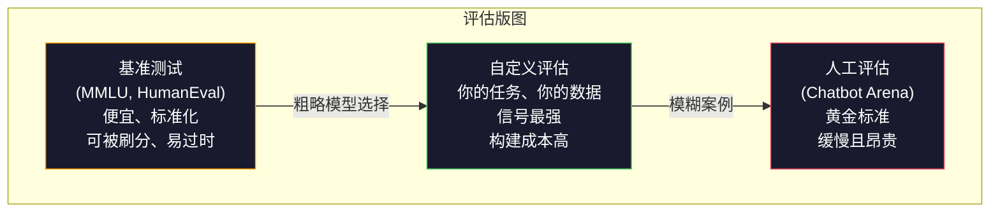
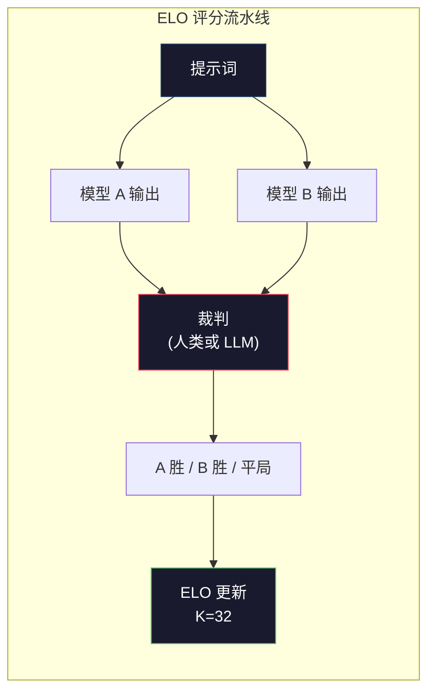

# 评估：基准测试、评测（Evals）、LM Harness

> 古德哈特定律（Goodhart's Law）：当一个指标变成目标，它就不再是一个好指标。每家前沿实验室都会“刷”基准测试。MMLU 分数不断上升，但模型依然无法稳定数清 "strawberry" 里有几个字母 R。唯一真正重要的评估，就是针对**你的任务**、使用**你的数据**进行的**你的评估**。

**类型：** 构建
**语言：** Python
**前置要求：** 第 10 阶段，第 01-05 课（从零开始构建 LLM）
**时长：** 约 90 分钟

## 学习目标

- 构建一个自定义评估框架，能够针对语言模型运行多项选择与开放式基准测试
- 解释为什么标准基准测试（benchmark）（如 MMLU、HumanEval）会饱和，并且无法区分前沿模型
- 实现面向具体任务的评估（evaluation），并使用合适的指标：精确匹配（exact match）、F1、BLEU，以及由 LLM 担任裁判的评分
- 设计一套针对你特定使用场景的自定义评估集，而不是只依赖公开排行榜

## 问题

MMLU 于 2020 年发布，包含 57 个学科的 15,908 道题。三年之内，前沿模型就把它做到了饱和。GPT-4 得分 86.4%。Claude 3 Opus 得分 86.8%。Llama 3 405B 得分 88.6%。排行榜被压缩到了仅 3 分的区间内，这种差异更多是统计噪声，而不是真实能力差距。

与此同时，这些模型却会在一些 10 岁小孩都能不假思索完成的任务上失败。Claude 3.5 Sonnet 在 MMLU 上得分 88.7%，最初却数不清 "strawberry" 里的字母个数——这个任务根本不需要世界知识，也不需要推理，只需要逐字符迭代。HumanEval 用 164 道题测试代码生成。模型在上面能拿到 90%+ 的分数，但仍会产出在边界条件下崩溃的代码，而这些问题任何初级开发者都能发现。

基准表现与真实世界可靠性之间的鸿沟，是 LLM 评估的核心问题。基准测试告诉你的，只是模型在这个基准测试上的表现。它们几乎无法告诉你：该模型在你的具体任务上、使用你的具体数据、面对你的具体失效模式时会表现如何。如果你在做一个客服机器人，MMLU 几乎毫无意义。如果你在做一个代码助手，HumanEval 只覆盖函数级生成——它对跨文件调试、重构或解释代码没有任何说明力。

你需要自定义评估。不是因为基准测试毫无用处——它们对粗略选型仍然有帮助——而是因为最终评估必须与真实部署条件完全一致。

## 概念

### 评估版图

评估大致分为三类，每一类的成本和信号质量都不同。

**基准测试（benchmarks）**是标准化测试集。MMLU、HumanEval、SWE-bench、MATH、ARC、HellaSwag。你让模型跑一遍基准测试，就会得到一个分数。优点是：所有人都用同一套测试，因此你可以横向比较模型。缺点是：模型与训练数据正越来越多地污染这些基准测试。实验室会在包含基准题目的数据上训练。分数会升高，但能力未必真的提升。

**自定义评估（custom evals）**是你针对具体使用场景构建的测试集。你定义输入、期望输出和评分函数。法律文档摘要器，就用法律文档来评估。SQL 生成器，就用你的数据库模式来评估。它们创建成本高，但却是唯一能够预测生产环境表现的评估方式。

**人工评估（human evals）**使用付费标注员，根据有用性、正确性、流畅性和安全性等标准来判断模型输出。对于自动评分失效的开放式任务来说，它是黄金标准。Chatbot Arena 已经收集了 100 多个模型、超过 200 万张人工偏好投票。缺点是：成本高（每次判断 $0.10-$2.00），速度慢（数小时到数天）。



### 基准测试为何失效

有三个机制会导致基准分数不再反映真实能力。

**数据污染（data contamination）。**训练语料会抓取整个互联网。基准测试题目也存在于互联网上。模型会在训练期间见到答案。这并不是传统意义上的作弊——实验室通常不会故意把基准数据加进去。但在网络规模的数据抓取下，几乎不可能完全排除这些内容。

**针对测试教学（teaching to the test）。**实验室会为了基准表现去优化训练数据混合。如果训练数据中有 5% 是 MMLU 风格的多项选择题，模型就会学会这种格式和答案分布。MMLU 是四选一题。模型会学到 A/B/C/D 的答案分布大致均匀，这一点甚至能在模型根本不知道答案时帮上忙。

**饱和（saturation）。**当所有前沿模型在某个基准上都拿到 85-90% 时，这个基准就失去了区分度。剩下的 10-15% 题目可能本身含糊、标注错误，或者要求冷门领域知识。从 87% 提高到 89%，可能只是模型又记住了两道冷门题，而不是它真的更聪明了。

### 困惑度（Perplexity）：快速健康检查

困惑度衡量的是：模型面对一串词元（token）时有多“惊讶”。形式化地说，它是平均负对数似然的指数形式：

```
PPL = exp(-1/N * sum(log P(token_i | context)))
```

困惑度为 10，表示模型平均而言，就像是在每个词元位置上从 10 个选项中均匀随机选择一样不确定。越低越好。GPT-2 在 WikiText-103 上的困惑度约为 30。GPT-3 约为 20。Llama 3 8B 约为 7。

困惑度适合在同一个测试集上比较模型，但它也有盲点。一个模型可能因为擅长预测常见模式而拥有较低困惑度，同时在罕见但重要的模式上表现糟糕。它也完全无法反映指令遵循、推理或事实准确性。把它当作合理性检查，而不是最终裁决。

### LLM 充当裁判（LLM-as-Judge）

用一个强模型来评估较弱模型的输出。思路很简单：让 GPT-4o 或 Claude Sonnet 按 1-5 分为一条回答在正确性、有用性和安全性上打分。使用 GPT-4o-mini 时，这样的单次评判成本大约是 $0.01，而且与人工判断的相关性高得惊人——在大多数任务上，二者一致率大约在 80% 左右。

评分提示词（prompt）比模型本身更重要。一个模糊的提示词（“给这条回答打分”）会产生噪声很大的分数。一个带评分细则（rubric）的结构化提示词（“如果答案事实正确且引用来源则打 5 分；如果正确但没有来源则打 4 分；如果部分正确则打 3 分……”）会产生一致、可复现的分数。

失效模式包括：裁判模型会出现位置偏差（在成对比较中更偏好第一个回答）、冗长度偏差（更偏好更长的回答），以及自我偏好（GPT-4 会给 GPT-4 的输出打出比同水平 Claude 输出更高的分）。缓解方法包括：随机打乱顺序、按长度归一化，以及使用与被评估模型不同的裁判模型。

### 基于成对比较的 ELO 评分

这是 Chatbot Arena 的方法：向同一个提示词展示两个来自不同模型的回答。一个人类（或 LLM 裁判）选出更好的那个。基于成千上万次这样的比较，为每个模型计算一个 ELO 评分——也就是国际象棋里使用的同一套系统。

ELO 的优势在于：相对排序比绝对打分更可靠，能优雅地处理平局，而且相比逐条独立打分，所需比较次数更少就能收敛。截至 2026 年初，Chatbot Arena 的榜单显示，GPT-4o、Claude 3.5 Sonnet 和 Gemini 1.5 Pro 在榜首的差距都在 20 个 ELO 点以内。



### 评估框架

**lm-evaluation-harness**（EleutherAI）：标准的开源评估框架。支持 200+ 个基准测试。只用一条命令，就可以让任意 Hugging Face 模型跑 MMLU、HellaSwag、ARC 等任务。Open LLM Leaderboard 也在使用它。

**RAGAS**：专门面向 RAG 流水线的评估框架。它衡量忠实性（答案是否与检索到的上下文一致？）、相关性（检索到的上下文是否与问题相关？）以及答案正确性。

**promptfoo**：面向提示工程（prompt engineering）的配置驱动评估工具。你在 YAML 里定义测试用例，对多个模型运行，然后得到一份通过/失败报告。它很适合做提示词的回归测试——确保一次提示词改动不会破坏已有测试用例。

### 构建自定义评估

这是对生产环境最重要的评估。流程如下：

1. **定义任务。**模型究竟应该做什么？要精确。“回答问题”太模糊。“给定一封客户投诉邮件，提取产品名、问题类别和情绪”才是一个可以评估的任务。

2. **创建测试用例。**原型评估至少 50 个，生产环境 200+ 个。每个测试用例都是一个 `(input, expected_output)` 对。要包含边界情况：空输入、对抗性输入、模糊输入、其他语言输入。

3. **定义评分。**结构化输出用精确匹配。文本相似度用 BLEU/ROUGE。开放式质量用 LLM-as-judge。抽取任务用 F1。把多个指标按权重组合起来。

4. **自动化。**每次评估都能用一条命令运行。不要有人工步骤。结果要存成可以支持长期比较的格式。

5. **持续跟踪。**孤立地看一个评估分数没有意义。你需要趋势线。上一次提示词改动后分数是否提升了？切换模型后是否退化了？要让你的评估与提示词一起版本化。

| 评估类型 | 每次判断成本 | 与人工一致性 | 最适用场景 |
|-----------|------------------|----------------------|----------|
| 精确匹配 | ~$0 | 100%（适用时） | 结构化输出、分类 |
| BLEU/ROUGE | ~$0 | ~60% | 翻译、摘要 |
| LLM-as-judge | ~$0.01 | ~80% | 开放式生成 |
| 人工评估 | $0.10-$2.00 | N/A（它本身就是真实标准） | 模糊且高风险的任务 |

## 动手构建

### 第 1 步：最小可用评估框架

先定义核心抽象。一个评估案例包含输入、期望输出，以及一个可选的元数据字典。评分器接收预测值和参考答案，并返回 0 到 1 之间的分数。

```python
import json
from collections import Counter

class EvalCase:
    def __init__(self, input_text, expected, metadata=None):
        self.input_text = input_text
        self.expected = expected
        self.metadata = metadata or {}

class EvalSuite:
    def __init__(self, name, cases, scorers):
        self.name = name
        self.cases = cases
        self.scorers = scorers

    def run(self, model_fn):
        results = []
        for case in self.cases:
            prediction = model_fn(case.input_text)
            scores = {}
            for scorer_name, scorer_fn in self.scorers.items():
                scores[scorer_name] = scorer_fn(prediction, case.expected)
            results.append({
                "input": case.input_text,
                "expected": case.expected,
                "prediction": prediction,
                "scores": scores,
            })
        return results
```

### 第 2 步：评分函数

构建精确匹配、token F1，以及一个模拟版的 LLM-as-judge 评分器。

```python
def exact_match(prediction, expected):
    return 1.0 if prediction.strip().lower() == expected.strip().lower() else 0.0

def token_f1(prediction, expected):
    pred_tokens = set(prediction.lower().split())
    exp_tokens = set(expected.lower().split())
    if not pred_tokens or not exp_tokens:
        return 0.0
    common = pred_tokens & exp_tokens
    precision = len(common) / len(pred_tokens)
    recall = len(common) / len(exp_tokens)
    if precision + recall == 0:
        return 0.0
    return 2 * (precision * recall) / (precision + recall)

def llm_judge_simulated(prediction, expected):
    pred_words = set(prediction.lower().split())
    exp_words = set(expected.lower().split())
    if not exp_words:
        return 0.0
    overlap = len(pred_words & exp_words) / len(exp_words)
    length_penalty = min(1.0, len(prediction) / max(len(expected), 1))
    return round(overlap * 0.7 + length_penalty * 0.3, 3)
```

### 第 3 步：ELO 评分系统

实现带有 ELO 更新的成对比较。这正是 Chatbot Arena 用来给模型排名的系统。

```python
class ELOTracker:
    def __init__(self, k=32, initial_rating=1500):
        self.ratings = {}
        self.k = k
        self.initial_rating = initial_rating
        self.history = []

    def _ensure_player(self, name):
        if name not in self.ratings:
            self.ratings[name] = self.initial_rating

    def expected_score(self, rating_a, rating_b):
        return 1 / (1 + 10 ** ((rating_b - rating_a) / 400))

    def record_match(self, player_a, player_b, outcome):
        self._ensure_player(player_a)
        self._ensure_player(player_b)

        ea = self.expected_score(self.ratings[player_a], self.ratings[player_b])
        eb = 1 - ea

        if outcome == "a":
            sa, sb = 1.0, 0.0
        elif outcome == "b":
            sa, sb = 0.0, 1.0
        else:
            sa, sb = 0.5, 0.5

        self.ratings[player_a] += self.k * (sa - ea)
        self.ratings[player_b] += self.k * (sb - eb)

        self.history.append({
            "a": player_a, "b": player_b,
            "outcome": outcome,
            "rating_a": round(self.ratings[player_a], 1),
            "rating_b": round(self.ratings[player_b], 1),
        })

    def leaderboard(self):
        return sorted(self.ratings.items(), key=lambda x: -x[1])
```

### 第 4 步：困惑度计算

使用词元概率来计算困惑度。实际中你会从模型的 logits（未归一化对数概率）中拿到这些值。这里我们用一个概率分布来模拟。

```python
import numpy as np

def perplexity(log_probs):
    if not log_probs:
        return float("inf")
    avg_neg_log_prob = -np.mean(log_probs)
    return float(np.exp(avg_neg_log_prob))

def token_log_probs_simulated(text, model_quality=0.8):
    np.random.seed(hash(text) % 2**31)
    tokens = text.split()
    log_probs = []
    for i, token in enumerate(tokens):
        base_prob = model_quality
        if len(token) > 8:
            base_prob *= 0.6
        if i == 0:
            base_prob *= 0.7
        prob = np.clip(base_prob + np.random.normal(0, 0.1), 0.01, 0.99)
        log_probs.append(float(np.log(prob)))
    return log_probs
```

### 第 5 步：聚合结果

计算一次评估运行的汇总统计：均值、中位数、阈值下的通过率，以及按指标拆分的明细。

```python
def summarize_results(results, threshold=0.8):
    all_scores = {}
    for r in results:
        for metric, score in r["scores"].items():
            all_scores.setdefault(metric, []).append(score)

    summary = {}
    for metric, scores in all_scores.items():
        arr = np.array(scores)
        summary[metric] = {
            "mean": round(float(np.mean(arr)), 3),
            "median": round(float(np.median(arr)), 3),
            "std": round(float(np.std(arr)), 3),
            "min": round(float(np.min(arr)), 3),
            "max": round(float(np.max(arr)), 3),
            "pass_rate": round(float(np.mean(arr >= threshold)), 3),
            "n": len(scores),
        }
    return summary

def print_summary(summary, suite_name="Eval"):
    print(f"\n{'=' * 60}")
    print(f"  {suite_name} Summary")
    print(f"{'=' * 60}")
    for metric, stats in summary.items():
        print(f"\n  {metric}:")
        print(f"    Mean:      {stats['mean']:.3f}")
        print(f"    Median:    {stats['median']:.3f}")
        print(f"    Std:       {stats['std']:.3f}")
        print(f"    Range:     [{stats['min']:.3f}, {stats['max']:.3f}]")
        print(f"    Pass rate: {stats['pass_rate']:.1%} (threshold >= 0.8)")
        print(f"    N:         {stats['n']}")
```

### 第 6 步：运行完整流水线

把所有部分接起来。定义任务、创建测试用例、模拟两个模型、运行评估、从成对比较中计算 ELO，并打印排行榜。

```python
def demo_model_good(prompt):
    responses = {
        "What is the capital of France?": "Paris",
        "What is 2 + 2?": "4",
        "Who wrote Hamlet?": "William Shakespeare",
        "What language is PyTorch written in?": "Python and C++",
        "What is the boiling point of water?": "100 degrees Celsius",
    }
    return responses.get(prompt, "I don't know")

def demo_model_bad(prompt):
    responses = {
        "What is the capital of France?": "Paris is the capital city of France",
        "What is 2 + 2?": "The answer is four",
        "Who wrote Hamlet?": "Shakespeare",
        "What language is PyTorch written in?": "Python",
        "What is the boiling point of water?": "212 Fahrenheit",
    }
    return responses.get(prompt, "Unknown")

cases = [
    EvalCase("What is the capital of France?", "Paris"),
    EvalCase("What is 2 + 2?", "4"),
    EvalCase("Who wrote Hamlet?", "William Shakespeare"),
    EvalCase("What language is PyTorch written in?", "Python and C++"),
    EvalCase("What is the boiling point of water?", "100 degrees Celsius"),
]

suite = EvalSuite(
    name="General Knowledge",
    cases=cases,
    scorers={
        "exact_match": exact_match,
        "token_f1": token_f1,
        "llm_judge": llm_judge_simulated,
    },
)

results_good = suite.run(demo_model_good)
results_bad = suite.run(demo_model_bad)

print_summary(summarize_results(results_good), "Model A (concise)")
print_summary(summarize_results(results_bad), "Model B (verbose)")
```

“好”模型给出精确答案。“坏”模型给出冗长的改写。精确匹配会严重惩罚这个冗长模型。token F1 和 LLM-as-judge 则更宽容。这说明了为什么指标选择如此重要：同一个模型会因为你的评分方式不同，而看起来非常优秀或非常糟糕。

### 第 7 步：ELO 锦标赛

在多轮比赛中跨模型运行成对比较。

```python
elo = ELOTracker(k=32)

for case in cases:
    pred_a = demo_model_good(case.input_text)
    pred_b = demo_model_bad(case.input_text)

    score_a = token_f1(pred_a, case.expected)
    score_b = token_f1(pred_b, case.expected)

    if score_a > score_b:
        outcome = "a"
    elif score_b > score_a:
        outcome = "b"
    else:
        outcome = "tie"

    elo.record_match("model_a_concise", "model_b_verbose", outcome)

print("\nELO Leaderboard:")
for name, rating in elo.leaderboard():
    print(f"  {name}: {rating:.0f}")
```

### 第 8 步：困惑度比较

比较不同质量等级“模型”的困惑度。

```python
test_text = "The quick brown fox jumps over the lazy dog in the garden"

for quality, label in [(0.9, "Strong model"), (0.7, "Medium model"), (0.4, "Weak model")]:
    log_probs = token_log_probs_simulated(test_text, model_quality=quality)
    ppl = perplexity(log_probs)
    print(f"  {label} (quality={quality}): perplexity = {ppl:.2f}")
```

## 使用它

### lm-evaluation-harness（EleutherAI）

这是在任意模型上运行基准测试的标准工具。

```python
# pip install lm-eval
# Command line:
# lm_eval --model hf --model_args pretrained=meta-llama/Llama-3.1-8B --tasks mmlu --batch_size 8

# Python API:
# import lm_eval
# results = lm_eval.simple_evaluate(
#     model="hf",
#     model_args="pretrained=meta-llama/Llama-3.1-8B",
#     tasks=["mmlu", "hellaswag", "arc_easy"],
#     batch_size=8,
# )
# print(results["results"])
```

### promptfoo

这是一个面向提示工程的配置驱动评估工具。你可以在 YAML 中定义测试，并对多个提供方运行。

```yaml
# promptfoo.yaml
providers:
  - openai:gpt-4o-mini
  - anthropic:claude-3-haiku

prompts:
  - "Answer in one word: {{question}}"

tests:
  - vars:
      question: "What is the capital of France?"
    assert:
      - type: contains
        value: "Paris"
  - vars:
      question: "What is 2 + 2?"
    assert:
      - type: equals
        value: "4"
```

### 用于 RAG 评估的 RAGAS

```python
# pip install ragas
# from ragas import evaluate
# from ragas.metrics import faithfulness, answer_relevancy, context_precision
#
# result = evaluate(
#     dataset,
#     metrics=[faithfulness, answer_relevancy, context_precision],
# )
# print(result)
```

RAGAS 衡量的是通用评估遗漏的东西：模型的答案是否建立在检索到的上下文之上，而不仅仅是在抽象意义上“正确”。

## 交付

本课会产出 `outputs/prompt-eval-designer.md`——这是一个可复用的提示词，用于为任意任务设计自定义评估集。给它一段任务描述，它就会生成测试用例、评分函数以及通过/失败阈值建议。

它还会产出 `outputs/skill-llm-evaluation.md`——这是一个决策框架，帮助你根据任务类型、预算和延迟要求选择正确的评估策略。

## 练习

1. 添加一个“一致性”评分器：让同一个输入通过模型运行 5 次，并测量输出一致的频率。对于确定性输入却给出不一致答案，通常说明提示词脆弱，或者温度设置过高。

2. 扩展 ELO 跟踪器，使其支持多个裁判函数（精确匹配、F1、LLM-as-judge）并为它们加权。比较当你重权精确匹配与重权 F1 时，排行榜会如何变化。

3. 为一个具体任务构建评估集：把邮件分类到 5 个类别中。创建 100 个测试用例，包含多样化示例和边界情况（可能属于多个类别的邮件、空邮件、其他语言的邮件）。衡量不同“模型”（基于规则、关键词匹配、模拟 LLM）的表现。

4. 实现污染检测：给定一组评估题目和训练语料，检查有多少比例的评估题目（或近似改写）出现在训练数据中。这正是研究人员审计基准有效性的方式。

5. 构建一个“模型差异”工具。给定两个模型版本的评估结果，突出显示哪些具体测试用例提升了、哪些退化了、哪些保持不变。这相当于评估领域里的代码 diff——对于理解一次改动到底帮了忙还是添了乱至关重要。

## 关键术语

| 术语 | 人们怎么说 | 实际含义 |
|------|----------------|----------------------|
| MMLU | “那个基准测试” | Massive Multitask Language Understanding——覆盖 57 个学科的 15,908 道多项选择题，到 2025 年已在 88% 以上趋于饱和 |
| HumanEval | “代码评估” | OpenAI 提出的 164 道 Python 函数补全题，只测试孤立函数生成 |
| SWE-bench | “真实编码评估” | 来自 12 个 Python 仓库的 2,294 个 GitHub issue，衡量包含测试生成在内的端到端缺陷修复 |
| 困惑度（Perplexity） | “模型有多困惑” | exp(-avg(log P(token_i given context)))——值越低表示模型给真实 token 分配的概率越高 |
| ELO 评分（ELO rating） | “模型版国际象棋排名” | 基于成对胜负记录计算出的相对能力评分，Chatbot Arena 用它给 100+ 个模型排名 |
| LLM 充当裁判（LLM-as-judge） | “用 AI 给 AI 打分” | 用一个强模型按评分细则给弱模型输出打分，在每次评判约 $0.01 的成本下，与人工裁判一致率约 80% |
| 数据污染（Data contamination） | “模型见过测试题” | 训练数据中包含基准题目，导致分数膨胀，却不提升真实能力 |
| 评估套件（Eval suite） | “一堆测试” | 由 `(input, expected_output, scorer)` 三元组组成、带版本管理、用于衡量特定能力的一组集合 |
| 通过率（Pass rate） | “它答对了多少百分比” | 得分高于阈值的评估案例占比——比平均分更可执行，因为它衡量的是可靠性 |
| Chatbot Arena | “模型排行榜网站” | LMSYS 的平台，拥有 2M+ 人工偏好投票，通过 ELO 评分产出最受信任的 LLM 排行榜 |

## 延伸阅读

- [Hendrycks et al., 2021 -- "Measuring Massive Multitask Language Understanding"](https://arxiv.org/abs/2009.03300) —— MMLU 论文，尽管已经饱和，仍是被引用最多的 LLM 基准测试
- [Chen et al., 2021 -- "Evaluating Large Language Models Trained on Code"](https://arxiv.org/abs/2107.03374) —— OpenAI 的 HumanEval 论文，奠定了代码生成评估方法论
- [Zheng et al., 2023 -- "Judging LLM-as-a-Judge"](https://arxiv.org/abs/2306.05685) —— 系统分析用 LLM 评估 LLM 的论文，包括位置偏差和冗长度偏差的发现
- [LMSYS Chatbot Arena](https://chat.lmsys.org/) —— 众包模型对比平台，拥有 2M+ 投票，基于 ELO 评分产出最受信任的真实世界 LLM 排名
