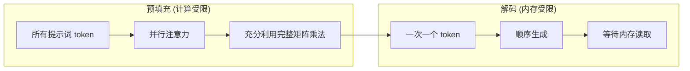
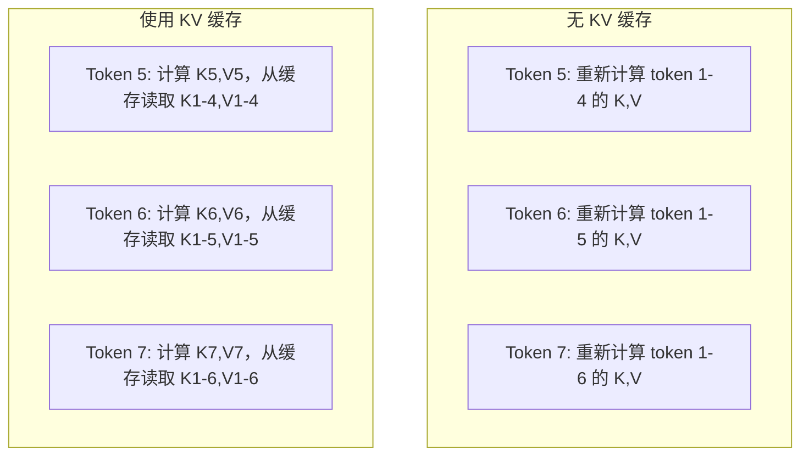
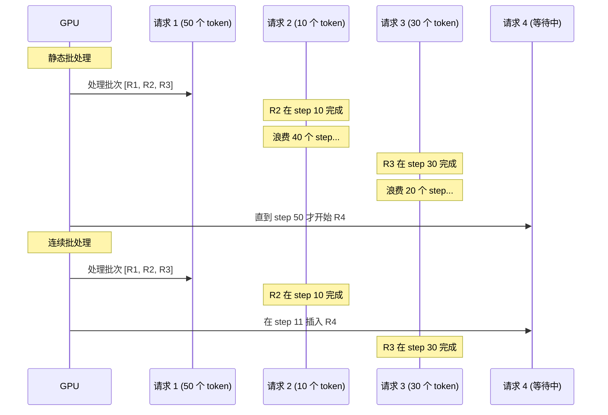
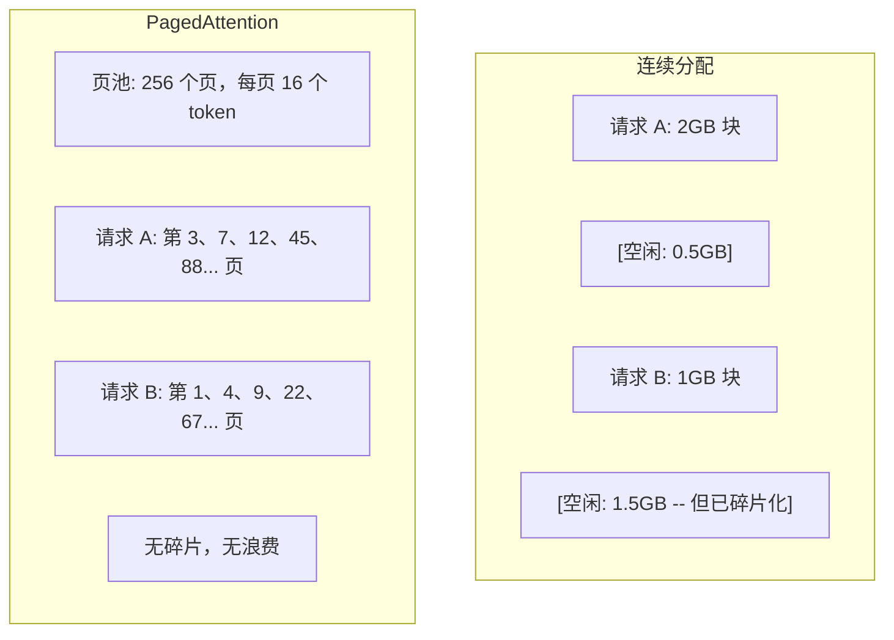
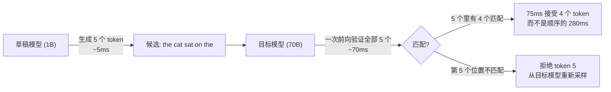

# 推理优化 (Inference Optimization)

> 两个阶段定义了 LLM 推理。预填充 (prefill) 并行处理你的提示词——计算受限 (compute-bound)。解码 (decode) 一次生成一个 token——内存受限 (memory-bound)。每一种优化都针对其中一个阶段，或同时针对两者。

**类型：** 构建
**语言：** Python
**前置条件：** 第 10 阶段，第 01-08 课（Transformer 架构、注意力机制）
**时间：** ~120 分钟

## 学习目标

- 实现 KV 缓存 (KV cache)，在自回归 token 生成期间消除冗余计算
- 解释 LLM 推理中的预填充 (prefill) 与解码 (decode) 阶段，以及为什么它们各自有不同的瓶颈（计算受限 vs 内存受限）
- 实现连续批处理 (continuous batching) 和分页注意力 (PagedAttention) 的核心概念，在并发请求下最大化 GPU 利用率
- 比较推理优化技术（KV 缓存、推测解码 (speculative decoding)、FlashAttention）的吞吐量/延迟权衡

## 问题

你把 Llama 3 70B 部署在 4 张 A100 GPU 上。单个用户能拿到约 50 token/秒，感觉很快。然后 100 个用户同时打到这个端点。吞吐量跌到每个用户 3 token/秒。你每月 25,000 美元的 GPU 账单，提供的响应速度却比人打字还慢。

模型本身在 1 个用户和 100 个用户之间并没有变化。权重相同，架构相同，数学相同。变化的是你如何调度这些计算。朴素推理会浪费 90% 以上的可用 GPU 算力。一个正在等待第 47 个 token 的用户，会一直占着整个 batch 槽位，而 GPU 的内存总线在两次矩阵乘法之间却处于空闲。与此同时，另一个新用户的 2,000-token 提示词，本可以利用这段空档完成有价值的计算。

这不是扩容问题，而是调度问题。本课中的这些技术——KV 缓存、连续批处理、PagedAttention、推测解码、前缀缓存 (prefix caching)——决定了同样流量下你的推理账单是每月 25,000 美元还是 5,000 美元。

在 4xA100-80GB 上用 vLLM 服务 Llama 3 70B 时，低并发下可达到约 50 token/秒/用户，并能通过连续批处理和 PagedAttention 在 100 个并发请求下维持 15-25 TPS/用户。如果没有这些优化，同样的硬件在该并发下只能提供 5 TPS/用户。同样的 GPU，同样的模型，吞吐量却能差 4 倍。

## 概念

### 预填充 (Prefill) 与解码 (Decode)

每个 LLM 推理请求都有两个不同的阶段。

**预填充** 会处理完整的输入提示词。所有 token 都已知，因此注意力可以在整个序列上并行计算。这是一次大型矩阵乘法——GPU 核心始终保持忙碌。瓶颈是计算：你的硬件每秒能提供多少 FLOPS。A100 可提供 312 TFLOPS（BF16）。对于 70B 模型，4,096-token 提示词的预填充在单张 A100 上大约需要 400ms。

**解码** 一次生成一个输出 token。每个新 token 都要关注此前所有 token，但每次前向传播只会产生一个 token。权重矩阵与预填充阶段一样大，但你现在是在把它们乘以单个向量，而不是一个矩阵。GPU 核心会在微秒内完成计算，然后等待下一批权重从内存到达。瓶颈是内存带宽：你能以多快的速度把模型权重从 HBM 流到计算单元。A100 的带宽是 2 TB/s。一个 FP16 的 70B 模型大小约为 140 GB。完整读取一次模型需要 70ms——这就是单次解码 step 的理论下限。



**ops:byte 比率**（也叫算术强度，arithmetic intensity）刻画了这种权衡。它衡量的是：每从内存加载 1 字节，你执行了多少次运算。

```
ops:byte ratio = FLOPs per token / bytes read from memory
```

在大小为 4,096 token 的批次的预填充阶段，每读取一个权重，你会执行约 4,096 次乘加运算。这个比率很高——因此你是计算受限的。在 batch size 为 1 的解码阶段，每读取一个权重，你大约只执行 1 次运算。这个比率很低——因此你是内存受限的。

根本洞见是：*解码之所以是内存受限的，是因为你为了生成一个 token 要读取整个模型*。下面的每一种优化，要么减少读取量，要么在每次读取中处理更多 token，要么干脆完全避免读取。

### KV 缓存 (KV Cache)

在注意力计算中，每个 token 的 query 都会关注此前所有 token 的 key 和 value 向量。如果不做缓存，生成第 N 个 token 时，需要为前面 N-1 个 token 重新计算 key 和 value 投影。生成 token 2 时会投影 token 1，生成 token 3 时还会再投影一次 token 1，生成 token 4 时又要再来一次。到了第 1,000 个 token，token 1 一共已经被投影了 999 次。

KV 缓存会存储此前所有 token 的 key 和 value 投影。生成第 N 个 token 时，你只需要计算 token N 的 key 和 value，然后把它们与缓存中 token 1 到 N-1 的 K/V 拼接起来。



**KV 缓存的内存公式：**

```
KV cache size = 2 * num_layers * num_kv_heads * head_dim * seq_len * bytes_per_param
```

对于 Llama 3 70B（80 层、采用 GQA 的 8 个 KV head、head_dim=128、BF16）：

```
per token: 2 * 80 * 8 * 128 * 2 bytes = 327,680 bytes = 320 KB
at 4,096 tokens: 320 KB * 4,096 = 1.28 GB
at 128K tokens: 320 KB * 131,072 = 40 GB
```

Llama 3 70B 的一次 128K 上下文会话会占用 40 GB 的 KV 缓存——相当于一张 A100 一半的显存。若有 100 个并发用户、每人 4K token，仅 KV 缓存就需要 128 GB。这也是为什么 KV 缓存管理是推理优化中的核心挑战。

### 连续批处理 (Continuous Batching)

静态批处理会等到 N 个请求凑成一个 batch，再把它们一起处理，并在 *全部* 完成前不接收新请求。如果一个请求需要 500 个 token，另一个只需要 10 个，那么短请求在完成后还要空等 490 个解码 step。

连续批处理（也叫迭代级批处理，iteration-level batching）会在任一请求完成时，立刻把新请求插入 batch。系统会在每个解码 step 重新评估 batch。一个在生成 10 个 token 后完成的请求，会立即被等待中的新请求替换。



吞吐量提升取决于输出长度的离散程度。若长度都很均匀，连续批处理与静态批处理效果相当。若长度差异很大（这是更常见的情况），连续批处理可带来 2-5x 更高的吞吐量，因为 GPU 槽位永远不会空着。

### 分页注意力 (PagedAttention)

每个请求的 KV 缓存通常是一块连续内存。随着请求不断进入和离开，内存会产生碎片——这和操作系统里的 RAM 碎片完全一样。一个 4K-token 请求需要 1.28 GB 连续空间。即便你总共有 2 GB 空闲，也未必有 1.28 GB *连续* 空间。结果要么浪费内存，要么拒绝请求。

PagedAttention（来自 vLLM）把操作系统式虚拟内存的思路应用到了 KV 缓存上。它不再为每个请求分配一整块连续空间，而是分配固定大小的“页”（通常每页 16 个 token）。这些页可以位于 GPU 物理内存的任意位置。页表会把每个请求的逻辑序列位置映射到物理页位置。



PagedAttention 还支持共享前缀的**写时复制 (copy-on-write)**。如果 50 个请求共享同一个 system prompt，那么这个 system prompt 对应的 KV 缓存页只需要存储一次，并由这 50 个请求共同引用。只有当某个请求开始分叉（例如用户消息不同）时，它才会获得自己的页面。对于共享 system prompt 的应用，这能显著降低内存占用。

vLLM 报告称，通过 PagedAttention 可以把内存浪费降到接近于零（约 4%，而朴素分配通常是约 60-80%）。

### 推测解码 (Speculative Decoding)

解码之所以慢，是因为它是顺序的——你生成一个 token，把它送回模型，再生成下一个。但如果你能以很低成本先猜出后面的 5 个 token，然后一次性把它们全部验证，会怎样？

推测解码使用一个小而快的**草稿模型 (draft model)** 来生成 K 个候选 token。随后，大型的**目标模型 (target model)** 会在一次前向传播中处理全部 K 个候选（这看起来更像预填充——并行、计算受限、高效）。如果目标模型同意草稿模型的预测，你就能用一次目标模型前向传播的时间接受全部 K 个 token。如果它在第 j 个位置开始不同意，你就接受第 1 到 j-1 个 token，并丢弃其余部分。



加速幅度取决于**接受率 (acceptance rate)**——也就是草稿模型预测与目标模型一致的频率。对于让 Llama 3 8B 给 Llama 3 70B 打草稿的场景，自然语言上的接受率通常在 70-85% 之间。这通常能带来 2-3x 的解码加速。

推测解码主要有三种做法：

| 方法 | 草稿来源 | 接受率 | 开销 |
|--------|-------------|-----------------|----------|
| 草稿-目标 (Leviathan 等) | 独立的小模型 | 70-85% | 草稿模型内存 |
| EAGLE (Li 等) | 目标模型上的轻量头 | 75-90% | 约 1% 额外参数 |
| N-gram 查表 | Token n-gram 表 | 40-60% | 可忽略 |

**EAGLE** 会在目标模型的隐藏状态之上训练一个小型自回归头。它利用目标模型倒数第二层的特征来预测下一个 token 的嵌入。因为它直接工作在目标模型自身的表示上（而不是另一个独立模型的表示上），所以只需极少的额外内存就能获得更高的接受率。EAGLE-2 进一步加入了动态草稿树，可以根据上下文调整候选数量。

**N-gram 推测解码** 会维护一个 n-gram continuation 表，来源可以是当前上下文，也可以是预先构建的语料库。如果草稿恰好匹配了同一段对话中此前出现过的内容（重复模式、代码、结构化输出等），它几乎不需要任何神经网络额外开销就能生效。它的平均接受率较低，但每次推测的成本基本接近零。

推测解码*在数学上完全精确*——它的输出分布与目标模型的输出分布完全一致。它不是近似方法。验证步骤保证了每个被接受的 token 都恰好具有目标模型本该赋予它的概率。

### 前缀缓存 (Prefix Caching)

许多请求都会共享同样的前缀。比如聊天机器人里的 system prompt、RAG 上下文块、few-shot 示例集。如果没有前缀缓存，每个请求都要从头重新计算这些共享 token 的 KV 缓存。

前缀缓存会存储常见前缀对应的 KV 缓存，并在请求之间复用。当一个新请求带着已知前缀到来时，系统会复制（或引用）缓存好的 KV 条目，然后只为其独有的后缀计算 KV。

对于一个被所有请求共享的 2,000-token system prompt，前缀缓存可以为每个请求省掉约 400ms 的预填充时间。按每秒 100 个请求计算，这相当于每秒节省 40 秒的 GPU 计算时间——超过了一整张 GPU 的工作量。

SGLang 的 RadixAttention 使用 radix tree（trie）来实现前缀缓存，它按 token 内容索引前缀。任何与已存前缀匹配的请求，都可以“免费”获得其 KV 缓存。这个树结构还支持部分前缀匹配——如果你与某个缓存条目共享 2,000 个前缀 token 中的 1,500 个，那么就能复用这 1,500 个，只重新计算剩下的 500 个。

### 推理引擎 (Inference Engines)

在生产环境的 LLM 服务中，主要由三种引擎占主导：

| 引擎 | 关键创新 | 最适用场景 |
|--------|---------------|----------|
| vLLM | PagedAttention、连续批处理 | 通用服务、兼容性最高 |
| SGLang | RadixAttention（前缀缓存）、结构化生成 | 多轮聊天机器人、约束解码 |
| TensorRT-LLM | NVIDIA 内核融合、FP8 量化 | NVIDIA 硬件上的最高单 GPU 吞吐 |

**vLLM** 是默认的起点。它支持的模型范围最广，可运行在各种 GPU 厂商硬件上（NVIDIA、AMD、Intel），并通过 PagedAttention + 连续批处理获得很强的吞吐量。它提供与 OpenAI 兼容的 API，因此你可以把它直接替换进任何 OpenAI API 调用位置。

**SGLang** 建立在与 vLLM 相似的基础之上，但加入了用于前缀缓存的 RadixAttention，以及一门面向结构化 LLM 程序的领域特定语言。如果你的工作负载包含多轮对话、工具调用或约束解码（JSON 输出、regex 引导生成），SGLang 通常能凭借前缀复用取得比 vLLM 高 2-5x 的性能。

**TensorRT-LLM** 会把模型编译成经过优化的 NVIDIA GPU 内核。它能够融合多个操作（例如在一个内核里完成 attention + linear + activation），在 H100 GPU 上使用 FP8，并与 NVIDIA Triton Inference Server 集成用于生产部署。它在 NVIDIA 硬件上可以实现最高的单 GPU 吞吐量，但配置更复杂，也只能运行在 NVIDIA GPU 上。

Llama 3 70B 的真实世界数据（4xA100-80GB，BF16）：

| 指标 | vLLM | SGLang | TensorRT-LLM |
|--------|------|--------|---------------|
| 吞吐量（1 用户） | ~50 TPS | ~55 TPS | ~65 TPS |
| 吞吐量（100 用户） | ~2,500 总 TPS | ~3,200 总 TPS | ~3,000 总 TPS |
| 首 token 时间 | ~400ms | ~300ms（前缀命中） | ~350ms |
| 最大上下文 | 128K | 128K | 128K |

### Ops:Byte 框架 (Ops:Byte Framework)

你无法优化你没有测量的东西。ops:byte 比率会告诉你当前是计算受限还是内存受限，而这正决定了哪些优化真正重要。

```
Compute roof: peak FLOPS of the GPU
Memory roof:  peak bandwidth * ops:byte ratio
```

当 ops:byte 很低时（解码、小 batch），你会撞上内存带宽的上限。此时增加算力（更高主频、更多核心）并不会有帮助。你需要减少内存读取（量化、KV 缓存压缩），或者增大 batch size，把同一次读取摊薄到更多有效工作上。

当 ops:byte 很高时（预填充、大 batch），你会撞上计算上限。此时优化内存带宽没有帮助。你需要更快的 GPU、内核融合或更低精度，来榨出更多 FLOPS。

| 场景 | ops:byte | 受限类型 | 优化方式 |
|----------|----------|-------|---------------|
| 预填充，batch=1 | ~4,096 | 计算 | 内核融合、FP8 |
| 解码，batch=1 | ~1 | 内存 | 量化、KV 压缩 |
| 解码，batch=32 | ~32 | 内存 | 更大 batch、连续批处理 |
| 解码，batch=256 | ~256 | 过渡区间 | 两者都重要 |
| 解码，batch=1024 | ~1,024 | 计算 | 内核融合、张量并行 |

A100 上的转折点大约在 ops:byte = 156（312 TFLOPS / 2 TB/s）。低于 156 时，你是内存受限；高于 156 时，你是计算受限。连续批处理通过在每次迭代中塞入更多 token，把解码推向这个转折点。

## 动手实现 (Build It)

### 第 1 步：从零实现 KV 缓存

我们来构建一个多头 KV 缓存，它按层、按 head 存储 key 和 value 投影，并展示其内存增长模式。

```python
import numpy as np

class KVCache:
    def __init__(self, num_layers, num_heads, head_dim, max_seq_len, dtype=np.float16):
        self.num_layers = num_layers
        self.num_heads = num_heads
        self.head_dim = head_dim
        self.max_seq_len = max_seq_len
        self.dtype = dtype

        self.k_cache = np.zeros(
            (num_layers, num_heads, max_seq_len, head_dim), dtype=dtype
        )
        self.v_cache = np.zeros(
            (num_layers, num_heads, max_seq_len, head_dim), dtype=dtype
        )
        self.seq_len = 0

    def update(self, layer_idx, new_keys, new_values):
        num_new = new_keys.shape[1]
        end = self.seq_len + num_new
        self.k_cache[layer_idx, :, self.seq_len:end, :] = new_keys
        self.v_cache[layer_idx, :, self.seq_len:end, :] = new_values
        return (
            self.k_cache[layer_idx, :, :end, :],
            self.v_cache[layer_idx, :, :end, :]
        )

    def advance(self, num_tokens):
        self.seq_len += num_tokens

    def memory_bytes(self):
        return self.k_cache.nbytes + self.v_cache.nbytes

    def used_bytes(self):
        per_token = 2 * self.num_layers * self.num_heads * self.head_dim * np.dtype(self.dtype).itemsize
        return per_token * self.seq_len
```

### 第 2 步：带 KV 缓存的注意力

一个简化版多头注意力实现，在解码阶段使用 KV 缓存。

```python
def scaled_dot_product_attention(query, keys, values):
    head_dim = query.shape[-1]
    scores = np.matmul(query, keys.transpose(0, 1, 3, 2)) / np.sqrt(head_dim)
    seq_len_q = scores.shape[-2]
    seq_len_k = scores.shape[-1]
    if seq_len_q > 1:
        mask = np.triu(np.ones((seq_len_q, seq_len_k), dtype=np.float32), k=seq_len_k - seq_len_q + 1)
        scores = scores + mask * (-1e9)
    max_scores = np.max(scores, axis=-1, keepdims=True)
    exp_scores = np.exp(scores - max_scores)
    attn_weights = exp_scores / np.sum(exp_scores, axis=-1, keepdims=True)
    return np.matmul(attn_weights, values)


class MultiHeadAttention:
    def __init__(self, d_model, num_heads):
        self.num_heads = num_heads
        self.head_dim = d_model // num_heads
        scale = np.sqrt(2.0 / d_model)
        self.W_q = np.random.randn(d_model, d_model).astype(np.float32) * scale
        self.W_k = np.random.randn(d_model, d_model).astype(np.float32) * scale
        self.W_v = np.random.randn(d_model, d_model).astype(np.float32) * scale
        self.W_o = np.random.randn(d_model, d_model).astype(np.float32) * scale

    def forward(self, x, kv_cache=None, layer_idx=0):
        batch, seq_len, d_model = x.shape
        Q = np.matmul(x, self.W_q).reshape(batch, seq_len, self.num_heads, self.head_dim).transpose(0, 2, 1, 3)
        K = np.matmul(x, self.W_k).reshape(batch, seq_len, self.num_heads, self.head_dim).transpose(0, 2, 1, 3)
        V = np.matmul(x, self.W_v).reshape(batch, seq_len, self.num_heads, self.head_dim).transpose(0, 2, 1, 3)

        if kv_cache is not None:
            K_full, V_full = kv_cache.update(layer_idx, K[0], V[0])
            K = K_full[np.newaxis, :, :, :]
            V = V_full[np.newaxis, :, :, :]
            if seq_len == 1:
                kv_cache.advance(1)

        attn_out = scaled_dot_product_attention(Q, K, V)
        attn_out = attn_out.transpose(0, 2, 1, 3).reshape(batch, -1, d_model)
        return np.matmul(attn_out, self.W_o)
```

### 第 3 步：连续批处理模拟器

这段代码模拟静态批处理与连续批处理在调度上的差异。

```python
import heapq

class Request:
    def __init__(self, request_id, prompt_tokens, output_tokens, arrival_step):
        self.request_id = request_id
        self.prompt_tokens = prompt_tokens
        self.output_tokens = output_tokens
        self.arrival_step = arrival_step
        self.tokens_generated = 0
        self.start_step = None
        self.end_step = None

    def is_done(self):
        return self.tokens_generated >= self.output_tokens


def simulate_static_batching(requests, batch_size):
    step = 0
    completed = []
    queue = list(requests)
    queue.sort(key=lambda r: r.arrival_step)

    while queue:
        batch = []
        while queue and len(batch) < batch_size:
            r = queue.pop(0)
            r.start_step = max(step, r.arrival_step)
            batch.append(r)

        if batch:
            step = max(step, max(r.start_step for r in batch))
            max_output = max(r.output_tokens for r in batch)
            for r in batch:
                r.tokens_generated = r.output_tokens
                r.end_step = step + max_output
            step += max_output
            completed.extend(batch)

    return completed


def simulate_continuous_batching(requests, batch_size):
    step = 0
    completed = []
    queue = sorted(requests, key=lambda r: r.arrival_step)
    queue_idx = 0
    active = []
    waiting = []

    while queue_idx < len(queue) or active or waiting:
        while queue_idx < len(queue) and queue[queue_idx].arrival_step <= step:
            waiting.append(queue[queue_idx])
            queue_idx += 1

        while waiting and len(active) < batch_size:
            r = waiting.pop(0)
            r.start_step = step
            active.append(r)

        if not active:
            if waiting:
                step += 1
                continue
            elif queue_idx < len(queue):
                step = queue[queue_idx].arrival_step
                continue
            else:
                break

        for r in active:
            r.tokens_generated += 1

        done = [r for r in active if r.is_done()]
        for r in done:
            r.end_step = step + 1
            completed.append(r)
        active = [r for r in active if not r.is_done()]

        step += 1

    return completed


def batching_stats(completed):
    latencies = [r.end_step - r.arrival_step for r in completed]
    total_time = max(r.end_step for r in completed) - min(r.arrival_step for r in completed)
    total_tokens = sum(r.output_tokens for r in completed)
    return {
        "avg_latency": np.mean(latencies),
        "p50_latency": np.median(latencies),
        "p99_latency": np.percentile(latencies, 99),
        "total_time": total_time,
        "throughput": total_tokens / total_time if total_time > 0 else 0,
    }
```

### 第 4 步：前缀缓存

一个基于 trie 的前缀缓存，用于存储共享前缀的 KV 条目。

```python
class TrieNode:
    def __init__(self):
        self.children = {}
        self.kv_data = None
        self.hit_count = 0


class PrefixCache:
    def __init__(self, max_entries=1000):
        self.root = TrieNode()
        self.max_entries = max_entries
        self.total_entries = 0
        self.hits = 0
        self.misses = 0

    def _walk(self, token_ids):
        node = self.root
        depth = 0
        for tid in token_ids:
            if tid not in node.children:
                break
            node = node.children[tid]
            depth += 1
        return node, depth

    def lookup(self, token_ids):
        node, depth = self._walk(token_ids)
        if depth > 0:
            self.hits += 1
            current = self.root
            for tid in token_ids[:depth]:
                current = current.children[tid]
                current.hit_count += 1
            kv_entries = []
            current = self.root
            for tid in token_ids[:depth]:
                current = current.children[tid]
                if current.kv_data is not None:
                    kv_entries.append(current.kv_data)
            return depth, kv_entries
        self.misses += 1
        return 0, []

    def insert(self, token_ids, kv_per_token):
        node = self.root
        for i, tid in enumerate(token_ids):
            if tid not in node.children:
                if self.total_entries >= self.max_entries:
                    return i
                node.children[tid] = TrieNode()
                self.total_entries += 1
            node = node.children[tid]
            if i < len(kv_per_token):
                node.kv_data = kv_per_token[i]
        return len(token_ids)

    def hit_rate(self):
        total = self.hits + self.misses
        return self.hits / total if total > 0 else 0.0
```

### 第 5 步：推测解码模拟器

我们模拟带可配置接受率的草稿-目标推测解码。

```python
class DraftModel:
    def __init__(self, vocab_size, acceptance_rate=0.8):
        self.vocab_size = vocab_size
        self.acceptance_rate = acceptance_rate

    def generate(self, context, num_tokens):
        tokens = np.random.randint(0, self.vocab_size, size=num_tokens)
        return tokens

    def get_probs(self, context, token):
        probs = np.random.dirichlet(np.ones(self.vocab_size))
        return probs


class TargetModel:
    def __init__(self, vocab_size):
        self.vocab_size = vocab_size

    def get_probs(self, context, tokens=None):
        if tokens is not None:
            return [np.random.dirichlet(np.ones(self.vocab_size)) for _ in tokens]
        return np.random.dirichlet(np.ones(self.vocab_size))


def speculative_decode(draft_model, target_model, context, num_speculative=5,
                       draft_cost=1.0, target_cost=10.0, verify_cost=12.0):
    total_tokens = 0
    total_cost = 0.0
    accepted_counts = []
    context = list(context)

    max_tokens = 100

    while total_tokens < max_tokens:
        draft_tokens = draft_model.generate(context, num_speculative)
        total_cost += draft_cost * num_speculative

        target_probs = target_model.get_probs(context, draft_tokens)
        total_cost += verify_cost

        accepted = 0
        for i, token in enumerate(draft_tokens):
            draft_p = draft_model.get_probs(context + list(draft_tokens[:i]), token)
            target_p = target_probs[i]

            r = np.random.random()
            acceptance_prob = min(1.0, target_p[token] / (draft_p[token] + 1e-10))

            if r < draft_model.acceptance_rate:
                accepted += 1
                context.append(token)
                total_tokens += 1
            else:
                new_token = np.random.choice(draft_model.vocab_size, p=target_p)
                context.append(new_token)
                total_tokens += 1
                break

        accepted_counts.append(accepted)

        if accepted == num_speculative:
            bonus_probs = target_model.get_probs(context)
            bonus_token = np.random.choice(draft_model.vocab_size, p=bonus_probs)
            context.append(bonus_token)
            total_tokens += 1

    sequential_cost = total_tokens * target_cost
    return {
        "total_tokens": total_tokens,
        "speculative_cost": total_cost,
        "sequential_cost": sequential_cost,
        "speedup": sequential_cost / total_cost if total_cost > 0 else 1.0,
        "avg_accepted": np.mean(accepted_counts),
        "acceptance_rate": np.mean(accepted_counts) / num_speculative,
    }


def compare_speculation_strategies(vocab_size=1000, num_trials=20):
    results = {}

    for name, acceptance_rate, spec_tokens in [
        ("Draft-target (8B->70B)", 0.78, 5),
        ("EAGLE", 0.85, 6),
        ("N-gram", 0.50, 4),
        ("No speculation", 0.0, 0),
    ]:
        if spec_tokens == 0:
            results[name] = {
                "speedup": 1.0,
                "acceptance_rate": 0.0,
                "avg_accepted": 0.0,
            }
            continue

        trial_results = []
        for _ in range(num_trials):
            draft = DraftModel(vocab_size, acceptance_rate=acceptance_rate)
            target = TargetModel(vocab_size)
            context = list(np.random.randint(0, vocab_size, size=10))
            result = speculative_decode(draft, target, context, num_speculative=spec_tokens)
            trial_results.append(result)

        results[name] = {
            "speedup": np.mean([r["speedup"] for r in trial_results]),
            "acceptance_rate": np.mean([r["acceptance_rate"] for r in trial_results]),
            "avg_accepted": np.mean([r["avg_accepted"] for r in trial_results]),
        }

    return results
```

### 第 6 步：KV 缓存内存分析器

为真实模型配置计算 KV 缓存的内存需求。

```python
MODEL_CONFIGS = {
    "Llama-3-8B": {
        "num_layers": 32, "num_kv_heads": 8, "head_dim": 128,
        "model_params_b": 8, "gqa": True,
    },
    "Llama-3-70B": {
        "num_layers": 80, "num_kv_heads": 8, "head_dim": 128,
        "model_params_b": 70, "gqa": True,
    },
    "Llama-3-405B": {
        "num_layers": 126, "num_kv_heads": 8, "head_dim": 128,
        "model_params_b": 405, "gqa": True,
    },
    "Mistral-7B": {
        "num_layers": 32, "num_kv_heads": 8, "head_dim": 128,
        "model_params_b": 7, "gqa": True,
    },
    "GPT-4-est": {
        "num_layers": 120, "num_kv_heads": 96, "head_dim": 128,
        "model_params_b": 1800, "gqa": False,
    },
}


def kv_cache_memory(config, seq_len, dtype_bytes=2):
    per_token = 2 * config["num_layers"] * config["num_kv_heads"] * config["head_dim"] * dtype_bytes
    total = per_token * seq_len
    return {
        "per_token_bytes": per_token,
        "per_token_kb": per_token / 1024,
        "total_bytes": total,
        "total_mb": total / (1024 ** 2),
        "total_gb": total / (1024 ** 3),
    }


def memory_budget(config, gpu_memory_gb, model_dtype_bytes=2, kv_dtype_bytes=2):
    model_memory_gb = config["model_params_b"] * 1e9 * model_dtype_bytes / (1024 ** 3)
    overhead_gb = gpu_memory_gb * 0.1
    available_for_kv = gpu_memory_gb - model_memory_gb - overhead_gb

    if available_for_kv <= 0:
        return {"error": "Model does not fit in GPU memory", "model_memory_gb": model_memory_gb}

    per_token = 2 * config["num_layers"] * config["num_kv_heads"] * config["head_dim"] * kv_dtype_bytes
    max_tokens = int(available_for_kv * (1024 ** 3) / per_token)

    return {
        "gpu_memory_gb": gpu_memory_gb,
        "model_memory_gb": round(model_memory_gb, 1),
        "overhead_gb": round(overhead_gb, 1),
        "available_for_kv_gb": round(available_for_kv, 1),
        "max_total_tokens": max_tokens,
        "max_users_at_2k": max_tokens // 2048,
        "max_users_at_4k": max_tokens // 4096,
        "max_users_at_32k": max_tokens // 32768,
    }
```

## 使用示例 (Use It)

使用 vLLM：

```python
from vllm import LLM, SamplingParams

llm = LLM(
    model="meta-llama/Llama-3-70B-Instruct",
    tensor_parallel_size=4,
    enable_prefix_caching=True,
    max_model_len=8192,
    gpu_memory_utilization=0.9,
)

params = SamplingParams(temperature=0.7, max_tokens=256)
outputs = llm.generate(["Explain inference optimization in one paragraph."], params)
```

使用 SGLang 实现前缀缓存 + 结构化输出：

```python
import sglang as sgl

@sgl.function
def classify(s, text):
    s += sgl.system("You are a classifier. Output JSON only.")
    s += sgl.user(f"Classify this text: {text}")
    s += sgl.assistant(sgl.gen("result", regex=r'\{"label": "(positive|negative|neutral)"\}'))

runtime = sgl.Runtime(model_path="meta-llama/Llama-3-70B-Instruct", tp_size=4)
sgl.set_default_backend(runtime)

results = classify.run_batch([
    {"text": "This product is amazing!"},
    {"text": "Terrible experience."},
    {"text": "It was okay I guess."},
])
```

使用 TensorRT-LLM：

```python
import tensorrt_llm
from tensorrt_llm.runtime import ModelRunner

runner = ModelRunner.from_dir("./llama-70b-trt-engine/", rank=0)

outputs = runner.generate(
    batch_input_ids=[tokenizer.encode("Explain KV caching.")],
    max_new_tokens=256,
    temperature=0.7,
)
```

## 交付成果 (Ship It)

本课将产出：
- `outputs/skill-inference-optimization.md` —— 一个用于诊断和优化 LLM 推理服务的 skill

## 练习

1. 修改 KV 缓存分析器，对比 FP16、FP8 和 INT4 的 KV 缓存量化。以 4K context 下的 Llama 3 70B 为例，计算 4xA100-80GB 上每种精度的最大并发用户数。把 KV 量化到 INT4 后，用户容量应大致提升 4 倍。

2. 扩展连续批处理模拟器以跟踪 GPU 利用率（每个 step 中已填充 batch 槽位的比例）。对 50 个请求绘制静态批处理与连续批处理的利用率随时间变化图，请求输出长度服从 Pareto 分布（shape=1.5, scale=20）。连续批处理应保持 >80% 的利用率。

3. 实现一个分组查询注意力 (GQA) 版本的 KV 缓存，其中 `num_kv_heads &lt; num_query_heads`。Llama 3 70B 使用 64 个 query head，但只有 8 个 KV head。计算相对于完整多头注意力的内存节省（KV 缓存大小减少 8 倍）。

4. 构建一个使用 LRU 驱逐的前缀缓存。将 `max_entries` 设为 500，并生成 1,000 个请求，其中 60% 共享 5 个常见前缀之一。测量命中率，并与无限缓存进行比较。若驱逐策略良好，命中率应保持在 55% 以上。

5. 扩展推测解码模拟器，实现基于树的推测（EAGLE-2 风格）。不要只生成单条长度为 K 的草稿链，而是生成候选树（例如每层 2 个分支、共 3 层 = 8 个叶子候选）。比较树形推测与线性推测在每轮验证中被接受的总 token 数。

## 关键术语

| 术语 | 常见说法 | 实际含义 |
|------|----------------|----------------------|
| 预填充 (Prefill) | "处理提示词" | 并行计算所有输入 token 上的注意力——之所以是计算受限，是因为完整矩阵乘法能让 GPU 核心保持忙碌 |
| 解码 (Decode) | "生成 token" | 每次前向传播只产生一个 token，但每次都要读取完整模型权重——之所以是内存受限，是因为计算在下一批权重到达前就已结束 |
| KV 缓存 (KV cache) | "缓存注意力状态" | 存储所有历史 token 的 key 和 value 投影，避免在每次解码 step 重新计算——用内存换计算 |
| 连续批处理 (Continuous batching) | "动态批处理" | 只要当前 batch 中有请求完成，就立即把新请求插入运行中的 batch；在每次解码迭代重新评估，而不是等整个 batch 结束 |
| 分页注意力 (PagedAttention) | "KV 缓存的虚拟内存" | 以固定大小页面而非连续大块分配 KV 缓存，消除内存碎片，并为共享前缀启用写时复制 |
| 推测解码 (Speculative decoding) | "先草稿后验证" | 用快速草稿模型一次提出多个 token，再用目标模型一次前向全部验证——数学上精确，可带来 2-3x 加速 |
| EAGLE | "自推测解码" | 一种推测解码变体，在目标模型自身的隐藏状态上训练轻量头，因此比独立草稿模型有更高的接受率 |
| 前缀缓存 (Prefix caching) | "复用 system prompt 的 KV" | 为常见前缀（system prompt、few-shot 示例）存储已计算的 KV 条目，并在请求间复用，以跳过重复的预填充 |
| Ops:byte 比率 (ops:byte ratio) | "算术强度" | 计算操作数与读取内存字节数的比值——它决定了工作负载是计算受限（高比率）还是内存受限（低比率） |
| 首 token 时间 (Time to first token) | "TTFT" | 从接收请求到产生第一个输出 token 的延迟——对于长提示词，主要由预填充时间主导 |

## 延伸阅读

- Kwon et al., "Efficient Memory Management for Large Language Model Serving with PagedAttention" (2023) —— vLLM 论文，提出了分页式 KV 缓存管理，如今已成为推理服务的行业标准
- Leviathan et al., "Fast Inference from Transformers via Speculative Decoding" (2023) —— 奠基性论文，证明了草稿-验证式推测在保持目标模型精确分布的同时，能够实现 2-3x 加速
- Li et al., "EAGLE: Speculative Sampling Requires Rethinking Feature Uncertainty" (2024) —— 通过在目标模型自身特征上训练一个头，而不是使用独立草稿模型，实现了更高的接受率
- Zheng et al., "SGLang: Efficient Execution of Structured Language Model Programs" (2024) —— 引入了用于前缀缓存的 RadixAttention，以及适用于多次调用 LLM 程序的编程模型
- Williams et al., "Roofline: An Insightful Visual Performance Model for Multicore Architectures" (2009) —— 最初的 roofline 论文，形式化了 ops:byte 框架，用于分析计算瓶颈与内存瓶颈

