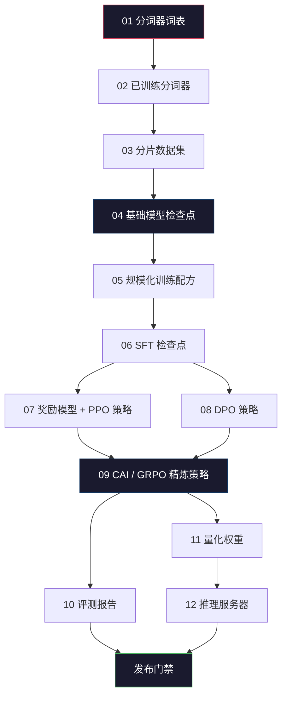
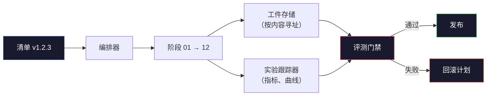

# 构建完整的 LLM 流水线

> 从第 01 课到第 12 课的所有内容，都是同一条流水线（pipeline）中的一个阶段。这节课提供的是把这些阶段串成一次端到端（end-to-end）运行的脚手架：分词（tokenize）、预训练（pre-train）、规模化（scale）、SFT、对齐（align）、评测（evaluate）、量化（quantize）、服务化（serve）。你不会在一台笔记本电脑上训练一个 70B 模型。你将产出的是编排层、清单、评测门禁，以及一个 2026 年前沿团队用来决定哪些成果可以发布的回滚计划。这就是压轴项目。

**类型：** 构建
**语言：** Python（stdlib）
**先修要求：** Phase 10 的全部第 01-12 课
**时间：** ~120 分钟

## 学习目标

- 将前面十一节课（分词器、数据、预训练、规模化、SFT、RLHF、DPO、CAI、评测、量化、推理）组合成一份可复现的单一流水线规范
- 定义阶段之间的工件契约：每个阶段消费什么、产出什么，以及下一个阶段如何验证输入
- 构建一个能跟踪实验、对工件做哈希、并基于评测阈值决定是否可发布的编排器
- 设计回滚计划：哪些工件重跑成本低，哪些代价高，以及一个损坏的检查点会造成什么损失

## 问题

前面的课程各自都能工作。分词器（tokenizer）已训练完成。微型 GPT 已完成预训练。SFT 数据集已组装完成。奖励模型（reward model）已训练完成。DPO 已跑通。评测（evals）已测完。量化权重已导出。推理服务器已启动。每一项都是一个笔记本（notebook）。每一项都有自己的约定、自己的输出路径、自己的随机种子。

一次前沿训练运行不是一个笔记本。Llama 3 405B 在大约 54 天里消耗了 3000 万 H100 小时。DeepSeek-V3 使用了大约 280 万 H800 小时。在这段时间里，一个损坏的检查点、一次数据污染、一次评测回归，都可能让一个团队损失一周的墙钟时间和一个月的 GPU 预算。团队之所以能活下来，靠的是流水线卫生（pipeline hygiene）：每个阶段都有确定性的输入、确定性的输出、一份清单、一个哈希，以及一道门禁。

这就是压轴项目。你不会在笔记本电脑上把整条流水线端到端跑完。你要写的是：协调各阶段的编排器、描述整次运行的清单、决定能否发布的校验器，以及让第三方能通过单个文件重跑你全部工作的重放计划。代码很小，纪律很大。

这个模式从 100M 参数扩展到 1T 参数都不变。同样四个组件——清单（manifest）、编排器（orchestrator）、评测门禁（eval gate）、工件存储（artifact store）——既能运行 Llama 3，也能运行你的业余 GPT。差别只在于每个阶段配置里的数字规模，而不在于流水线的形状。

## 概念

### 十二个阶段

Phase 10 的每一课都是一个阶段。下面是完整的依赖图。



第 07 和第 08 阶段可以并行运行。其他一切都是硬依赖。第 02 阶段（分词器）的变化会让所有下游工件失效。第 10 阶段（评测）的变化只会让发布决策失效。

### 清单

清单（manifest）是一个能足够完整描述某次运行、以便重放的单文件。流水线产出的任何结果，都不应该依赖清单之外的状态。这些字段很无聊，但缺一不可。

```
pipeline_version: 1.2.3
seed: 42
git_commit: a1b2c3d4
stages:
  01_tokenizer:
    recipe: bpe_32k
    input_hash: sha256:...
    output_hash: sha256:...
    wall_clock_sec: 3600
    cost_usd: 12
```

第 N 阶段的输出哈希，就是第 N+1 阶段的输入哈希。只要有任何偏差，流水线就会停止。这就是你及早发现数据损坏的方式。这也是为什么身处另一片大陆的队友，能验证他们重放出来的工件与你的一致。

在实践中，团队通常会使用一个小型 YAML 模式（schema），再配一个清单检查器，与上一次成功运行做差异比较（diff）。任何超出预期字段（成本、墙钟时间）之外的变化，都是红旗。

### 工件类型

每个阶段的输出都是一个有类型的工件（typed artifact）。不是一个目录数据块（blob），不是一个 pickle 序列化对象，而是一种带名字、已知模式（schema）的类型。

| 阶段 | 工件类型 | 关键字段 |
|-------|--------------|-----------|
| 01-02 | 分词器 | vocab.json、merges.txt、config.json、哈希 |
| 03 | 数据集 | shards[]、行数、token 数、去重统计 |
| 04-05 | 检查点 | weights.safetensors、config.json、优化器状态、步数 |
| 06 | SFT 模型 | 检查点 + SFT 配方 + 数据混合 |
| 07 | 奖励模型 | RM 检查点 + 偏好数据哈希 |
| 08-09 | 策略 | 检查点 + 参考哈希 + beta + 已消耗的 KL 预算 |
| 10 | 评测报告 | 基准分数 + 回归差异 + 评测数据哈希 |
| 11 | 量化模型 | 量化权重 + 校准数据 + 相对 FP16 的精度差 |
| 12 | 服务端规范 | 端点 + 模型哈希 + 配置 + 可观测性钩子 |

这种类型约束能防住最常见的失败模式：把第 08 阶段的输出当作第 06 阶段的输入，把一个 DPO 训练出来的模型沿着 SFT 路径发布。有类型的工件和有类型的阶段签名，会让这些错误变成“编译期”失败，而不是第五天才暴露的问题。

### 评测门禁

发布不等于“训练完成”。发布是“训练完成且通过了评测门禁（eval gate）”。这道门禁在运行开始之前就要定义好。

```
gates:
  mmlu:      >= baseline + 0.5   # no regression
  humaneval: >= baseline + 1.0
  truthfulqa: >= baseline         # no drop
  safety_refusal_rate: <= 0.05
  kl_from_reference: <= 25.0
  cost_total_usd: <= 50000
```

每一道门禁都是数值阈值。不能有“看起来不错”这样的门禁。不能有主观签字。若所有门禁都通过，该工件就会被标记为可发布。若任意一个门禁失败，该运行就会被挂起，等待一位具名审阅者显式人工覆写（override），而这件事本身也会被记录进清单。

两类门禁能挡住大多数灾难。*回归*门禁（新模型在核心基准上至少要与旧模型一样好）能抓住训练错误（bug）。*KL 预算*门禁（对齐后的策略相对其参考模型的漂移不能超过 X）能抓住对齐过度。每一条生产流水线都会同时拥有这两者。

### 编排器

编排器（orchestrator）是一小段代码：它读取清单、分发阶段、跟踪工件，并在任何契约被破坏时停止。这不是 Airflow。也不是 Kubeflow。要做到流水线卫生，你想要的是一个无聊但由你自己写出来的东西。

编排器的职责非常狭窄：

1. 从清单解析 DAG。
2. 对每个阶段，检查预期输出是否已以正确哈希存在（若存在则跳过）。
3. 运行该阶段，捕获 stdout/stderr，测量墙钟时间与成本。
4. 根据下游阶段预期的输入哈希，验证输出哈希。
5. 一旦失败，写出一份部分清单，精确记录失败阶段，并以非零状态退出。

这只需要 200 行 Python。它看起来就会像本课里的 `code/main.py`。在底层，真实流水线会用 `torchrun` 或 `ray` 在集群上执行各个阶段，但编排器本身运行在单机上。

### 实验跟踪与工件存储

有两套外部系统为这条流水线提供锚点。

**实验跟踪器（experiment tracker，wandb、neptune、mlflow）。** 它为每个阶段记录损失（loss）曲线、评测指标、系统遥测。当你需要在三周后比较运行 A 和运行 B 时，你去看的就是它。团队几乎总会使用托管式跟踪器——自己造一个只会浪费本该投入训练的时间。

**工件存储（artifact store，S3、R2、GCS）。** 它是用于保存检查点、数据集、分词器、评测报告的不可变对象存储。工件通过哈希寻址，而不是通过文件名。像 `latest.pt` 这样的文件名是个坑；`ckpt-7b-step-20000-sha256:abc123.safetensors` 才是一份契约。

编排器会同时写入这两者。跟踪器服务于看图的人类。工件存储服务于下一个阶段查找输入。

### 成本核算

一次前沿运行总会挂着一个美元数字。预算纪律发生在两个位置。

**运行前估算。** 根据清单，计算预期 FLOPs（对预训练而言：6 x params x tokens）、预期 GPU 小时（FLOPs / 峰值吞吐 / 利用率），以及按当前租用价格计算的美元成本。如果估算值超过预算门禁，流水线将拒绝启动。

**运行中跟踪。** 每个阶段的墙钟时间和成本都会被记录到清单里。每完成一个阶段，就会检查剩余预算。如果某个阶段超支，就用更新后的剩余预算去评估下一个阶段的门禁。不要等 VC 打电话时才发现你已经没钱了。

Llama 3 报告的成本是 6100 万美元。DeepSeek-V3 报告主预训练运行成本为 560 万美元。两者的差异主要来自硬件效率和混合专家（mixture-of-experts）——但之所以能看见这些具体数字，是因为这两个团队按阶段而不是按整次运行去跟踪成本。

### 可复现性 vs 确定性

这两者并不相同。*可复现*（reproducible）意味着：相同的清单、相同的代码、相同的基础设施，会产出一个在下游指标上等价的检查点。*确定性*（deterministic）意味着：输出在位级上完全一致。

现代 LLM 训练是可复现的，但不是确定性的。分布式训练中的 reduce 次序、GPU 内核的非确定性（cuBLAS、flash-attn），以及混合精度舍入，会共同造成不同运行之间在 1e-5 量级上不同的浮点值。这对最终指标来说没有问题，因为指标并不会变化；但如果你想用位级差异比较（diff）来调试，这就是致命的。解决办法是记录每个阶段的输入哈希、输出哈希和标题级指标——只要这些一致，这次运行就算“被复现”了，即使权重并非逐位相同。



### 回滚计划

在运行开始前，就写下每个阶段失败时会发生什么。分成三类。

- **重跑成本低**（数小时）：分词器、评测、量化、推理服务器。直接重跑。
- **中等**（数天）：SFT、DPO、CAI。保留基础模型，只重跑对齐阶段。
- **昂贵**（数周、数百万美元）：预训练。这里的回滚计划不是“重跑”，而是“使用上一个良好检查点，并用修订后的数据重跑更便宜的下游阶段”。

由于阶段依赖是有类型并带哈希的，编排器可以自动计算回滚集合：让失败阶段及其所有后代失效。第 06 阶段（SFT）失败，会让 06、07、08、09、10、11、12 失效。第 11 阶段（量化）失败，则只会让 11 和 12 失效。提前把这件事命名清楚，能避免团队在凌晨 4 点精疲力竭时临场发挥。

### 2026 年观察到的生产配方

大多数前沿团队都收敛到同一套骨架。

- 分词器：128k BPE，带字节回退（byte fallback）。用一个小而均衡的多语种切片训练。
- 预训练：10-20T 个 token，主要由网页、代码和合成数据构成。使用 Muon 或 AdamW 优化器。FSDP2 或 DeepSpeed ZeRO-3。梯度检查点。BF16 权重，FP32 主权重。
- SFT：500k-2M 条指令对，混合人工与合成数据，并且对评测集（eval set）执行严格去重。
- 对齐：DPO 或 CAI + GRPO。只有当偏好信号对 DPO 来说维度过高时，才使用 RLHF。
- 评测：MMLU-Pro、MATH、HumanEval+、GPQA、SWE-Bench Verified、LiveBench，再加上一套公众永远看不到的私有留出集（held-out set）。
- 量化：服务使用 4-bit GPTQ 或 AWQ；对精度差（accuracy delta）敏感的安全评测使用 8-bit。
- 服务：vLLM、TensorRT-LLM 或自研系统。连续批处理。推测解码。KV 缓存驱逐。

数字每六个月都会变。骨架不会。

## 动手构建

本课的代码是一个编排器和一个清单检查器，而不是十二个训练脚本。每个阶段都用一个占位器来模拟，它会产出一个形状和哈希都正确的输出工件。在你把真实 GPU 预算烧到真实阶段之前，先把编排器端到端跑通，就能证明这条流水线的底层连线是通的。

完整实现见 `code/main.py`。关键组成如下：

- `Manifest` 数据类（dataclass）：流水线版本、seed、git commit、stages、gates。
- `Stage` 数据类（dataclass）：name、type、inputs（hashes）、output（hash）、wall clock、cost。
- `Orchestrator.run()`：解析 DAG、分发阶段、验证哈希、更新清单。
- `EvalGate.check()`：读取阈值，对比最新评测报告，返回通过/失败。
- `ArtifactStore`（内存存根，stub）：按哈希 put/get，模拟 S3。
- `CostTracker`：跟踪每阶段和累计成本，在超过上限时停止。

`main.py` 里的流水线会运行十二个占位阶段、生成一份清单，并故意触发一次失败的评测门禁，让你看到运行被挂起时是什么样子。把每个占位器替换成对应课程中的真实训练脚本，你就得到了真实前沿流水线所用的那套骨架。

## 使用它

标准工作流只有三条命令。

```
python code/main.py plan    # validate manifest, compute cost estimate, print DAG
python code/main.py run     # execute stages, writing to manifest.out.yaml
python code/main.py gate    # read manifest.out.yaml, apply eval gates, ship-or-hold
```

每次都先运行 `plan`。大多数流水线 bug 都会在计划阶段暴露——缺失的门禁阈值、过期的哈希、预算超支。运行 `plan` 是免费的。运行 `run` 很昂贵。要在便宜的一侧抓住 bug，才能省钱。

`gate` 的输出要么是 `SHIP`，要么是 `HOLD: &lt;reason>`。被挂起的运行不是失败；它是一个决策点。一位具名审阅者要么进行人工覆写（override，并把记录写下来），要么批准回滚。

## 发布它

本课会产出 `outputs/skill-llm-pipeline-reviewer.md`。把一份拟议的流水线清单喂给它，它会检查所有契约：阶段类型、哈希链、门禁、回滚计划、成本估算。若清单缺少评测门禁、KL 预算没有上限，或某次运行混用了评测数据和训练数据，它都会拒绝批准。

## 练习

1. 扩展编排器，使其支持第 07 和第 08 阶段并行执行。使用标准库 `concurrent.futures` 模块。确认最终清单记录了两个阶段的输出，并且第 09 阶段的输入哈希是两者的确定性组合。

2. 添加一个“污染检查”门禁。给定 eval 数据集哈希和训练数据集分片，计算重叠率（精确字符串匹配或 13-gram 匹配）。如果重叠超过 0.1%，门禁就失败。给它喂一个受污染的训练集，并确认门禁会让这次运行进入 HOLD。

3. 从第一性原理实现一个成本估算器。对第 04 阶段（预训练），将 FLOPs 估算为 6 x params x tokens，假设在 H100 的 989 TFLOPs BF16 上 MFU（model FLOPs utilization）为 40%，单价为 $2.50/GPU-hour。给出一个 7B 模型在 2T 个 token 上训练的估算结果，并与公开的 Llama 2 数字比较。

4. 构建一次部分回滚。模拟第 09 阶段（CAI）失败，然后仅重跑第 09 到第 12 阶段，同时让 01-08 保持缓存。编排器应通过哈希检测到这些缓存工件并跳过它们。测量相对于完整重跑节省了多少墙钟时间。

5. 添加可观测性（observability）。为每个阶段发出 OpenTelemetry span，并附带 params、已见 token 数、loss、cost 等属性。把这些 span 导入本地收集器（collector）。重点不是仪表盘；重点是每个阶段的健康状态都能通过单个 trace ID 被追踪。

## 关键术语

| 术语 | 人们会怎么说 | 它真正的含义 |
|------|----------------|----------------------|
| 清单 | “配方文件” | 描述流水线版本、seed、每阶段配置和门禁阈值的 YAML 或 JSON——足以重放一次运行 |
| 按内容寻址 | “按哈希，不按名字” | 工件按其内容的 SHA-256 存储，因此你绝不会把版本 A 和版本 B 混淆 |
| 评测门禁 | “发布标准” | 在工件被标记为可发布之前，基准指标和安全分数必须满足的数值阈值 |
| KL 预算 | “对齐漂了多远” | 对齐阶段中累计 KL(policy || reference) 的上限，作为门禁强制执行 |
| MFU | “你把 GPU 用满了多少” | Model FLOPs Utilization——实际达到的 FLOPs 除以理论峰值。70B 规模下 40% 很常见，7B 下 55% 很常见 |
| 回滚计划 | “坏了之后我们怎么做” | 针对每个阶段预先写好的失败应对动作集合：重跑、回退、用修订后的输入重训 |
| 编排器 | “指挥家” | 读取清单、分发阶段、验证哈希，并在任何契约违反时停止的进程 |
| 工件存储 | “给权重做版本管理的 S3” | 不可变、按内容寻址的对象存储——检查点、数据集、评测报告的单一事实来源 |
| 可复现 | “重放后指标相同” | 位级权重不同，但下游指标等价——这是分布式 LLM 训练里现实可达的目标 |
| 成本门禁 | “你不能超过 X” | 运行前成本估算加运行中跟踪器——如果估算值超过预算，流水线会拒绝启动 |

## 延伸阅读

- [Dubey et al., 2024 -- "The Llama 3 Herd of Models"](https://arxiv.org/abs/2407.21783) -- 对前沿流水线最详细的公开描述之一，涵盖数据、训练、对齐与评测
- [DeepSeek-AI, 2024 -- "DeepSeek-V3 Technical Report"](https://arxiv.org/abs/2412.19437) -- 以效率优先的流水线，成本大约只有 Llama 3 同等级训练的 1/10
- [Kaplan et al., 2020 -- "Scaling Laws for Neural Language Models"](https://arxiv.org/abs/2001.08361) -- 最早提出计算、数据、参数缩放关系的论文
- [Hoffmann et al., 2022 -- "Training Compute-Optimal Large Language Models (Chinchilla)"](https://arxiv.org/abs/2203.15556) -- 对 Kaplan 的修正，重新校准了现代数据预算
- [PyTorch FSDP2 documentation](https://pytorch.org/docs/stable/fsdp.html) -- 在 PyTorch 2.4+ 中替代 FSDP1 的分布式训练原语
- [Weights & Biases LLM Reports](https://wandb.ai/site/llms) -- 开源 LLM 运行中的真实清单与实验跟踪器输出，可直接借鉴为模板
