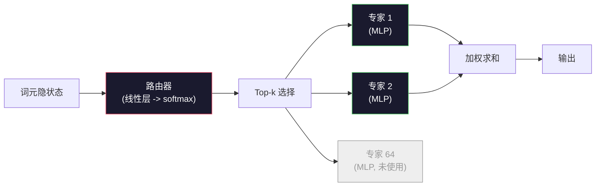

# 开放模型：架构逐步拆解

> 你在第 04 课里从零构建了一个 GPT-2 Small。2026 年的前沿开放模型（frontier open models）仍然属于同一家族，只是有五到六处具体改动：用根均方归一化（RMSNorm）替代层归一化（LayerNorm），用 SwiGLU 替代 GELU，用旋转位置编码（RoPE）替代学习式位置编码，用分组查询注意力（GQA）或多头潜在注意力（MLA）替代完整的多头注意力（MHA），并在大规模上引入混合专家（Mixture-of-Experts, MoE）。你已经掌握的数学足以覆盖其中 95%。本课将 Llama 3、DeepSeek-V3、Mixtral、Qwen 和 Gemma 并排比较，并指出每种架构究竟是从哪一行开始分叉的。

**类型：** 学习
**语言：** Python（stdlib）
**先修要求：** 第 10 阶段，第 04、05、12 课（预训练、缩放、推理）
**时间：** 约 45 分钟

## 学习目标

- 阅读 Llama 3、Mistral、Mixtral、Gemma 2、Qwen 2.5 和 DeepSeek-V3 的 config.json，并解释每一个字段
- 说出每个模型相对 GPT-2 Small 做了哪些具体架构改动，并从第一性原理说明原因
- 仅根据配置文件，计算任意开放模型的参数量、KV 缓存大小和激活内存
- 在延迟、内存和能力约束下，为部署目标选出合适的开放模型

## 问题

在第 04 课中，你写了 350 行 numpy，就得到了一个 GPT-2 形状的模型。Llama 3 405B 却有一份长达 200 页的技术报告。你的直觉会觉得这两者是完全不同的怪物。其实不是。这 200 页描述的仍然是同一个对象，只不过加上了五六个动机明确的修改，以及一大堆关于扩展规模的实现细节。骨架——嵌入（embedding）、Transformer 块、注意力（attention）、MLP、归一化（norm）、输出头（head）——并没有改变。

这节课本质上是一份 diff。对于每个主要开放模型家族，我们都会准确列出：相对 GPT-2 改了什么、为什么改、代价是什么。学完之后，你就能读一张新模型卡，并在脑中把它翻译回 GPT-2 这条基线。

实际收益在于：当 Meta 发布 Llama 5，或者 DeepSeek 发布 V4 时，你不需要重新建立一套心智模型。你只要看一眼配置，看看那些熟悉的旋钮里哪些被拨动了，就能知道下游影响是什么。2026 年的架构就是一个有限工具箱；每个新模型只是从中挑选不同的子集。

## 核心概念

### 不变的核心

所有自回归开放模型都共享以下结构：

- 词元嵌入矩阵（vocab_size x hidden_dim）。
- N 个解码器块（decoder block）堆叠：归一化、自注意力、残差、归一化、MLP、残差。
- 最终归一化层和投影到 vocab_size 的线性输出头（通常与嵌入权重绑定）。
- 因果掩码，以及预测下一个词元的交叉熵损失。

这就是整体形状，剩下的都是旋钮。

### 真正会变化的六个旋钮

在 2024 到 2026 年的所有前沿开放模型中，反复出现的设计选择其实都是同样的六项：

1. **归一化。** LayerNorm -> RMSNorm。
2. **位置编码。** 学习式绝对位置 -> RoPE（以及 YaRN、NTK 等变体）。
3. **激活函数。** GELU -> SwiGLU（或 GeGLU）。
4. **注意力头共享。** MHA -> GQA -> MQA -> MLA。
5. **稠密与稀疏 MLP。** Dense -> Mixture-of-Experts。
6. **预归一化位置。** pre-norm 保留，post-norm 消失。

其他一切（学习率调度、数据混合、batch size、上下文长度）都属于训练配置，而不是架构本身。就这六个旋钮。

### 旋钮 1：RMSNorm

LayerNorm 会减去均值、除以标准差、再做缩放和平移。RMSNorm 只保留缩放：

```
RMSNorm(x) = x / sqrt(mean(x^2) + eps) * gamma
```

没有减均值。没有偏置。每个 token 少做一点计算。Zhang 和 Sennrich（2019）指出，它在机器翻译上能达到与 LayerNorm 相当的效果，同时快 10%。所有现代开放模型都在用它。

代价：没有。收益：吞吐略有提升，代码更简单。

### 旋钮 2：RoPE

GPT-2 中学习式位置嵌入是一个 1024 槽位的查找表。到了上下文 1025，你就已经越过表尾了。模型无法外推到训练长度之外。

旋转位置编码（Rotary Position Embedding, RoPE，Su 等，2021）会在注意力点积之前，按成对维度旋转每个 Q 和 K 向量，从而注入位置信息。旋转角度是位置的确定性函数，因此没有任何需要学习的参数，也不会出现“用完位置”的问题。借助缩放技巧（NTK-aware interpolation、YaRN），一个在 8k 上训练的模型，可以在推理时拉伸到 128k，上下文精度只会温和下降。

```
q_rotated = rotate(q, angle(pos))
k_rotated = rotate(k, angle(pos))
score = q_rotated . k_rotated
```

所有 Llama、Mistral、Qwen、DeepSeek 和 Gemma 都使用 RoPE。Gemma 2 采用混合方案（大多数层用 RoPE，另一些层用局部滑动窗口注意力）。

### 旋钮 3：SwiGLU

GPT-2 的 MLP 是 `x -> gelu(xW1 + b1) -> (...)W2 + b2`。SwiGLU（Shazeer 2020）把激活替换成一个门控乘积：

```
SwiGLU(x) = (xW1) * sigmoid(xW1) * xV
```

它不再只有一个投影，而是并行做两个投影，再由 Swish 激活进行门控。在经验上，它以相同参数量能得到更好的困惑度。Llama 2 采用之后，其他人基本都跟进了。MLP 的隐藏维度通常会被设置成让总参数量与原始稠密 MLP 大致相当：如果 GPT-2 使用 `ff_dim = 4 * hidden`，那么 SwiGLU 会使用 `ff_dim = (2/3) * 4 * hidden = 8/3 * hidden`。

### 旋钮 4：注意力头共享

GPT-2 使用的是**多头注意力（Multi-Head Attention, MHA）**：每个头都有自己的 Q、K、V 投影。

**多查询注意力（Multi-Query Attention, MQA，Shazeer 2019）**会让所有头共享一个 K 和一个 V。这样可以把 KV 缓存缩小到原来的 1 / num_heads，也就是典型模型上 12 倍到 32 倍的削减。不过在困难基准上，精度会略有下降。

**分组查询注意力（Grouped-Query Attention, GQA，Ainslie 等，2023）**是折中方案：G 组 Q 头共享一个 K 和一个 V。Llama 3 8B 使用 GQA，具有 32 个 Q 头和 8 个 KV 头（G=8），因此相较完整 MHA，KV 缓存缩小了 4 倍。

**多头潜在注意力（Multi-Head Latent Attention, MLA，DeepSeek 2024）**会先把 K 和 V 压缩进共享的低秩潜变量，再按头投影回高维。这样在保留按头表达能力的同时，进一步缩小 KV 缓存。DeepSeek-V2 和 V3 的长上下文表现很大程度上依赖这一点。

| 方案 | KV 头数 | KV 缓存 | 精度 |
|--------|----------|----------|----------|
| MHA    | num_heads | 完整 | 最佳 |
| GQA    | num_groups (G &lt; num_heads) | 缩小为原来的 num_heads / G | 接近 MHA |
| MQA    | 1 | 缩小为原来的 1 / num_heads | 轻微下降 |
| MLA    | latent, per-head decompression | 比 MQA 更小 | 接近 MHA |

对于任何超过约 13B 参数的模型来说，GQA 或 MLA 基本都是必选项。大规模场景下继续使用完整 MHA，会让 KV 缓存变成灾难。

### 旋钮 5：混合专家（Mixture of Experts, MoE）

稠密 MLP 会为每个 token 激活全部参数。MoE MLP 在每个块里有 K 个专家（expert），再加一个路由器（router），由它为每个 token 选出 top-k 个专家（通常是 top-2）。只有这些专家的权重会为该 token 执行前向传播。

```
router_logits = xW_r
indices, weights = top_k(router_logits, k=2)
output = sum_i weights[i] * expert[indices[i]](x)
```

它的吸引力在于：你可以拥有 64 个、每个都是 7B 规模的专家（所以总参数量极大），但每个 token 只运行其中 2 个（所以单 token 计算量仍接近一个稠密 7B 模型）。Mixtral 8x7B 总参数有 47B，但每个 token 只激活 13B。DeepSeek-V3 总参数有 671B，但每个 token 只激活 37B。



优点：相同计算量下拥有更多参数、获得更强容量。缺点：专家权重仍然必须存放在某处（因此服务时需要比同级稠密模型更多的显存），路由器的负载均衡很难做，而在对齐阶段微调路由器本身就是一个独立研究方向。

### 旋钮 6：保留 pre-norm

原始 Transformer 在每个子层之后应用 layer norm。自 GPT-2 以来的所有开放模型都会把它放在*每个子层之前*。pre-norm 在深层训练中就是更容易优化，没什么可争论的。

### 逐模型差异

下面这张表把前面的内容都落到了实处。

| 模型 | 年份 | 总参数 | 活跃参数 | 归一化 | 激活函数 | 位置编码 | 注意力 | MoE | 上下文 |
|-------|------|-------------|---------------|------|-----------|----------|-----------|-----|---------|
| GPT-2 Small | 2019 | 124M | 124M | LayerNorm | GELU | 学习式 | MHA（12 头） | 否 | 1k |
| Llama 3 8B | 2024 | 8B | 8B | RMSNorm | SwiGLU | RoPE | GQA（32/8） | 否 | 128k |
| Llama 3 70B | 2024 | 70B | 70B | RMSNorm | SwiGLU | RoPE | GQA（64/8） | 否 | 128k |
| Llama 3 405B | 2024 | 405B | 405B | RMSNorm | SwiGLU | RoPE | GQA（128/16） | 否 | 128k |
| Mistral 7B | 2023 | 7.2B | 7.2B | RMSNorm | SwiGLU | RoPE | GQA | 否 | 32k |
| Mixtral 8x7B | 2023 | 47B | 13B | RMSNorm | SwiGLU | RoPE | GQA | 是（8 个专家，top-2） | 32k |
| Gemma 2 9B | 2024 | 9B | 9B | RMSNorm（pre+post） | GeGLU | RoPE + 滑动窗口 | GQA | 否 | 8k |
| Qwen 2.5 72B | 2024 | 72B | 72B | RMSNorm | SwiGLU | RoPE（YaRN） | GQA（64/8） | 否 | 128k |
| DeepSeek V2 236B | 2024 | 236B | 21B | RMSNorm | SwiGLU | RoPE | MLA | 是（160 个专家，top-6） | 128k |
| DeepSeek V3 | 2024 | 671B | 37B | RMSNorm | SwiGLU | RoPE | MLA | 是（256 个专家，top-8） | 128k |

扫一眼这些列。RMSNorm 已经是通用配置。SwiGLU 及其表亲 GeGLU 也几乎是通用配置。RoPE 同样如此。7B 以上的模型里，GQA 基本是标配，除非它被 MLA 取代。MoE 则是高端模型真正拉开差异的地方。

### 读懂 config.json

Llama 3 8B 的配置：

```
{
  "hidden_size": 4096,
  "intermediate_size": 14336,
  "num_hidden_layers": 32,
  "num_attention_heads": 32,
  "num_key_value_heads": 8,
  "max_position_embeddings": 131072,
  "rope_theta": 500000.0,
  "rms_norm_eps": 1e-5,
  "vocab_size": 128256
}
```

每个字段都对应着你已经实现过的某个部件。

- `hidden_size`：嵌入维度。
- `intermediate_size`：MLP 隐藏层大小（3.5x hidden —— SwiGLU 的数学结果）。
- `num_hidden_layers`：堆叠深度。
- `num_attention_heads`：Q 头数量。
- `num_key_value_heads`：KV 头数量（GQA）。
- `max_position_embeddings`：训练时的上下文长度。
- `rope_theta`：RoPE 的基频。Meta 把它从默认的 10k 扩到了 500k，以支持长上下文外推。
- `rms_norm_eps`：数值稳定性。
- `vocab_size`：词元数。

仅凭这些字段，你就能算出总参数量、KV 缓存和峰值激活内存。精确公式见 `code/main.py`。

### 激活内存预算

当参数规模达到几十亿以上时，激活值会主导训练内存。预训练时（启用 gradient checkpointing）的经验公式是：

```
activation_mem ~ batch_size * seq_len * hidden_size * num_layers * bytes_per_element
```

对于 Llama 3 8B，如果 batch=1、seq=8192、BF16、32 层、hidden=4096：启用 checkpointing 时，仅激活值就大约需要 8 GB；不开时约为 40 GB。这就是为什么 flash-attention 和 ring-attention 很重要——它们重写了注意力计算方式，使激活值能够放得下。

### KV 缓存预算

在最大上下文长度下推理时：

```
kv_cache = 2 * num_layers * num_kv_heads * head_dim * max_seq_len * bytes_per_element
```

Llama 3 8B 在 128k 上下文、BF16、head_dim = hidden / num_heads = 128 时：
`2 * 32 * 8 * 128 * 131072 * 2 = 17.2 GB` 每条序列。

8B 权重在 BF16 下是 16 GB。单条 128k 序列的 KV 缓存比权重本身还大。这种内存压力正是推动 GQA、MLA 和 KV 缓存量化研究的原因。

### 各模型何时更占优

- **单张 80GB GPU，无 MoE：** Llama 3 8B、Mistral 7B、Gemma 2 9B。容易部署，工具链完善。
- **单节点（8x80GB），追求大容量：** Llama 3 70B、Qwen 2.5 72B。它们是能力最强的稠密开放模型。
- **追求最强开放能力，并接受 MoE 复杂度：** DeepSeek V3、Mixtral 8x22B。按活跃 FLOP 计算，它们的能力最高。
- **需要长上下文：** Llama 3（借助 RoPE 缩放达到 128k）、DeepSeek（MLA 更占优势）。
- **低延迟服务：** Gemma 2 9B（滑动窗口降低了长上下文计算成本）。

## 动手构建

本课代码是一个计算器。给定任意 config.json，它会打印各组件的参数量、最大上下文下的 KV 缓存、SwiGLU MLP 比例，以及对该架构的简短判断（dense / GQA / MLA / MoE）。

```python
config = {
    "hidden_size": 4096, "intermediate_size": 14336,
    "num_hidden_layers": 32, "num_attention_heads": 32,
    "num_key_value_heads": 8, "vocab_size": 128256,
    "max_position_embeddings": 131072,
}
```

脚本会逐字段走读架构，计算嵌入、注意力（含 GQA 缩减）、MLP（含 SwiGLU 扩展）、layernorm 以及输出头的参数量。随后，它会在给定上下文长度下计算 KV 缓存，并打印摘要。

实现见 `code/main.py`。

## 使用它

在脚本附带的 Llama 3 8B、Mistral 7B、Mixtral 8x7B 和 DeepSeek V3 配置上运行这个计算器。比较它们的参数拆解。注意：MoE 模型的总参数量远大于稠密模型，但活跃参数量往往反而更小。还要注意：尽管总参数更多，DeepSeek V3 的 KV 缓存却比 Llama 3 405B 更小——这就是 MLA 的作用。

然后把你本地任意模型的配置也塞进去，读一遍摘要，再判断它是否适合你的 GPU。

## 交付它

本课会产出 `outputs/skill-open-model-picker.md`。给定部署目标（GPU 类型、显存、上下文长度、延迟预算）和任务画像（聊天、代码、推理、长上下文），它会推荐一个开放模型、第 11 课里的量化方案，以及第 12 课里的推理栈，并明确说明六个架构旋钮各自带来的影响。

## 练习

1. 从 HuggingFace 读取 Qwen 2.5 72B 的配置，从零计算总参数量。把结果与 HF 报告值对比，并找出任何偏差来自哪里（比如 head dim 的取整、KV 共享因子等）。

2. DeepSeek V3 使用 256 个专家，并采用 top-8 路由。计算被激活专家数与专家总数的比例，并与 Mixtral 8x7B 的 8 选 2 做比较。这种从稀疏（25%）到“更稠密的稀疏”（3%）的变化，对每 FLOP 容量意味着什么？

3. 计算 Llama 3 405B 在 128k 上下文下、FP8 和 BF16 两种精度的 KV 缓存。FP8 时它是 BF16 数值的一半。在单个 8xH100 节点上（每张 80GB，总计 640GB，扣除权重内存后），你最多能并行服务多少条序列？

4. Gemma 2 在全注意力层和滑动窗口注意力层之间交替。写出当一半层使用 4096-token 滑动窗口而不是完整上下文时，KV 缓存的数学表达式。在总上下文为 8k 时，这能节省多少内存？

5. 找一个在本课写完之后发布的最新前沿开放模型。判断它选择了这六个旋钮中的哪些，以及它是否引入了第七个旋钮。课程内容会在新架构发布的那一刻显得过时——目标是让你更新表格，而不是推倒重建心智模型。

## 关键术语

| 术语 | 人们会怎么说 | 它实际意味着什么 |
|------|----------------|----------------------|
| RMSNorm | “没有均值的 LayerNorm” | 只按均方根进行归一化，并配一个可学习缩放 —— 更便宜，效果也接近 LayerNorm |
| RoPE | “旋转位置” | 按位置相关角度，以二维成对方式旋转每个 Q 和 K 向量 —— 借助缩放技巧可以外推到训练长度之外 |
| SwiGLU | “新的 MLP 激活函数” | 带 Swish 的门控线性单元：`(xW1) * sigmoid(xW1) * xV` —— 每个 2024+ 开放模型里的标准配置 |
| GQA | “折中的注意力” | 分组查询注意力：G 组 Q 头共享一个 K 头和一个 V 头 —— 在不承受 MQA 精度损失的情况下缩小 KV 缓存 |
| MLA | “DeepSeek 的注意力” | 多头潜在注意力：把 K/V 压缩为共享的低秩潜变量，再按头解压 —— 大模型中 KV 缓存最小 |
| MoE | “稀疏专家” | 混合专家：每个块有 N 个 MLP，路由器为每个 token 选 top-k —— 总参数巨大，活跃参数很小 |
| Top-k routing | “每个 token 选 k 个专家” | 路由器为每个专家计算一个分数，并激活其中最高的 k 个 —— 典型 k 从 2（Mixtral）到 8（DeepSeek） |
| YaRN | “拉伸 RoPE” | 另一种 RoPE 扩展方式 —— 在推理时插值旋转角度，把上下文从 8k 扩到 128k+ |
| Sliding-window attention | “不要关注一切” | 每个 token 只关注最近 W 个 token —— 将每个 token 的注意力成本封顶为 O(W)，Gemma 2 和早期 Mistral 会用 |
| Active params | “每个 token 实际运行的参数” | 对 MoE 模型而言，指每个 token 前向传播时真正被用到的参数量（远小于总参数）—— 它决定每个 token 的 FLOPs |

## 延伸阅读

- [Dubey et al., 2024 -- "The Llama 3 Herd of Models"](https://arxiv.org/abs/2407.21783) -- Llama 3 稠密模型家族在架构与训练上的核心参考
- [DeepSeek-AI, 2024 -- "DeepSeek-V3 Technical Report"](https://arxiv.org/abs/2412.19437) -- 介绍 MLA、无辅助损失负载均衡，以及 671B 的 MoE
- [Jiang et al., 2024 -- "Mixtral of Experts"](https://arxiv.org/abs/2401.04088) -- 经典的开放 MoE 模型论文
- [Su et al., 2021 -- "RoFormer: Enhanced Transformer with Rotary Position Embedding"](https://arxiv.org/abs/2104.09864) -- RoPE 论文
- [Shazeer, 2020 -- "GLU Variants Improve Transformer"](https://arxiv.org/abs/2002.05202) -- SwiGLU、GeGLU 及其相关变体
- [Ainslie et al., 2023 -- "GQA: Training Generalized Multi-Query Transformer Models"](https://arxiv.org/abs/2305.13245) -- GQA 论文
- [Gemma 2 Team, 2024 -- "Gemma 2: Improving Open Language Models at a Practical Size"](https://arxiv.org/abs/2408.00118) -- 混合的全注意力 + 滑动注意力，以及 pre+post-norm
- [Qwen Team, 2024 -- "Qwen 2.5 Technical Report"](https://arxiv.org/abs/2412.15115) -- YaRN 上下文扩展与长上下文训练配方
