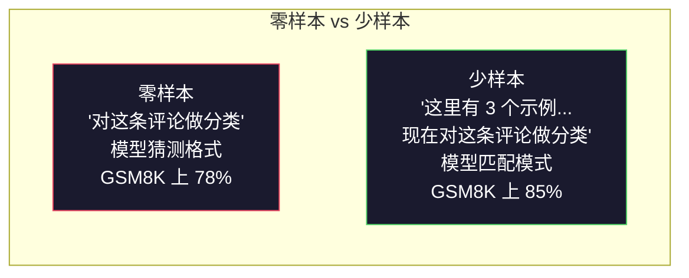
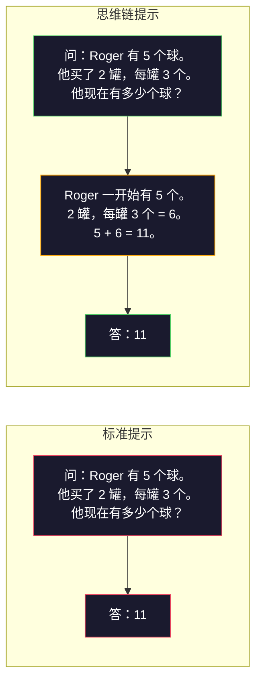
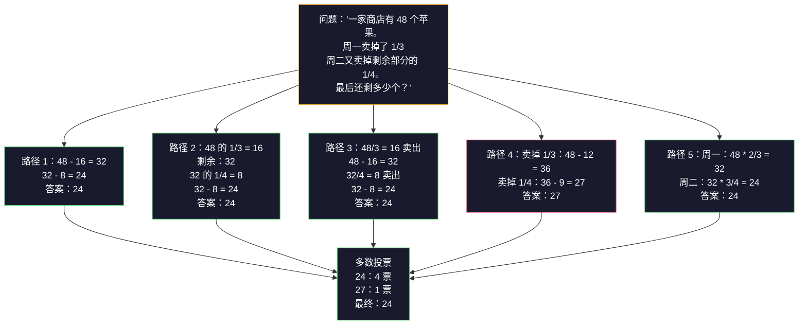
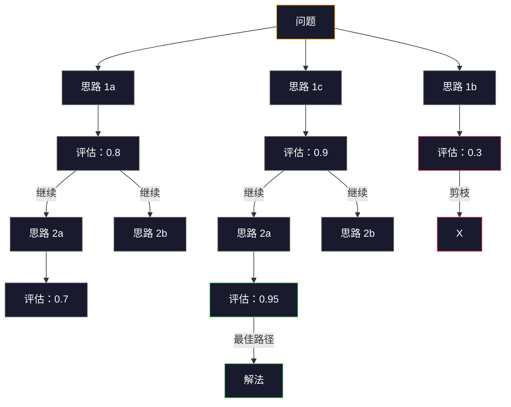

# 少样本 (Few-Shot)、思维链 (Chain-of-Thought, CoT)、思维树 (Tree-of-Thought, ToT)

> 告诉模型该做什么，叫做提示（prompting）。教它如何思考，才是工程。让同一个模型、同一个任务、同一份数据的准确率从 78% 提升到 91%，靠的不是更好的模型，而是更好的推理策略。

**类型：** 构建
**语言：** Python
**前置课程：** Lesson 11.01（Prompt Engineering）
**时长：** ~45 分钟

## 学习目标

- 通过选择并格式化能最大化任务准确率的示例演示，实作少样本提示
- 将 CoT 推理应用到数学应用题这类多步骤问题上，以提升准确率
- 构建一个能够探索多条推理路径并选出最佳路径的 ToT 提示
- 在标准基准上测量 zero-shot、few-shot 与 CoT 带来的准确率提升

## 问题

你正在做一个数学辅导应用。你的提示词写的是：“解答这道应用题。”GPT-5 在 GSM8K 这个标准小学数学基准上有 94% 的正确率。你以为这已经到顶了。其实还没有——CoT 依然能再带来 3 到 4 个点的提升。

只要再加上五个词——"Let's think step by step"——准确率就会跳到 91%。再加入几个完整示例，就能达到 95%。同一个模型。同一个 temperature。同样的 API 成本。唯一的区别，是你给了模型一张草稿纸。

这不是技巧，而是推理本身的工作方式。人类不会在一次脑内跳跃中解完多步骤问题，transformer 也不会。当你迫使模型生成中间 token 时，这些 token 就会成为下一个 token 的上下文。每一步推理都会喂给下一步。模型是真的在“算”出答案。

但“think step by step”只是起点，不是终点。如果你采样五条推理路径，再做多数表决，会怎样？如果你让模型探索一棵可能性的树，对分支进行评估和剪枝，又会怎样？如果你把推理和工具调用交错起来，又会怎样？这些都不是纸上谈兵，而是已经发表并验证有效的技术；这一课里，你会把它们全部做出来。

## 核心概念

### 零样本 (Zero-Shot) vs 少样本：什么时候示例比指令更有效

零样本提示 (Zero-shot prompting) 只给模型任务，不给任何额外示例。少样本提示 (Few-shot prompting) 则会先给它一些示例。

Wei 等人在 2022 年对 8 个基准进行了测量。对情感分类这类简单任务，zero-shot 和 few-shot 的表现差距通常在 2% 以内。对多步算术和符号推理这类复杂任务，few-shot 能把准确率提高 10% 到 25%。

直觉上看，示例就是被压缩过的指令。你不用描述输出格式，而是直接展示给模型看；你不用解释推理过程，而是直接演示。相比抽象指令，模型对示例的模式匹配通常更可靠。



**少样本更占优的场景：** 对格式敏感的任务、分类、结构化抽取、包含领域术语的任务，以及任何需要模型匹配特定模式的任务。

**零样本更占优的场景：** 简单事实问答、示例反而会限制创造力的任务，以及“找好示例”比“写好指令”更困难的任务。

### 示例选择：相似比随机更好

并不是所有示例都一样好。在分类任务上，选择与目标输入相似的示例，比随机选择高出 5% 到 15%（Liu et al., 2022）。有三个原则：

1. **语义相似度**：挑选在嵌入空间 (embedding space) 里最接近输入的示例
2. **标签多样性**：让示例覆盖所有输出类别
3. **难度匹配**：让示例的复杂度与目标问题一致

对大多数任务来说，最优示例数通常是 3 到 5 个。少于 3 个，模型拿不到足够的信号来提取模式；超过 5 个，收益就会明显递减，还会浪费上下文窗口里的 token。对于标签很多的分类任务，可以每个标签放一个示例。

### 思维链：给模型一张草稿纸

思维链提示由 Google Brain 的 Wei 等人在 2022 年提出。核心想法很简单：不要只让模型给答案，而是先把推理步骤写出来。



从机制上看，它为什么有效？transformer 生成的每一个 token 都会成为下一个 token 的上下文。没有 CoT 时，模型必须把全部推理压缩进一次前向传播的隐藏状态里；有了 CoT，它会把中间计算外化成 token。每一个推理 token 都在延长有效计算深度。

**GSM8K 基准（小学数学，8.5K 道题）：**

| 模型 | Zero-Shot | Zero-Shot CoT | Few-Shot CoT |
|-------|-----------|---------------|--------------|
| GPT-4o | 78% | 91% | 95% |
| GPT-5 | 94% | 97% | 98% |
| o4-mini (reasoning) | 97% | — | — |
| Claude Opus 4.7 | 93% | 97% | 98% |
| Gemini 3 Pro | 92% | 96% | 98% |
| Llama 4 70B | 80% | 89% | 94% |
| DeepSeek-V3.1 | 89% | 94% | 96% |

**关于推理模型 (reasoning model) 的说明。** 像 OpenAI o 系列（o3、o4-mini）和 DeepSeek-R1 这样的模型，会在输出答案前先在内部完成 CoT。对推理模型再额外加上 "Let's think step by step" 往往是多余的，有时甚至会起反效果——因为它们本来就已经这么做了。

CoT 主要有两种形式：

**Zero-shot CoT：** 在提示末尾加上 "Let's think step by step"。不需要示例。Kojima 等人在 2022 年证明，仅这一句话就能提升算术、常识推理和符号推理任务的准确率。

**Few-shot CoT：** 提供带有推理步骤的示例。它通常比 zero-shot CoT 更有效，因为模型看到了你期望的确切推理格式。

**CoT 什么时候有害：** 简单事实回忆（“法国首都是哪里？”）、单步分类、速度比准确率更重要的任务。CoT 每次查询会额外增加 50 到 200 个推理 token。对于高吞吐、低复杂度任务，这些成本基本都是浪费。

### 自洽性 (Self-Consistency)：多次采样，一次投票

Wang 等人在 2023 年提出了 self-consistency。核心洞察是：单条 CoT 路径里可能会有推理错误；但如果你采样 N 条相互独立的推理路径（temperature > 0），然后对最终答案做多数表决，错误就会彼此抵消。



在最初的 PaLM 540B 实验里，self-consistency 把 GSM8K 准确率从 56.5%（单条 CoT）提升到了 N=40 时的 74.4%。在 GPT-5 上，提升很小（97% 到 98%），因为基础准确率本身已经接近饱和。这个技术最适合基础 CoT 准确率在 60% 到 85% 的模型——也就是单路径错误很常见、但又不是系统性错误的甜蜜区间。对于 reasoning model（o 系列、R1），self-consistency 往往已经被内建的内部采样机制所覆盖。

权衡也很明显：N 次采样，就意味着 N 倍 API 成本和延迟。实际中，N=5 通常已经吃到大部分收益；N=3 是能形成有效投票的最低值；对大多数任务来说，N > 10 的边际收益就已经很低了。

### 思维树：分支式探索

Yao 等人在 2023 年提出了 ToT。CoT 只沿着一条线性推理路径前进，而 ToT 会探索多个分支，并在继续深入之前判断哪些分支更有希望。



ToT 有三个组成部分：

1. **思路生成**：产生多个候选下一步
2. **状态评估**：给每个候选打分（评估器也可以直接用 LLM 本身）
3. **搜索算法**：在树上做 BFS 或 DFS，并剪掉低分分支

在 Game of 24 任务上（用 4 个数字通过四则运算得到 24），GPT-4 使用标准提示时只能解出 7.3% 的题；用了 CoT 后甚至降到 4.0%（这里 CoT 反而有害，因为搜索空间太大）；而用 ToT 时，准确率达到 74%。

ToT 很贵。树上的每个节点都需要一次 LLM 调用。一棵分支因子为 3、深度为 3 的树，最多需要 39 次 LLM 调用。只有在“搜索空间很大、但又可以评估”的问题上才值得使用，比如规划、解谜、受约束的创意问题求解。

### ReAct：思考 + 执行

Yao 等人在 2022 年把推理轨迹和动作结合了起来。模型会在思考（生成推理）和执行（调用工具、搜索、计算）之间交替进行。


ReAct 在知识密集型任务上通常优于纯 CoT，因为它能把推理建立在真实数据上。在 HotpotQA（多跳问答）上，使用 GPT-4 的 ReAct 精确匹配 (exact match) 达到 35.1%，而仅用 CoT 只有 29.4%。它真正强大的地方在于：推理错误可以被观察结果纠正——模型能在执行过程中途更新自己的计划。

ReAct 是现代 AI 智能体 (agent) 的基础。几乎所有智能体框架（LangChain、CrewAI、AutoGen）都实现了某种 Thought-Action-Observation 循环的变体。完整智能体会在 Phase 14 里构建；这一课先聚焦在提示模式本身。

### 结构化提示：XML 标签、分隔符、标题

随着提示越来越复杂，良好的结构能防止模型混淆不同区段。常见有三种方式：

**XML 标签**（对 Claude 最友好，其他模型上也普遍有效）：
```
<context>
You are reviewing a pull request.
The codebase uses TypeScript and React.
</context>

<task>
Review the following diff for bugs, security issues, and style violations.
</task>

<diff>
{diff_content}
</diff>

<output_format>
List each issue with: file, line, severity (critical/warning/info), description.
</output_format>
```

**Markdown 标题**（通用）：
```
## Role
Senior security engineer at a fintech company.

## Task
Analyze this API endpoint for vulnerabilities.

## Input
{api_code}

## Rules
- Focus on OWASP Top 10
- Rate each finding: critical, high, medium, low
- Include remediation steps
```

**分隔符**（最简，但很有效）：
```
---INPUT---
{user_text}
---END INPUT---

---INSTRUCTIONS---
Summarize the above in 3 bullet points.
---END INSTRUCTIONS---
```

### 提示链 (Prompt Chaining)：顺序分解

有些任务太复杂，无法靠单个提示完成。Prompt chaining 会把任务拆成多个步骤，让前一个提示的输出成为后一个提示的输入。


链式提示优于单提示，主要有三个原因：

1. **每一步都更简单**：模型只需处理一个聚焦任务，而不是同时兼顾所有事情
2. **中间输出可检查**：你可以在步骤之间验证并纠正结果
3. **不同步骤可使用不同模型**：抽取用便宜模型，推理用昂贵模型

### 性能对比

| 技术 | 最适合 | GSM8K 准确率（GPT-5） | API 调用次数 | Token 开销 | 复杂度 |
|-----------|----------|------------------------|-----------|----------------|------------|
| Zero-Shot | 简单任务 | 94% | 1 | 无 | 极低 |
| Few-Shot | 格式匹配 | 96% | 1 | 200-500 tokens | 低 |
| Zero-Shot CoT | 快速提升推理效果 | 97% | 1 | 50-200 tokens | 极低 |
| Few-Shot CoT | 单次调用的最高准确率 | 98% | 1 | 300-600 tokens | 低 |
| Self-Consistency (N=5) | 高风险推理任务 | 98.5% | 5 | 5x token 成本 | 中 |
| Reasoning model (o4-mini) | 可直接替代 CoT | 97% | 1 | hidden（内部 2-10x） | 极低 |
| Tree-of-Thought | 搜索/规划问题 | 不适用（Game of 24 上为 74%） | 10-40+ | 10-40x token 成本 | 高 |
| ReAct | 基于知识落地的推理 | 不适用（HotpotQA 上为 35.1%） | 3-10+ | 可变 | 高 |
| Prompt Chaining | 复杂多步骤任务 | 96%（pipeline） | 2-5 | 2-5x token 成本 | 中 |

该选哪种技术，取决于三个因素：准确率要求、延迟预算和成本容忍度。对大多数生产系统来说，少样本 CoT 加上一个 3 次采样的自洽性回退策略，已经能覆盖 90% 的使用场景。

## 动手构建

我们将构建一个数学题求解器，把少样本提示、CoT 推理和自洽性投票组合成一条完整流水线 (pipeline)。然后，我们会再为难题加入 ToT。

完整实现位于 `code/advanced_prompting.py`。下面是关键组件。

### 第 1 步：少样本示例库

第一个组件负责管理少样本示例，并为给定问题选出最相关的几个。

```python
GSM8K_EXAMPLES = [
    {
        "question": "Janet's ducks lay 16 eggs per day. She eats three for breakfast every morning and bakes muffins for her friends every day with four. She sells every egg at the farmers' market for $2. How much does she make every day at the farmers' market?",
        "reasoning": "Janet's ducks lay 16 eggs per day. She eats 3 and bakes 4, using 3 + 4 = 7 eggs. So she has 16 - 7 = 9 eggs left. She sells each for $2, so she makes 9 * 2 = $18 per day.",
        "answer": "18"
    },
    ...
]
```

每个示例有三个部分：问题、推理链和最终答案。正是这条推理链，把一个普通少样本示例变成了 CoT 少样本示例。

### 第 2 步：CoT 提示构建器

这个提示构建器会把系统消息 (system message)、带推理链的少样本示例，以及目标问题拼成一个完整提示。

```python
def build_cot_prompt(question, examples, num_examples=3):
    system = (
        "You are a math problem solver. "
        "For each problem, show your step-by-step reasoning, "
        "then give the final numerical answer on the last line "
        "in the format: 'The answer is [number]'."
    )

    example_text = ""
    for ex in examples[:num_examples]:
        example_text += f"Q: {ex['question']}\n"
        example_text += f"A: {ex['reasoning']} The answer is {ex['answer']}.\n\n"

    user = f"{example_text}Q: {question}\nA:"
    return system, user
```

这里的格式约束（"The answer is [number]"）非常关键。没有它，self-consistency 就无法在多次采样之间提取并比较答案。

### 第 3 步：自洽性投票

采样 N 条推理路径，然后采用多数答案。

```python
def self_consistency_solve(question, examples, client, model, n_samples=5):
    system, user = build_cot_prompt(question, examples)

    answers = []
    reasonings = []
    for _ in range(n_samples):
        response = client.chat.completions.create(
            model=model,
            messages=[
                {"role": "system", "content": system},
                {"role": "user", "content": user}
            ],
            temperature=0.7
        )
        text = response.choices[0].message.content
        reasonings.append(text)
        answer = extract_answer(text)
        if answer is not None:
            answers.append(answer)

    vote_counts = Counter(answers)
    best_answer = vote_counts.most_common(1)[0][0] if vote_counts else None
    confidence = vote_counts[best_answer] / len(answers) if best_answer else 0

    return best_answer, confidence, reasonings, vote_counts
```

`temperature=0.7` 很重要。若 temperature=0.0，N 次采样会完全一样，self-consistency 就失去了意义。你需要足够的随机性来产生多样化的推理路径，但又不能高到让模型开始胡说八道。

### 第 4 步：ToT 求解器

对于线性推理容易失败的问题，ToT 会探索多种解法，并评估哪条方向最有希望。

```python
def tree_of_thought_solve(question, client, model, breadth=3, depth=3):
    thoughts = generate_initial_thoughts(question, client, model, breadth)
    scored = [(t, evaluate_thought(t, question, client, model)) for t in thoughts]
    scored.sort(key=lambda x: x[1], reverse=True)

    for current_depth in range(1, depth):
        next_thoughts = []
        for thought, score in scored[:2]:
            extensions = extend_thought(thought, question, client, model, breadth)
            for ext in extensions:
                ext_score = evaluate_thought(ext, question, client, model)
                next_thoughts.append((ext, ext_score))
        scored = sorted(next_thoughts, key=lambda x: x[1], reverse=True)

    best_thought = scored[0][0] if scored else ""
    return extract_answer(best_thought), best_thought
```

这里的评估器 (evaluator) 本身也是一次 LLM 调用。你会向模型提问：“从 0.0 到 1.0，这条推理路径对解决问题有多大希望？”这正是 ToT 的关键洞察——模型会评估自己的部分解。

### 第 5 步：完整流水线

这条流水线用升级策略把前面的技术整合在一起。

```python
def solve_with_escalation(question, examples, client, model):
    system, user = build_cot_prompt(question, examples)
    single_response = call_llm(client, model, system, user, temperature=0.0)
    single_answer = extract_answer(single_response)

    sc_answer, confidence, _, _ = self_consistency_solve(
        question, examples, client, model, n_samples=5
    )

    if confidence >= 0.8:
        return sc_answer, "self_consistency", confidence

    tot_answer, _ = tree_of_thought_solve(question, client, model)
    return tot_answer, "tree_of_thought", None
```

升级逻辑是：先尝试便宜的方案（单次 CoT）。如果 self-consistency 的置信度低于 0.8（也就是 5 次采样里少于 4 次一致），就升级到 ToT。这样能平衡成本和准确率——大多数题可以低成本解决，难题再投入更多计算。

## 使用方式

### 使用 LangChain

LangChain 内置了提示模板 (prompt template) 和输出解析 (output parsing) 支持，能显著简化少样本和 CoT 模式：

```python
from langchain_core.prompts import FewShotPromptTemplate, PromptTemplate
from langchain_openai import ChatOpenAI

example_prompt = PromptTemplate(
    input_variables=["question", "reasoning", "answer"],
    template="Q: {question}\nA: {reasoning} The answer is {answer}."
)

few_shot_prompt = FewShotPromptTemplate(
    examples=examples,
    example_prompt=example_prompt,
    suffix="Q: {input}\nA: Let's think step by step.",
    input_variables=["input"]
)

llm = ChatOpenAI(model="gpt-4o", temperature=0.7)
chain = few_shot_prompt | llm
result = chain.invoke({"input": "If a train travels 120 km in 2 hours..."})
```

LangChain 也提供了用于语义相似度选择的 `ExampleSelector` 类：

```python
from langchain_core.example_selectors import SemanticSimilarityExampleSelector
from langchain_openai import OpenAIEmbeddings

selector = SemanticSimilarityExampleSelector.from_examples(
    examples,
    OpenAIEmbeddings(),
    k=3
)
```

### 使用 DSPy

DSPy 会把提示策略 (prompting strategy) 视为可优化模块。你不再手工编写 CoT 提示，而是定义一个签名 (signature)，再让 DSPy 自动优化提示：

```python
import dspy

dspy.configure(lm=dspy.LM("openai/gpt-4o", temperature=0.7))

class MathSolver(dspy.Module):
    def __init__(self):
        self.solve = dspy.ChainOfThought("question -> answer")

    def forward(self, question):
        return self.solve(question=question)

solver = MathSolver()
result = solver(question="Janet's ducks lay 16 eggs per day...")
```

DSPy 的 `ChainOfThought` 会自动加入推理轨迹。`dspy.majority` 则实现了 self-consistency：

```python
result = dspy.majority(
    [solver(question=q) for _ in range(5)],
    field="answer"
)
```

### 对比：从零实现 vs 框架

| 特性 | 从零实现（本课） | LangChain | DSPy |
|---------|--------------------------|-----------|------|
| 对 prompt 格式的控制 | 完全控制 | 基于模板 | 自动 |
| Self-consistency | 手动投票 | 手动 | 内置（`dspy.majority`） |
| 示例选择 | 自定义逻辑 | `ExampleSelector` | `dspy.BootstrapFewShot` |
| Tree-of-Thought | 自定义树搜索 | 社区 chains | 不内置 |
| Prompt 优化 | 手动迭代 | 手动 | 自动编译 |
| 最适合 | 学习、自定义 pipeline | 标准工作流 | 研究、优化 |

## 交付成果

这一课会产出两个交付物。

**1. 推理链提示**（`outputs/prompt-reasoning-chain.md`）：一个可直接用于生产的少样本 CoT 提示模板。把你的示例和问题领域填进去就能用。

**2. CoT 模式选择技能**（`outputs/skill-cot-patterns.md`）：一个决策框架，帮助你根据任务类型、准确率要求和成本约束选择合适的推理技术。

## 练习

1. **测量差距**：取 10 道 GSM8K 题目，分别用 zero-shot、few-shot、zero-shot CoT 和 few-shot CoT 解答。记录每种方法的准确率。哪种技术在你的模型上提升最大？

2. **示例选择实验**：对同样这 10 道题，对比随机选择示例与手工挑选相似示例。测量准确率差异。在哪个点上，示例质量会比示例数量更重要？

3. **Self-consistency 成本曲线**：在 20 道 GSM8K 题上运行 N=1、3、5、7、10 的 self-consistency。画出准确率与成本（总 token 数）的关系图。对你的模型来说，曲线的拐点在哪里？

4. **构建一个 ReAct 循环**：给这条流水线加一个计算器工具。当模型生成数学表达式时，用 Python 的 `eval()`（在沙箱 (sandbox) 中）执行它，再把结果喂回去。测量这种基于工具落地的推理，是否优于纯 CoT。

5. **把 ToT 用到创意任务上**：把 Tree-of-Thought 求解器改造成一个创意写作任务：“写一个 6 个词的故事，同时要好笑又悲伤。”让 LLM 自己做 evaluator。分支式探索会比单次生成产出更好的创意结果吗？

## 关键术语

| 术语 | 人们常怎么说 | 它真正的含义 |
|------|----------------|----------------------|
| Few-shot prompting | “给它几个示例” | 在 prompt 中加入输入-输出示例，用来锚定模型的输出格式与行为 |
| Chain-of-Thought | “让它一步一步想” | 诱导模型先生成中间推理 token，在给出最终答案前扩展有效计算过程 |
| Self-Consistency | “多跑几次” | 在 temperature > 0 下采样 N 条多样化推理路径，再用多数投票选出最常见的最终答案 |
| Tree-of-Thought | “让它探索不同选项” | 对推理分支进行结构化搜索，评估每个部分解，只扩展最有希望的路径 |
| ReAct | “思考 + 工具使用” | 在 Thought-Action-Observation 循环中交替进行推理轨迹与外部动作（搜索、计算、API 调用） |
| Prompt chaining | “把任务拆成步骤” | 将复杂任务拆成顺序执行的多个 prompt，让每一步输出成为下一步输入 |
| Zero-shot CoT | “只要加上 'think step by step'” | 在没有任何示例的情况下，为 prompt 追加推理触发语，利用模型潜在的推理能力 |

## 延伸阅读

- [Chain-of-Thought Prompting Elicits Reasoning in Large Language Models](https://arxiv.org/abs/2201.11903) -- Wei et al. 2022。Google Brain 的原始 CoT 论文。重点阅读第 2-3 节的核心结果。
- [Self-Consistency Improves Chain of Thought Reasoning in Language Models](https://arxiv.org/abs/2203.11171) -- Wang et al. 2023。self-consistency 论文。表 1 里有你需要的全部数据。
- [Tree of Thoughts: Deliberate Problem Solving with Large Language Models](https://arxiv.org/abs/2305.10601) -- Yao et al. 2023。ToT 论文。第 4 节里 Game of 24 的结果最值得看。
- [ReAct: Synergizing Reasoning and Acting in Language Models](https://arxiv.org/abs/2210.03629) -- Yao et al. 2022。现代 AI agent 的基础。第 3 节解释了 Thought-Action-Observation 循环。
- [Large Language Models are Zero-Shot Reasoners](https://arxiv.org/abs/2205.11916) -- Kojima et al. 2022。那篇 "Let's think step by step" 论文。简单得惊人，但效果也强得惊人。
- [DSPy: Compiling Declarative Language Model Calls into Self-Improving Pipelines](https://arxiv.org/abs/2310.03714) -- Khattab et al. 2023。把 prompting 视作编译问题。如果你想走出手工 prompt engineering，这篇值得读。
- [OpenAI — Reasoning models guide](https://platform.openai.com/docs/guides/reasoning) -- 厂商关于 reasoning model 的指南，解释了 chain-of-thought 何时会从提示层技巧变成按 token 计费的内部“reasoning”模式。
- [Lightman et al., "Let's Verify Step by Step" (2023)](https://arxiv.org/abs/2305.20050) -- 过程奖励模型（PRM）：对推理链的每一步打分；这是比只奖励最终结果更有效的推理监督信号。
- [Snell et al., "Scaling LLM Test-Time Compute Optimally" (2024)](https://arxiv.org/abs/2408.03314) -- 对 CoT 长度、self-consistency 采样和 MCTS 的系统研究；当准确率比延迟更重要时，“think step by step”最终会走向这里。
