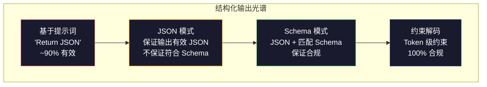
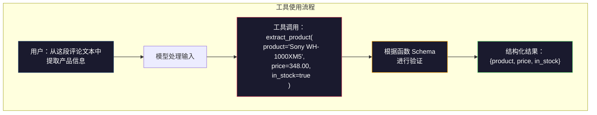

# 结构化输出 (Structured Outputs)：JSON、Schema 验证 (Schema Validation)、约束解码 (Constrained Decoding)

> 你的 LLM 返回的是字符串，而应用真正需要的是 JSON。这个落差导致的生产事故，比任何模型幻觉都更多。结构化输出是自然语言与类型化数据之间的桥梁。做对了，LLM 就会变成可靠的 API；做错了，你就会在凌晨 3 点用 regex 解析自由文本。

**类型：** 构建
**语言：** Python
**前置要求：** 第 10 阶段，第 01-05 课（从零开始实现 LLM）
**时长：** ~90 分钟
**相关内容：** 第 5 阶段 · 20（Structured Outputs & Constrained Decoding）讲解了解码器层面的理论（FSM/CFG logit processors、Outlines、XGrammar）。本课聚焦生产级 SDK 接口层（OpenAI `response_format`、Anthropic tool use、Instructor）——如果你想理解 API 之下实际发生了什么，建议先读第 5 阶段 · 20。

## 学习目标

- 使用 OpenAI 和 Anthropic 的 API 参数实现 JSON 模式 (JSON mode) 与受 Schema 约束的输出
- 构建基于 Pydantic 的验证层，拒绝格式错误的 LLM 输出，并结合错误反馈进行重试
- 解释约束解码如何在无需后处理的情况下，从 token 层面强制生成有效 JSON
- 设计稳健的抽取提示词，让模型可靠地把非结构化文本转换为类型化数据结构

## 问题

你向 LLM 提问：“从这段文本中提取产品名、价格和库存状态。” 它返回：

```
The product is the Sony WH-1000XM5 headphones, which cost $348.00 and are currently in stock.
```

这个答案完全正确，但对你的应用毫无用处。库存系统真正需要的是 `{"product": "Sony WH-1000XM5", "price": 348.00, "in_stock": true}`。你需要的是一个拥有特定键、特定类型以及特定取值约束的 JSON 对象，而不是一句自然语言描述。

最天真的做法，是在提示词里加上一句“Respond in JSON”。这样 90% 的时候确实能工作。但剩下 10% 里，模型会把 JSON 包进 markdown code fence，或者先来一句 “Here's the JSON:”，又或者因为括号提前闭合而生成语法无效的 JSON。于是 JSON parser 崩了，整条 pipeline 跟着断掉。然后你加 try/except 和重试循环。结果重试时模型又可能给出不同数据。现在你不仅有解析问题，还有一致性问题。

这不是提示词工程问题，而是解码问题。模型按从左到右的顺序生成 token。每个位置上，它都要从一个拥有 10 万+ 候选项的词表中选出下一个最可能的 token。而在任意给定位置，其中绝大多数选择都会导致无效 JSON。比如模型刚输出了 `{"price":`，那么下一个 token 必须是数字、引号（表示字符串）、`null`、`true`、`false`，或者负号。其他任何东西都会让 JSON 非法。如果没有约束，模型完全可能选出一个在英语语义上合理、但在语法上灾难性的词。

## 核心概念

### 结构化输出光谱

结构化输出控制大致可以分为四个层级，后者总比前者更可靠。



**基于提示词 (Prompt-based)**（“Respond in valid JSON”）：没有任何强制机制。模型大多数时候会照做，但偶尔不会。可靠性大约是 90%。常见失败方式包括：markdown fence、前置说明文字、输出被截断、结构错误。

**JSON 模式 (JSON mode)**：API 保证输出一定是合法 JSON。OpenAI 的 `response_format: { type: "json_object" }` 就能开启这个模式。输出一定可以被正常解析，但未必符合你预期的 Schema——可能有额外键、类型错误，或缺失字段。

**Schema 模式 (Schema mode)**：API 接收一个 JSON Schema，并保证输出与之匹配。到 2026 年，所有主流提供商都原生支持这一能力：OpenAI 的 `response_format: { type: "json_schema", json_schema: {...} }`（也可通过 `tool_choice="required"` 使用）、Anthropic 的 tool use 配合 `input_schema`，以及 Gemini 的 `response_schema` + `response_mime_type: "application/json"`。输出会严格遵循你指定的键、类型和约束。

**约束解码**：在生成过程中的每一个 token 位置，解码器都会屏蔽所有会导致无效输出的 token。如果 Schema 要求当前位置必须是数字，而模型正准备输出字母，那么这个 token 的概率就会被直接设为 0。模型只能生成那些会通向有效输出的 token。这正是 OpenAI 的 structured output 模式，以及 Outlines、Guidance 这类库在底层实现的机制。

### JSON Schema：契约语言

JSON Schema 就是你告诉模型（或者验证层）“输出必须长成什么样”的语言。所有主流的结构化输出系统都依赖它。

```json
{
  "type": "object",
  "properties": {
    "product": { "type": "string" },
    "price": { "type": "number", "minimum": 0 },
    "in_stock": { "type": "boolean" },
    "categories": {
      "type": "array",
      "items": { "type": "string" }
    }
  },
  "required": ["product", "price", "in_stock"]
}
```

这个 Schema 的意思是：输出必须是一个对象，包含字符串类型的 `product`、非负数类型的 `price`、布尔类型的 `in_stock`，以及一个可选的字符串数组 `categories`。任何不满足这些条件的输出都会被拒绝。

Schema 还能处理更棘手的情况：嵌套对象、带有类型约束的数组项、枚举（把字符串限制在固定取值集合中）、模式匹配（对字符串使用 regex），以及组合器（`oneOf`、`anyOf`、`allOf`，用于多态输出）。

### Pydantic 模式

在 Python 里，你通常不手写 JSON Schema。你只需要定义一个 Pydantic 模型，它会自动为你生成对应的 Schema。

```python
from pydantic import BaseModel

class Product(BaseModel):
    product: str
    price: float
    in_stock: bool
    categories: list[str] = []
```

它生成的 JSON Schema 与上面的示例等价。Instructor 库（以及 OpenAI 的 SDK）都可以直接接收 Pydantic 模型：传入模型类，返回经过验证的实例。如果 LLM 输出不匹配，Instructor 会自动重试。

### 函数调用 (Function Calling) / 工具使用 (Tool Use)

这是解决同一问题的另一种接口形式。你不再直接要求模型输出 JSON，而是定义一组带类型参数的 “tools”（函数）。模型输出的是一次函数调用及其结构化参数。OpenAI 把它叫作 “function calling”，Anthropic 把它叫作 “tool use”。最终结果是一样的：你拿到结构化数据。



当模型不仅要填写参数，还需要先判断“该调用哪个函数”时，tool use 会更合适。如果你手头有 10 种不同的抽取 Schema，而模型必须根据输入挑出正确的一种，那么 tool use 同时解决了 Schema 选择和结构化输出两个问题。

### 常见失败模式

即使有 Schema 强制约束，结构化输出依然会以一些微妙的方式失败。

**幻觉值 (Hallucinated values)**：输出符合 Schema，但里面的数据是编造的。比如文本明明写的是 $348，模型却输出 `{"price": 299.99}`。Schema 验证抓不住这种问题——类型是对的，值却是错的。

**枚举混淆 (Enum confusion)**：你把字段限制为 `["in_stock", "out_of_stock", "preorder"]`，模型却输出了 `"available"`——语义上没错，但不在允许集合里。好的约束解码可以防止这种情况；基于提示词的方法做不到。

**嵌套对象深度**：Schema 嵌套层级很深（4 层以上）时，错误会明显增多。每多一层嵌套，模型就多一个可能丢失结构感的位置。

**数组长度**：模型可能在数组里生成过多或过少的元素。Schema 支持 `minItems` 和 `maxItems`，但不是所有提供商都会在解码层面真正强制执行它们。

**可选字段缺失**：某些字段在技术上是 optional，但在你的业务语义里却非常重要，模型可能会把它们省略。对于这种字段，即使数据有时缺失，也应当在 Schema 里把它们标成 required——强制模型显式输出 `null`。

## 动手构建

### 第 1 步：JSON Schema 验证器

从零实现一个验证器，用来检查 Python 对象是否符合 JSON Schema。这就是输出侧用来验证合规性的那一层。

```python
import json

def validate_schema(data, schema):
    errors = []
    _validate(data, schema, "", errors)
    return errors

def _validate(data, schema, path, errors):
    schema_type = schema.get("type")

    if schema_type == "object":
        if not isinstance(data, dict):
            errors.append(f"{path}: expected object, got {type(data).__name__}")
            return
        for key in schema.get("required", []):
            if key not in data:
                errors.append(f"{path}.{key}: required field missing")
        properties = schema.get("properties", {})
        for key, value in data.items():
            if key in properties:
                _validate(value, properties[key], f"{path}.{key}", errors)

    elif schema_type == "array":
        if not isinstance(data, list):
            errors.append(f"{path}: expected array, got {type(data).__name__}")
            return
        min_items = schema.get("minItems", 0)
        max_items = schema.get("maxItems", float("inf"))
        if len(data) < min_items:
            errors.append(f"{path}: array has {len(data)} items, minimum is {min_items}")
        if len(data) > max_items:
            errors.append(f"{path}: array has {len(data)} items, maximum is {max_items}")
        items_schema = schema.get("items", {})
        for i, item in enumerate(data):
            _validate(item, items_schema, f"{path}[{i}]", errors)

    elif schema_type == "string":
        if not isinstance(data, str):
            errors.append(f"{path}: expected string, got {type(data).__name__}")
            return
        enum_values = schema.get("enum")
        if enum_values and data not in enum_values:
            errors.append(f"{path}: '{data}' not in allowed values {enum_values}")

    elif schema_type == "number":
        if not isinstance(data, (int, float)):
            errors.append(f"{path}: expected number, got {type(data).__name__}")
            return
        minimum = schema.get("minimum")
        maximum = schema.get("maximum")
        if minimum is not None and data < minimum:
            errors.append(f"{path}: {data} is less than minimum {minimum}")
        if maximum is not None and data > maximum:
            errors.append(f"{path}: {data} is greater than maximum {maximum}")

    elif schema_type == "boolean":
        if not isinstance(data, bool):
            errors.append(f"{path}: expected boolean, got {type(data).__name__}")

    elif schema_type == "integer":
        if not isinstance(data, int) or isinstance(data, bool):
            errors.append(f"{path}: expected integer, got {type(data).__name__}")
```

### 第 2 步：Pydantic 风格的 Model 到 Schema 转换

实现一个最小版的类到 Schema 转换器。定义一个 Python 类，然后自动生成它的 JSON Schema。

```python
class SchemaField:
    def __init__(self, field_type, required=True, default=None, enum=None, minimum=None, maximum=None):
        self.field_type = field_type
        self.required = required
        self.default = default
        self.enum = enum
        self.minimum = minimum
        self.maximum = maximum

def python_type_to_schema(field):
    type_map = {
        str: "string",
        int: "integer",
        float: "number",
        bool: "boolean",
    }

    schema = {}

    if field.field_type in type_map:
        schema["type"] = type_map[field.field_type]
    elif field.field_type == list:
        schema["type"] = "array"
        schema["items"] = {"type": "string"}
    elif isinstance(field.field_type, dict):
        schema = field.field_type

    if field.enum:
        schema["enum"] = field.enum
    if field.minimum is not None:
        schema["minimum"] = field.minimum
    if field.maximum is not None:
        schema["maximum"] = field.maximum

    return schema

def model_to_schema(name, fields):
    properties = {}
    required = []

    for field_name, field in fields.items():
        properties[field_name] = python_type_to_schema(field)
        if field.required:
            required.append(field_name)

    return {
        "type": "object",
        "properties": properties,
        "required": required,
    }
```

### 第 3 步：约束 token 过滤器

模拟约束解码。给定一段不完整的 JSON 字符串和一个 Schema，判断在当前位置哪些 token 类别是合法的。

```python
def next_valid_tokens(partial_json, schema):
    stripped = partial_json.strip()

    if not stripped:
        return ["{"]

    try:
        json.loads(stripped)
        return ["<EOS>"]
    except json.JSONDecodeError:
        pass

    last_char = stripped[-1] if stripped else ""

    if last_char == "{":
        return ['"', "}"]
    elif last_char == '"':
        if stripped.endswith('":'):
            return ['"', "0-9", "true", "false", "null", "[", "{"]
        return ["a-z", '"']
    elif last_char == ":":
        return [" ", '"', "0-9", "true", "false", "null", "[", "{"]
    elif last_char == ",":
        return [" ", '"', "{", "["]
    elif last_char in "0123456789":
        return ["0-9", ".", ",", "}", "]"]
    elif last_char == "}":
        return [",", "}", "]", "<EOS>"]
    elif last_char == "]":
        return [",", "}", "<EOS>"]
    elif last_char == "[":
        return ['"', "0-9", "true", "false", "null", "{", "[", "]"]
    else:
        return ["any"]

def demonstrate_constrained_decoding():
    partial_states = [
        '',
        '{',
        '{"product"',
        '{"product":',
        '{"product": "Sony"',
        '{"product": "Sony",',
        '{"product": "Sony", "price":',
        '{"product": "Sony", "price": 348',
        '{"product": "Sony", "price": 348}',
    ]

    print(f"{'Partial JSON':<45} {'Valid Next Tokens'}")
    print("-" * 80)
    for state in partial_states:
        valid = next_valid_tokens(state, {})
        display = state if state else "(empty)"
        print(f"{display:<45} {valid}")
```

### 第 4 步：抽取流水线

把前面的内容整合成一条完整的抽取流水线：定义 Schema，模拟 LLM 生成结构化输出，验证输出，并处理重试。

```python
def simulate_llm_extraction(text, schema, attempt=0):
    if "headphones" in text.lower() or "sony" in text.lower():
        if attempt == 0:
            return '{"product": "Sony WH-1000XM5", "price": 348.00, "in_stock": true, "categories": ["audio", "headphones"]}'
        return '{"product": "Sony WH-1000XM5", "price": 348.00, "in_stock": true}'

    if "laptop" in text.lower():
        return '{"product": "MacBook Pro 16", "price": 2499.00, "in_stock": false, "categories": ["computers"]}'

    return '{"product": "Unknown", "price": 0, "in_stock": false}'

def extract_with_retry(text, schema, max_retries=3):
    for attempt in range(max_retries):
        raw = simulate_llm_extraction(text, schema, attempt)

        try:
            data = json.loads(raw)
        except json.JSONDecodeError as e:
            print(f"  Attempt {attempt + 1}: JSON parse error -- {e}")
            continue

        errors = validate_schema(data, schema)
        if not errors:
            return data

        print(f"  Attempt {attempt + 1}: Schema validation errors -- {errors}")

    return None

product_schema = {
    "type": "object",
    "properties": {
        "product": {"type": "string"},
        "price": {"type": "number", "minimum": 0},
        "in_stock": {"type": "boolean"},
        "categories": {"type": "array", "items": {"type": "string"}},
    },
    "required": ["product", "price", "in_stock"],
}
```

### 第 5 步：运行完整流水线

```python
def run_demo():
    print("=" * 60)
    print("  Structured Output Pipeline Demo")
    print("=" * 60)

    print("\n--- Schema Definition ---")
    product_fields = {
        "product": SchemaField(str),
        "price": SchemaField(float, minimum=0),
        "in_stock": SchemaField(bool),
        "categories": SchemaField(list, required=False),
    }
    generated_schema = model_to_schema("Product", product_fields)
    print(json.dumps(generated_schema, indent=2))

    print("\n--- Schema Validation ---")
    test_cases = [
        ({"product": "Test", "price": 10.0, "in_stock": True}, "Valid object"),
        ({"product": "Test", "price": -5.0, "in_stock": True}, "Negative price"),
        ({"product": "Test", "in_stock": True}, "Missing price"),
        ({"product": "Test", "price": "ten", "in_stock": True}, "String as price"),
        ("not an object", "String instead of object"),
    ]

    for data, label in test_cases:
        errors = validate_schema(data, product_schema)
        status = "PASS" if not errors else f"FAIL: {errors}"
        print(f"  {label}: {status}")

    print("\n--- Constrained Decoding Simulation ---")
    demonstrate_constrained_decoding()

    print("\n--- Extraction Pipeline ---")
    texts = [
        "The Sony WH-1000XM5 headphones are priced at $348 and currently available.",
        "The new MacBook Pro 16-inch laptop costs $2499 but is sold out.",
        "This is a random sentence with no product info.",
    ]

    for text in texts:
        print(f"\n  Input: {text[:60]}...")
        result = extract_with_retry(text, product_schema)
        if result:
            print(f"  Output: {json.dumps(result)}")
        else:
            print(f"  Output: FAILED after retries")
```

## 投入使用

### OpenAI Structured Outputs

```python
# from openai import OpenAI
# from pydantic import BaseModel
#
# client = OpenAI()
#
# class Product(BaseModel):
#     product: str
#     price: float
#     in_stock: bool
#
# response = client.beta.chat.completions.parse(
#     model="gpt-5-mini",
#     messages=[
#         {"role": "system", "content": "Extract product information."},
#         {"role": "user", "content": "Sony WH-1000XM5, $348, in stock"},
#     ],
#     response_format=Product,
# )
#
# product = response.choices[0].message.parsed
# print(product.product, product.price, product.in_stock)
```

OpenAI 的 structured output 模式在内部使用了约束解码。模型生成的每一个 token 都保证最终输出符合 Pydantic Schema。无需重试，也无需额外验证。约束已经直接嵌入了解码过程。

### Anthropic Tool Use

```python
# import anthropic
#
# client = anthropic.Anthropic()
#
# response = client.messages.create(
#     model="claude-opus-4-7",
#     max_tokens=1024,
#     tools=[{
#         "name": "extract_product",
#         "description": "Extract product information from text",
#         "input_schema": {
#             "type": "object",
#             "properties": {
#                 "product": {"type": "string"},
#                 "price": {"type": "number"},
#                 "in_stock": {"type": "boolean"},
#             },
#             "required": ["product", "price", "in_stock"],
#         },
#     }],
#     messages=[{"role": "user", "content": "Extract: Sony WH-1000XM5, $348, in stock"}],
# )
```

Anthropic 通过 tool use 来实现结构化输出。模型会发出一次带结构化参数的工具调用，并保证这些参数符合 `input_schema`。结果相同，只是 API 形式不同。

### Instructor Library

```python
# pip install instructor
# import instructor
# from openai import OpenAI
# from pydantic import BaseModel
#
# client = instructor.from_openai(OpenAI())
#
# class Product(BaseModel):
#     product: str
#     price: float
#     in_stock: bool
#
# product = client.chat.completions.create(
#     model="gpt-5-mini",
#     response_model=Product,
#     messages=[{"role": "user", "content": "Sony WH-1000XM5, $348, in stock"}],
# )
```

Instructor 可以包装任意 LLM 客户端，并在其上增加“验证失败自动重试”的能力。如果第一次结果没有通过验证，它会把错误信息作为上下文发回给模型，并要求模型修正输出。它适用于任何模型提供商，不只是 OpenAI。

## 交付

本课会产出 `outputs/prompt-structured-extractor.md`——一个可复用的提示词模板，只要给它一个 Schema 定义和一段非结构化文本，它就能抽取并返回经过验证的 JSON。

它还会产出 `outputs/skill-structured-outputs.md`——一个决策框架，帮助你根据模型提供商、可靠性要求以及 Schema 复杂度，选择合适的结构化输出策略。

## 练习

1. 扩展这个 Schema 验证器，使其支持 `oneOf`（数据必须且只能匹配多个 Schema 中的一个）。这能处理多态输出——例如某个字段既可能是 `Product`，也可能是 `Service`，两者结构不同。

2. 构建一个 “schema diff” 工具，对比两个 Schema，并识别破坏性变更（移除 required 字段、修改类型）与非破坏性变更（新增 optional 字段、放宽约束）。这对于在生产环境中给抽取 Schema 做版本管理至关重要。

3. 实现一个更接近真实情况的约束解码模拟器。给定 JSON Schema 和一个包含 100 个 token 的词表（字母、数字、标点、关键字），逐步模拟生成过程，在每个位置屏蔽非法 token。统计每一步中词表里有多少比例是合法的。

4. 构建一套抽取评测集。创建 50 条产品描述，并手工标注对应的 JSON 输出。让你的抽取流水线在这 50 条数据上全部跑一遍，测量 exact match、字段级准确率，以及类型合规率。找出最难正确抽取的字段。

5. 给抽取流水线增加置信度分数 (confidence scores)。对于每个抽取出的字段，估计模型的置信度（可以基于 token probabilities，或者将抽取运行 3 次并比较一致性）。把低置信度字段标记出来，交给人工复核。

## 关键术语

| 术语 | 人们常说的话 | 实际含义 |
|------|-------------|---------|
| JSON mode | “返回 JSON” | 一个 API 开关，保证输出在语法上是合法 JSON，但不强制符合任何特定 Schema |
| Structured output | “类型化 JSON” | 与特定 JSON Schema 匹配的输出，具备正确的键、类型和约束 |
| Constrained decoding | “引导式生成” | 在每个 token 位置屏蔽会导致非法输出的 token——保证 100% 符合 Schema |
| JSON Schema | “JSON 模板” | 一种声明式语言，用于描述 JSON 数据的结构、类型和约束（OpenAPI、JSON Forms 等都在使用） |
| Pydantic | “Python dataclasses+” | 一个 Python 库，用于定义带类型验证的数据模型；FastAPI 和 Instructor 都会用它生成 JSON Schema |
| Function calling | “Tool use” | LLM 输出的是结构化函数调用（名称 + 类型化参数），而不是自由文本——OpenAI 和 Anthropic 都支持 |
| Instructor | “面向 LLM 的 Pydantic” | 一个 Python 库，用来包装 LLM 客户端，使其返回经过验证的 Pydantic 实例，并在验证失败时自动重试 |
| Token masking | “过滤词表” | 在生成过程中把特定 token 的概率设为 0，从而让模型无法输出它们 |
| Schema compliance | “形状匹配” | 输出包含全部 required 字段、类型正确、取值满足约束，且没有额外不允许的字段 |
| Retry loop | “一直重试直到成功” | 把验证错误发回给模型，并要求其修正输出——Instructor 会自动完成这件事，并且支持可配置的最大重试次数 |

## 延伸阅读

- [OpenAI Structured Outputs Guide](https://platform.openai.com/docs/guides/structured-outputs) —— OpenAI API 中基于 JSON Schema 的约束解码官方文档
- [Willard & Louf, 2023 -- "Efficient Guided Generation for Large Language Models"](https://arxiv.org/abs/2307.09702) —— Outlines 论文，介绍如何把 JSON Schema 编译为有限状态机，以实现 token 级约束
- [Instructor documentation](https://python.useinstructor.com/) —— 使用 Pydantic 验证与重试，从任意 LLM 获取结构化输出的标准库文档
- [Anthropic Tool Use Guide](https://docs.anthropic.com/en/docs/tool-use) —— Claude 如何通过带 JSON Schema `input_schema` 的 tool use 实现结构化输出
- [JSON Schema specification](https://json-schema.org/) —— 所有主流结构化输出系统都会用到的 Schema 语言完整规范
- [Outlines library](https://github.com/outlines-dev/outlines) —— 开源约束生成库，支持将 regex 和 JSON Schema 编译为有限状态机
- [Dong et al., "XGrammar: Flexible and Efficient Structured Generation Engine for Large Language Models" (MLSys 2025)](https://arxiv.org/abs/2411.15100) —— 当前最先进的 grammar engine；它通过下推自动机编译，在约 100 ns / token 的开销下完成 token 屏蔽
- [Beurer-Kellner et al., "Prompting Is Programming: A Query Language for Large Language Models" (LMQL)](https://arxiv.org/abs/2212.06094) —— LMQL 论文，把约束解码表述为一种带类型和值约束的查询语言
- [Microsoft Guidance (framework docs)](https://github.com/guidance-ai/guidance) —— 基于模板的约束生成框架；是 Outlines 和 XGrammar 之外的一个与厂商无关的补充方案
