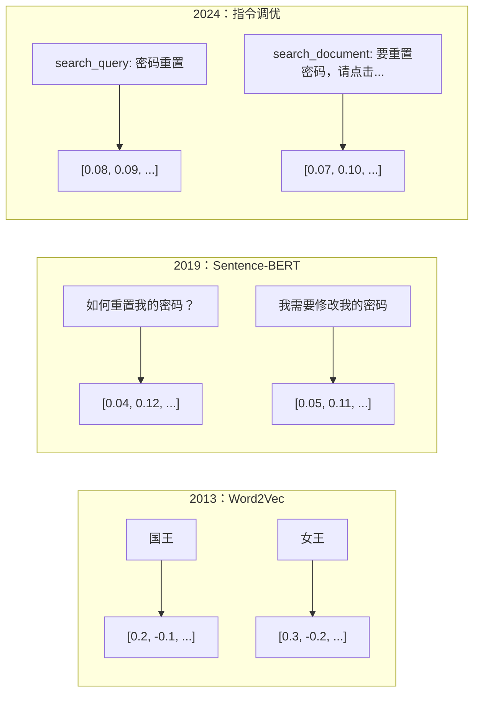
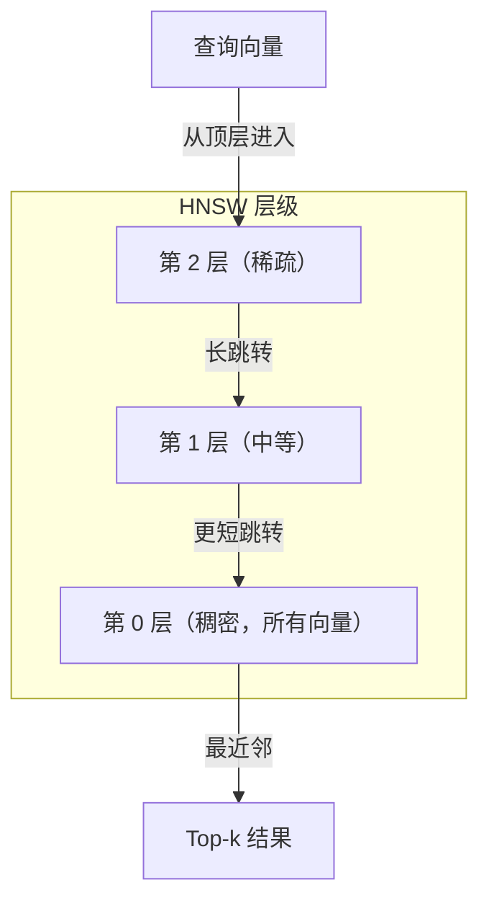

# 嵌入向量 (Embeddings) 与向量表示 (Vector Representations)

> 文本是离散的，数学是连续的。每当你让 LLM 查找“相似”文档、比较语义，或进行超越关键词的搜索时，你依赖的都是连接这两个世界的桥梁。这座桥就是嵌入向量。如果你不理解嵌入向量，你就不算真正理解现代 AI；你只是会使用它。

**类型：** 构建
**语言：** Python
**前置课程：** 第 11 阶段，第 01 课（Prompt Engineering）
**耗时：** ~75 分钟
**相关内容：** 第 5 阶段 · 22（Embedding Models 深度解析）会讲稠密、多向量和稀疏表示的差异、Matryoshka 截断，以及按维度进行模型选型。本课聚焦生产级流水线（向量数据库、HNSW、相似度数学）。在选模型之前，先读第 5 阶段 · 22。

## 学习目标

- 使用 API 提供商和开源模型生成文本嵌入，并计算它们之间的余弦相似度 (cosine similarity)
- 解释为什么嵌入向量可以解决关键词搜索无法处理的词汇错配问题 (vocabulary mismatch problem)
- 构建语义搜索索引 (semantic search index)，按语义而不是精确关键词匹配来检索文档
- 使用检索基准（precision@k、recall）评估嵌入质量，并为你的任务选择合适的嵌入模型

## 问题

你有 10,000 条客服工单。一位客户写道：“我的支付没有成功。”你需要找到过去类似的工单。关键词搜索会找到包含“支付”和“没有成功”的工单，但会漏掉“交易失败”“扣款被拒绝”“账单错误”这类描述。它们说的是同一个问题，只是措辞完全不同。

这就是词汇错配问题。人类语言可以用几十种方式表达同一件事。关键词搜索把每个词都当成彼此独立、没有语义的符号。它无法知道“被拒绝”和“没有成功”指向的是同一个概念。

你需要一种文本表示方式，让决定相似性的不是拼写，而是语义。你需要一种办法，把“我的支付没有成功”和“交易被拒绝”放到某个数学空间中彼此靠近，同时把“我的支付按时到账了”推得很远——哪怕它们都共享“支付”这个词。

这种表示方式就是嵌入向量。

## 概念

### 什么是嵌入向量？

嵌入向量是由浮点数组成的稠密向量 (dense vector)，用来表示文本的语义。“稠密”这个词很关键——每个维度都携带信息；这和稀疏表示 (sparse representations，如 bag-of-words、TF-IDF) 不同，后者的大多数维度都是 0。

“猫坐在垫子上” 会变成类似 `[0.023, -0.041, 0.087, ..., 0.012]` 这样的形式——具体是 768 到 3072 个数字，取决于模型。这些数字编码的是语义。你不会直接去看它们，而是拿它们做比较。

### Word2Vec 的突破

2013 年，Google 的 Tomas Mikolov 及其同事发表了 Word2Vec。它的核心洞见是：训练一个神经网络，用上下文词预测目标词（或反过来），隐藏层的权重就会变成有意义的向量表示。

最经典的结果是：

```
king - man + woman = queen
```

对词嵌入做向量运算，可以捕捉语义关系。从 “man” 到 “woman” 的方向，大致与从 “king” 到 “queen” 的方向一致。正是这一刻，整个领域意识到：几何结构可以编码语义。

Word2Vec 生成的是 300 维向量。每个词只有一个向量，与上下文无关。“river bank” 里的 “bank” 和 “bank account” 里的 “bank” 会得到同一个嵌入。这一局限推动了之后十年的研究。

### 从词到句子

词嵌入表示的是单个词元 (token)，而生产系统需要对整句、整段甚至整篇文档做嵌入。后来主要出现了四种方法：

**平均池化 (Averaging)**：对句子里所有词向量求平均。便宜、信息有损，但对短文本效果意外地还不错。它会彻底丢失词序——“狗咬人”和“人咬狗”会得到完全一样的嵌入。

**CLS 标记 (CLS token)**：Transformer 模型（BERT，2018）会输出一个特殊的 `[CLS]` 词元嵌入，代表整段输入。它比简单平均更好，但 `[CLS]` 的训练目标是下一句预测 (next-sentence prediction)，而不是相似度。

**对比学习 (Contrastive learning)**：显式训练模型，把相似样本拉近、不相似样本推远。Sentence-BERT（Reimers & Gurevych，2019）采用了这种方法，并成为现代嵌入模型的基础。给定“我该如何重置密码？”和“我需要修改密码”，模型会学到它们应该拥有几乎相同的向量。

**指令调优嵌入 (Instruction-tuned embeddings)**：最新的方法。像 E5 和 GTE 这样的模型接受任务前缀（`search_query:`、`search_document:`），告诉模型应该生成哪一类嵌入。这样一个模型就能服务多种任务。



### 现代嵌入模型

市场已经收敛到少数几种生产级选项（MTEB v2，截止 2026 年初的分数）：

| 模型 | 提供商 | 维度 | MTEB | 上下文 | 成本 / 100 万 tokens |
|-------|----------|-----------|------|---------|------------------|
| Gemini Embedding 2 | Google | 3072 (Matryoshka) | 67.7 (retrieval) | 8192 | $0.15 |
| embed-v4 | Cohere | 1024 (Matryoshka) | 65.2 | 128K | $0.12 |
| voyage-4 | Voyage AI | 1024/2048 (Matryoshka) | 66.8 | 32K | $0.12 |
| text-embedding-3-large | OpenAI | 3072 (Matryoshka) | 64.6 | 8192 | $0.13 |
| text-embedding-3-small | OpenAI | 1536 (Matryoshka) | 62.3 | 8192 | $0.02 |
| BGE-M3 | BAAI | 1024 (dense+sparse+ColBERT) | 63.0 multilingual | 8192 | Open-weight |
| Qwen3-Embedding | Alibaba | 4096 (Matryoshka) | 66.9 | 32K | Open-weight |
| Nomic-embed-v2 | Nomic | 768 (Matryoshka) | 63.1 | 8192 | Open-weight |

MTEB（Massive Text Embedding Benchmark）v2 覆盖了 100+ 个任务，包括检索、分类、聚类、重排和摘要。分数越高越好。到了 2026 年，开源权重模型（Qwen3-Embedding、BGE-M3）在大多数维度上已经追平甚至超过封闭式托管模型。Gemini Embedding 2 在纯检索上领先；Voyage 和 Cohere 在特定领域（金融、法律、代码）表现更强。无论如何，真正定型前都要先用你自己的查询做基准测试。

### 相似度度量

给定两个嵌入向量，常见的相似度计算方式有三种：

**余弦相似度 (Cosine similarity)**：两个向量夹角的余弦值。范围从 -1（方向相反）到 1（方向完全一致）。它忽略向量长度——一个 10 个词的句子和一篇 500 个词的文档，只要方向相同，也可能得到 1.0。这是 90% 使用场景的默认选择。

```
cosine_sim(a, b) = dot(a, b) / (||a|| * ||b||)
```

**点积 (Dot product)**：两个向量原始的内积。如果向量已经归一化（单位长度），它与余弦相似度的结果完全一致。计算更快。OpenAI 的嵌入默认就是归一化的，因此 dot product 和 cosine 会给出相同排序。

```
dot(a, b) = sum(a_i * b_i)
```

**欧几里得距离 (Euclidean distance)**：向量空间中的直线距离。值越小表示越相似。它对向量长度差异更敏感。适合你关心的是向量在空间中的绝对位置，而不仅仅是方向的场景。

```
L2(a, b) = sqrt(sum((a_i - b_i)^2))
```

什么时候该用哪一种：

| 度量 | 适用场景 | 不适用场景 |
|--------|----------|------------|
| Cosine similarity | 比较长度不同的文本；大多数检索任务 | 向量长度本身携带信息 |
| Dot product | 嵌入已经归一化；追求极致速度 | 向量长度差异较大 |
| Euclidean distance | 聚类；空间最近邻问题 | 比较长度差异极大的文档 |

### 向量数据库与 HNSW

暴力相似度搜索会把查询向量与每一个已存储向量逐一比较。假设有 100 万个 1536 维向量，那么每次查询都要做 15 亿次乘加运算，速度太慢了。

向量数据库用近似最近邻 (Approximate Nearest Neighbor, ANN) 算法来解决这个问题。当前最主流的算法是 HNSW（Hierarchical Navigable Small World）：

1. 先构建一个多层向量图
2. 顶层比较稀疏——连接远距离簇的长程边
3. 底层比较稠密——连接彼此接近向量的细粒度边
4. 搜索从顶层开始，贪心地下探并逐步细化
5. 以 O(log n) 的时间返回近似 top-k 结果，而不是 O(n)

HNSW 用少量精度损失（通常 95-99% 的召回率）换来巨大的速度提升。在 1000 万个向量规模下，暴力搜索往往需要数秒，HNSW 只需要几毫秒。



生产环境中的常见选择：

| 数据库 | 类型 | 最适合 | 最大规模 |
|----------|------|----------|-----------|
| Pinecone | Managed SaaS | 零运维生产环境 | Billions |
| Weaviate | Open source | 自托管、混合搜索 | 100M+ |
| Qdrant | Open source | 高性能、支持过滤 | 100M+ |
| ChromaDB | Embedded | 原型开发、本地开发 | 1M |
| pgvector | Postgres extension | 已经在用 Postgres | 10M |
| FAISS | Library | 进程内、研究场景 | 1B+ |

### 分块策略

文档通常太长，不能直接作为单个向量嵌入。比如一份 50 页的 PDF 会覆盖几十个主题——它的嵌入会变成“所有内容的平均值”，结果对任何具体主题都不够像。因此你需要把文档拆成多个分块 (chunk)，并分别做嵌入。

**固定大小分块 (Fixed-size chunking)**：每 N 个词元切一块，并保留 M 个词元的重叠。简单、可预测。适合没有明显结构的文档。比如 512 词元的分块，重叠 50 词元：第 1 块是词元 0-511，第 2 块是词元 462-973。

**按句分块 (Sentence-based chunking)**：按句子边界切分，把句子持续聚合到接近词元上限为止。每个分块至少包含一个完整句子。它比固定大小更好，因为你不会把一个完整意思从中间切断。

**递归分块 (Recursive chunking)**：优先尝试在最大的结构边界处分割（如章节标题）；如果还是太大，再尝试段落边界、句子边界，最后才退化到字符长度限制。这就是 LangChain 的 `RecursiveCharacterTextSplitter`，对混合格式语料效果很好。

**语义分块 (Semantic chunking)**：先为每个句子单独生成嵌入，再把相似的相邻句子归为一组。当句子间的嵌入相似度低于阈值时，就开启新的分块。它的成本最高（因为要单独嵌入每个句子），但能产生语义最连贯的分块。

| 策略 | 复杂度 | 质量 | 最适合 |
|----------|-----------|---------|----------|
| Fixed-size | 低 | 尚可 | 非结构化文本、日志 |
| Sentence-based | 低 | 好 | 文章、邮件 |
| Recursive | 中 | 好 | Markdown、HTML、混合文档 |
| Semantic | 高 | 最佳 | 对检索质量要求极高 |

对大多数系统来说，最佳平衡点是：256-512 个词元的分块，配 50 个词元的重叠。

### Bi-encoder 与 Cross-encoder

双编码器 (bi-encoder) 会分别对查询和文档做嵌入，然后比较向量。它很快——你只需要对查询嵌入一次，再去和预先计算好的文档嵌入比较。这就是检索阶段该用的东西。

交叉编码器 (cross-encoder) 会把查询和文档拼成一个输入，直接输出相关性分数。它很慢——因为每一对 query-document 都要完整跑一遍模型。但它也更准，因为模型可以同时关注查询词元和文档词元之间的关系。

生产中的常见模式是：双编码器先召回 top-100 候选，交叉编码器再把它们重排成 top-10。这就是先检索后重排 (retrieve-then-rerank) 流水线。


常见重排模型：Cohere Rerank 3.5（每 1000 次查询 $2）、BGE-reranker-v2（免费、开源）、Jina Reranker v2（免费、开源）。

### Matryoshka 嵌入

传统嵌入是“全有或全无”的。一个 1536 维向量就要存 1536 个浮点数，你不能直接把它截成 256 维还指望继续可用，除非重新训练。

Matryoshka 表征学习 (Matryoshka Representation Learning，Kusupati et al., 2022) 解决了这个问题。模型在训练时会被约束，让前 N 个维度承载最重要的信息，就像俄罗斯套娃一样。把一个 1536 维的 Matryoshka 嵌入截断到 256 维，确实会损失一些精度，但依然可用。

OpenAI 的 text-embedding-3-small 和 text-embedding-3-large 通过 `dimensions` 参数支持 Matryoshka 截断。请求 256 维而不是 1536 维，可以把存储量降到原来的 1/6，而 MTEB 基准上的精度损失大约只有 3-5%。

### 二值量化

一个 1536 维的嵌入如果按 float32 存储，需要 6,144 字节。乘上 1000 万篇文档，仅向量就要 61 GB。

二值量化 (binary quantization) 会把每个 float 压成 1 bit：正数变成 1，负数变成 0。这样存储会从 6,144 字节降到 192 字节——减少 32 倍。相似度可以通过汉明距离 (Hamming distance) 计算，也就是统计有多少 bit 不同，而 CPU 可以用一条指令完成。

它带来的准确率损失大约是 5-10% 的检索召回率。常见模式是：先对数百万向量做二值量化，用于第一阶段搜索；然后再用全精度向量对 top-1000 结果重打分。这样能用 1/32 的内存，拿到 95%+ 的全精度效果。

## 动手构建

我们要从零开始做一个语义搜索引擎。不用向量数据库，不用外部嵌入 API，只用 Python 和 numpy 完成数学部分。

### 第 1 步：文本分块

```python
def chunk_text(text, chunk_size=200, overlap=50):
    words = text.split()
    chunks = []
    start = 0
    while start < len(words):
        end = start + chunk_size
        chunk = " ".join(words[start:end])
        chunks.append(chunk)
        start += chunk_size - overlap
    return chunks


def chunk_by_sentences(text, max_chunk_tokens=200):
    sentences = text.replace("\n", " ").split(".")
    sentences = [s.strip() + "." for s in sentences if s.strip()]
    chunks = []
    current_chunk = []
    current_length = 0
    for sentence in sentences:
        sentence_length = len(sentence.split())
        if current_length + sentence_length > max_chunk_tokens and current_chunk:
            chunks.append(" ".join(current_chunk))
            current_chunk = []
            current_length = 0
        current_chunk.append(sentence)
        current_length += sentence_length
    if current_chunk:
        chunks.append(" ".join(current_chunk))
    return chunks
```

### 第 2 步：从零实现嵌入

我们用 TF-IDF 加 L2 归一化实现一个简单的稠密嵌入。这不是真正的神经网络嵌入，但它遵循相同的契约：文本输入，固定长度向量输出；相似文本产生相似向量。

```python
import math
import numpy as np
from collections import Counter

class SimpleEmbedder:
    def __init__(self):
        self.vocab = []
        self.idf = []
        self.word_to_idx = {}

    def fit(self, documents):
        vocab_set = set()
        for doc in documents:
            vocab_set.update(doc.lower().split())
        self.vocab = sorted(vocab_set)
        self.word_to_idx = {w: i for i, w in enumerate(self.vocab)}
        n = len(documents)
        self.idf = np.zeros(len(self.vocab))
        for i, word in enumerate(self.vocab):
            doc_count = sum(1 for doc in documents if word in doc.lower().split())
            self.idf[i] = math.log((n + 1) / (doc_count + 1)) + 1

    def embed(self, text):
        words = text.lower().split()
        count = Counter(words)
        total = len(words) if words else 1
        vec = np.zeros(len(self.vocab))
        for word, freq in count.items():
            if word in self.word_to_idx:
                tf = freq / total
                vec[self.word_to_idx[word]] = tf * self.idf[self.word_to_idx[word]]
        norm = np.linalg.norm(vec)
        if norm > 0:
            vec = vec / norm
        return vec
```

### 第 3 步：相似度函数

```python
def cosine_similarity(a, b):
    dot = np.dot(a, b)
    norm_a = np.linalg.norm(a)
    norm_b = np.linalg.norm(b)
    if norm_a == 0 or norm_b == 0:
        return 0.0
    return float(dot / (norm_a * norm_b))


def dot_product(a, b):
    return float(np.dot(a, b))


def euclidean_distance(a, b):
    return float(np.linalg.norm(a - b))
```

### 第 4 步：带暴力搜索的向量索引

```python
class VectorIndex:
    def __init__(self):
        self.vectors = []
        self.texts = []
        self.metadata = []

    def add(self, vector, text, meta=None):
        self.vectors.append(vector)
        self.texts.append(text)
        self.metadata.append(meta or {})

    def search(self, query_vector, top_k=5, metric="cosine"):
        scores = []
        for i, vec in enumerate(self.vectors):
            if metric == "cosine":
                score = cosine_similarity(query_vector, vec)
            elif metric == "dot":
                score = dot_product(query_vector, vec)
            elif metric == "euclidean":
                score = -euclidean_distance(query_vector, vec)
            else:
                raise ValueError(f"Unknown metric: {metric}")
            scores.append((i, score))
        scores.sort(key=lambda x: x[1], reverse=True)
        results = []
        for idx, score in scores[:top_k]:
            results.append({
                "text": self.texts[idx],
                "score": score,
                "metadata": self.metadata[idx],
                "index": idx
            })
        return results

    def size(self):
        return len(self.vectors)
```

### 第 5 步：语义搜索引擎

```python
class SemanticSearchEngine:
    def __init__(self, chunk_size=200, overlap=50):
        self.embedder = SimpleEmbedder()
        self.index = VectorIndex()
        self.chunk_size = chunk_size
        self.overlap = overlap

    def index_documents(self, documents, source_names=None):
        all_chunks = []
        all_sources = []
        for i, doc in enumerate(documents):
            chunks = chunk_text(doc, self.chunk_size, self.overlap)
            all_chunks.extend(chunks)
            name = source_names[i] if source_names else f"doc_{i}"
            all_sources.extend([name] * len(chunks))
        self.embedder.fit(all_chunks)
        for chunk, source in zip(all_chunks, all_sources):
            vec = self.embedder.embed(chunk)
            self.index.add(vec, chunk, {"source": source})
        return len(all_chunks)

    def search(self, query, top_k=5, metric="cosine"):
        query_vec = self.embedder.embed(query)
        return self.index.search(query_vec, top_k, metric)

    def search_with_scores(self, query, top_k=5):
        results = self.search(query, top_k)
        return [
            {
                "text": r["text"][:200],
                "source": r["metadata"].get("source", "unknown"),
                "score": round(r["score"], 4)
            }
            for r in results
        ]
```

### 第 6 步：比较不同相似度度量

```python
def compare_metrics(engine, query, top_k=3):
    results = {}
    for metric in ["cosine", "dot", "euclidean"]:
        hits = engine.search(query, top_k=top_k, metric=metric)
        results[metric] = [
            {"score": round(h["score"], 4), "preview": h["text"][:80]}
            for h in hits
        ]
    return results
```

## 用起来

如果换成生产环境里的嵌入 API，整体架构其实完全一样。你只需要替换嵌入器 (embedder)：

```python
from openai import OpenAI

client = OpenAI()


def openai_embed(texts, model="text-embedding-3-small", dimensions=None):
    kwargs = {"model": model, "input": texts}
    if dimensions:
        kwargs["dimensions"] = dimensions
    response = client.embeddings.create(**kwargs)
    return [item.embedding for item in response.data]
```

使用 OpenAI 的 Matryoshka 截断时：同一个模型、更少的维度、更低的存储成本：

```python
full = openai_embed(["semantic search query"], dimensions=1536)
compact = openai_embed(["semantic search query"], dimensions=256)
```

256 维向量的存储量缩小了 6 倍。对 1000 万篇文档来说，就是 10 GB 对 61 GB。精度损失在标准基准上大约是 3-5%。

如果用 Cohere 做重排：

```python
import cohere

co = cohere.ClientV2()

results = co.rerank(
    model="rerank-v3.5",
    query="What is the refund policy?",
    documents=["Full refund within 30 days...", "No refunds after 90 days..."],
    top_n=3
)
```

如果要做本地嵌入、完全不依赖 API：

```python
from sentence_transformers import SentenceTransformer

model = SentenceTransformer("BAAI/bge-small-en-v1.5")
embeddings = model.encode(["semantic search query", "another document"])
```

我们在本课里实现的 `VectorIndex` 类可以兼容这些方案中的任何一种。替换嵌入函数，搜索逻辑保持不变。

## 交付成果

本课会产出：
- `outputs/prompt-embedding-advisor.md` -- 一个用于为具体场景选择嵌入模型与策略的提示词
- `outputs/skill-embedding-patterns.md` -- 一个教会智能体 (agent) 在生产环境中高效使用嵌入的技能说明

## 练习

1. **度量对比**：对示例文档使用余弦相似度、点积和欧几里得距离分别跑同样的 5 个查询，记录每种方法的 top-3 结果。哪些查询下这些度量给出的结果不同？为什么？

2. **分块大小实验**：分别用 50、100、200、500 词的分块大小为示例文档建索引。对每种设置跑 5 个查询，记录 top-1 相似度分数。画出分块大小与检索质量之间的关系曲线，找出分块变大后开始拖累效果的拐点。

3. **Matryoshka 模拟**：构建一个能产生 500 维向量的 `SimpleEmbedder`。然后分别截断到 50、100、200、500 维，测量每种截断下检索召回率的退化情况。这样不用真正实现训练技巧，也能模拟 Matryoshka 的行为。

4. **二值量化**：拿搜索引擎生成的嵌入，把它们转成二值形式（正数记为 1，负数记为 0），并实现基于汉明距离的搜索。把 top-10 结果与全精度余弦相似度的 top-10 做比较，计算重叠百分比。

5. **按句分块**：用 `chunk_by_sentences` 替换固定大小分块，跑同样的查询并比较检索分数。尊重句子边界之后，结果有没有变好？

## 关键术语

| 术语 | 人们常说 | 实际含义 |
|------|----------------|----------------------|
| Embedding | “把文本变成数字” | 一种稠密向量，其中几何上的接近性编码了语义相似度 |
| Word2Vec | “初代嵌入” | 2013 年提出的词向量模型，通过预测上下文词学习向量；证明了向量运算可以编码语义 |
| Cosine similarity | “两个向量有多像” | 向量夹角的余弦值；1 = 方向完全一致，0 = 正交，-1 = 方向相反 |
| HNSW | “快速向量搜索” | Hierarchical Navigable Small World 图——一种多层结构，可实现 O(log n) 的近似最近邻搜索 |
| Bi-encoder | “分别嵌入，快速比较” | 将查询和文档分别编码成向量；便于预计算并实现快速检索 |
| Cross-encoder | “慢但准的重排器” | 将 query-document 对一起送入完整模型处理；准确率更高，但无法预计算 |
| Matryoshka embeddings | “可截断向量” | 训练时让前 N 个维度保留最重要的信息，从而支持可变尺寸存储的嵌入 |
| Binary quantization | “1-bit embeddings” | 将浮点向量转成二进制（只保留符号位），配合汉明距离搜索，实现 32 倍存储压缩 |
| Chunking | “为了嵌入而切分文档” | 把文档拆成 256-512 个词元的片段，使每段都能独立嵌入和检索 |
| Vector database | “嵌入的搜索引擎” | 针对向量存储和大规模近似最近邻搜索优化的数据存储系统 |
| Contrastive learning | “通过比较来训练” | 一种训练方法：把相似样本对的嵌入拉近，把不相似样本对的嵌入推远 |
| MTEB | “嵌入模型基准” | Massive Text Embedding Benchmark——覆盖 8 类任务、56 个数据集的标准嵌入评测基准 |

## 延伸阅读

- Mikolov et al., "Efficient Estimation of Word Representations in Vector Space" (2013) -- 开启嵌入革命的 Word2Vec 论文，因“国王-女王”类比而闻名
- Reimers & Gurevych, "Sentence-BERT: Sentence Embeddings using Siamese BERT-Networks" (2019) -- 介绍如何为句子级相似度训练双编码器，是现代嵌入模型的基础
- Kusupati et al., "Matryoshka Representation Learning" (2022) -- 支撑可变维度嵌入的核心技术，OpenAI 在 text-embedding-3 中采用了这一思路
- Malkov & Yashunin, "Efficient and Robust Approximate Nearest Neighbor using Hierarchical Navigable Small World Graphs" (2018) -- HNSW 论文，也是大多数生产级向量搜索背后的算法来源
- OpenAI Embeddings Guide (platform.openai.com/docs/guides/embeddings) -- text-embedding-3 模型的实用参考，包括 Matryoshka 维度缩减
- MTEB Leaderboard (huggingface.co/spaces/mteb/leaderboard) -- 实时基准榜单，对比不同嵌入模型在多种任务和语言上的表现
- [Muennighoff et al., "MTEB: Massive Text Embedding Benchmark" (EACL 2023)](https://arxiv.org/abs/2210.07316) -- 定义了排行榜所使用的 8 类任务（classification、clustering、pair classification、reranking、retrieval、STS、summarization、bitext mining）的基准论文；在相信任何单一 MTEB 分数之前，先读这篇
- [Sentence Transformers documentation](https://www.sbert.net/) -- 关于 bi-encoder 与 cross-encoder、池化 (pooling) 策略，以及本课实现的 ingest-split-embed-store RAG 流水线的权威参考
