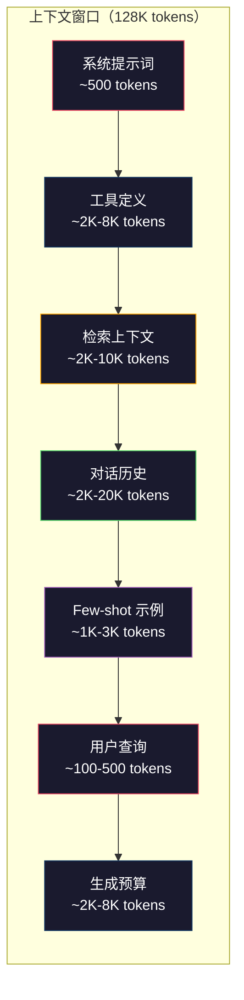
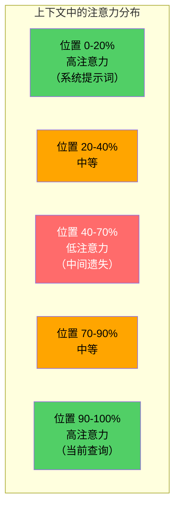
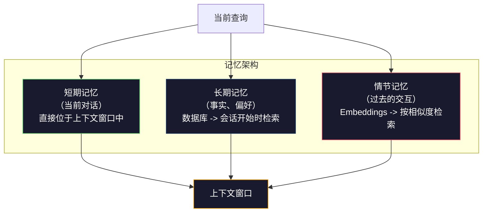

# 上下文工程：窗口、预算、记忆与检索

> 提示词工程（prompt engineering）只是其中一部分。上下文工程（context engineering）才是整个核心。提示词只是你输入的一段字符串；上下文则是进入模型窗口（context window）的全部内容：系统指令、检索到的文档、工具定义、对话历史、few-shot 示例，以及提示词本身。到 2026 年，最优秀的 AI 工程师都是上下文工程师。他们决定什么该放进去、什么该留在外面，以及这些内容以什么顺序进入。

**类型：** 构建
**语言：** Python
**前置要求：** 第 10 阶段（从零开始实现 LLM）、第 11 阶段第 01-02 课
**时长：** ~90 分钟
**相关内容：** 第 11 阶段 · 15（Prompt Caching）——缓存友好的布局是上下文工程的延伸。关于如何用 NIAH/RULER 衡量“中间遗失”（lost-in-the-middle），参见第 5 阶段 · 28（Long-Context Evaluation）。

## 学习目标

- 计算上下文窗口各组成部分的 token 预算（系统提示词、工具、历史、检索文档、生成预留空间）
- 实现上下文窗口管理策略：截断、摘要，以及用于对话历史的滑动窗口
- 对上下文组成部分进行优先级排序和摆放，以最大化模型对最相关信息的注意力
- 构建一个上下文组装器，能够根据查询类型和可用窗口空间动态分配 token

## 问题

Claude Opus 4.7 的上下文窗口是 200K token（beta 中为 1M）。GPT-5 是 400K。Gemini 3 Pro 是 2M。Llama 4 宣称达到 10M。听起来都非常大，直到你真的把它们塞满。

下面是一个代码助手的真实拆分。系统提示词：500 token。50 个工具的工具定义：8,000 token。检索到的文档：4,000 token。对话历史（10 轮）：6,000 token。当前用户查询：200 token。生成预算（最大输出）：4,000 token。总计：22,700 token。即便如此，也只占 128K 窗口的 18%。

但注意力并不会随着上下文长度线性扩展。一个拥有 128K 上下文的模型，需要承担二次方级的注意力成本（在原始 Transformer 中是 O(n^2)，尽管大多数生产模型使用了高效注意力变体）。更重要的是，检索准确率会下降。“Needle in a Haystack” 测试表明，模型很难从长上下文的中间位置找出信息。Liu 等人（2023）的研究显示，LLM 在长上下文的开头和结尾检索信息时，准确率几乎完美；但当信息位于上下文中间（约占上下文位置的 40-70%）时，准确率会下降 10-20%。这种“中间遗失”效应因模型而异，但会影响当前所有架构。

实践中的结论是：拥有 200K token 可用，并不意味着实际使用 200K token 就有效。一个精心挑选的 10K token 上下文，往往比一股脑塞进去的 100K token 上下文表现更好。上下文工程，就是在上下文窗口内最大化信噪比的学科。

你放进窗口的每一个 token，都会挤掉一个本来可以承载更相关信息的 token。每一个无关的工具定义、每一轮陈旧的对话、每一段无法回答当前问题的检索文本——都会让模型在任务上变得稍微更差一些。

## 核心概念

### 上下文窗口是一种稀缺资源

把上下文窗口想成 RAM，而不是磁盘。它访问快、可被直接利用，但容量有限。你不可能把所有东西都塞进去，必须做选择。



每个组成部分都在争抢空间。增加更多工具定义，就意味着对话历史的空间更少；增加更多检索上下文，就意味着 few-shot 示例的空间更少。上下文工程，就是把这份预算分配得尽可能有利于任务表现的艺术。

### 中间遗失（Lost-in-the-Middle）

这是上下文工程里最重要的经验发现。模型对上下文开头和结尾的信息注意力更强，而中间位置的信息注意力分数更低，更容易被忽略。

Liu 等人（2023）系统地测试了这一点。他们把一份相关文档放在 20 份无关文档中的不同位置，并测量回答准确率。当相关文档位于第一个或最后一个位置时，准确率为 85-90%；当它处于中间（20 份中的第 10 个位置）时，准确率下降到 60-70%。

这会直接影响工程设计：

- 把最重要的信息放在最前面（系统提示词、关键指令）
- 把当前查询和最相关的上下文放在最后（新近性偏置会起作用）
- 把上下文的中间区域视为最低优先级区域
- 如果你必须把信息放在中间，就把关键点再复制一份放到结尾



### 上下文组成部分

**系统提示词（system prompt）**：设定角色、约束和行为规则。它总是放在最前面，并在多轮对话中保持恒定。Claude Code 的系统提示词（含工具定义和行为指令）大约使用 6,000 token。尽量保持精简，因为系统提示词里的每一个词，都会在每次 API 调用中重复出现。

**工具定义（tool definitions）**：每个工具会增加 50-200 个 token（名称、描述、参数 schema）。50 个工具按每个 150 token 计算，在任何对话开始前就已经是 7,500 token。动态工具选择——只包含与当前查询相关的工具——通常能把这部分减少 60-80%。

**检索上下文（retrieved context）**：来自向量数据库的文档、搜索结果、文件内容。检索质量会直接决定回答质量。糟糕的检索比不检索更糟——它会用噪声塞满窗口，甚至主动把模型带偏。

**对话历史（conversation history）**：此前所有用户消息与助手回复。它会随着对话轮数线性增长。若一段 50 轮对话中每轮平均 200 token，那历史就是 10,000 token。而其中大多数内容与当前查询无关。

**Few-shot 示例（few-shot examples）**：展示期望行为的输入/输出样例。两到三个选得好的示例，常常比几千 token 的指令更能提升输出质量。但它们同样要占空间。

**生成预算（generation budget）**：为模型回答预留的 token。如果你把窗口塞到极限，模型就没有空间作答。至少要预留 2,000-4,000 token 用于生成。

### 上下文压缩策略

**历史摘要（history summarization）**：不要把所有旧对话逐字保留，而是定期对它们做摘要。比如用 100 token 的“我们讨论了 X，决定了 Y，用户想要 Z”去替代原本占 2,000 token 的 10 轮对话。当历史超过某个阈值（如 5,000 token）时，就运行摘要。

**相关性过滤（relevance filtering）**：根据当前查询为每个检索到的文档打分，低于阈值的直接丢弃。如果你检索到 10 个 chunk，但只有 3 个相关，就丢掉其余 7 个。3 个高度相关的 chunk，比 10 个质量一般的 chunk 更有价值。

**工具裁剪（tool pruning）**：先判断用户查询意图，再只包含与该意图相关的工具。代码问题不需要日历工具；排程问题不需要文件系统工具。这可以把工具定义从 8,000 token 压到 1,000 token。

**递归摘要（recursive summarization）**：面对超长文档时，分阶段摘要。先概括各个部分，再概括这些摘要。这样一份 50 页文档就能被压缩成一份 500 token 的精华版，同时保留关键点。

### 记忆系统

上下文工程横跨三个时间尺度。

**短期记忆（short-term memory）**：当前对话。直接存放在上下文窗口里。每轮对话都会增长，需要靠摘要和截断来管理。

**长期记忆（long-term memory）**：跨对话持久存在的事实和偏好。例如“用户偏好 TypeScript”“项目使用 PostgreSQL”。这些信息存放在数据库里，在会话开始时检索。Claude Code 把这类内容放在 CLAUDE.md 文件中；ChatGPT 则使用它的 memory 功能。

**情节记忆（episodic memory）**：可能与当前问题相关的具体过往交互。例如“上周二我们在 auth 模块里调试过一个类似问题”。这类内容通常以 embedding 形式存储，并在当前对话与过去事件相似时被检索出来。



### 动态上下文组装

关键洞见是：不同的查询需要不同的上下文。固定的系统提示词 + 固定工具 + 固定历史，是一种浪费。最优秀的系统会针对每次查询动态组装上下文。

1. 判断查询意图
2. 选择相关工具（而不是所有工具）
3. 检索相关文档（而不是固定的一组）
4. 只包含相关历史轮次（而不是全部历史）
5. 加入与任务类型匹配的 few-shot 示例
6. 按重要性排序：关键内容放前面，重要内容放最后，可选内容放中间

这正是一个优秀 AI 应用与一个卓越 AI 应用之间的区别。模型本身是一样的，差异化来自上下文。

## 动手构建

### 第 1 步：Token 计数器

无法测量，就无法做预算。先构建一个简单的 token 计数器（这里用按空白分词来近似，因为精确计数取决于具体 tokenizer）。

```python
import json
import numpy as np
from collections import OrderedDict

def count_tokens(text):
    if not text:
        return 0
    return int(len(text.split()) * 1.3)

def count_tokens_json(obj):
    return count_tokens(json.dumps(obj))
```

### 第 2 步：上下文预算管理器

这是核心抽象。预算管理器会跟踪每个组成部分消耗了多少 token，并执行限制。

```python
class ContextBudget:
    def __init__(self, max_tokens=128000, generation_reserve=4000):
        self.max_tokens = max_tokens
        self.generation_reserve = generation_reserve
        self.available = max_tokens - generation_reserve
        self.allocations = OrderedDict()

    def allocate(self, component, content, max_tokens=None):
        tokens = count_tokens(content)
        if max_tokens and tokens > max_tokens:
            words = content.split()
            target_words = int(max_tokens / 1.3)
            content = " ".join(words[:target_words])
            tokens = count_tokens(content)

        used = sum(self.allocations.values())
        if used + tokens > self.available:
            allowed = self.available - used
            if allowed <= 0:
                return None, 0
            words = content.split()
            target_words = int(allowed / 1.3)
            content = " ".join(words[:target_words])
            tokens = count_tokens(content)

        self.allocations[component] = tokens
        return content, tokens

    def remaining(self):
        used = sum(self.allocations.values())
        return self.available - used

    def utilization(self):
        used = sum(self.allocations.values())
        return used / self.max_tokens

    def report(self):
        total_used = sum(self.allocations.values())
        lines = []
        lines.append(f"Context Budget Report ({self.max_tokens:,} token window)")
        lines.append("-" * 50)
        for component, tokens in self.allocations.items():
            pct = tokens / self.max_tokens * 100
            bar = "#" * int(pct / 2)
            lines.append(f"  {component:<25} {tokens:>6} tokens ({pct:>5.1f}%) {bar}")
        lines.append("-" * 50)
        lines.append(f"  {'Used':<25} {total_used:>6} tokens ({total_used/self.max_tokens*100:.1f}%)")
        lines.append(f"  {'Generation reserve':<25} {self.generation_reserve:>6} tokens")
        lines.append(f"  {'Remaining':<25} {self.remaining():>6} tokens")
        return "\n".join(lines)
```

### 第 3 步：中间遗失重排序

实现这种重排策略：最重要的内容放在最前和最后，最不重要的放在中间。

```python
def reorder_lost_in_middle(items, scores):
    paired = sorted(zip(scores, items), reverse=True)
    sorted_items = [item for _, item in paired]

    if len(sorted_items) <= 2:
        return sorted_items

    first_half = sorted_items[::2]
    second_half = sorted_items[1::2]
    second_half.reverse()

    return first_half + second_half

def score_relevance(query, documents):
    query_words = set(query.lower().split())
    scores = []
    for doc in documents:
        doc_words = set(doc.lower().split())
        if not query_words:
            scores.append(0.0)
            continue
        overlap = len(query_words & doc_words) / len(query_words)
        scores.append(round(overlap, 3))
    return scores
```

### 第 4 步：对话历史压缩器

对旧对话轮次做摘要，以回收 token 预算。

```python
class ConversationManager:
    def __init__(self, max_history_tokens=5000):
        self.turns = []
        self.summaries = []
        self.max_history_tokens = max_history_tokens

    def add_turn(self, role, content):
        self.turns.append({"role": role, "content": content})
        self._compress_if_needed()

    def _compress_if_needed(self):
        total = sum(count_tokens(t["content"]) for t in self.turns)
        if total <= self.max_history_tokens:
            return

        while total > self.max_history_tokens and len(self.turns) > 4:
            old_turns = self.turns[:2]
            summary = self._summarize_turns(old_turns)
            self.summaries.append(summary)
            self.turns = self.turns[2:]
            total = sum(count_tokens(t["content"]) for t in self.turns)

    def _summarize_turns(self, turns):
        parts = []
        for t in turns:
            content = t["content"]
            if len(content) > 100:
                content = content[:100] + "..."
            parts.append(f"{t['role']}: {content}")
        return "Previous: " + " | ".join(parts)

    def get_context(self):
        parts = []
        if self.summaries:
            parts.append("[Conversation Summary]")
            for s in self.summaries:
                parts.append(s)
        parts.append("[Recent Conversation]")
        for t in self.turns:
            parts.append(f"{t['role']}: {t['content']}")
        return "\n".join(parts)

    def token_count(self):
        return count_tokens(self.get_context())
```

### 第 5 步：动态工具选择器

只包含与当前查询相关的工具。先分类意图，再过滤。

```python
TOOL_REGISTRY = {
    "read_file": {
        "description": "Read contents of a file",
        "tokens": 120,
        "categories": ["code", "files"],
    },
    "write_file": {
        "description": "Write content to a file",
        "tokens": 150,
        "categories": ["code", "files"],
    },
    "search_code": {
        "description": "Search for patterns in codebase",
        "tokens": 130,
        "categories": ["code"],
    },
    "run_command": {
        "description": "Execute a shell command",
        "tokens": 140,
        "categories": ["code", "system"],
    },
    "create_calendar_event": {
        "description": "Create a new calendar event",
        "tokens": 180,
        "categories": ["calendar"],
    },
    "list_emails": {
        "description": "List recent emails",
        "tokens": 160,
        "categories": ["email"],
    },
    "send_email": {
        "description": "Send an email message",
        "tokens": 200,
        "categories": ["email"],
    },
    "web_search": {
        "description": "Search the web for information",
        "tokens": 140,
        "categories": ["research"],
    },
    "query_database": {
        "description": "Run a SQL query on the database",
        "tokens": 170,
        "categories": ["code", "data"],
    },
    "generate_chart": {
        "description": "Generate a chart from data",
        "tokens": 190,
        "categories": ["data", "visualization"],
    },
}

def classify_intent(query):
    query_lower = query.lower()

    intent_keywords = {
        "code": ["code", "function", "bug", "error", "file", "implement", "refactor", "debug", "test"],
        "calendar": ["meeting", "schedule", "calendar", "appointment", "event"],
        "email": ["email", "mail", "send", "inbox", "message"],
        "research": ["search", "find", "what is", "how does", "explain", "look up"],
        "data": ["data", "query", "database", "chart", "graph", "analytics", "sql"],
    }

    scores = {}
    for intent, keywords in intent_keywords.items():
        score = sum(1 for kw in keywords if kw in query_lower)
        if score > 0:
            scores[intent] = score

    if not scores:
        return ["code"]

    max_score = max(scores.values())
    return [intent for intent, score in scores.items() if score >= max_score * 0.5]

def select_tools(query, token_budget=2000):
    intents = classify_intent(query)
    relevant = {}
    total_tokens = 0

    for name, tool in TOOL_REGISTRY.items():
        if any(cat in intents for cat in tool["categories"]):
            if total_tokens + tool["tokens"] <= token_budget:
                relevant[name] = tool
                total_tokens += tool["tokens"]

    return relevant, total_tokens
```

### 第 6 步：完整的上下文组装流水线

把所有部分串起来。给定一个查询，动态组装出最优上下文。

```python
class ContextEngine:
    def __init__(self, max_tokens=128000, generation_reserve=4000):
        self.budget = ContextBudget(max_tokens, generation_reserve)
        self.conversation = ConversationManager(max_history_tokens=5000)
        self.system_prompt = (
            "You are a helpful AI assistant. You have access to tools for "
            "code editing, file management, web search, and data analysis. "
            "Use the appropriate tools for each task. Be concise and accurate."
        )
        self.knowledge_base = [
            "Python 3.12 introduced type parameter syntax for generic classes using bracket notation.",
            "The project uses PostgreSQL 16 with pgvector for embedding storage.",
            "Authentication is handled by Supabase Auth with JWT tokens.",
            "The frontend is built with Next.js 15 using the App Router.",
            "API rate limits are set to 100 requests per minute per user.",
            "The deployment pipeline uses GitHub Actions with Docker multi-stage builds.",
            "Test coverage must be above 80% for all new modules.",
            "The codebase follows the repository pattern for data access.",
        ]

    def assemble(self, query):
        self.budget = ContextBudget(self.budget.max_tokens, self.budget.generation_reserve)

        system_content, _ = self.budget.allocate("system_prompt", self.system_prompt, max_tokens=1000)

        tools, tool_tokens = select_tools(query, token_budget=2000)
        tool_text = json.dumps(list(tools.keys()))
        tool_content, _ = self.budget.allocate("tools", tool_text, max_tokens=2000)

        relevance = score_relevance(query, self.knowledge_base)
        threshold = 0.1
        relevant_docs = [
            doc for doc, score in zip(self.knowledge_base, relevance)
            if score >= threshold
        ]

        if relevant_docs:
            doc_scores = [s for s in relevance if s >= threshold]
            reordered = reorder_lost_in_middle(relevant_docs, doc_scores)
            doc_text = "\n".join(reordered)
            doc_content, _ = self.budget.allocate("retrieved_context", doc_text, max_tokens=3000)

        history_text = self.conversation.get_context()
        if history_text.strip():
            history_content, _ = self.budget.allocate("conversation_history", history_text, max_tokens=5000)

        query_content, _ = self.budget.allocate("user_query", query, max_tokens=500)

        return self.budget

    def chat(self, query):
        self.conversation.add_turn("user", query)
        budget = self.assemble(query)
        response = f"[Response to: {query[:50]}...]"
        self.conversation.add_turn("assistant", response)
        return budget


def run_demo():
    print("=" * 60)
    print("  Context Engineering Pipeline Demo")
    print("=" * 60)

    engine = ContextEngine(max_tokens=128000, generation_reserve=4000)

    print("\n--- Query 1: Code task ---")
    budget = engine.chat("Fix the bug in the authentication module where JWT tokens expire too early")
    print(budget.report())

    print("\n--- Query 2: Research task ---")
    budget = engine.chat("What is the best approach for implementing vector search in PostgreSQL?")
    print(budget.report())

    print("\n--- Query 3: After conversation history builds up ---")
    for i in range(8):
        engine.conversation.add_turn("user", f"Follow-up question number {i+1} about the implementation details of the system")
        engine.conversation.add_turn("assistant", f"Here is the response to follow-up {i+1} with technical details about the architecture")

    budget = engine.chat("Now implement the changes we discussed")
    print(budget.report())

    print("\n--- Tool Selection Examples ---")
    test_queries = [
        "Fix the bug in auth.py",
        "Schedule a meeting with the team for Tuesday",
        "Show me the database query performance stats",
        "Search for best practices on error handling",
    ]

    for q in test_queries:
        tools, tokens = select_tools(q)
        intents = classify_intent(q)
        print(f"\n  Query: {q}")
        print(f"  Intents: {intents}")
        print(f"  Tools: {list(tools.keys())} ({tokens} tokens)")

    print("\n--- Lost-in-the-Middle Reordering ---")
    docs = ["Doc A (most relevant)", "Doc B (somewhat relevant)", "Doc C (least relevant)",
            "Doc D (relevant)", "Doc E (moderately relevant)"]
    scores = [0.95, 0.60, 0.20, 0.80, 0.50]
    reordered = reorder_lost_in_middle(docs, scores)
    print(f"  Original order: {docs}")
    print(f"  Scores:         {scores}")
    print(f"  Reordered:      {reordered}")
    print(f"  (Most relevant at start and end, least relevant in middle)")
```

## 实际使用

### Claude Code 的上下文策略

Claude Code 用分层方式管理上下文。系统提示词中包含行为规则和工具定义（约 6K token）。当你打开一个文件时，文件内容会被注入为上下文；当你搜索时，搜索结果也会被加入。较旧的对话轮次会被摘要。CLAUDE.md 则提供了跨会话持久存在的长期记忆。

其中最关键的工程决策是：Claude Code 不会把整个代码库一次性塞进上下文，而是在需要时检索相关文件。这就是上下文工程在实践中的样子。

### Cursor 的动态上下文加载

Cursor 会把整个代码库索引为 embeddings。当你输入查询时，它会利用向量相似度检索最相关的文件和代码块。只有这些内容会进入上下文窗口。一个有 50 万行代码的代码库，会被压缩成 5-10 个最相关的代码块。

这就是典型模式：把所有东西都 embedding，按需检索，只放进真正重要的部分。

### ChatGPT 的记忆

ChatGPT 会把用户偏好和事实存为长期记忆。每次对话开始时，相关记忆会被检索出来并加入系统提示词。像“用户偏好 Python”这样的信息只占 5 个 token，却能在多轮对话中省下数百个重复指令的 token。

### 作为上下文工程的 RAG

检索增强生成（Retrieval-Augmented Generation, RAG）可以看作是上下文工程的形式化版本。你不再把知识塞进模型权重（训练）或系统提示词（静态上下文）里，而是在查询时检索相关文档，再把它们注入上下文窗口。整个 RAG 流程——chunking、embedding、retrieval、reranking——本质上都在解决同一个问题：把正确的信息放进上下文窗口。

## 交付

本课会产出 `outputs/prompt-context-optimizer.md`——一个可复用的提示词，用来审计上下文组装策略并给出优化建议。把你的系统提示词、工具数量、平均历史长度以及检索策略喂给它，它会识别 token 浪费并提出改进建议。

它还会产出 `outputs/skill-context-engineering.md`——一个决策框架，用于根据任务类型、上下文窗口大小和延迟预算，设计上下文组装流水线。

## 练习

1. 给 `ContextBudget` 类增加一个“token 浪费检测器”。它应当标记出占用预算超过 30% 的组件，并针对不同组件类型提出压缩策略（摘要历史、裁剪工具、重排文档）。

2. 为检索上下文实现语义去重。如果两份检索到的文档相似度超过 80%（可按词重叠率或 embedding 的余弦相似度来算），只保留分数更高的那一份。衡量这样能回收多少 token 预算。

3. 构建一个“上下文回放（context replay）”工具。给定一份对话转录，将其送入 `ContextEngine` 重放，并可视化预算分配如何逐轮变化。绘制各组件随时间变化的 token 使用量，并找出上下文开始被压缩的那一轮。

4. 实现一个基于优先级的工具选择器。不要只做二元的包含/排除，而是为每个工具分配一个与当前查询相关的分数。按照相关性从高到低加入工具，直到工具预算耗尽。比较分别包含 5、10、20、50 个工具时的任务表现。

5. 构建一个多策略上下文压缩器。实现三种压缩策略（截断、摘要、提取关键句），并在 20 份文档上做基准测试。衡量压缩率和信息保留之间的权衡（压缩后的版本是否仍然包含查询所需答案？）。

## 关键术语

| 术语 | 人们常说什么 | 实际含义 |
|------|-------------|----------|
| 上下文窗口 | “模型能读多少内容” | 模型在一次前向传播中处理的最大 token 数（输入 + 输出）——GPT-5 为 400K，Claude Opus 4.7 为 200K（beta 为 1M），Gemini 3 Pro 为 2M |
| 上下文工程 | “高级提示词工程” | 决定什么进入上下文窗口、以什么顺序进入、优先级如何安排的工程学科——涵盖检索、压缩、工具选择和记忆管理 |
| 中间遗失 | “模型会忘掉中间的内容” | 一项经验发现：LLM 对上下文开头和结尾的注意力更强，而放在中间的信息准确率会下降 10-20% |
| Token 预算 | “你还剩多少 token” | 对上下文窗口容量在各组件间进行显式分配（系统提示词、工具、历史、检索、生成），并对每个组件设定上限 |
| 动态上下文 | “按需加载内容” | 根据意图分类、相关工具选择和检索结果，为每个查询动态组装不同的上下文窗口 |
| 历史摘要 | “压缩对话” | 用简洁摘要替代逐字保留的旧对话轮次，在保留关键信息的同时降低 token 成本 |
| 工具裁剪 | “只包含相关工具” | 先分类查询意图，再只包含匹配的工具定义，从而把工具 token 成本降低 60-80% |
| 长期记忆 | “跨会话记住内容” | 存在数据库中的事实和偏好，并在会话开始时被检索出来——例如 CLAUDE.md、ChatGPT Memory 及类似系统 |
| 情节记忆 | “记住特定过去事件” | 把过往交互存成 embeddings，并在当前查询与过去对话相似时检索出来 |
| 生成预算 | “给答案留空间” | 为模型输出预留的 token——如果上下文把窗口完全占满，模型就没有空间响应 |

## 延伸阅读

- [Liu et al., 2023 -- "Lost in the Middle: How Language Models Use Long Contexts"](https://arxiv.org/abs/2307.03172) —— 关于位置相关注意力的权威研究，展示了模型为何难以利用长上下文中间的信息
- [Anthropic's Contextual Retrieval blog post](https://www.anthropic.com/news/contextual-retrieval) —— Anthropic 如何做上下文感知的 chunk 检索，将检索失败率降低 49%
- [Simon Willison's "Context Engineering"](https://simonwillison.net/2025/Jun/27/context-engineering/) —— 为这一学科命名，并将其与 prompt engineering 区分开的博客文章
- [LangChain documentation on RAG](https://python.langchain.com/docs/tutorials/rag/) —— 将检索增强生成作为上下文工程模式进行实践实现
- [Greg Kamradt's Needle in a Haystack test](https://github.com/gkamradt/LLMTest_NeedleInAHaystack) —— 揭示所有主流模型都存在位置相关检索失效问题的基准测试
- [Pope et al., "Efficiently Scaling Transformer Inference" (2022)](https://arxiv.org/abs/2211.05102) —— 解释上下文长度为何会推动内存与延迟成本，以及 KV cache、MQA、GQA 如何改变预算计算
- [Agrawal et al., "SARATHI: Efficient LLM Inference by Piggybacking Decodes with Chunked Prefills" (2023)](https://arxiv.org/abs/2308.16369) —— 解析推理的两个阶段，说明为何长提示词会提高 TTFT 却对 TPOT 影响较小，这是上下文打包权衡的真实依据
- [Ainslie et al., "GQA: Training Generalized Multi-Query Transformer Models from Multi-Head Checkpoints" (EMNLP 2023)](https://arxiv.org/abs/2305.13245) —— 介绍 grouped-query attention 的论文，在不损失质量的前提下，把生产解码器中的 KV 内存占用降低了 8 倍
