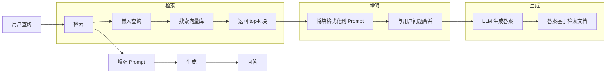
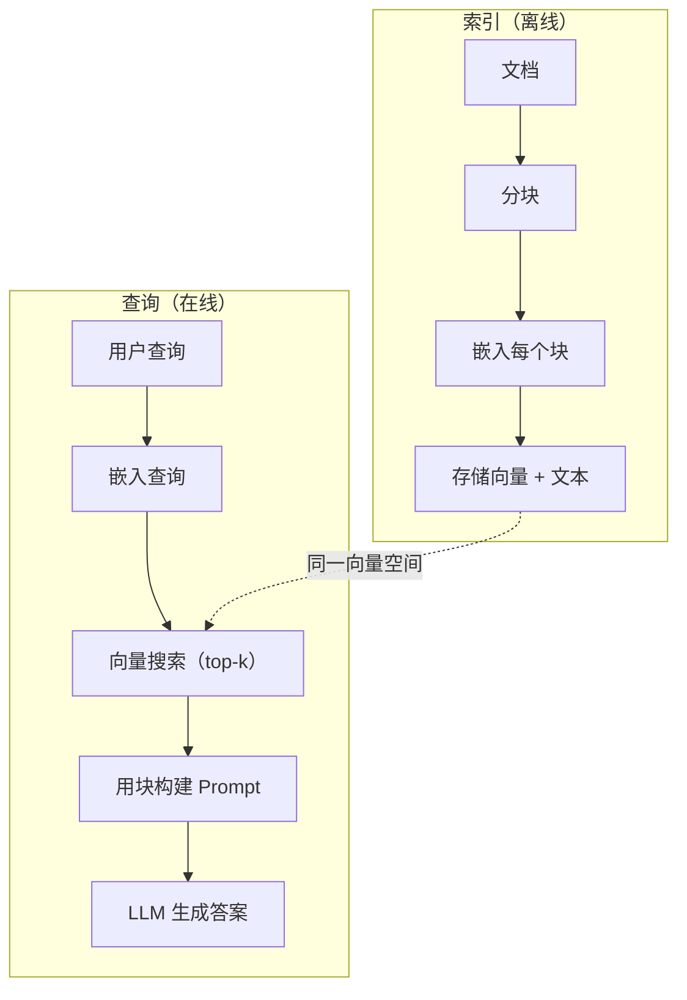

# RAG（检索增强生成）

> 你的 LLM 知道训练截止日期之前的一切。它对你公司的文档、你的代码库或上周的会议纪要一无所知。RAG 通过检索相关文档并将其塞入 Prompt 来解决这个问题。这是生产 AI 中部署最多的模式。如果你只从这门课学一样东西，就学构建 RAG 管线。

**类型：** 构建实战
**语言：** Python
**前置要求：** 第 10 阶段（从零构建 LLM）、第 11 阶段第 01-05 课
**时间：** 约 90 分钟
**相关课程：** 第 5 阶段 · 23（RAG 分块策略）涵盖六种分块算法及各自的优势场景。第 5 阶段 · 22（Embedding 模型深入）讲解如何选择嵌入器。第 11 阶段 · 07（高级 RAG）讲解混合搜索、重排序和查询转换。

## 学习目标

- 构建完整的 RAG 管线：文档加载、分块、嵌入、向量存储、检索和生成
- 使用向量数据库（ChromaDB、FAISS 或 Pinecone）实现带有适当索引的语义搜索
- 解释为什么 RAG 优于微调用于知识驱动的应用（成本、新鲜度、可溯源性）
- 使用检索指标（精确率、召回率）和生成指标（忠实度、相关性）评估 RAG 质量

## 问题背景

你为公司构建了一个聊天机器人。客户问"企业计划的退款政策是什么？"LLM 用一个关于典型 SaaS 退款政策的通用回答作答。而实际政策，埋在 200 页的内部 Wiki 中，说企业客户有 60 天的窗口期，按比例退款。LLM 从未见过这份文档。它不可能知道自己没有训练过的内容。

微调 (Fine-tuning) 是一种解决方案。拿到 LLM，在你的内部文档上训练，然后部署更新后的模型。这可以工作，但有严重的问题。微调花费数千美元的计算费用。文档一有变化，模型就过时了。你无法知道模型引用了哪个来源。而且如果公司下个月收购了另一条产品线，你得再次微调。

RAG 是另一种解决方案。保持模型不变。当问题到来时，在文档库中搜索相关段落，将它们粘贴到问题前的 Prompt 中，让模型使用这些段落作为上下文来回答。文档库可以在几分钟内更新。你可以准确看到检索了哪些文档。模型本身永远不变。这就是为什么 RAG 是生产中的主流模式：更便宜、更新鲜、更可审计，且适用于任何 LLM。

## 核心概念

### RAG 模式

整个模式用四步就能概括：



查询 → 检索 → 增强 Prompt → 生成。每个 RAG 系统都遵循这个模式。生产 RAG 系统之间的差异在于每个步骤的细节：如何分块、如何嵌入、如何搜索、如何构造 Prompt。

### 为什么 RAG 优于微调

| 关注点 | 微调 | RAG |
|--------|------|-----|
| 成本 | 每次训练 $1,000-$100,000+ | 每次查询 $0.01-$0.10（嵌入 + LLM） |
| 新鲜度 | 重新训练前一直过时 | 重新索引文档几分钟内更新 |
| 可审计性 | 无法追溯答案来源 | 可以展示确切的检索段落 |
| 幻觉 | 仍然自由幻觉 | 基于检索文档 |
| 数据隐私 | 训练数据烤入权重 | 文档留在你的向量库中 |

微调永久改变模型的权重。RAG 临时改变模型的上下文。对于大多数应用，临时上下文就是你想要的。

微调胜出的一种场景：当你需要模型采用特定的风格、语气或推理模式，且仅通过 Prompt 无法实现时。对于事实性知识检索，RAG 每次都赢。

### Embedding 模型

Embedding 模型将文本转换为稠密向量。相似的文本产生在高维空间中彼此接近的向量。"如何重置密码？"和"我需要更改密码"尽管共享的词汇很少，却产生几乎相同的向量。"猫坐在垫子上"则产生非常不同的向量。

常用 Embedding 模型（2026 年阵容 — 完整分析见第 5 阶段 · 22）：

| 模型 | 维度 | 提供商 | 备注 |
|------|------|--------|------|
| text-embedding-3-small | 1536（Matryoshka） | OpenAI | 大多数用例的最佳性价比 |
| text-embedding-3-large | 3072（Matryoshka） | OpenAI | 更高精度，可截断至 256/512/1024 |
| Gemini Embedding 2 | 3072（Matryoshka） | Google | MTEB 检索榜首；8K 上下文 |
| voyage-4 | 1024/2048（Matryoshka） | Voyage AI | 领域变体（代码、金融、法律） |
| Cohere embed-v4 | 1024（Matryoshka） | Cohere | 强多语言，128K 上下文 |
| BGE-M3 | 1024（稠密 + 稀疏 + ColBERT） | BAAI（开源） | 一个模型三种视图 |
| Qwen3-Embedding | 4096（Matryoshka） | 阿里巴巴（开源） | 开源检索评分最高 |
| all-MiniLM-L6-v2 | 384 | 开源（Sentence Transformers） | 原型基线 |

在本课中，我们使用 TF-IDF 构建自己的简单嵌入。不是因为 TF-IDF 是生产系统使用的方法，而是因为它让概念变得具体：文本输入，向量输出，相似文本产生相似向量。

### 向量相似度

给定两个向量，如何衡量相似度？三种选择：

**余弦相似度 (Cosine similarity)**：两个向量之间角度的余弦值。范围从 -1（相反）到 1（相同）。忽略大小，只关注方向。这是 RAG 的默认选择。

```
cosine_sim(a, b) = dot(a, b) / (||a|| * ||b||)
```

**点积 (Dot product)**：原始内积。较大的向量得到更高的分数。当大小携带信息时有用（较长的文档可能更相关）。

```
dot(a, b) = sum(a_i * b_i)
```

**L2（欧氏）距离**：向量空间中的直线距离。距离越小 = 越相似。对大小差异敏感。

```
L2(a, b) = sqrt(sum((a_i - b_i)^2))
```

余弦相似度是标准选择。它优雅地处理不同长度的文档，因为它按大小归一化。当有人说"向量搜索"时，他们几乎总是指余弦相似度。

### 分块策略

文档太长，无法作为单个向量嵌入。一个 50 页的 PDF 可能产生糟糕的嵌入，因为它包含几十个主题。相反，你将文档切分成块，分别嵌入每个块。

**固定大小分块**：每 N 个 token 切分一次。简单且可预测。512 token 的块加上 50 token 的重叠意味着块 1 是 token 0-511，块 2 是 token 462-973，以此类推。重叠确保你不会在不幸的位置切断句子。

**语义分块**：在自然边界处切分。段落、章节或 Markdown 标题。每个块是一个连贯的意义单元。实现更复杂但产生更好的检索效果。

**递归分块**：先尝试在最大边界处切分（章节标题）。如果一个章节仍然太大，在段落边界处切分。如果一个段落仍然太大，在句子边界处切分。这就是 LangChain RecursiveCharacterTextSplitter 的方法，在实践中效果很好。

块大小比人们想象的更重要：

- 太小（64-128 token）：每个块缺乏上下文。"上季度增长了 15%"如果不知道"它"指什么就毫无意义。
- 太大（2048+ token）：每个块覆盖多个主题，稀释了相关性。当你搜索收入数据时，你得到一个 10% 关于收入、90% 关于人员编制的块。
- 最佳范围（256-512 token）：足够的上下文使其自包含，足够聚焦使其相关。

大多数生产 RAG 系统使用 256-512 token 的块加上 50 token 的重叠。Anthropic 的 RAG 指南推荐这个范围。

### 向量数据库

有了嵌入之后，你需要一个地方来存储和搜索它们。选项：

| 数据库 | 类型 | 最适合 |
|--------|------|--------|
| FAISS | 库（进程内） | 原型开发、中小型数据集 |
| Chroma | 轻量级数据库 | 本地开发、小型部署 |
| Pinecone | 托管服务 | 无运维开销的生产环境 |
| Weaviate | 开源数据库 | 自托管生产环境 |
| pgvector | Postgres 扩展 | 已在使用 Postgres |
| Qdrant | 开源数据库 | 高性能自托管 |

在本课中，我们构建一个简单的内存向量存储。它将向量存储在列表中，执行暴力余弦相似度搜索。这等同于使用 flat 索引的 FAISS。它最多能扩展到约 100,000 个向量才会变慢。生产系统使用近似最近邻 (ANN) 算法如 HNSW 来在毫秒内搜索数百万个向量。

### 完整管线



索引阶段每个文档运行一次（或在文档更新时运行）。查询阶段在每个用户请求时运行。在生产中，索引可能需要数小时处理数百万文档。查询必须在一秒内响应。

### 实际数据

大多数生产 RAG 系统使用这些参数：

- **k = 5 到 10** 每次查询检索的块数
- **块大小 = 256 到 512 token** 加上 50 token 重叠
- **上下文预算**：每次查询 2,500-5,000 token 的检索内容
- **总 Prompt**：约 8,000-16,000 token（系统 Prompt + 检索块 + 对话历史 + 用户查询）
- **嵌入维度**：384-3072，取决于模型
- **索引吞吐量**：使用 API 嵌入时每秒 100-1,000 个文档
- **查询延迟**：检索 50-200ms，生成 500-3000ms

## 动手构建

### 步骤 1：文档分块

```python
def chunk_text(text, chunk_size=200, overlap=50):
    words = text.split()
    chunks = []
    start = 0
    while start < len(words):
        end = start + chunk_size
        chunk = " ".join(words[start:end])
        chunks.append(chunk)
        start += chunk_size - overlap
    return chunks
```

### 步骤 2：TF-IDF 嵌入

我们构建一个简单的嵌入函数。TF-IDF（词频-逆文档频率）不是神经嵌入，但它以捕获词汇重要性的方式将文本转换为向量。文档中的高频词获得更高的 TF。语料库中的稀有词获得更高的 IDF。两者的乘积给出一个向量，其中重要的、有区分度的词具有高值。

```python
import math
from collections import Counter

def build_vocabulary(documents):
    vocab = set()
    for doc in documents:
        vocab.update(doc.lower().split())
    return sorted(vocab)

def compute_tf(text, vocab):
    words = text.lower().split()
    count = Counter(words)
    total = len(words)
    return [count.get(word, 0) / total for word in vocab]

def compute_idf(documents, vocab):
    n = len(documents)
    idf = []
    for word in vocab:
        doc_count = sum(1 for doc in documents if word in doc.lower().split())
        idf.append(math.log((n + 1) / (doc_count + 1)) + 1)
    return idf

def tfidf_embed(text, vocab, idf):
    tf = compute_tf(text, vocab)
    return [t * i for t, i in zip(tf, idf)]
```

### 步骤 3：余弦相似度搜索

```python
def cosine_similarity(a, b):
    dot = sum(x * y for x, y in zip(a, b))
    norm_a = math.sqrt(sum(x * x for x in a))
    norm_b = math.sqrt(sum(x * x for x in b))
    if norm_a == 0 or norm_b == 0:
        return 0.0
    return dot / (norm_a * norm_b)

def search(query_embedding, stored_embeddings, top_k=5):
    scores = []
    for i, emb in enumerate(stored_embeddings):
        sim = cosine_similarity(query_embedding, emb)
        scores.append((i, sim))
    scores.sort(key=lambda x: x[1], reverse=True)
    return scores[:top_k]
```

### 步骤 4：Prompt 构造

这就是 RAG 中"增强"发生的地方。取出检索到的块，格式化到 Prompt 中，然后让 LLM 基于提供的上下文回答。

```python
def build_rag_prompt(query, retrieved_chunks):
    context = "\n\n---\n\n".join(
        f"[Source {i+1}]\n{chunk}"
        for i, chunk in enumerate(retrieved_chunks)
    )
    return f"""Answer the question based ONLY on the following context.
If the context doesn't contain enough information, say "I don't have enough information to answer that."

Context:
{context}

Question: {query}

Answer:"""
```

### 步骤 5：完整 RAG 管线

```python
class RAGPipeline:
    def __init__(self):
        self.chunks = []
        self.embeddings = []
        self.vocab = []
        self.idf = []

    def index(self, documents):
        all_chunks = []
        for doc in documents:
            all_chunks.extend(chunk_text(doc))
        self.chunks = all_chunks
        self.vocab = build_vocabulary(all_chunks)
        self.idf = compute_idf(all_chunks, self.vocab)
        self.embeddings = [
            tfidf_embed(chunk, self.vocab, self.idf)
            for chunk in all_chunks
        ]

    def query(self, question, top_k=5):
        query_emb = tfidf_embed(question, self.vocab, self.idf)
        results = search(query_emb, self.embeddings, top_k)
        retrieved = [(self.chunks[i], score) for i, score in results]
        prompt = build_rag_prompt(
            question, [chunk for chunk, _ in retrieved]
        )
        return prompt, retrieved
```

### 步骤 6：生成（模拟）

在生产中，这是你调用 LLM API 的地方。在本课中，我们通过从检索上下文中提取最相关的句子来模拟生成。

```python
def simple_generate(prompt, retrieved_chunks):
    query_words = set(prompt.lower().split("question:")[-1].split())
    best_sentence = ""
    best_score = 0
    for chunk in retrieved_chunks:
        for sentence in chunk.split("."):
            sentence = sentence.strip()
            if not sentence:
                continue
            words = set(sentence.lower().split())
            overlap = len(query_words & words)
            if overlap > best_score:
                best_score = overlap
                best_sentence = sentence
    return best_sentence if best_sentence else "I don't have enough information."
```

## 实际应用

使用真正的 Embedding 模型和 LLM 时，代码几乎不变：

```python
from openai import OpenAI

client = OpenAI()

def embed(text):
    response = client.embeddings.create(
        model="text-embedding-3-small",
        input=text
    )
    return response.data[0].embedding

def generate(prompt):
    response = client.chat.completions.create(
        model="gpt-4o-mini",
        messages=[{"role": "user", "content": prompt}],
        temperature=0
    )
    return response.choices[0].message.content
```

或使用 Anthropic：

```python
import anthropic

client = anthropic.Anthropic()

def generate(prompt):
    response = client.messages.create(
        model="claude-sonnet-4-20250514",
        max_tokens=1024,
        messages=[{"role": "user", "content": prompt}]
    )
    return response.content[0].text
```

管线是一样的。替换嵌入函数。替换生成函数。检索逻辑、分块、Prompt 构造 — 无论你使用哪个模型都完全相同。

对于大规模向量存储，用适当的向量数据库替换暴力搜索：

```python
import chromadb

client = chromadb.Client()
collection = client.create_collection("my_docs")

collection.add(
    documents=chunks,
    ids=[f"chunk_{i}" for i in range(len(chunks))]
)

results = collection.query(
    query_texts=["What is the refund policy?"],
    n_results=5
)
```

Chroma 内部处理嵌入（默认使用 all-MiniLM-L6-v2）并将向量存储在本地数据库中。相同的模式，不同的管道。

## 交付物

本课产出：
- `outputs/prompt-rag-architect.md` — 为特定用例设计 RAG 系统的 Prompt
- `outputs/skill-rag-pipeline.md` — 教 Agent 如何构建和调试 RAG 管线的技能

## 练习

1. 用简单的词袋方法（二值：词存在为 1，否则为 0）替换 TF-IDF 嵌入。在样本文档上比较检索质量。TF-IDF 应该表现更好，因为它对稀有词赋予更高权重。

2. 尝试不同的块大小：在同一文档集上试用 50、100、200 和 500 个词。对每种大小，运行相同的 5 个查询，计算有多少在 top-3 中返回了相关块。找到检索质量最高的最佳范围。

3. 为每个块添加元数据（源文档名、块位置）。修改 Prompt 模板以包含来源标注，使 LLM 引用其来源。

4. 实现简单评估：给定 10 个问答对，通过 RAG 管线运行每个问题，衡量检索到的块中有多少百分比包含答案。这就是 k 处的检索召回率。

5. 构建对话感知的 RAG 管线：维护最近 3 轮交流的历史，并将其与检索块一起包含在 Prompt 中。用追问测试，如在问过定价后问"那企业版呢？"。

## 关键术语

| 术语 | 通俗说法 | 实际含义 |
|------|---------|---------|
| RAG | "读你文档的 AI" | 检索相关文档，粘贴到 Prompt 中，生成基于这些文档的答案 |
| Embedding（嵌入） | "把文本转成数字" | 文本的稠密向量表示，相似含义产生相似向量 |
| 向量数据库 | "AI 的搜索引擎" | 针对存储向量和按相似度查找最近邻优化的数据存储 |
| 分块 (Chunking) | "把文档切成小块" | 将文档拆分为较小的段（通常 256-512 token），以便各自独立嵌入和检索 |
| 余弦相似度 | "两个向量有多相似" | 两个向量之间角度的余弦值；1 = 方向相同，0 = 正交，-1 = 相反 |
| Top-k 检索 | "获取 k 个最佳匹配" | 从向量库中返回与查询最相似的 k 个块 |
| 上下文窗口 | "LLM 能看到多少文本" | LLM 单次请求能处理的最大 token 数；检索块必须在此范围内 |
| 增强生成 | "用给定上下文回答" | 使用检索文档作为上下文生成响应，而非仅依赖训练知识 |
| TF-IDF | "词汇重要性评分" | 词频乘以逆文档频率；按词在语料库中的区分度加权 |
| 索引 (Indexing) | "为搜索准备文档" | 分块、嵌入和存储文档的离线过程，使其可在查询时被搜索 |

## 延伸阅读

- Lewis et al., "Retrieval-Augmented Generation for Knowledge-Intensive NLP Tasks" (2020) — Facebook AI Research 的原始 RAG 论文，形式化了先检索后生成的模式
- Anthropic 的 RAG 文档 (docs.anthropic.com) — 块大小、Prompt 构造和评估的实用指南
- Pinecone Learning Center, "What is RAG?" — RAG 管线的清晰可视化解释，附生产注意事项
- Sentence-BERT: Reimers & Gurevych (2019) — all-MiniLM 嵌入模型背后的论文，展示如何训练双编码器进行语义相似度
- [Karpukhin et al., "Dense Passage Retrieval for Open-Domain Question Answering" (EMNLP 2020)](https://arxiv.org/abs/2004.04906) — DPR 论文，证明稠密双编码器检索在开放域 QA 上优于 BM25，奠定了现代 RAG 检索器的模式
- [LlamaIndex High-Level Concepts](https://docs.llamaindex.ai/en/stable/getting_started/concepts.html) — 构建 RAG 管线时需要了解的主要概念：数据加载器、节点解析器、索引、检索器、响应合成器
- [LangChain RAG tutorial](https://python.langchain.com/docs/tutorials/rag/) — 另一种风格的编排器；相同的先检索后生成模式的链式可运行视图
