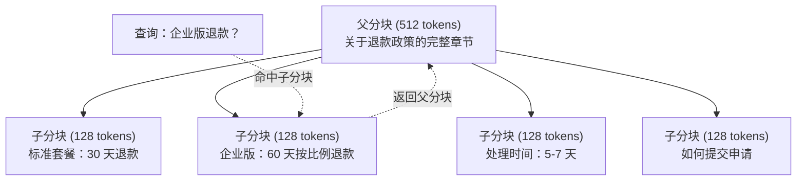
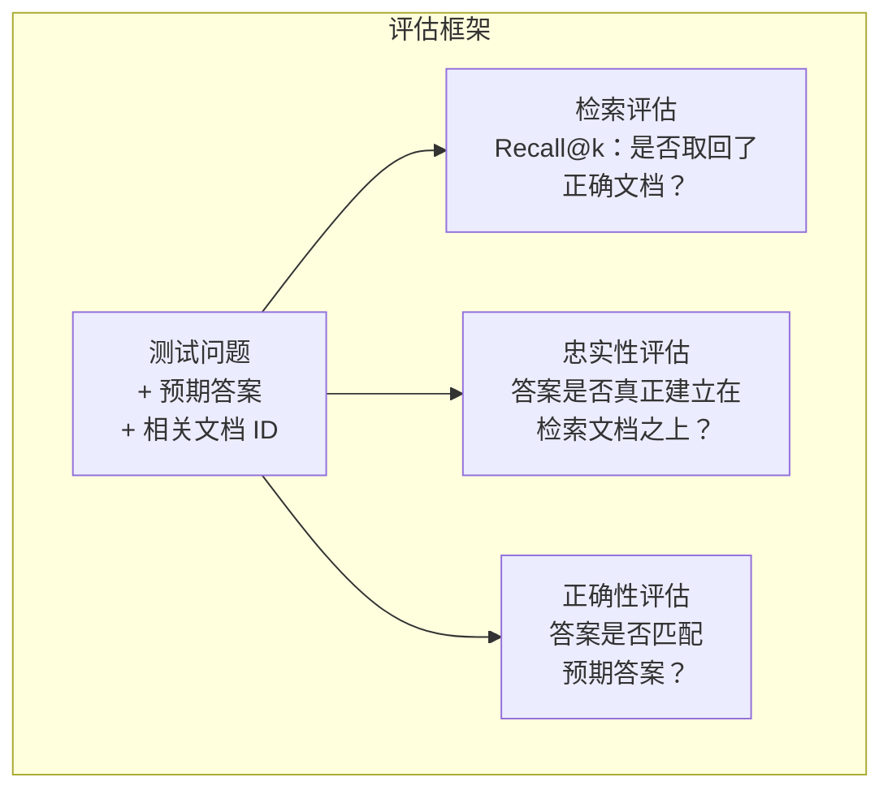

# 高级 RAG（分块 Chunking、重排 Reranking、混合检索 Hybrid Search）

> 基础 RAG 只会检索最相似的 top-k 分块。这对简单问题够用，但遇到多跳推理、歧义查询和大规模语料库时就会失效。高级 RAG 决定了你的系统只是一个能在 10 篇文档上跑通的演示，还是一个能在 1000 万篇文档上稳定工作的系统。

**类型：** 构建
**语言：** Python
**前置要求：** Phase 11，Lesson 06（RAG）
**时长：** ~90 分钟
**相关内容：** Phase 5 · 23（Chunking Strategies for RAG）涵盖了六种分块算法——recursive、semantic、sentence、parent-document、late chunking、contextual retrieval——并附有 Vectara/Anthropic 的基准测试。本课在此基础上继续深入：混合检索、重排、查询变换。

## 学习目标

- 实现高级分块策略，包括语义分块 (semantic chunking)、递归分块 (recursive chunking) 和父子分块 (parent-child chunking)，在保留文档结构与上下文的同时进行检索
- 构建混合检索流水线，把 BM25 关键词匹配、语义向量检索和交叉编码器 (cross-encoder) 重排器结合起来
- 应用查询变换 (query transformation) 技术（HyDE、multi-query、step-back），提升歧义或复杂问题上的检索效果
- 诊断并修复常见 RAG 故障：取回了错误分块、答案不在上下文中、多跳推理失效

## 问题所在

你已经在 Lesson 06 中搭建了一个基础 RAG 流水线。它在小型语料库上回答直接问题时效果不错。现在试试下面这些场景：

**歧义查询**："上个季度的营收是多少？" 语义检索会返回关于营收策略、营收预测，以及 CFO 对营收增长看法的分块。这些内容在语义上都和 "revenue" 很接近，但没有一个包含真正的数字。正确的分块写的是 "Q3 2025 的 earnings 为 $47.2M"，但它用的是 "earnings" 而不是 "revenue"。嵌入模型会认为 "revenue strategy" 比 "Q3 earnings were $47.2M" 更接近这个查询。

**多跳问题**："哪个团队的客户满意度得分提升最高？" 这需要先找到每个团队的满意度得分，再进行比较，并识别出最大值。没有任何一个分块单独包含答案，信息散落在多个团队报告中。

**大规模语料问题**：你有 200 万个分块。正确答案位于分块 #1,847,293。你的 top-5 检索结果却是分块 #14、#89,201、#1,200,000、#44 和 #901,333。它们在嵌入空间 (embedding space) 中都很接近，但没有一个包含答案。在这种规模下，近似最近邻搜索 (approximate nearest neighbor search) 会引入足够多的误差，把真正相关的结果挤出 top-k。

基础 RAG 会失败，是因为向量相似度不等于相关性。一个分块可以在语义上和查询很接近，但对回答问题没有帮助。高级 RAG 通过四种技术来解决这个问题：混合检索（加入关键词匹配）、重排（更细致地给候选结果打分）、查询变换（在检索前先修正查询），以及更好的分块策略（用合适的粒度进行检索）。

## 核心概念

### 混合检索 (Hybrid Search)：语义 + 关键词

语义检索（向量相似度）擅长理解含义。"How do I cancel my subscription?" 即使和 "Steps to terminate your plan" 没有共享任何词，也能匹配上。但它会漏掉精确匹配。比如 "Error code E-4021"，如果嵌入模型把它当成噪声处理，就未必能匹配到包含 "E-4021" 的分块。

关键词检索（BM25）恰好相反。它特别擅长精确匹配，"E-4021" 可以准确命中。但如果文档写的是 "terminate your plan"，那么查询 "cancel my subscription" 可能一个结果都没有。

混合检索会同时运行这两种方法，再把结果合并。

**BM25**（Best Matching 25）是标准的关键词检索算法。自 1990 年代以来，它一直是搜索引擎的核心算法。公式如下：

```
BM25(q, d) = sum over terms t in q:
    IDF(t) * (tf(t,d) * (k1 + 1)) / (tf(t,d) + k1 * (1 - b + b * |d| / avgdl))
```

其中，tf(t,d) 表示词项 t 在文档 d 中的词频，IDF(t) 表示逆文档频率，|d| 表示文档长度，avgdl 表示平均文档长度，k1 控制词频饱和程度（默认 1.2），b 控制长度归一化（默认 0.75）。

用直白的话说：只要文档包含查询词，尤其是稀有词，BM25 就会给它更高分；但同一个词重复出现，收益会逐渐递减。一个文档里出现 50 次 "revenue"，并不意味着它会比只出现 1 次的文档相关 50 倍。

### 倒数排名融合 (Reciprocal Rank Fusion, RRF)

现在你有两个排序列表：一个来自向量检索，一个来自 BM25。该怎么把它们合并？标准做法就是倒数排名融合。

```
RRF_score(d) = sum over rankings R:
    1 / (k + rank_R(d))
```

其中 k 是一个常数（通常取 60），用于防止排名第一的结果权重过大、压制其他信号。

一个文档如果在向量检索中排 #1、在 BM25 中排 #5，它的得分就是：1/(60+1) + 1/(60+5) = 0.0164 + 0.0154 = 0.0318

一个文档如果在向量检索中排 #3、在 BM25 中排 #2，它的得分就是：1/(60+3) + 1/(60+2) = 0.0159 + 0.0161 = 0.0320

RRF 会自然地平衡这两种信号。一个同时在两个列表里都排得很高的文档，会获得最佳分数。一个只在某个列表里排 #1、但在另一个列表中完全缺失的文档，会得到中等分数。这种方法很稳健，因为它使用的是排名而不是原始分数，所以两个系统之间分数分布不同也没关系。

### 重排 (Reranking)

检索（无论是向量、关键词还是混合方式）速度快，但不够精确。它依赖双编码器 (bi-encoders)：查询和每篇文档分别独立嵌入，然后再进行比较。嵌入只需计算一次并缓存，因此可以扩展到数百万文档。

重排使用交叉编码器 (cross-encoders)：把查询和候选文档一起送入同一个模型，让模型输出相关性分数。模型会同时看到两段文本，因此可以捕捉更细粒度的交互。交叉编码器能够理解：即使双编码器没能建立联系，"What were Q3 earnings?" 仍然和包含 "$47.2M in Q3" 的分块高度相关。

代价在于：由于交叉编码器会联合处理 query-document 对，它比双编码器慢 100-1000 倍。你不可能为 100 万篇文档预先计算交叉编码器分数。解决方案是：先用混合检索取回更大的候选集（例如 top-50），再用交叉编码器重排，得到最终的 top-5。


常见重排模型（2026 年版本）：
- Cohere Rerank 3.5：托管 API，多语言，对混合语料的召回提升最好
- Voyage rerank-2.5：托管 API，在托管方案里延迟最低
- Jina-Reranker-v2 Multilingual：开放权重，支持 100+ 语言
- bge-reranker-v2-m3：开放权重，强基线模型
- cross-encoder/ms-marco-MiniLM-L-6-v2：开放权重，可在 CPU 上运行，适合原型验证
- ColBERTv2 / Jina-ColBERT-v2：late-interaction 多向量重排器——评分时复杂度是 O(tokens)，不是 O(docs)

### 查询变换 (Query Transformation)

有时候问题不在检索，而在查询本身。"那个新的政策变化到底说了什么来着？" 是一个很糟糕的搜索查询。它没有任何具体词汇，嵌入也很模糊。再好的检索系统也无法靠这种查询找到正确文档。

**查询重写 (Query rewriting)**：把用户的原始问题改写成更适合检索的查询。LLM 很适合做这件事：

```
User: "What was that thing about the new policy change?"
Rewritten: "Recent policy changes and updates"
```

**假设文档嵌入 (HyDE, Hypothetical Document Embeddings)**：不是直接拿查询去搜，而是先生成一个假设性的答案，对这个答案做嵌入，再去搜索相似的真实文档。

```
Query: "What is the refund policy for enterprise?"
Hypothetical answer: "Enterprise customers are eligible for a full refund
within 60 days of purchase. Refunds are pro-rated based on the remaining
subscription period and processed within 5-7 business days."
```

把这个假设答案做嵌入，再去搜索与之相似的真实文档。直觉上，假设答案在嵌入空间里会比原始问题更接近真正的答案。问题和答案的语言结构并不相同；通过先生成一个假设答案，你就把嵌入中的“问题空间”和“答案空间”连接起来了。

HyDE 会在检索前额外增加一次 LLM 调用，因此延迟会增加 500-2000ms。当原始查询的检索质量较差时，这个代价通常是值得的。

### 父子分块 (Parent-Child Chunking)

标准分块总要在两者之间做取舍：分块小，检索更精确；分块大，上下文更完整。父子分块消除了这种取舍。

索引小分块（128 tokens）用于检索；一旦某个小分块被命中，就把它对应的父分块（512 tokens）返回给提示词。小分块能精准匹配查询，父分块则为 LLM 提供足够上下文来生成高质量答案。



查询“企业版退款？”会精准命中子分块 C2。但送入提示词的却是完整的父分块 P，其中包含处理时间和提交流程等周边上下文。

### 元数据过滤 (Metadata Filtering)

在执行向量检索前，先根据元数据过滤语料库：日期、来源、类别、作者、语言。这会缩小搜索空间，并减少无关结果。

"上个月安全策略有哪些变化？" 这类问题只应该检索过去 30 天内、类别为 security 的文档。如果没有元数据过滤，你会在整个语料库里搜索，结果可能捞到一篇两年前的安全文档，只因为它在语义上碰巧相似。

生产级 RAG 系统会为每个分块存储配套元数据：源文档、创建日期、类别、作者、版本。向量数据库支持在相似度搜索前基于元数据进行预过滤，这对大规模系统的性能至关重要。

### 评估

你已经搭好了一个 RAG 系统。那怎么知道它到底有没有用？看三个指标：

**检索相关性（Recall@k）**：针对一组已知相关文档的测试问题，有多少相关文档出现在 top-k 结果中？如果某个问题的答案在分块 #47 里，那么 #47 有没有出现在 top-5 中？

**忠实性 (Faithfulness)**：生成的答案是否真正建立在检索到的文档之上？如果检索到的分块写的是 "60-day refund window"，模型却回答成 "90-day refund window"，那就是一次忠实性失败。模型在已有正确上下文的情况下仍然产生了幻觉。

**答案正确性**：生成的答案是否和预期答案一致？这是端到端指标，同时反映了检索质量和生成质量。

一个简单的忠实性检查方法是：把生成答案中的每个断言单独拿出来，验证它是否（在实质意义上）出现在检索到的分块中。如果答案里包含任何一个没有出现在检索结果里的事实，它就很可能是幻觉。



## 动手构建

### 第 1 步：实现 BM25

```python
import math
from collections import Counter


class BM25:
    def __init__(self, k1=1.2, b=0.75):
        self.k1 = k1
        self.b = b
        self.docs = []
        self.doc_lengths = []
        self.avg_dl = 0
        self.doc_freqs = {}
        self.n_docs = 0

    def index(self, documents):
        self.docs = documents
        self.n_docs = len(documents)
        self.doc_lengths = []
        self.doc_freqs = {}

        for doc in documents:
            words = doc.lower().split()
            self.doc_lengths.append(len(words))
            unique_words = set(words)
            for word in unique_words:
                self.doc_freqs[word] = self.doc_freqs.get(word, 0) + 1

        self.avg_dl = sum(self.doc_lengths) / self.n_docs if self.n_docs else 1

    def score(self, query, doc_idx):
        query_words = query.lower().split()
        doc_words = self.docs[doc_idx].lower().split()
        doc_len = self.doc_lengths[doc_idx]
        word_counts = Counter(doc_words)
        score = 0.0

        for term in query_words:
            if term not in word_counts:
                continue
            tf = word_counts[term]
            df = self.doc_freqs.get(term, 0)
            idf = math.log((self.n_docs - df + 0.5) / (df + 0.5) + 1)
            numerator = tf * (self.k1 + 1)
            denominator = tf + self.k1 * (1 - self.b + self.b * doc_len / self.avg_dl)
            score += idf * numerator / denominator

        return score

    def search(self, query, top_k=10):
        scores = [(i, self.score(query, i)) for i in range(self.n_docs)]
        scores.sort(key=lambda x: x[1], reverse=True)
        return scores[:top_k]
```

### 第 2 步：倒数排名融合

```python
def reciprocal_rank_fusion(ranked_lists, k=60):
    scores = {}
    for ranked_list in ranked_lists:
        for rank, (doc_id, _) in enumerate(ranked_list):
            if doc_id not in scores:
                scores[doc_id] = 0.0
            scores[doc_id] += 1.0 / (k + rank + 1)
    fused = sorted(scores.items(), key=lambda x: x[1], reverse=True)
    return fused
```

### 第 3 步：混合检索流水线

```python
def hybrid_search(query, chunks, vector_embeddings, vocab, idf, bm25_index, top_k=5, fusion_k=60):
    query_emb = tfidf_embed(query, vocab, idf)
    vector_results = search(query_emb, vector_embeddings, top_k=top_k * 3)
    bm25_results = bm25_index.search(query, top_k=top_k * 3)
    fused = reciprocal_rank_fusion([vector_results, bm25_results], k=fusion_k)
    return fused[:top_k]
```

### 第 4 步：简单重排器

在生产环境中，你通常会使用 cross-encoder 模型。这里我们先构建一个简单重排器，依据 query-document 的词重叠、词项重要性和短语匹配来估计相关性。

```python
def rerank(query, candidates, chunks):
    query_words = set(query.lower().split())
    stop_words = {"the", "a", "an", "is", "are", "was", "were", "what", "how",
                  "why", "when", "where", "do", "does", "for", "of", "in", "to",
                  "and", "or", "on", "at", "by", "it", "its", "this", "that",
                  "with", "from", "be", "has", "have", "had", "not", "but"}
    query_terms = query_words - stop_words

    scored = []
    for doc_id, initial_score in candidates:
        chunk = chunks[doc_id].lower()
        chunk_words = set(chunk.split())

        term_overlap = len(query_terms & chunk_words)

        query_bigrams = set()
        q_list = [w for w in query.lower().split() if w not in stop_words]
        for i in range(len(q_list) - 1):
            query_bigrams.add(q_list[i] + " " + q_list[i + 1])
        bigram_matches = sum(1 for bg in query_bigrams if bg in chunk)

        position_boost = 0
        for term in query_terms:
            pos = chunk.find(term)
            if pos != -1 and pos < len(chunk) // 3:
                position_boost += 0.5

        rerank_score = (
            term_overlap * 1.0
            + bigram_matches * 2.0
            + position_boost
            + initial_score * 5.0
        )
        scored.append((doc_id, rerank_score))

    scored.sort(key=lambda x: x[1], reverse=True)
    return scored
```

### 第 5 步：HyDE（Hypothetical Document Embeddings）

```python
def hyde_generate_hypothesis(query):
    templates = {
        "what": "The answer to '{query}' is as follows: Based on our documentation, {topic} involves specific policies and procedures that define how the process works.",
        "how": "To address '{query}': The process involves several steps. First, you need to initiate the request. Then, the system processes it according to the defined rules.",
        "default": "Regarding '{query}': Our records indicate specific details and policies related to this topic that provide a comprehensive answer."
    }
    query_lower = query.lower()
    if query_lower.startswith("what"):
        template = templates["what"]
    elif query_lower.startswith("how"):
        template = templates["how"]
    else:
        template = templates["default"]

    topic_words = [w for w in query.lower().split()
                   if w not in {"what", "is", "the", "how", "do", "does", "a", "an",
                                "for", "of", "to", "in", "on", "at", "by", "and", "or"}]
    topic = " ".join(topic_words) if topic_words else "this topic"

    return template.format(query=query, topic=topic)


def hyde_search(query, chunks, vector_embeddings, vocab, idf, top_k=5):
    hypothesis = hyde_generate_hypothesis(query)
    hypothesis_emb = tfidf_embed(hypothesis, vocab, idf)
    results = search(hypothesis_emb, vector_embeddings, top_k)
    return results, hypothesis
```

### 第 6 步：父子分块

```python
def create_parent_child_chunks(text, parent_size=200, child_size=50):
    words = text.split()
    parents = []
    children = []
    child_to_parent = {}

    parent_idx = 0
    start = 0
    while start < len(words):
        parent_end = min(start + parent_size, len(words))
        parent_text = " ".join(words[start:parent_end])
        parents.append(parent_text)

        child_start = start
        while child_start < parent_end:
            child_end = min(child_start + child_size, parent_end)
            child_text = " ".join(words[child_start:child_end])
            child_idx = len(children)
            children.append(child_text)
            child_to_parent[child_idx] = parent_idx
            child_start += child_size

        parent_idx += 1
        start += parent_size

    return parents, children, child_to_parent
```

### 第 7 步：忠实性评估

```python
def evaluate_faithfulness(answer, retrieved_chunks):
    answer_sentences = [s.strip() for s in answer.split(".") if len(s.strip()) > 10]
    if not answer_sentences:
        return 1.0, []

    grounded = 0
    ungrounded = []
    context = " ".join(retrieved_chunks).lower()

    for sentence in answer_sentences:
        words = set(sentence.lower().split())
        stop_words = {"the", "a", "an", "is", "are", "was", "were", "and", "or",
                      "to", "of", "in", "for", "on", "at", "by", "it", "this", "that"}
        content_words = words - stop_words
        if not content_words:
            grounded += 1
            continue

        matched = sum(1 for w in content_words if w in context)
        ratio = matched / len(content_words) if content_words else 0

        if ratio >= 0.5:
            grounded += 1
        else:
            ungrounded.append(sentence)

    score = grounded / len(answer_sentences) if answer_sentences else 1.0
    return score, ungrounded


def evaluate_retrieval_recall(queries_with_relevant, retrieval_fn, k=5):
    total_recall = 0.0
    results = []

    for query, relevant_indices in queries_with_relevant:
        retrieved = retrieval_fn(query, k)
        retrieved_indices = set(idx for idx, _ in retrieved)
        relevant_set = set(relevant_indices)
        hits = len(retrieved_indices & relevant_set)
        recall = hits / len(relevant_set) if relevant_set else 1.0
        total_recall += recall
        results.append({
            "query": query,
            "recall": recall,
            "hits": hits,
            "total_relevant": len(relevant_set)
        })

    avg_recall = total_recall / len(queries_with_relevant) if queries_with_relevant else 0
    return avg_recall, results
```

## 实际使用

如果使用真实的 cross-encoder 来做重排：

```python
from sentence_transformers import CrossEncoder

reranker = CrossEncoder("cross-encoder/ms-marco-MiniLM-L-6-v2")

def rerank_with_cross_encoder(query, candidates, chunks, top_k=5):
    pairs = [(query, chunks[doc_id]) for doc_id, _ in candidates]
    scores = reranker.predict(pairs)
    scored = list(zip([doc_id for doc_id, _ in candidates], scores))
    scored.sort(key=lambda x: x[1], reverse=True)
    return scored[:top_k]
```

如果使用 Cohere 的托管重排器：

```python
import cohere

co = cohere.Client()

def rerank_with_cohere(query, candidates, chunks, top_k=5):
    docs = [chunks[doc_id] for doc_id, _ in candidates]
    response = co.rerank(
        model="rerank-english-v3.0",
        query=query,
        documents=docs,
        top_n=top_k
    )
    return [(candidates[r.index][0], r.relevance_score) for r in response.results]
```

如果要用真实 LLM 来实现 HyDE：

```python
import anthropic

client = anthropic.Anthropic()

def hyde_with_llm(query):
    response = client.messages.create(
        model="claude-sonnet-4-20250514",
        max_tokens=256,
        messages=[{
            "role": "user",
            "content": f"Write a short paragraph that would be a good answer to this question. Do not say you don't know. Just write what the answer would look like.\n\nQuestion: {query}"
        }]
    )
    return response.content[0].text
```

如果要在生产环境中用 Weaviate 做混合检索：

```python
import weaviate

client = weaviate.connect_to_local()

collection = client.collections.get("Documents")
response = collection.query.hybrid(
    query="enterprise refund policy",
    alpha=0.5,
    limit=10
)
```

alpha 参数用于控制权重平衡：0.0 = 纯关键词（BM25），1.0 = 纯向量，0.5 = 两者等权。大多数生产系统会把 alpha 设在 0.3 到 0.7 之间。

## 交付成果

本课会产出：
- `outputs/prompt-advanced-rag-debugger.md` —— 一个用于诊断和修复 RAG 质量问题的提示词
- `outputs/skill-advanced-rag.md` —— 一个用于构建生产级 RAG 的技能说明，包含混合检索与重排

## 练习

1. 在示例文档上比较 BM25、向量检索和混合检索。对 5 个测试查询分别记录：哪种方法能在位置 #1 返回最相关的分块。混合检索至少应该在 5 个查询中的 3 个上获胜。

2. 实现元数据过滤。给每篇文档增加一个 `category` 字段（security、billing、api、product）。在执行向量检索前，先把分块过滤到相关类别。用 "使用了什么加密方式？" 进行测试，并验证它只会搜索 security 类别的分块。

3. 使用 Lesson 06 中的简单 generate 函数，构建完整的 HyDE 流水线。比较直接查询检索和 HyDE 检索在全部 5 个测试查询上的检索质量（top-3 相关性）。对于表述模糊的查询，HyDE 应该能改善结果。

4. 在示例文档上实现完整的父子分块策略。设置 child_size=30、parent_size=100。检索时搜索子分块，但在提示词中返回父分块。将生成答案与标准分块（chunk_size=50）进行比较。

5. 创建一个评估数据集：10 个问题，每个问题都已知对应的答案分块。分别测量 (a) 仅向量检索、(b) 仅 BM25、(c) 混合检索、(d) 混合检索 + 重排 的 Recall@3、Recall@5 和 Recall@10。把结果画出来，并找出重排在哪些情况下帮助最大。

## 关键术语

| 术语 | 常见说法 | 实际含义 |
|------|----------------|----------------------|
| BM25 | “关键词搜索” | 一种概率排序算法，依据 term frequency、inverse document frequency 和 document length normalization 为文档打分 |
| Hybrid search | “两全其美” | 并行执行 semantic（vector）search 与 keyword（BM25）search，再用 rank fusion 合并结果 |
| Reciprocal Rank Fusion | “合并多个排序列表” | 通过对各个列表中的每篇文档累加 1/(k + rank) 来组合多个排序结果 |
| Reranking | “第二轮打分” | 使用更昂贵的 cross-encoder 模型，对初始检索返回的候选集合重新打分 |
| Cross-encoder | “联合 query-document 模型” | 把 query 和 document 作为单一输入送入模型，输出 relevance score；比 bi-encoder 更准确，但太慢，不适合全库搜索 |
| Bi-encoder | “独立 embedding 模型” | 分别对 query 和 document 独立做 embedding；因为 embedding 可以预计算，所以速度快，但准确率不如 cross-encoder |
| HyDE | “用一个假答案去搜索” | 先为查询生成一个假设性答案，对其做 embedding，再搜索与之相似的真实文档 |
| Parent-child chunking | “检索时更小，上下文更大” | 用小分块建立索引以获得更精确的检索，但返回更大的父分块以提供足够上下文 |
| Metadata filtering | “先缩小范围再搜索” | 在执行向量检索前，先按属性（date、source、category）过滤文档，以缩小搜索空间 |
| Faithfulness | “它是不是一直有依据” | 判断生成答案是否由检索到的文档支持，而不是模型凭训练数据臆造出来 |

## 延伸阅读

- Robertson & Zaragoza, "The Probabilistic Relevance Framework: BM25 and Beyond" (2009) -- BM25 的权威参考资料，解释了该公式背后的概率基础
- Cormack et al., "Reciprocal Rank Fusion Outperforms Condorcet and Individual Rank Learning Methods" (2009) -- 最初提出 RRF 的论文，证明它优于更复杂的融合方法
- Gao et al., "Precise Zero-Shot Dense Retrieval without Relevance Labels" (2022) -- HyDE 论文，展示了在没有任何训练数据时，假设文档 embedding 也能提升检索效果
- Nogueira & Cho, "Passage Re-ranking with BERT" (2019) -- 证明在 BM25 之上叠加 cross-encoder 重排，可以显著提高检索质量
- [Khattab et al., "DSPy: Compiling Declarative Language Model Calls into Self-Improving Pipelines" (2023)](https://arxiv.org/abs/2310.03714) -- 把 prompt 构造和权重选择视为检索流水线上的优化问题；如果你想学的是“program LLMs”而不是“prompt LLMs”，就读这篇
- [Edge et al., "From Local to Global: A Graph RAG Approach to Query-Focused Summarization" (Microsoft Research 2024)](https://arxiv.org/abs/2404.16130) -- GraphRAG 论文：实体关系抽取 + Leiden 社区发现，用于面向查询的摘要；重点看 global 与 local retrieval 的区别
- [Asai et al., "Self-RAG: Learning to Retrieve, Generate, and Critique through Self-Reflection" (ICLR 2024)](https://arxiv.org/abs/2310.11511) -- 带有 reflection tokens 的自评估 RAG；这是超越静态 retrieve-then-generate 的 agentic 前沿
- [LangChain Query Construction blog](https://blog.langchain.dev/query-construction/) -- 介绍如何把自然语言查询翻译成结构化数据库查询（Text-to-SQL、Cypher），作为检索前的一步
