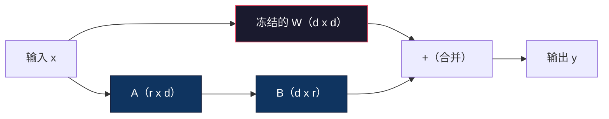
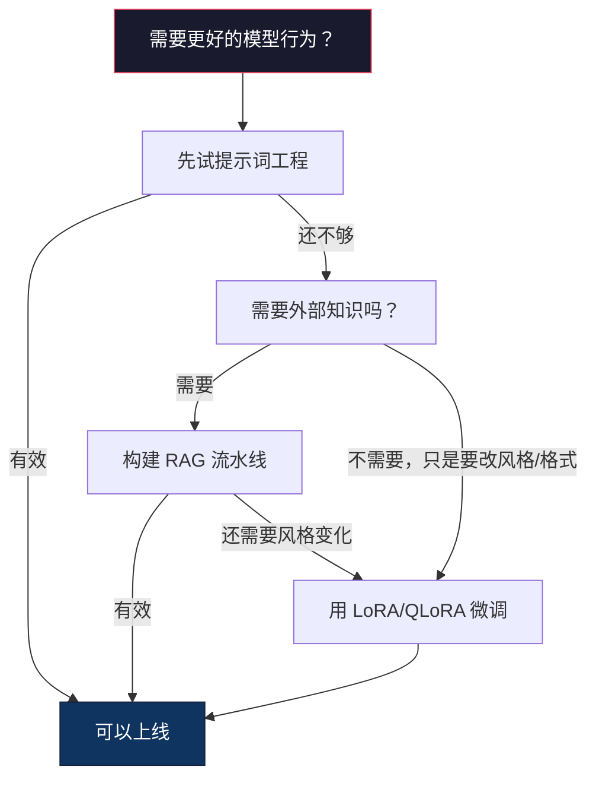

# 使用 LoRA 与 QLoRA 进行微调

> 对一个 7B 模型做全量微调（full fine-tuning）需要 56GB VRAM。你没有，大多数公司也没有。LoRA 通过只训练不到 1% 的参数，就能把同一个模型的微调压到 6GB 内完成。这不是一种妥协——在大多数任务上，它能达到与全量微调相当的质量。整个开源微调生态，基本都建立在这一个技巧之上。

**类型：** 构建
**语言：** Python
**前置要求：** 第 10 阶段，第 06 课（Instruction Tuning / SFT）
**时长：** ~75 分钟
**相关内容：** 第 10 阶段从零讲解 SFT/DPO 循环。本课将这些内容接入 2026 年的 PEFT 工具栈（PEFT、TRL、Unsloth、Axolotl、LLaMA-Factory）。

## 学习目标

- 通过把低秩适配器矩阵（A 和 B）注入预训练模型的注意力层，亲手实现 LoRA
- 计算 LoRA 相比全量微调的参数节省：对于维度为 d_model、秩为 r 的情况，训练的是 `2*r*d` 个参数，而不是 `d^2`
- 使用 QLoRA（4-bit 量化基座 + LoRA 适配器）微调模型，使其能装进消费级 GPU 显存
- 将 LoRA 权重合并回基座模型用于部署，并比较带适配器与不带适配器时的推理速度

## 问题

你有一个基座模型。Llama 3 8B。你想让它用你公司的口吻回答客服工单。SFT 是答案。但 SFT 有成本问题。

全量微调会更新模型中的每一个参数。Llama 3 8B 有 80 亿个参数。用 fp16 表示时，每个参数占 2 字节。仅加载权重就要 16GB。训练时你还需要梯度（16GB）、Adam 优化器状态（动量 + 方差共 32GB），以及激活值。总计：单个 8B 模型大约需要 56GB VRAM。

即使是 A100 80GB，也只是勉强装下。云服务商上两张 A100 的价格通常是每小时 3-4 美元。在 50,000 个样本上训练 3 个 epoch，大概要 6-10 小时。也就是说，每次实验要花 30-40 美元。为了找到合适的超参数跑 10 次实验，还没部署任何东西，你就已经花掉 400 美元了。

如果扩展到 Llama 3 70B，数字会离谱到不可接受。仅权重就需要 140GB。你得上集群。每次实验 100 美元起步。

更深层的问题是：全量微调会修改模型中的每一项权重。如果你在客服数据上微调，模型的通用能力可能会下降。这叫灾难性遗忘（catastrophic forgetting）。模型会更擅长你的任务，却会在其他一切事情上变差。

你需要一种方法：训练更少的参数、使用更少的内存，同时又不破坏模型已有的知识。

## 核心概念

### LoRA：低秩适配（Low-Rank Adaptation）

Microsoft 的 Edward Hu 等人在 2021 年 6 月提出了 LoRA。论文的核心洞见是：微调过程中的权重更新，本身具有较低的内在秩（intrinsic rank）。你不需要去更新一个 4096x4096 权重矩阵中的全部 1670 万参数。更新中的有效信息，往往可以用一个秩为 16 或 32 的矩阵来表达。

数学形式如下。标准线性层计算：

```
y = Wx
```

其中 W 是一个 `d_out x d_in` 的矩阵。对于 4096x4096 的注意力投影层而言，这就是 16,777,216 个参数。

LoRA 会冻结 W，并增加一个低秩分解：

```
y = Wx + BAx
```

其中 B 的形状是 `(d_out x r)`，A 的形状是 `(r x d_in)`。秩 r 远小于 d——通常是 8、16 或 32。

当 `r=16` 且层大小为 4096x4096 时：
- 原始参数量：4096 x 4096 = 16,777,216
- LoRA 参数量：`(4096 x 16) + (16 x 4096) = 65,536 + 65,536 = 131,072`
- 降幅：`131,072 / 16,777,216 = 0.78%`

你只训练了 0.78% 的参数，却能拿到 95-100% 的效果。



A 用随机高斯值初始化，B 初始化为 0。这意味着 LoRA 分支一开始的贡献是 0——模型会从原始行为开始训练，再逐步学习适配能力。

### 缩放因子：Alpha

LoRA 引入了一个缩放因子 alpha，用来控制低秩更新对输出的影响：

```
y = Wx + (alpha / r) * BAx
```

当 `alpha = r` 时，缩放为 1x；当 `alpha = 2r`（常见默认值）时，缩放为 2x。这个超参数可以独立于基础学习率，单独控制 LoRA 路径的“学习力度”。

实战建议：
- `alpha = 2 * rank` 是社区常见惯例（原始论文在多数实验中使用 `alpha = rank`）
- `alpha = rank` 对应 1x 缩放，更保守但更稳定
- 更高的 alpha 代表每一步更新幅度更大，可能加快收敛，也可能带来不稳定性

### LoRA 应该加在哪些层上

一个 Transformer 含有大量线性层，但你并不需要给所有层都加 LoRA。原始论文测试了不同组合：

| 目标层 | 可训练参数（7B） | 质量 |
|--------|------------------|------|
| 仅 q_proj | 4.7M | 良好 |
| q_proj + v_proj | 9.4M | 更好 |
| q_proj + k_proj + v_proj + o_proj | 18.9M | 对注意力最优 |
| 所有线性层（attention + MLP） | 37.7M | 提升有限，但参数翻倍 |

对多数任务来说，最甜蜜点是：`q_proj + v_proj`。这会作用在自注意力中的 query 和 value 投影层上，它们决定模型关注什么、提取什么信息。加入 MLP 层会对代码生成等复杂任务有帮助，但会把参数量翻倍，而对简单任务的边际收益有限。

### Rank 选择

秩 r 决定了适配能力的表达上限：

| Rank | 可训练参数（每层） | 最适合 |
|------|-------------------|--------|
| 4 | 32,768 | 简单分类、情感分析 |
| 8 | 65,536 | 单领域问答、摘要 |
| 16 | 131,072 | 多领域任务、指令跟随 |
| 32 | 262,144 | 复杂推理、代码生成 |
| 64 | 524,288 | 对大多数任务收益递减 |
| 128 | 1,048,576 | 很少能证明值得 |

Hu 等人的结果表明，`r=4` 在简单任务上就已经能捕捉大部分适配信息。`r=8` 和 `r=16` 是实践中最常见的选择。超过 `r=64` 通常很难继续提升质量，同时会开始失去 LoRA 的显存优势。

### QLoRA：4-bit 量化 + LoRA

华盛顿大学的 Tim Dettmers 等人在 2023 年 5 月提出了 QLoRA。思路是：先把冻结的基座模型量化到 4-bit 精度，再在其上方挂接 fp16 的 LoRA 适配器。

这会显著改变内存账本：

| 方法 | 权重内存（7B） | 训练内存（7B） | 所需 GPU |
|------|---------------|----------------|----------|
| 全量微调（fp16） | 14GB | ~56GB | 1x A100 80GB |
| LoRA（fp16 基座） | 14GB | ~18GB | 1x A100 40GB |
| QLoRA（4-bit 基座） | 3.5GB | ~6GB | 1x RTX 3090 24GB |

QLoRA 有三项关键技术贡献：

**NF4（Normal Float 4-bit）**：一种专门为神经网络权重设计的新数据类型。神经网络权重大致服从正态分布。NF4 把 16 个量化等级放在标准正态分布的分位点上。对于正态分布数据而言，这在信息论意义上是最优的。相比均匀 4-bit 量化（INT4）或标准 Float4，它会损失更少的信息。

**双重量化（double quantization）**：量化常数本身也要占内存。每个 64 权重块都需要一个 fp32 缩放因子（4 字节）。对于 7B 模型，这会额外增加 0.4GB。双重量化会把这些常数再量化为 fp8，把开销压到 0.1GB。看似不大，但积少成多。

**分页优化器（paged optimizers）**：训练长序列时，优化器状态（Adam 的动量和方差）可能会超过 GPU 内存。分页优化器会借助 NVIDIA 的统一内存，在 GPU 显存耗尽时，自动把优化器状态分页到 CPU RAM；需要时再换回 GPU。这样可以避免 OOM 崩溃，代价是吞吐会有所下降。

### 质量问题

减少参数或量化基座，会不会伤害质量？多篇论文给出的结果如下：

| 方法 | MMLU（5-shot） | MT-Bench | HumanEval |
|------|----------------|----------|-----------|
| 全量微调（Llama 2 7B） | 48.3 | 6.72 | 14.6 |
| LoRA r=16 | 47.9 | 6.68 | 14.0 |
| QLoRA r=16（NF4） | 47.5 | 6.61 | 13.4 |
| QLoRA r=64（NF4） | 48.1 | 6.70 | 14.2 |

在大多数基准上，`r=16` 的 LoRA 与全量微调的差距在 1% 以内。`r=16` 的 QLoRA 还会再损失一点点百分比。而 `r=64` 的 QLoRA 在使用 90% 更少内存的前提下，基本与全量微调持平。

### 真实世界成本

在 50,000 个样本上微调 Llama 3 8B（3 个 epoch）：

| 方法 | GPU | 时间 | 成本 |
|------|-----|------|------|
| 全量微调 | 2x A100 80GB | 8 小时 | ~$32 |
| LoRA r=16 | 1x A100 40GB | 4 小时 | ~$8 |
| QLoRA r=16 | 1x RTX 4090 24GB | 6 小时 | ~$5 |
| QLoRA r=16（Unsloth） | 1x RTX 4090 24GB | 2.5 小时 | ~$2 |
| QLoRA r=16 | 1x T4 16GB | 12 小时 | ~$4 |

在一张消费级 GPU 上跑 QLoRA，成本比一顿午饭还低。这就是为什么开源权重微调社区会在 2023 年爆发，也解释了为什么到了 2026 年，下面列出的每一个训练框架都默认内置 QLoRA。

### 2026 年的 PEFT 工具栈

| 框架 | 它是什么 | 适用场景 |
|------|----------|----------|
| **Hugging Face PEFT** | 经典的 LoRA/QLoRA/DoRA/IA3 库 | 你想获得底层控制权，而且训练循环已经基于 `transformers.Trainer` |
| **TRL** | HF 的反馈学习训练器（SFT、DPO、GRPO、PPO、ORPO） | 你需要在 SFT 后继续做 DPO/GRPO；它构建在 PEFT 之上 |
| **Unsloth** | 用 Triton kernel 重写前向/反向传播 | 你想获得 2-5 倍加速、显存减半且不损失精度；适用于 Llama/Mistral/Qwen 家族 |
| **Axolotl** | 基于 YAML 的封装层，封住了 PEFT + TRL + DeepSpeed + Unsloth | 你想要可复现、可版本化的训练流程 |
| **LLaMA-Factory** | PEFT + TRL 之上的 GUI/CLI/API | 你想零代码微调；支持 100+ 模型家族 |
| **torchtune** | 原生 PyTorch recipes，不依赖 `transformers` | 你想保持依赖最小化，而且团队已经统一使用 PyTorch |

经验法则：科研用途或一次性实验 → PEFT。可重复的生产流水线 → 开启 Unsloth kernel 的 Axolotl。快速原型验证 → LLaMA-Factory。

### 合并适配器

训练结束后，你会得到两样东西：冻结的基座模型，以及一个很小的 LoRA adapter（通常 10-100MB）。你可以选择：

1. **保持分离**：先加载基座模型，再把 adapter 叠加在上面。这样可以为不同任务切换 adapter。这就是生产中如何从同一个基座模型服务多个微调变体。

2. **永久合并**：计算 `W' = W + (alpha/r) * BA`，然后把结果保存为一个新的完整模型。合并后的模型大小与原始模型一致。没有推理额外开销，也不用再管理 adapter。

如果你要服务多个任务（客服 adapter、代码 adapter、翻译 adapter），就保持分离。如果你只部署一个专用模型，就做合并。

用于组合多个 adapter 的高级合并技术包括：

- **TIES-Merging**（Yadav et al. 2023）：裁剪小幅值参数、解决符号冲突后再合并，以减少 adapter 之间的相互干扰。
- **DARE**（Yu et al. 2023）：合并前随机丢弃部分 adapter 参数，再对剩余参数重新缩放。对于能力组合，这种方法意外地有效。
- **任务算术（task arithmetic）**：直接对 adapter 权重做加减。把一个“代码”adapter 和一个“数学”adapter 相加，往往能得到一个两者都不错的模型。

### 什么时候不该微调

微调应该是第三选择，而不是第一选择。

**第一：提示词工程。** 写更好的系统提示词，增加 few-shot 示例，使用 chain-of-thought。这几乎零成本，只需几分钟。如果靠提示词你已经达到 80% 的效果，通常就没必要微调。

**第二：RAG。** 如果模型需要知道你的特定数据（文档、知识库、产品目录），检索要比把这些信息烘焙进权重更便宜，也更好维护。参见第 06 课。

**第三：微调。** 当你需要模型学会某种特定风格、格式或推理模式，而这些无法通过提示词实现时；当你需要稳定的结构化输出时；当你需要把更大的模型蒸馏到更小模型时；当延迟很重要而你无法承受 few-shot 提示词额外 token 成本时，才考虑微调。



## 动手构建

我们将用纯 PyTorch 从零实现 LoRA。不依赖任何库，不靠魔法。你会构建 LoRA 层，把它注入模型，训练它，再把权重合并回去。

### 第 1 步：LoRA 层

```python
import torch
import torch.nn as nn
import math

class LoRALayer(nn.Module):
    def __init__(self, in_features, out_features, rank=8, alpha=16):
        super().__init__()
        self.rank = rank
        self.alpha = alpha
        self.scaling = alpha / rank

        self.A = nn.Parameter(torch.randn(in_features, rank) * (1 / math.sqrt(rank)))
        self.B = nn.Parameter(torch.zeros(rank, out_features))

    def forward(self, x):
        return (x @ self.A @ self.B) * self.scaling
```

A 用缩放后的随机值初始化，B 初始化为 0。这样 `BA` 的乘积一开始为 0，模型会从原始行为出发。

### 第 2 步：LoRA 包装的线性层

```python
class LinearWithLoRA(nn.Module):
    def __init__(self, linear, rank=8, alpha=16):
        super().__init__()
        self.linear = linear
        self.lora = LoRALayer(
            linear.in_features, linear.out_features, rank, alpha
        )

        for param in self.linear.parameters():
            param.requires_grad = False

    def forward(self, x):
        return self.linear(x) + self.lora(x)
```

原始线性层被冻结。只有 LoRA 参数（A 和 B）是可训练的。

### 第 3 步：把 LoRA 注入模型

```python
def inject_lora(model, target_modules, rank=8, alpha=16):
    for param in model.parameters():
        param.requires_grad = False

    lora_layers = {}
    for name, module in model.named_modules():
        if isinstance(module, nn.Linear):
            if any(t in name for t in target_modules):
                parent_name = ".".join(name.split(".")[:-1])
                child_name = name.split(".")[-1]
                parent = dict(model.named_modules())[parent_name]
                lora_linear = LinearWithLoRA(module, rank, alpha)
                setattr(parent, child_name, lora_linear)
                lora_layers[name] = lora_linear
    return lora_layers
```

先冻结模型中的所有参数。然后遍历模型树，找到名称匹配目标模块的线性层，并替换成 LoRA 包装版本。整个模型中，只有 LoRA 的 A 和 B 矩阵仍然可训练。

### 第 4 步：统计参数

```python
def count_parameters(model):
    total = sum(p.numel() for p in model.parameters())
    trainable = sum(p.numel() for p in model.parameters() if p.requires_grad)
    frozen = total - trainable
    return {
        "total": total,
        "trainable": trainable,
        "frozen": frozen,
        "trainable_pct": 100 * trainable / total if total > 0 else 0
    }
```

### 第 5 步：把权重合并回去

```python
def merge_lora_weights(model):
    for name, module in model.named_modules():
        if isinstance(module, LinearWithLoRA):
            with torch.no_grad():
                merged = (
                    module.lora.A @ module.lora.B
                ) * module.lora.scaling
                module.linear.weight.data += merged.T
            parent_name = ".".join(name.split(".")[:-1])
            child_name = name.split(".")[-1]
            if parent_name:
                parent = dict(model.named_modules())[parent_name]
            else:
                parent = model
            setattr(parent, child_name, module.linear)
```

合并后，LoRA 层就消失了。模型大小会回到原始状态，只是适配能力已经被烘焙进权重中。推理时没有额外开销。

### 第 6 步：模拟 QLoRA 量化

```python
def quantize_to_nf4(tensor, block_size=64):
    blocks = tensor.reshape(-1, block_size)
    scales = blocks.abs().max(dim=1, keepdim=True).values / 7.0
    scales = torch.clamp(scales, min=1e-8)
    quantized = torch.round(blocks / scales).clamp(-8, 7).to(torch.int8)
    return quantized, scales

def dequantize_from_nf4(quantized, scales, original_shape):
    dequantized = quantized.float() * scales
    return dequantized.reshape(original_shape)
```

这段代码模拟了 4-bit 量化：把权重按 64 个一组映射到 16 个离散等级上。生产中的 QLoRA 会使用 bitsandbytes 库，在 GPU 上实现真正的 NF4。

### 第 7 步：训练循环

```python
def train_lora(model, data, epochs=5, lr=1e-3, batch_size=4):
    optimizer = torch.optim.AdamW(
        [p for p in model.parameters() if p.requires_grad], lr=lr
    )
    criterion = nn.MSELoss()

    losses = []
    for epoch in range(epochs):
        epoch_loss = 0.0
        n_batches = 0
        indices = torch.randperm(len(data["inputs"]))

        for i in range(0, len(indices), batch_size):
            batch_idx = indices[i:i + batch_size]
            x = data["inputs"][batch_idx]
            y = data["targets"][batch_idx]

            output = model(x)
            loss = criterion(output, y)

            optimizer.zero_grad()
            loss.backward()
            optimizer.step()

            epoch_loss += loss.item()
            n_batches += 1

        avg_loss = epoch_loss / n_batches
        losses.append(avg_loss)

    return losses
```

### 第 8 步：完整演示

```python
def demo():
    torch.manual_seed(42)
    d_model = 256
    n_classes = 10

    model = nn.Sequential(
        nn.Linear(d_model, 512),
        nn.ReLU(),
        nn.Linear(512, 512),
        nn.ReLU(),
        nn.Linear(512, n_classes),
    )

    n_samples = 500
    x = torch.randn(n_samples, d_model)
    y = torch.randint(0, n_classes, (n_samples,))
    y_onehot = torch.zeros(n_samples, n_classes).scatter_(1, y.unsqueeze(1), 1.0)

    data = {"inputs": x, "targets": y_onehot}

    params_before = count_parameters(model)

    lora_layers = inject_lora(
        model, target_modules=["0", "2"], rank=8, alpha=16
    )

    params_after = count_parameters(model)

    losses = train_lora(model, data, epochs=20, lr=1e-3)

    merge_lora_weights(model)
    params_merged = count_parameters(model)

    return {
        "params_before": params_before,
        "params_after": params_after,
        "params_merged": params_merged,
        "losses": losses,
    }
```

这个 demo 会创建一个小模型，把 LoRA 注入两层，训练它，再把权重合并回去。参数数量会从“全部可训练”降到 LoRA 训练期间的约 1% 可训练，合并后再回到原始架构。

## 实际使用

在 Hugging Face 生态里，对真实模型应用 LoRA 大约只需要 20 行代码：

```python
from transformers import AutoModelForCausalLM, AutoTokenizer
from peft import LoraConfig, get_peft_model, TaskType

model = AutoModelForCausalLM.from_pretrained("meta-llama/Llama-3.1-8B")
tokenizer = AutoTokenizer.from_pretrained("meta-llama/Llama-3.1-8B")

lora_config = LoraConfig(
    task_type=TaskType.CAUSAL_LM,
    r=16,
    lora_alpha=32,
    lora_dropout=0.05,
    target_modules=["q_proj", "v_proj"],
)

model = get_peft_model(model, lora_config)
model.print_trainable_parameters()
```

如果要做 QLoRA，再加上 bitsandbytes 的量化配置：

```python
from transformers import BitsAndBytesConfig

bnb_config = BitsAndBytesConfig(
    load_in_4bit=True,
    bnb_4bit_quant_type="nf4",
    bnb_4bit_compute_dtype=torch.bfloat16,
    bnb_4bit_use_double_quant=True,
)

model = AutoModelForCausalLM.from_pretrained(
    "meta-llama/Llama-3.1-8B",
    quantization_config=bnb_config,
    device_map="auto",
)

model = get_peft_model(model, lora_config)
```

就这些。训练循环不变，数据流水线也不变。基座模型现在以 4-bit 形式驻留，LoRA 适配器以 fp16 训练，整体可以压进 6GB。

如果你使用 Hugging Face Trainer 训练：

```python
from transformers import TrainingArguments, Trainer
from datasets import load_dataset

dataset = load_dataset("tatsu-lab/alpaca", split="train[:5000]")

training_args = TrainingArguments(
    output_dir="./lora-llama",
    num_train_epochs=3,
    per_device_train_batch_size=4,
    gradient_accumulation_steps=4,
    learning_rate=2e-4,
    fp16=True,
    logging_steps=10,
    save_strategy="epoch",
    optim="paged_adamw_8bit",
)

trainer = Trainer(
    model=model,
    args=training_args,
    train_dataset=dataset,
)

trainer.train()

model.save_pretrained("./lora-adapter")
```

保存下来的 adapter 只有 10-100MB。基座模型保持不变。你可以在 Hugging Face Hub 上分享 adapter，而不需要重新分发完整模型。

## 交付

本课会产出：
- `outputs/prompt-lora-advisor.md` —— 一个提示词，帮助你为具体任务选择 LoRA rank、目标模块和超参数
- `outputs/skill-fine-tuning-guide.md` —— 一个 skill，用来教 agent 在何时以及如何进行微调的决策树

## 练习

1. **Rank 消融实验。** 用 `r=2、4、8、16、32、64` 分别运行 demo。绘制最终 loss 与 rank 的关系图。找出收益递减点：即 rank 翻倍后，loss 不再近似减半的位置。对于 256 维特征上的简单分类任务，这个点通常在 `r=8-16` 左右。

2. **目标模块对比。** 修改 `inject_lora`，分别只作用于层 `"0"`、只作用于层 `"2"`、只作用于层 `"4"`，以及三层全开。每种变体训练 20 个 epoch。比较收敛速度和最终 loss。这对应了真实世界中只打 `q_proj`、只打 `v_proj` 或所有线性层的选择问题。

3. **量化误差分析。** 对训练后模型的权重矩阵，在 `quantize_to_nf4 / dequantize_from_nf4` 前后分别取值。计算均方误差、最大绝对误差，以及原始权重与重建权重之间的相关性。尝试 `block_size=32、64、128、256`。

4. **多 adapter 服务。** 在数据的不同子集上训练两个 LoRA adapter（偶数索引 vs 奇数索引）。保存两个 adapter。只加载一次基座模型，然后切换 adapter，并验证同一输入会产生不同输出。这就是生产系统如何用同一个基座服务多个微调模型。

5. **合并 vs 未合并推理。** 在相同的 100 个输入上，比较 `merge_lora_weights` 前后 LoRA 模型的输出。验证两者输出一致（在 `1e-5` 的浮点容忍范围内）。然后对两者的推理速度做 benchmark——合并后的版本应略快，因为只需一次矩阵乘法，而不是两次。

## 关键术语

| 术语 | 人们常说什么 | 实际含义 |
|------|-------------|----------|
| LoRA | “高效微调” | Low-Rank Adaptation：冻结基座权重，只训练两个小矩阵 A 和 B，它们的乘积近似完整的权重更新 |
| QLoRA | “能在笔记本上微调” | Quantized LoRA：基座模型以 4-bit NF4 加载，在其上方用 fp16 训练 LoRA adapter，使 7B 模型可在 6GB VRAM 内微调 |
| Rank（r） | “模型能学多少” | A 和 B 矩阵的内部维度；决定表达能力与参数量之间的权衡 |
| Alpha | “LoRA 学习率” | 作用在 LoRA 输出上的缩放因子；`alpha/r` 会缩放适配分支对最终输出的贡献 |
| NF4 | “4-bit 量化” | Normal Float 4：一种 4-bit 数据类型，其量化等级位于正态分布分位点上，专为神经网络权重设计 |
| Adapter | “那个训练出来的小部分” | 作为独立文件保存的 LoRA A/B 矩阵（10-100MB），可叠加加载到任意一份基座模型上 |
| 目标模块 | “哪些层要打 LoRA” | 注入 LoRA adapter 的具体线性层（如 `q_proj`、`v_proj` 等） |
| 合并 | “烘焙进去” | 计算 `W + (alpha/r) * BA` 并替换原始权重，从而消除推理时的 adapter 开销 |
| 分页优化器 | “训练时别 OOM” | 当 GPU 显存耗尽时，把优化器状态（Adam 的动量、方差）卸载到 CPU |
| 灾难性遗忘 | “微调把其他能力搞坏了” | 当更新全部权重时，模型会丢失此前学到的其他能力 |

## 延伸阅读

- Hu et al., "LoRA: Low-Rank Adaptation of Large Language Models" (2021) —— 提出低秩分解方法的原始论文，在 GPT-3 175B 上测试时 rank 甚至低到 4
- Dettmers et al., "QLoRA: Efficient Finetuning of Quantized Language Models" (2023) —— 提出了 NF4、双重量化和分页优化器，使得单张 48GB GPU 上微调 65B 成为可能
- PEFT library documentation (huggingface.co/docs/peft) —— Hugging Face 生态中 LoRA、QLoRA 以及其他高效参数方法的标准库文档
- Yadav et al., "TIES-Merging: Resolving Interference When Merging Models" (2023) —— 介绍如何在不损失质量的情况下合并多个 LoRA adapter
- [Rafailov et al., "Direct Preference Optimization: Your Language Model is Secretly a Reward Model" (NeurIPS 2023)](https://arxiv.org/abs/2305.18290) —— DPO 的推导；这是 SFT 之后的偏好微调阶段，不需要奖励模型。
- [TRL documentation](https://huggingface.co/docs/trl/) —— `SFTTrainer`、`DPOTrainer`、`KTOTrainer` 以及其与 PEFT/bitsandbytes/Unsloth 集成面的官方参考。
- [Unsloth documentation](https://docs.unsloth.ai/) —— 通过融合 kernel 将微调吞吐翻倍、显存减半；TRL 下层的重要性能层。
- [Axolotl documentation](https://axolotl-ai-cloud.github.io/axolotl/) —— 基于 YAML 配置的多 GPU SFT/DPO/QLoRA 训练器；相对于手写脚本的 config-as-code 方案。
