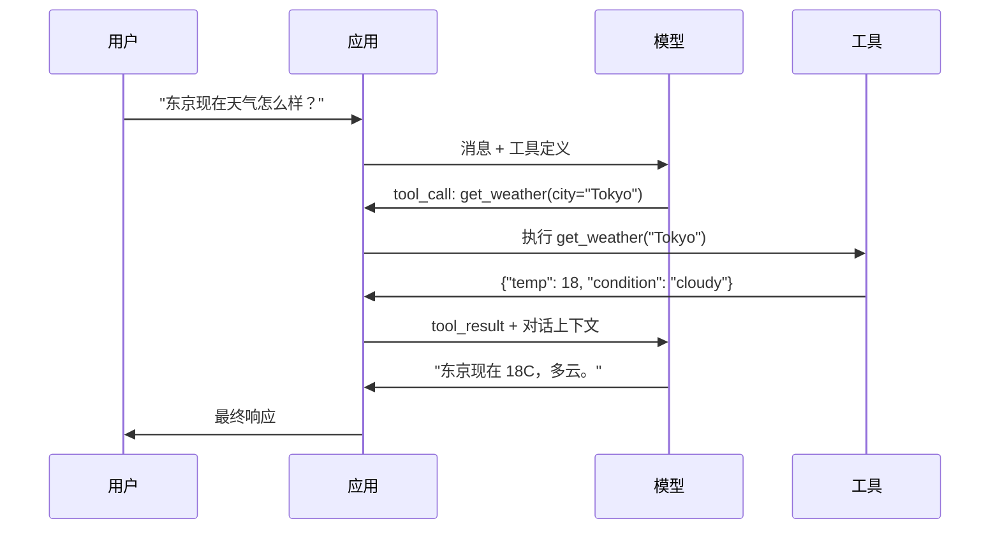

# 函数调用与工具使用

> LLM 本身什么都做不了。它们只会生成文本，这就是它们全部的能力。它们不能查天气、不能查询数据库、不能发邮件、不能运行代码、也不能读取文件。你见过的每一个“AI agent”，本质上都是 LLM 生成一段 JSON 来说明该调用哪个函数——然后由你的代码真正去调用。模型是大脑，工具是双手，而函数调用就是把二者连接起来的神经系统。

**类型：** 构建
**语言：** Python
**前置要求：** 第 11 阶段第 03 课（Structured Outputs）
**时长：** ~75 分钟
**相关内容：** 第 11 阶段 · 14（Model Context Protocol）——当一个工具需要跨宿主共享时，就该从内联 function-calling 升级到 MCP server。本课讲的是内联场景；MCP 讲的是协议场景。

## 学习目标

- 实现一套函数调用循环：定义工具 schema、解析模型输出的 tool-call JSON、执行函数，并返回结果
- 设计带有清晰描述和类型化参数的工具 schema，使模型能稳定地调用它们
- 构建一个多轮 agent 循环，通过串联多个函数调用来回答复杂查询
- 处理函数调用的边缘情况：并行工具调用、错误传播，以及防止无限工具循环

## 问题

你做了一个聊天机器人。用户问：“现在东京的天气怎么样？”

模型回复：“我无法访问实时天气数据，但根据季节判断，东京现在大概是 15 摄氏度左右……”

这只是披着免责声明外衣的幻觉。模型根本不知道天气，也永远不会知道。天气每小时都在变化，而模型的训练数据通常已经过时了几个月。

正确答案需要调用 OpenWeatherMap API，拿到当前温度，再把真实数字返回。模型不能直接调用 API，但你的代码可以。缺失的那一环，就是一种结构化协议：它允许模型说“我需要用这些参数去调用天气 API”，然后由你的代码执行调用并把结果喂回去。

这就是函数调用（function calling）。模型输出结构化 JSON，描述该调用哪个函数、传入什么参数。你的应用负责执行函数，结果再回到对话中，模型基于这些结果生成最终答案。

没有函数调用时，LLM 只是百科全书；有了它，LLM 才变成 agent。

## 核心概念

### 函数调用循环

每一次工具使用交互，都遵循相同的 5 步循环。



第 1 步：用户发送消息。第 2 步：模型收到这条消息，以及工具定义（即描述可用函数的 JSON Schema）。第 3 步：模型不是直接返回文本，而是输出一个工具调用——它是一个结构化 JSON 对象，包含函数名和参数。第 4 步：你的代码执行该函数，并捕获结果。第 5 步：结果回到模型，此时模型拥有真实数据，才能生成最终答案。

模型从不真正执行任何东西。它只负责决定“该调用什么、传什么参数”。真正的执行者是你的代码。

### 工具定义：JSON Schema 契约

每个工具都由一个 JSON Schema 定义，这份 schema 会告诉模型：这个函数做什么、接受哪些参数，以及这些参数必须是什么类型。

```json
{
  "type": "function",
  "function": {
    "name": "get_weather",
    "description": "Get current weather for a city. Returns temperature in Celsius and conditions.",
    "parameters": {
      "type": "object",
      "properties": {
        "city": {
          "type": "string",
          "description": "City name, e.g. 'Tokyo' or 'San Francisco'"
        },
        "units": {
          "type": "string",
          "enum": ["celsius", "fahrenheit"],
          "description": "Temperature units"
        }
      },
      "required": ["city"]
    }
  }
}
```

其中的 `description` 字段非常关键。模型会读这些描述来决定何时以及如何使用工具。像“gets weather”这种模糊描述，会比“Get current weather for a city. Returns temperature in Celsius and conditions.”导致更差的工具选择效果。换句话说，description 本身就是给工具选择用的提示词。

### 提供商对比

所有主流提供商都支持函数调用，但 API 表面形态各不相同。

| 提供商 | API 参数 | 工具调用格式 | 并行调用 | 强制调用 |
|--------|----------|--------------|----------|----------|
| OpenAI（GPT-5, o4） | `tools` | `tool_calls[].function` | 支持（单轮多个） | `tool_choice="required"` |
| Anthropic（Claude 4.6/4.7） | `tools` | `content[].type="tool_use"` | 支持（多个 block） | `tool_choice={"type":"any"}` |
| Google（Gemini 3） | `function_declarations` | `functionCall` | 支持 | `function_calling_config` |
| 开放权重（Llama 4, Qwen3, DeepSeek-V3） | Llama 4 原生支持 `tools`；其他常见 Hermes 或 ChatML | 不统一 | 取决于模型 | 若支持则用提示词或 `tool_choice` |

到 2026 年，三家闭源提供商已经基本收敛到几乎相同、基于 JSON Schema 的格式。Llama 4 也自带了与 OpenAI 形状相近的原生 `tools` 字段。开放权重微调模型仍然各不相同——其中 Hermes 格式（NousResearch）是第三方微调里最常见的一种。若工具需要跨宿主共享，优先选择 MCP（第 11 阶段 · 14），而不是内联 function-calling——因为对所有宿主来说，server 可以保持一致。

### Tool Choice：Auto、Required、Specific

你可以控制模型什么时候必须用工具。

**Auto**（默认）：模型自行决定是调用工具还是直接回复。比如“2+2 等于几？”——直接回答；“天气怎么样？”——调用工具。

**Required**：模型必须至少调用一个工具。当你确信用户意图需要工具时使用它。这样可以防止模型乱猜，而不是去查真实数据。

**Specific function**：强制模型调用某个特定函数。`tool_choice={"type":"function", "function": {"name": "get_weather"}}` 会确保天气工具被调用，不管用户问题具体怎么写。这适合做路由——即上游逻辑已经确定所需工具时。

### 并行函数调用

GPT-4o 和 Claude 都能在单轮里调用多个函数。比如用户问：“东京和纽约现在天气怎么样？”模型会同时输出两个工具调用：

```json
[
  {"name": "get_weather", "arguments": {"city": "Tokyo"}},
  {"name": "get_weather", "arguments": {"city": "New York"}}
]
```

你的代码执行这两个调用（理想情况下并发执行），返回两份结果，模型再综合成一个统一回复。这样能把往返次数从 2 次压到 1 次。对于每个查询要触发 5-10 次工具调用的 agent 来说，并行调用能降低 60-80% 的延迟。

### 结构化输出 vs 函数调用

第 03 课讲过结构化输出。函数调用与它使用的是同一套 JSON Schema 机制，但用途不同。

**结构化输出（structured outputs）**：强制模型产出某种固定形状的数据。这个输出本身就是最终产物。例子：把文本里的商品信息抽取成 `{name, price, in_stock}`。

**函数调用（function calling）**：模型声明自己想执行某个动作。这个输出只是中间步骤。例子：`get_weather(city="Tokyo")`——模型是在请求执行动作，而不是直接给最终答案。

当你想做数据抽取时，用结构化输出；当你希望模型与外部系统交互时，用函数调用。

### 安全：不可谈判的规则

函数调用是你能赋予 LLM 的最危险能力。模型会决定要执行什么。如果你的工具集里包含数据库查询，那么查询语句是模型构造的；如果包含 shell 命令，那么命令也是模型写的。

**规则 1：绝不要把模型生成的 SQL 直接传给数据库。** 模型可能会生成 DROP TABLE、UNION 注入，或者返回所有数据行的查询。始终做参数化，始终做校验，始终使用 allowlist 限制操作范围。

**规则 2：函数必须走 allowlist。** 模型只能调用你显式定义的函数。绝不要构建一个“按名字执行任意函数”的通用工具。如果你内部有 50 个函数，只暴露用户真正需要的 5 个。

**规则 3：验证参数。** 模型可能传入类似 `"; DROP TABLE users; --"` 的城市名。执行前，必须根据预期类型、范围和格式验证每个参数。

**规则 4：清洗工具结果。** 如果工具返回了敏感数据（API keys、PII、内部错误），在送回模型前必须先过滤。否则模型很可能会原样把这些结果写进回复里。

**规则 5：限制工具调用频率。** 处在循环里的模型可能会连续调用工具几百次。你必须设置上限（每段对话 10-20 次通常比较合理），以切断无限循环。

### 错误处理

工具会失败。API 会超时。数据库会挂。文件可能不存在。模型必须知道工具何时失败，以及为什么失败。

错误应作为结构化工具结果返回，而不是直接抛异常：

```json
{
  "error": true,
  "message": "City 'Toky' not found. Did you mean 'Tokyo'?",
  "code": "CITY_NOT_FOUND"
}
```

模型读到这样的结果后，就能调整参数并重试。模型很擅长根据结构化错误信息自我修正，但不擅长从空响应或泛泛的“出错了”里恢复。

### MCP：模型上下文协议（Model Context Protocol）

MCP 是 Anthropic 提出的开放标准，用来实现工具互操作。过去是每个应用自己定义工具；而 MCP 提供了一种通用协议：工具由 MCP server 提供，由 MCP client（如 Claude Code、Cursor 或你的应用）消费。

一个 MCP server 可以把工具暴露给任何兼容 client。一个 Postgres MCP server 能让任何兼容 MCP 的 agent 获得数据库访问能力；一个 GitHub MCP server 能让任何 agent 获得仓库访问能力。工具定义一次，到处可用。

MCP 之于函数调用，就像 HTTP 之于网络。它标准化了传输层，让工具真正具备可移植性。

## 动手构建

### 第 1 步：定义工具注册表

构建一个注册表，用来保存工具定义及其实现。每个工具都包含一份 JSON Schema 定义（给模型看）和一个 Python 函数（由你的代码执行）。

```python
import json
import math
import time
import hashlib


TOOL_REGISTRY = {}


def register_tool(name, description, parameters, function):
    TOOL_REGISTRY[name] = {
        "definition": {
            "type": "function",
            "function": {
                "name": name,
                "description": description,
                "parameters": parameters,
            },
        },
        "function": function,
    }
```

### 第 2 步：实现 5 个工具

实现一个计算器、天气查询、网页搜索模拟器、文件读取器，以及代码运行器。

```python
def calculator(expression, precision=2):
    allowed = set("0123456789+-*/.() ")
    if not all(c in allowed for c in expression):
        return {"error": True, "message": f"Invalid characters in expression: {expression}"}
    try:
        result = eval(expression, {"__builtins__": {}}, {"math": math})
        return {"result": round(float(result), precision), "expression": expression}
    except Exception as e:
        return {"error": True, "message": str(e)}


WEATHER_DB = {
    "tokyo": {"temp_c": 18, "condition": "cloudy", "humidity": 72, "wind_kph": 14},
    "new york": {"temp_c": 22, "condition": "sunny", "humidity": 45, "wind_kph": 8},
    "london": {"temp_c": 12, "condition": "rainy", "humidity": 88, "wind_kph": 22},
    "san francisco": {"temp_c": 16, "condition": "foggy", "humidity": 80, "wind_kph": 18},
    "sydney": {"temp_c": 25, "condition": "sunny", "humidity": 55, "wind_kph": 10},
}


def get_weather(city, units="celsius"):
    key = city.lower().strip()
    if key not in WEATHER_DB:
        suggestions = [c for c in WEATHER_DB if c.startswith(key[:3])]
        return {
            "error": True,
            "message": f"City '{city}' not found.",
            "suggestions": suggestions,
            "code": "CITY_NOT_FOUND",
        }
    data = WEATHER_DB[key].copy()
    if units == "fahrenheit":
        data["temp_f"] = round(data["temp_c"] * 9 / 5 + 32, 1)
        del data["temp_c"]
    data["city"] = city
    return data


SEARCH_DB = {
    "python function calling": [
        {"title": "OpenAI Function Calling Guide", "url": "https://platform.openai.com/docs/guides/function-calling", "snippet": "Learn how to connect LLMs to external tools."},
        {"title": "Anthropic Tool Use", "url": "https://docs.anthropic.com/en/docs/tool-use", "snippet": "Claude can interact with external tools and APIs."},
    ],
    "MCP protocol": [
        {"title": "Model Context Protocol", "url": "https://modelcontextprotocol.io", "snippet": "An open standard for connecting AI models to data sources."},
    ],
    "weather API": [
        {"title": "OpenWeatherMap API", "url": "https://openweathermap.org/api", "snippet": "Free weather API with current, forecast, and historical data."},
    ],
}


def web_search(query, max_results=3):
    key = query.lower().strip()
    for db_key, results in SEARCH_DB.items():
        if db_key in key or key in db_key:
            return {"query": query, "results": results[:max_results], "total": len(results)}
    return {"query": query, "results": [], "total": 0}


FILE_SYSTEM = {
    "data/config.json": '{"model": "gpt-4o", "temperature": 0.7, "max_tokens": 4096}',
    "data/users.csv": "name,email,role\nAlice,alice@example.com,admin\nBob,bob@example.com,user",
    "README.md": "# My Project\nA tool-use agent built from scratch.",
}


def read_file(path):
    if ".." in path or path.startswith("/"):
        return {"error": True, "message": "Path traversal not allowed.", "code": "FORBIDDEN"}
    if path not in FILE_SYSTEM:
        available = list(FILE_SYSTEM.keys())
        return {"error": True, "message": f"File '{path}' not found.", "available_files": available, "code": "NOT_FOUND"}
    content = FILE_SYSTEM[path]
    return {"path": path, "content": content, "size_bytes": len(content), "lines": content.count("\n") + 1}


def run_code(code, language="python"):
    if language != "python":
        return {"error": True, "message": f"Language '{language}' not supported. Only 'python' is available."}
    forbidden = ["import os", "import sys", "import subprocess", "exec(", "eval(", "__import__", "open("]
    for pattern in forbidden:
        if pattern in code:
            return {"error": True, "message": f"Forbidden operation: {pattern}", "code": "SECURITY_VIOLATION"}
    try:
        local_vars = {}
        exec(code, {"__builtins__": {"print": print, "range": range, "len": len, "str": str, "int": int, "float": float, "list": list, "dict": dict, "sum": sum, "min": min, "max": max, "abs": abs, "round": round, "sorted": sorted, "enumerate": enumerate, "zip": zip, "map": map, "filter": filter, "math": math}}, local_vars)
        result = local_vars.get("result", None)
        return {"success": True, "result": result, "variables": {k: str(v) for k, v in local_vars.items() if not k.startswith("_")}}
    except Exception as e:
        return {"error": True, "message": f"{type(e).__name__}: {e}"}
```

### 第 3 步：注册所有工具

```python
def register_all_tools():
    register_tool(
        "calculator", "Evaluate a mathematical expression. Supports +, -, *, /, parentheses, and decimals. Returns the numeric result.",
        {"type": "object", "properties": {"expression": {"type": "string", "description": "Math expression, e.g. '(10 + 5) * 3'"}, "precision": {"type": "integer", "description": "Decimal places in result", "default": 2}}, "required": ["expression"]},
        calculator,
    )
    register_tool(
        "get_weather", "Get current weather for a city. Returns temperature, condition, humidity, and wind speed.",
        {"type": "object", "properties": {"city": {"type": "string", "description": "City name, e.g. 'Tokyo' or 'San Francisco'"}, "units": {"type": "string", "enum": ["celsius", "fahrenheit"], "description": "Temperature units, defaults to celsius"}}, "required": ["city"]},
        get_weather,
    )
    register_tool(
        "web_search", "Search the web for information. Returns a list of results with title, URL, and snippet.",
        {"type": "object", "properties": {"query": {"type": "string", "description": "Search query"}, "max_results": {"type": "integer", "description": "Maximum results to return", "default": 3}}, "required": ["query"]},
        web_search,
    )
    register_tool(
        "read_file", "Read the contents of a file. Returns the file content, size, and line count.",
        {"type": "object", "properties": {"path": {"type": "string", "description": "Relative file path, e.g. 'data/config.json'"}}, "required": ["path"]},
        read_file,
    )
    register_tool(
        "run_code", "Execute Python code in a sandboxed environment. Set a 'result' variable to return output.",
        {"type": "object", "properties": {"code": {"type": "string", "description": "Python code to execute"}, "language": {"type": "string", "enum": ["python"], "description": "Programming language"}}, "required": ["code"]},
        run_code,
    )
```

### 第 4 步：构建函数调用循环

这是核心引擎。它模拟模型决定该调用哪个工具，执行工具，并把结果反馈回去。

```python
def simulate_model_decision(user_message, tools, conversation_history):
    msg = user_message.lower()

    if any(word in msg for word in ["weather", "temperature", "forecast"]):
        cities = []
        for city in WEATHER_DB:
            if city in msg:
                cities.append(city)
        if not cities:
            for word in msg.split():
                if word.capitalize() in [c.title() for c in WEATHER_DB]:
                    cities.append(word)
        if not cities:
            cities = ["tokyo"]
        calls = []
        for city in cities:
            calls.append({"name": "get_weather", "arguments": {"city": city.title()}})
        return calls

    if any(word in msg for word in ["calculate", "compute", "math", "what is", "how much"]):
        for token in msg.split():
            if any(c in token for c in "+-*/"):
                return [{"name": "calculator", "arguments": {"expression": token}}]
        if "+" in msg or "-" in msg or "*" in msg or "/" in msg:
            expr = "".join(c for c in msg if c in "0123456789+-*/.() ")
            if expr.strip():
                return [{"name": "calculator", "arguments": {"expression": expr.strip()}}]
        return [{"name": "calculator", "arguments": {"expression": "0"}}]

    if any(word in msg for word in ["search", "find", "look up", "google"]):
        query = msg.replace("search for", "").replace("look up", "").replace("find", "").strip()
        return [{"name": "web_search", "arguments": {"query": query}}]

    if any(word in msg for word in ["read", "file", "open", "cat", "show"]):
        for path in FILE_SYSTEM:
            if path.split("/")[-1].split(".")[0] in msg:
                return [{"name": "read_file", "arguments": {"path": path}}]
        return [{"name": "read_file", "arguments": {"path": "README.md"}}]

    if any(word in msg for word in ["run", "execute", "code", "python"]):
        return [{"name": "run_code", "arguments": {"code": "result = 'Hello from the sandbox!'", "language": "python"}}]

    return []


def execute_tool_call(tool_call):
    name = tool_call["name"]
    args = tool_call["arguments"]

    if name not in TOOL_REGISTRY:
        return {"error": True, "message": f"Unknown tool: {name}", "code": "UNKNOWN_TOOL"}

    tool = TOOL_REGISTRY[name]
    func = tool["function"]
    start = time.time()

    try:
        result = func(**args)
    except TypeError as e:
        result = {"error": True, "message": f"Invalid arguments: {e}"}

    elapsed_ms = round((time.time() - start) * 1000, 2)
    return {"tool": name, "result": result, "execution_time_ms": elapsed_ms}


def run_function_calling_loop(user_message, max_iterations=5):
    conversation = [{"role": "user", "content": user_message}]
    tool_definitions = [t["definition"] for t in TOOL_REGISTRY.values()]
    all_tool_results = []

    for iteration in range(max_iterations):
        tool_calls = simulate_model_decision(user_message, tool_definitions, conversation)

        if not tool_calls:
            break

        results = []
        for call in tool_calls:
            result = execute_tool_call(call)
            results.append(result)

        conversation.append({"role": "assistant", "content": None, "tool_calls": tool_calls})

        for result in results:
            conversation.append({"role": "tool", "content": json.dumps(result["result"]), "tool_name": result["tool"]})

        all_tool_results.extend(results)
        break

    return {"conversation": conversation, "tool_results": all_tool_results, "iterations": iteration + 1 if tool_calls else 0}
```

### 第 5 步：参数校验

在真正执行之前，构建一个校验器，依据 JSON Schema 检查工具调用参数是否有效。

```python
def validate_tool_arguments(tool_name, arguments):
    if tool_name not in TOOL_REGISTRY:
        return [f"Unknown tool: {tool_name}"]

    schema = TOOL_REGISTRY[tool_name]["definition"]["function"]["parameters"]
    errors = []

    if not isinstance(arguments, dict):
        return [f"Arguments must be an object, got {type(arguments).__name__}"]

    for required_field in schema.get("required", []):
        if required_field not in arguments:
            errors.append(f"Missing required argument: {required_field}")

    properties = schema.get("properties", {})
    for arg_name, arg_value in arguments.items():
        if arg_name not in properties:
            errors.append(f"Unknown argument: {arg_name}")
            continue

        prop_schema = properties[arg_name]
        expected_type = prop_schema.get("type")

        type_checks = {"string": str, "integer": int, "number": (int, float), "boolean": bool, "array": list, "object": dict}
        if expected_type in type_checks:
            if not isinstance(arg_value, type_checks[expected_type]):
                errors.append(f"Argument '{arg_name}': expected {expected_type}, got {type(arg_value).__name__}")

        if "enum" in prop_schema and arg_value not in prop_schema["enum"]:
            errors.append(f"Argument '{arg_name}': '{arg_value}' not in {prop_schema['enum']}")

    return errors
```

### 第 6 步：运行演示

```python
def run_demo():
    register_all_tools()

    print("=" * 60)
    print("  Function Calling & Tool Use Demo")
    print("=" * 60)

    print("\n--- Registered Tools ---")
    for name, tool in TOOL_REGISTRY.items():
        desc = tool["definition"]["function"]["description"][:60]
        params = list(tool["definition"]["function"]["parameters"].get("properties", {}).keys())
        print(f"  {name}: {desc}...")
        print(f"    params: {params}")

    print(f"\n--- Argument Validation ---")
    validation_tests = [
        ("get_weather", {"city": "Tokyo"}, "Valid call"),
        ("get_weather", {}, "Missing required arg"),
        ("get_weather", {"city": "Tokyo", "units": "kelvin"}, "Invalid enum value"),
        ("calculator", {"expression": 123}, "Wrong type (int for string)"),
        ("unknown_tool", {"x": 1}, "Unknown tool"),
    ]
    for tool_name, args, label in validation_tests:
        errors = validate_tool_arguments(tool_name, args)
        status = "VALID" if not errors else f"ERRORS: {errors}"
        print(f"  {label}: {status}")

    print(f"\n--- Tool Execution ---")
    direct_tests = [
        {"name": "calculator", "arguments": {"expression": "(10 + 5) * 3 / 2"}},
        {"name": "get_weather", "arguments": {"city": "Tokyo"}},
        {"name": "get_weather", "arguments": {"city": "Mars"}},
        {"name": "web_search", "arguments": {"query": "python function calling"}},
        {"name": "read_file", "arguments": {"path": "data/config.json"}},
        {"name": "read_file", "arguments": {"path": "../etc/passwd"}},
        {"name": "run_code", "arguments": {"code": "result = sum(range(1, 101))"}},
        {"name": "run_code", "arguments": {"code": "import os; os.system('rm -rf /')"}},
    ]
    for call in direct_tests:
        result = execute_tool_call(call)
        print(f"\n  {call['name']}({json.dumps(call['arguments'])})")
        print(f"    -> {json.dumps(result['result'], indent=None)[:100]}")
        print(f"    time: {result['execution_time_ms']}ms")

    print(f"\n--- Full Function Calling Loop ---")
    test_queries = [
        "What's the weather in Tokyo?",
        "Calculate (100 + 250) * 0.15",
        "Search for MCP protocol",
        "Read the config file",
        "Run some Python code",
        "Tell me a joke",
    ]
    for query in test_queries:
        print(f"\n  User: {query}")
        result = run_function_calling_loop(query)
        if result["tool_results"]:
            for tr in result["tool_results"]:
                print(f"    Tool: {tr['tool']} ({tr['execution_time_ms']}ms)")
                print(f"    Result: {json.dumps(tr['result'], indent=None)[:90]}")
        else:
            print(f"    [No tool called -- direct response]")
        print(f"    Iterations: {result['iterations']}")

    print(f"\n--- Parallel Tool Calls ---")
    multi_city_query = "What's the weather in tokyo and london?"
    print(f"  User: {multi_city_query}")
    result = run_function_calling_loop(multi_city_query)
    print(f"  Tool calls made: {len(result['tool_results'])}")
    for tr in result["tool_results"]:
        city = tr["result"].get("city", "unknown")
        temp = tr["result"].get("temp_c", "N/A")
        print(f"    {city}: {temp}C, {tr['result'].get('condition', 'N/A')}")

    print(f"\n--- Security Checks ---")
    security_tests = [
        ("read_file", {"path": "../../etc/passwd"}),
        ("run_code", {"code": "import subprocess; subprocess.run(['ls'])"}),
        ("calculator", {"expression": "__import__('os').system('ls')"}),
    ]
    for tool_name, args in security_tests:
        result = execute_tool_call({"name": tool_name, "arguments": args})
        blocked = result["result"].get("error", False)
        print(f"  {tool_name}({list(args.values())[0][:40]}): {'BLOCKED' if blocked else 'ALLOWED'}")
```

## 实际使用

### OpenAI Function Calling

```python
# from openai import OpenAI
#
# client = OpenAI()
#
# tools = [{
#     "type": "function",
#     "function": {
#         "name": "get_weather",
#         "description": "Get current weather for a city",
#         "parameters": {
#             "type": "object",
#             "properties": {
#                 "city": {"type": "string"},
#                 "units": {"type": "string", "enum": ["celsius", "fahrenheit"]}
#             },
#             "required": ["city"]
#         }
#     }
# }]
#
# response = client.chat.completions.create(
#     model="gpt-4o",
#     messages=[{"role": "user", "content": "Weather in Tokyo?"}],
#     tools=tools,
#     tool_choice="auto",
# )
#
# tool_call = response.choices[0].message.tool_calls[0]
# args = json.loads(tool_call.function.arguments)
# result = get_weather(**args)
#
# final = client.chat.completions.create(
#     model="gpt-4o",
#     messages=[
#         {"role": "user", "content": "Weather in Tokyo?"},
#         response.choices[0].message,
#         {"role": "tool", "tool_call_id": tool_call.id, "content": json.dumps(result)},
#     ],
# )
# print(final.choices[0].message.content)
```

OpenAI 会把工具调用放在 `response.choices[0].message.tool_calls` 里返回。每个调用都带有一个 `id`，你在返回工具结果时必须带上它。模型会用这个 ID 将结果与调用对应起来。GPT-4o 可以在单次响应中返回多个工具调用——你需要遍历并执行全部调用。

### Anthropic Tool Use

```python
# import anthropic
#
# client = anthropic.Anthropic()
#
# response = client.messages.create(
#     model="claude-sonnet-4-20250514",
#     max_tokens=1024,
#     tools=[{
#         "name": "get_weather",
#         "description": "Get current weather for a city",
#         "input_schema": {
#             "type": "object",
#             "properties": {
#                 "city": {"type": "string"},
#                 "units": {"type": "string", "enum": ["celsius", "fahrenheit"]}
#             },
#             "required": ["city"]
#         }
#     }],
#     messages=[{"role": "user", "content": "Weather in Tokyo?"}],
# )
#
# tool_block = next(b for b in response.content if b.type == "tool_use")
# result = get_weather(**tool_block.input)
#
# final = client.messages.create(
#     model="claude-sonnet-4-20250514",
#     max_tokens=1024,
#     tools=[...],
#     messages=[
#         {"role": "user", "content": "Weather in Tokyo?"},
#         {"role": "assistant", "content": response.content},
#         {"role": "user", "content": [{"type": "tool_result", "tool_use_id": tool_block.id, "content": json.dumps(result)}]},
#     ],
# )
```

Anthropic 会把工具调用作为 `type: "tool_use"` 的 content block 返回。工具结果则需要放进一条用户消息里，并使用 `type: "tool_result"`。关键差异在于：Anthropic 用 `input_schema` 定义工具参数，而 OpenAI 用的是 `parameters`。

### MCP 集成

```python
# MCP servers expose tools over a standardized protocol.
# Any MCP-compatible client can discover and call these tools.
#
# Example: connecting to a Postgres MCP server
#
# from mcp import ClientSession, StdioServerParameters
# from mcp.client.stdio import stdio_client
#
# server_params = StdioServerParameters(
#     command="npx",
#     args=["-y", "@modelcontextprotocol/server-postgres", "postgresql://localhost/mydb"],
# )
#
# async with stdio_client(server_params) as (read, write):
#     async with ClientSession(read, write) as session:
#         await session.initialize()
#         tools = await session.list_tools()
#         result = await session.call_tool("query", {"sql": "SELECT count(*) FROM users"})
```

MCP 将工具实现与工具消费解耦。Postgres server 懂 SQL，GitHub server 懂 API，而你的 agent 只需要发现并调用工具——不需要为每个集成都写一套提供商特定代码。

## 交付

本课会产出 `outputs/prompt-tool-designer.md`——一个可复用的提示词模板，用来设计工具定义。你只要给出工具想做什么，它就能生成完整的 JSON Schema 定义，包括描述、类型和约束。

它还会产出 `outputs/skill-function-calling-patterns.md`——一个在生产中实现函数调用的决策框架，覆盖工具设计、错误处理、安全性以及提供商差异化模式。

## 练习

1. **增加第 6 个工具：数据库查询。** 实现一个模拟 SQL 工具，底层使用内存表。该工具接受表名和过滤条件（不是原始 SQL）。校验表名是否位于 allowlist 中，并将过滤运算符限制为 `=`、`>`、`&lt;`、`>=`、`&lt;=`。以 JSON 返回匹配行。

2. **实现带错误反馈的重试。** 当工具调用失败（例如城市不存在）时，把错误消息反馈给模型决策函数，让它修正参数后重试。统计每次调用用了多少次重试。每个工具调用最多重试 3 次。

3. **构建一个多步 agent。** 有些查询需要串联多个工具调用：“读取配置文件，告诉我配置了什么模型，然后去网上搜索这个模型的定价。” 实现一个循环：直到模型判断不再需要更多工具为止，每一步都把累计结果传入下一次决策。限制最多 10 次迭代，以防止无限循环。

4. **测量工具选择准确率。** 设计 30 条测试查询，并写出预期工具名。在这 30 条查询上运行你的决策函数，统计它选择正确工具的比例。找出最容易让不同工具混淆的查询类型。

5. **实现工具调用缓存。** 如果同一工具在 60 秒内以完全相同的参数再次被调用，则直接返回缓存结果，而不是重新执行。使用以 `(tool_name, frozenset(args.items()))` 为键的字典。统计一段 20 条查询的对话中的缓存命中率。

## 关键术语

| 术语 | 人们常说什么 | 实际含义 |
|------|-------------|----------|
| 函数调用 | “工具使用” | 模型输出结构化 JSON，描述要调用哪个函数以及具体参数——执行者是你的代码，不是模型 |
| 工具定义 | “函数 schema” | 一个 JSON Schema 对象，描述工具的名称、用途、参数和类型——模型据此判断何时以及如何使用工具 |
| Tool choice | “调用模式” | 控制模型是必须调用工具（required）、可以调用工具（auto），还是必须调用某个指定工具（named） |
| 并行调用 | “多工具” | 模型在单轮里输出多个工具调用，从而减少往返次数——GPT-4o 和 Claude 都支持 |
| 工具结果 | “函数输出” | 执行工具后得到的返回值，再以消息形式发回模型，让它能基于真实数据继续回答 |
| 参数校验 | “输入检查” | 在执行工具前，验证模型生成的参数是否符合预期类型、范围和约束 |
| MCP | “工具协议” | Model Context Protocol——Anthropic 提出的开放标准，通过 server 暴露工具，任何兼容 client 都能发现并调用 |
| Agent 循环 | “ReAct 循环” | 模型决定工具 → 代码执行工具 → 结果反馈回模型的迭代循环，直到模型拥有足够信息完成响应 |
| 工具投毒 | “通过工具做 prompt injection” | 一种攻击方式：工具结果中包含会操纵模型行为的指令——因此所有工具输出都必须清洗 |
| 限流 | “调用预算” | 为每段对话设置最大工具调用次数，以防止无限循环和 API 成本失控 |

## 延伸阅读

- [OpenAI Function Calling Guide](https://platform.openai.com/docs/guides/function-calling) —— GPT-4o 工具使用的权威参考，包括并行调用、强制调用和结构化参数
- [Anthropic Tool Use Guide](https://docs.anthropic.com/en/docs/tool-use) —— Claude 的工具使用实现，涵盖 `input_schema`、多工具响应和 `tool_choice` 配置
- [Model Context Protocol Specification](https://modelcontextprotocol.io) —— AI 应用间实现工具互操作的开放标准，包含 server/client 架构
- [Schick et al., 2023 -- "Toolformer: Language Models Can Teach Themselves to Use Tools"](https://arxiv.org/abs/2302.04761) —— 关于训练 LLM 自主决定何时、如何调用外部工具的奠基论文
- [Patil et al., 2023 -- "Gorilla: Large Language Model Connected with Massive APIs"](https://arxiv.org/abs/2305.15334) —— 通过对 1,645 个 API 的准确调用微调 LLM，并减少幻觉
- [Berkeley Function Calling Leaderboard](https://gorilla.cs.berkeley.edu/leaderboard.html) —— 实时比较 GPT-4o、Claude、Gemini 与开放模型函数调用准确率的榜单
- [Yao et al., "ReAct: Synergizing Reasoning and Acting in Language Models" (ICLR 2023)](https://arxiv.org/abs/2210.03629) —— 思考-行动-观察循环，它是每一次工具调用外层的 agent 循环；本课在这里结束，第 14 阶段将继续展开。
- [Anthropic — Building effective agents (Dec 2024)](https://www.anthropic.com/research/building-effective-agents) —— 五种可组合模式（prompt chaining、routing、parallelization、orchestrator-workers、evaluator-optimizer），它们都建立在单一的 tool-use 原语之上。
