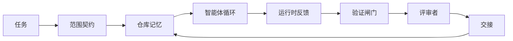

# 智能体工作台工程：为什么能力强的模型仍会失败

> 仅有一个能力强的模型还不够。可靠的智能体需要一个工作台：指令、状态、范围、反馈、验证、评审与交接。把这些都剥掉，即便是前沿模型也会产出无法安全上线的工作结果。

**类型：** 学习 + 构建
**语言：** Python（标准库）
**前置条件：** 第 14 阶段 · 01（智能体循环），第 14 阶段 · 26（失效模式）
**时长：** ~45 分钟

## 学习目标

- 将模型能力与执行可靠性区分开来。
- 说出决定智能体能否上线的七个工作面。
- 在一个小型仓库任务上，对比仅靠提示词的运行与由工作台引导的运行。
- 产出一份失效模式报告，把每个缺失的工作面映射到它造成的症状。

## 问题

你把一个前沿模型丢进真实仓库里，让它添加输入校验。它打开四个文件，写出看起来像样的代码，宣告成功，然后停下。你运行测试。两个失败。第三个被改动的文件跟校验根本无关。没有任何记录说明这个智能体做了哪些假设、先尝试了什么、还有什么没做完。

模型并不是不懂 Python。它是不懂“工作”本身。它不知道什么才算完成，不知道允许写到哪里，不知道哪些测试才是权威，也不知道下一次会话该如何接着做。

这不是模型缺陷，而是工作台缺陷。智能体周围的承载面缺了关键部件，没能把一次性生成变成可靠、可恢复的工程过程。

## 概念

工作台是在任务执行期间包裹模型的操作环境。它有七个工作面：

| 工作面 | 它承载什么 | 缺失时的失败表现 |
|--------|------------|------------------|
| 指令 | 启动规则、禁止动作、完成定义 | 智能体靠猜测理解“可交付”是什么意思 |
| 状态 | 当前任务、已触达文件、阻塞项、下一步动作 | 每次会话都从零开始 |
| 范围 | 允许文件、禁止文件、验收标准 | 修改渗漏到无关代码 |
| 反馈 | 被捕获并写回循环的真实命令输出 | 遇到 400 还宣称成功 |
| 验证 | 测试、lint 检查、冒烟运行、范围检查 | “看起来不错”一路进 main 分支 |
| 评审 | 由不同角色执行的第二遍检查 | 构建者自己给自己批作业 |
| 交接 | 改了什么、为什么改、还剩什么 | 下一次会话又把一切重新发现一遍 |

工作台独立于模型。你可以替换模型而保留这些工作面；却不能替换这些工作面还指望可靠性不变。



循环闭合在状态文件上，而不是闭合在聊天历史上。聊天是易失的，仓库才是记录系统。

### 工作台与提示词工程

提示词只告诉模型这一次你想要什么。工作台告诉模型怎样跨多个轮次、跨多个会话完成工作。大多数智能体失败故事，本质上都是披着提示词工程外衣的工作台失败。

### 工作台与框架

框架会给你一个运行时（LangGraph、AutoGen、Agents SDK）。工作台则是在这个运行时里面为智能体提供一个工作空间。你两者都需要。本迷你轨讲的是第二个。

### 从基础原语出发，而不是从厂商分类法出发推理

现在关于“运行支架工程”的文章很多。Addy Osmani、OpenAI、Anthropic、LangChain、Martin Fowler、MongoDB、HumanLayer、Augment Code、Thoughtworks、walkinglabs 的精选列表，以及一波又一波的 Medium 和 Hacker News 文章都在谈这个。它们对运行支架的边界、范围，以及该用什么词汇，并不一致。我们没必要站队。七个工作面只是一个体验层；在每个工作台下面，支撑其可靠性的，都是同一组分布式系统基础原语，它们支撑任何可靠后端。

先把“智能体”这个标签拿掉。一次智能体运行，本质上是跨越时间、进程和机器的计算。要让它可靠，你需要的仍然是任何生产系统都需要的那些原语。

| 原语 | 它是什么 | 对智能体来说它承载什么 |
|------|----------|------------------------|
| 函数 | 类型化的处理器。尽可能保持纯函数。拥有自己的输入与输出。 | 一次工具调用、一次规则检查、一次验证步骤、一次模型调用 |
| 工作进程 | 持久运行的进程，拥有一个或多个函数及其生命周期 | 构建者、评审者、验证者、一个 MCP 服务器 |
| 触发器 | 调用函数的事件源 | 智能体循环的一个时钟步、HTTP 请求、队列消息、定时任务、文件变化、钩子 |
| 运行时 | 决定什么在何处运行，以及超时和资源配置的边界 | Claude Code 的进程、LangGraph 的运行时、一个工作进程容器 |
| HTTP / RPC | 调用方与工作进程之间的通信线缆 | 工具调用协议、MCP 请求、模型 API |
| 队列 | 触发器与工作进程之间的持久缓冲；承载背压、重试、幂等性 | 任务看板、反馈日志、评审收件箱 |
| 会话持久化 | 能跨崩溃、重启、模型替换继续存在的状态 | `agent_state.json`、检查点、键值存储、仓库本身 |
| 授权策略 | 谁能在什么范围内调用哪个函数 | 允许 / 禁止的文件、审批边界、MCP 能力列表 |

现在把七个工作面映射到这些原语上。

- **指令** —— 策略与函数元数据。规则本身就是检查函数。路由器（`AGENTS.md`）是绑定在运行时启动阶段上的策略。
- **状态** —— 会话持久化。运行时在每一步都会读取的一个键控存储。可以是文件、KV 或 DB；重要的是持久化语义，不是存储后端。
- **范围** —— 每个任务的授权策略。允许 / 禁止的 glob 是 ACL。需要审批就是权限格。
- **反馈** —— 写入队列的调用日志。每一次 shell 调用都是一条记录，持久、可重放。
- **验证** —— 一个函数。对输入是确定性的。在任务关闭时被触发。失败就关闭。
- **评审** —— 一个单独的工作进程，对构建者产物只有只读权限，对评审报告只有只写权限。
- **交接** —— 会话结束触发器发出的持久记录。下一次会话的启动触发器会读取它。

智能体循环本身就是一个工作进程：它消费事件（用户消息、工具结果、计时器时钟步），调用函数（模型，以及模型选择的工具），写入记录（状态、反馈），并发出触发器（验证、评审、交接）。这里没有神秘之处；它和一个作业处理器的形状完全一样。

### 业界流行模式，翻译回原语之后是什么

所有流行的运行支架模式，最终都能还原成这八个原语。下面是翻译表。

| 厂商或社区模式 | 它实际是什么 |
|----------------|--------------|
| Ralph Loop（Claude Code、Codex、agentic_harness 书中都有）—— 当智能体过早尝试停止时，把原始意图重新注入一个全新的上下文窗口 | 一个触发器：把任务重新入队，并使用干净的上下文；会话持久化把目标带到下一轮 |
| 计划 / 执行 / 验证（PEV） | 三个工作进程，每个角色一个，通过状态和阶段间队列通信 |
| 运行支架-计算分离（OpenAI Agents SDK，2026 年 4 月）—— 将控制平面与执行平面分开 | 只是对控制平面 / 数据平面的重新表述。这个概念比“智能体”这个标签早几十年 |
| Open Agent Passport（OAP，2026 年 3 月）—— 在执行前，按声明式策略对每次工具调用进行签名和审计 | 由动作前工作进程执行的授权策略，加上一条已签名的审计队列 |
| 前馈规则与反馈传感（Guides and Sensors，Birgitta Böckeler / Thoughtworks） | 授权策略 + 验证函数 + 可观测性追踪 |
| 渐进压缩（Progressive compaction），五阶段（5-stage）（Claude Code 逆向工程，2026 年 4 月） | 一个状态管理工作进程，像定时任务一样定期处理会话持久化，把它维持在预算内 |
| 钩子 / 中间件（LangChain、Claude Code）—— 拦截模型和工具调用 | 包裹在运行时调用路径周围的触发器 + 函数 |
| Skills as Markdown with progressive disclosure（Anthropic、Flue） | 一个函数注册表，其中函数元数据会按需即时加载进上下文 |
| Sandbox agents（Codex、Sandcastle、Vercel Sandbox） | 计算平面：具备隔离文件系统、网络与生命周期的运行时 |
| MCP 服务器 | 通过稳定 RPC 暴露函数的工作进程，能力列表充当授权边界 |

表里的每一项，都是智能体社区重新发现了一个分布式系统中早就有名字的原语，只是给它换了个新名字。做营销，这些标签很有用；做工程，它们并不是有用的词汇。

### 这些“证据”真正说明了什么

“运行支架比模型更重要”这个说法，现在已经有了数据支撑。值得知道，因为这也是反驳“等模型更聪明就好了”的唯一诚实理由。

- Terminal Bench 2.0 —— 同一个模型，只改运行支架，就让一个编程智能体从前 30 名之外冲到第 5 名（LangChain，*Anatomy of an Agent Harness*）。
- Vercel —— 删除其智能体 80% 的工具后，成功率从 80% 跳到 100%（MongoDB）。
- Harvey —— 仅通过优化运行支架，就让法律智能体的准确率提升了两倍以上（MongoDB）。
- 88% 的企业 AI 智能体项目没能进入生产环境。失败集中在运行时，而不是推理（preprints.org，*Harness Engineering for Language Agents*，2026 年 3 月）。
- 一项 2025 年针对三个流行开源框架的基准研究报告称，任务完成率约为 ~50%；长上下文 WebAgent 在长上下文条件下会从 40-50% 崩到 10% 以下，主因是无限循环和目标丢失（这一点在 2026 年初的多篇文章里都有讨论）。

结论并不是“运行支架会永远赢”。模型会随着时间吸收运行支架的技巧。结论是：在今天，真正承重的工程工作在模型周围，而不在模型内部；承受这部分负载的原语，正是所有生产系统一直都需要的那些东西。

### 厂商文章哪里说得还不够

这一段你不必客气。

- LangChain 的 *Anatomy of an Agent Harness* 列出了 11 个组件——提示词、工具、钩子、沙箱、编排、记忆、技能、子智能体，以及一个运行时“傻循环”。但它没有点名队列、作为部署单元的工作进程、触发语义、作为独立关注点的会话持久化，或授权策略。
- Addy Osmani 的 *Agent Harness Engineering* 给出了 `Agent = Model + Harness` 的框架化表达和棘轮模式，但没有进一步说清运行支架是由什么构成的。它更像一种立场，而不是一份规范。
- Anthropic 和 OpenAI 对表层工作面讲得最深，但仍停留在它们自己的运行时里。2026 年 4 月 Agents SDK 的“运行支架-计算分离”公告，是第一篇明确支持控制平面 / 数据平面分离的厂商文章。那是一个原语层面的想法，不是新发明。
- agentic_harness 这本书把运行支架视为一个配置对象（Jaymin West 的 *Agentic Engineering*，第 6 章），其中最有力的一句话是：“运行支架是智能体系统中的主要安全边界。” 这其实就是在重述授权策略。
- Hacker News 的讨论串也一直在走向同一个结论。2026 年 4 月的帖子 *The agent harness belongs outside the sandbox* 认为运行支架应该“更像一个位于一切之外、根据上下文和用户授权访问的管理程序”。这再次说明，核心其实是作为独立平面的授权策略。

你不需要反对这些文章里的任何一篇，也能看到那个缺口。它们写的是一个早已存在系统的体验层描述；而我们在写的是系统本身。当系统构建正确时，七个工作面会自然从原语中长出来。当系统构建错误时，再怎么打磨 `AGENTS.md`，也填不上缺失的队列。

所以，当你在别处听到“运行支架工程”时，把它翻译回原语。提示词和规则就是策略与函数。脚手架是运行时。护栏是授权与验证。钩子是触发器。记忆是会话持久化。Ralph Loop 是重新入队。子智能体是工作进程。沙箱是计算平面。

## 动手构建

`code/main.py` 会把同一个微型仓库任务运行两次。第一次只靠提示词，第二次接入七个工作面。模型相同，任务相同。脚本会统计失败运行中缺失了哪些工作面，并打印一份失效模式报告。

这个仓库任务特意做得很小：给一个单文件的 FastAPI 风格处理器添加输入校验，并写一个能通过的测试。

运行它：

```
python3 code/main.py
```

输出：两次运行的并排日志、一个汇总纯提示词运行情况的 `failure_modes.json`，以及工作台运行的一行结论。

这里的智能体是一个很小的基于规则的桩实现；重点是工作面，而不是模型。在这个迷你轨的后续课程里，你会把每一个工作面都重建成一个真实、可复用的工件。

## 如何使用

即便没人这样叫，现实世界里已经有三类地方存在工作台工作面：

- **Claude Code、Codex、Cursor。** `AGENTS.md` 和 `CLAUDE.md` 是指令工作面。斜杠命令是范围。钩子是验证。
- **LangGraph、OpenAI Agents SDK。** 检查点和会话存储是状态工作面。交接是交接工作面。
- **真实仓库里的 CI。** 测试、lint 和类型检查是验证。PR 模板是交接。CODEOWNERS 是评审。

工作台工程，就是把这些工作面显式化、可复用化，而不是让每个团队都重新摸索一遍。

## 交付

`outputs/skill-workbench-audit.md` 是一个可移植的技能，用于审计现有仓库是否具备七个工作面，并报告哪些缺失、哪些是部分实现、哪些是健康的。把它放在任何智能体设置旁边；它会告诉你首先该修哪里。

## 练习

1. 选一个你已经在其中运行智能体的仓库。把七个工作面从 0（缺失）到 2（健康）打分。你最弱的是哪个工作面？
2. 扩展 `main.py`，让纯提示词运行也会产出一次假的“成功”声明。验证验证闸门是否能抓住它。
3. 为你自己的产品添加第八个工作面。论证为什么它不能折叠进现有七个之一。
4. 用一个会臆造额外文件写入的桩智能体重新运行脚本。哪个工作面最先抓到它？
5. 把第 14 阶段 · 26 中五种行业常见失败模式映射到七个工作面上。每个工作面是为吸收哪种模式而设计的？

## 关键术语

| 术语 | 人们常说什么 | 它实际意味着什么 |
|------|--------------|------------------|
| 工作台 | “那套设置” | 围绕模型构建的工程化工作面，使工作变得可靠 |
| 工作面 | “一份文档”或“一个脚本” | 智能体每个轮次都会读取或写入的、具名且机器可读的输入 |
| 记录系统 | “那些笔记” | 当聊天历史消失时，智能体视为真相的文件 |
| 完成定义 | “验收” | 智能体无法伪造的、由文件支撑的客观检查清单 |
| 工作台审计 | “仓库就绪性检查” | 对七个工作面的巡检，在工作开始前标出缺失项 |

## 延伸阅读

把下面这些当作数据点，而不是权威。每一篇都只是部分分类法。无论看到什么概念，先把它翻译回一个原语（函数、工作进程、触发器、运行时、HTTP/RPC、队列、持久化、策略），再决定是否采用。

厂商框架：

- [Addy Osmani, Agent Harness Engineering](https://addyosmani.com/blog/agent-harness-engineering/) — `Agent = Model + Harness` 与棘轮模式；但对基础设施讲得较少
- [LangChain, The Anatomy of an Agent Harness](https://blog.langchain.com/the-anatomy-of-an-agent-harness/) — 十一个组件：提示词、工具、钩子、编排、沙箱、记忆、技能、子智能体、运行时；遗漏了队列、部署与授权
- [OpenAI, Harness engineering: leveraging Codex in an agent-first world](https://openai.com/index/harness-engineering/) — Codex 团队对其运行时外层工作面的看法
- [OpenAI, Unrolling the Codex agent loop](https://openai.com/index/unrolling-the-codex-agent-loop/) — 把智能体循环还原为围绕函数调用的 `while`
- [Anthropic, Effective harnesses for long-running agents](https://www.anthropic.com/engineering/effective-harnesses-for-long-running-agents) — 特定运行时内部的长时程工作面
- [Anthropic, Harness design for long-running application development](https://www.anthropic.com/engineering/harness-design-long-running-apps) — 落地设计笔记
- [LangChain Deep Agents harness capabilities](https://docs.langchain.com/oss/python/deepagents/harness) — 运行时配置工作面

带有可操作细节的实践者文章：

- [Martin Fowler / Birgitta Böckeler, Harness engineering for coding agent users](https://martinfowler.com/articles/harness-engineering.html) — 前馈规则（guides）+ 反馈传感（sensors）；最清晰的控制论框架
- [HumanLayer, Skill Issue: Harness Engineering for Coding Agents](https://www.humanlayer.dev/blog/skill-issue-harness-engineering-for-coding-agents) — “这不是模型问题，而是配置问题”
- [MongoDB, The Agent Harness: Why the LLM Is the Smallest Part of Your Agent System](https://www.mongodb.com/company/blog/technical/agent-harness-why-llm-is-smallest-part-of-your-agent-system) — 数据证据：Vercel 从 80% 到 100%，Harvey 准确率提升 2 倍，Terminal Bench 从前 30 名外冲到第 5 名
- [Augment Code, Harness Engineering for AI Coding Agents](https://www.augmentcode.com/guides/harness-engineering-ai-coding-agents) — 以约束为先的实操讲解
- [Sequoia podcast, Harrison Chase on Context Engineering Long-Horizon Agents](https://sequoiacap.com/podcast/context-engineering-our-way-to-long-horizon-agents-langchains-harrison-chase/) — 运行时问题重于模型问题

书籍、论文与参考实现：

- [Jaymin West, Agentic Engineering — Chapter 6: Harnesses](https://www.jayminwest.com/agentic-engineering-book/6-harnesses) — 书籍级展开，认为运行支架是主要的安全边界
- [preprints.org, Harness Engineering for Language Agents (March 2026)](https://www.preprints.org/manuscript/202603.1756) — 将其学术化地表述为控制 / 主体性 / 运行时
- [walkinglabs/awesome-harness-engineering](https://github.com/walkinglabs/awesome-harness-engineering) — 涵盖上下文、评估、可观测性、编排的精选阅读列表
- [ai-boost/awesome-harness-engineering](https://github.com/ai-boost/awesome-harness-engineering) — 另一份精选列表（工具、评估、记忆、MCP、权限）
- [andrewgarst/agentic_harness](https://github.com/andrewgarst/agentic_harness) — 带 Redis 支撑记忆和评估套件的生产级参考实现
- [HKUDS/OpenHarness](https://github.com/HKUDS/OpenHarness) — 内置个人智能体的开源运行支架

Hacker News 讨论串值得读的地方在于分歧，而不是共识：

- [HN: Effective harnesses for long-running agents](https://news.ycombinator.com/item?id=46081704)
- [HN: Improving 15 LLMs at Coding in One Afternoon. Only the Harness Changed](https://news.ycombinator.com/item?id=46988596)
- [HN: The agent harness belongs outside the sandbox](https://news.ycombinator.com/item?id=47990675) — 主张把授权作为独立平面

本课程内的交叉引用：

- 第 14 阶段 · 23 — OpenTelemetry GenAI 约定：sensors 文献指向的可观测性层
- 第 14 阶段 · 26 — 失效模式目录，七个工作面就是为了吸收这些模式而设计
- 第 14 阶段 · 27 — 提示注入防御，落在授权策略原语之上
- 第 14 阶段 · 29 — 生产运行时（队列、事件、定时调度）：本课这些原语在部署中真正落地的地方

