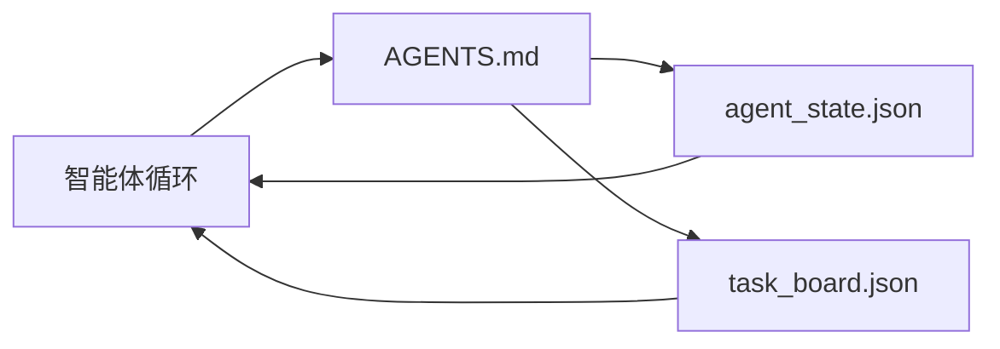

# 最小化智能体工作台

> 最小但有用的工作台只需要三个文件：根指令路由器、状态文件和任务看板。其他一切都建立在这三者之上。如果一个仓库连这三个都承载不了，再好的模型也救不了它。

**类型：** 构建
**语言：** Python（标准库）
**前置条件：** 第 14 阶段 · 31（为什么能力强的模型仍会失败）
**时长：** ~45 分钟

## 学习目标

- 定义构成最小可行工作台的三个文件。
- 解释为什么简短的根路由器胜过冗长、单体化的 `AGENTS.md`。
- 构建一个状态文件，让智能体在每个轮次都能读取，并在结束时写回。
- 构建一个任务看板，让多会话工作在没有聊天历史时也能继续。

## 问题

大多数团队想搭工作台时，第一反应是写一个 3000 行的 `AGENTS.md`，然后就觉得完事了。模型把它加载进来，忽略掉自己无法总结的部分，然后仍然在那些老问题上继续失败。

你需要的是反过来的做法：一个很小的根文件，只在相关时把智能体路由到更深的文件。让智能体在行动前读取、行动后写回的持久状态。一个能说明当前在做什么、什么被阻塞、下一步是什么的任务看板。

三个文件。每个文件只做一件事。每个文件都足够机器可读，以便将来可以演化成真正的系统。

## 概念



### AGENTS.md 是路由器，不是手册

一个好的 `AGENTS.md` 应该很短。它会把智能体指向：

- 状态文件（你现在处在哪里）。
- 任务看板（还剩什么没做）。
- 更深层的规则（放在 `docs/agent-rules.md` 下）。
- 验证命令（如何知道它真的可用）。

更长的内容应该放进更深的文档里，只在需要时加载。冗长手册会被忽略；简短路由器才会被遵循。

### agent_state.json 是记录系统

状态里应该带上：当前活跃任务 ID、已触达文件、做出的假设、阻塞项和下一步动作。智能体每个轮次都会读取它。下一次会话读它，而不是重放聊天记录。

状态之所以放在文件里，是因为聊天历史不可靠。会话会死亡，对话会被裁剪；文件不会。

### task_board.json 是队列

任务看板承载每个任务及其状态 `todo | in_progress | done | blocked`。当状态为空时，它就是智能体拉取任务的队列；当你想知道智能体是否按计划推进时，它也是你要查看的队列。

看板上的一个任务包含 ID、目标、负责人（`builder`、`reviewer` 或 `human`），以及验收标准。看板故意保持很小：当它长到一屏都放不下时，你遇到的是规划问题，不是看板问题。

### 三个文件是地板，不是天花板

后续课程会加上范围契约、反馈运行器、验证闸门、评审清单和交接包。这里的三个文件，是它们全部默认存在的基础。

## 动手构建

`code/main.py` 会把最小工作台写进一个空仓库，并演示一次智能体轮次，它会：

1. 读取 `agent_state.json`。
2. 如果状态为空，就从 `task_board.json` 拉取下一个任务。
3. 在允许范围内只触达一个文件。
4. 写回更新后的状态。

运行它：

```
python3 code/main.py
```

脚本会在自己旁边创建 `workdir/`，落下这三个文件，运行一个轮次，并打印差异。再次运行它，看看第二个轮次如何从第一个轮次停下的地方继续。

## 如何使用

在生产级智能体产品中，这三个文件通常只是换了名字：

- **Claude Code：** `AGENTS.md` 或 `CLAUDE.md` 充当路由器，类似 `.claude/state.json` 的存储充当状态，钩子充当看板。
- **Codex / Cursor：** 工作区规则充当路由器，会话记忆充当状态，聊天侧边栏里的排队任务充当看板。
- **自定义 Python 智能体：** 就是你刚刚写下的这三个文件。

名字会变，形状不会变。

## 现实中的生产模式

最小工作台在真实单仓库中要想活下来，需要叠加三个模式。它们彼此独立；只挑你的仓库真正需要的那些。

**嵌套 `AGENTS.md`，并采用最近优先的规则。** OpenAI 在它的主仓库里放了 88 个 `AGENTS.md` 文件，每个子组件一个。Codex、Cursor、Claude Code 和 Copilot 都会从当前工作文件一路向仓库根目录行走，把沿途找到的每个 `AGENTS.md` 连接起来。子目录文件会扩展根文件。Codex 还增加了 `AGENTS.override.md`，用来替换而不是扩展；这个覆盖机制是 Codex 特有的，做跨工具工作时应当避免。Augment Code 的测量给出了一条关键结论：最好的 `AGENTS.md` 带来的质量提升，相当于从 Haiku 升级到 Opus；最差的那些，效果比完全没有文件还差。

**即便看似覆盖充分，也要拒绝这些反模式。** 相互冲突的指令会悄悄把智能体从交互模式打回贪婪模式（ICLR 2026 AMBIG-SWE：48.8% → 28% 的解决率）；不要用数字优先级去互相压制，而要把它们平铺分层。不可验证的风格规则（“遵循 Google Python Style Guide”）如果没有强制执行命令，就会让智能体臆造合规；每条风格规则都要配上精确的 lint 命令。把风格放在命令前面，会把验证路径埋起来；命令优先，风格最后。为人类而不是为智能体写文档，会浪费上下文预算；简洁本身就是功能。

**跨工具的符号链接。** 用一个根文件再加一组符号链接（`ln -s AGENTS.md CLAUDE.md`、`ln -s AGENTS.md .github/copilot-instructions.md`、`ln -s AGENTS.md .cursorrules`），就能让每个编码智能体共享同一份事实来源。Nx 的 `nx ai-setup` 能从单一配置出发，自动为 Claude Code、Cursor、Copilot、Gemini、Codex 和 OpenCode 做这一套。

## 交付

`outputs/skill-minimal-workbench.md` 会为任何新仓库生成这套三文件工作台：一个按项目定制的 `AGENTS.md` 路由器、一个具备正确键的 `agent_state.json`，以及一个用当前待办列表初始化好的 `task_board.json`。

## 练习

1. 给 `agent_state.json` 增加一个 `last_run` 时间戳。如果文件超过 24 小时未更新，除非操作员确认，否则拒绝运行。
2. 给任务看板增加一个 `priority` 字段，并修改拉取器，使其总是选择优先级最高的 `todo`。
3. 把 `task_board.json` 迁移到 JSON Lines，这样每个任务占一行，版本控制中的 diff 更干净。
4. 写一个 `lint_workbench.py`：如果 `AGENTS.md` 超过 80 行，或引用了不存在的文件，就让它失败。
5. 决定这三个文件里哪一个丢失后伤害最大。为你的选择辩护。

## 关键术语

| 术语 | 人们常说什么 | 它实际意味着什么 |
|------|--------------|------------------|
| 路由器 | `AGENTS.md` | 简短的根文件，把智能体指向更深层的文档和文件 |
| 状态文件 | “那些笔记” | 记录智能体所处位置的机器可读文件，每个轮次都会写入 |
| 任务看板 | “待办列表” | 带状态、负责人、验收标准的 JSON 工作队列 |
| 记录系统 | “事实来源” | 当聊天不存在时，工作台视为权威的文件 |

## 延伸阅读

- [agents.md — the open spec](https://agents.md/) — 已被 Cursor、Codex、Claude Code、Copilot、Gemini、OpenCode 采用
- [Augment Code, A good AGENTS.md is a model upgrade. A bad one is worse than no docs at all](https://www.augmentcode.com/blog/how-to-write-good-agents-dot-md-files) — 量化过的质量跃升
- [Blake Crosley, AGENTS.md Patterns: What Actually Changes Agent Behavior](https://blakecrosley.com/blog/agents-md-patterns) — 哪些做法在经验上有效，哪些无效
- [Datadog Frontend, Steering AI Agents in Monorepos with AGENTS.md](https://dev.to/datadog-frontend-dev/steering-ai-agents-in-monorepos-with-agentsmd-13g0) — 嵌套优先级的真实实践
- [Nx Blog, Teach Your AI Agent How to Work in a Monorepo](https://nx.dev/blog/nx-ai-agent-skills) — 从单一来源为六种工具生成配置
- [The Prompt Shelf, AGENTS.md Best Practices: Structure, Scope, and Real Examples](https://thepromptshelf.dev/blog/agents-md-best-practices/) — 经得起评审的章节排序
- [Anthropic, Claude Code subagents and session store](https://docs.anthropic.com/en/docs/agents-and-tools/claude-code/sub-agents)
- 第 14 阶段 · 31 — 本最小工作台吸收的失败模式
- 第 14 阶段 · 34 — 本课预告的持久状态 Schema

