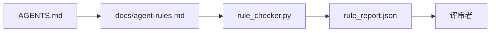

# 作为可执行约束的智能体指令

> 用散文写出来的指令只是愿望。写成约束的指令才是测试。工作台会把每条规则都变成一件智能体能在运行时检查、评审者能在事后验证的东西。

**类型：** 构建
**语言：** Python（标准库）
**前置条件：** 第 14 阶段 · 32（最小工作台）
**时长：** ~50 分钟

## 学习目标

- 将路由性说明文本与可执行规则分离。
- 把启动规则、禁止动作、完成定义、不确定性处理和审批边界表达成机器可检查的约束。
- 实现一个规则检查器，根据规则集为一次运行打分。
- 让规则集对差异友好，使评审能看出变更了什么。

## 问题

典型的 `AGENTS.md` 读起来像入职文档。它告诉智能体“要小心”“要充分测试”“不确定就问”。三天后，智能体交付了一个没有测试的改动，写入了禁止目录，而且从未提问，因为它根本不知道边界在哪里。

指令在可操作时才强大，在只剩愿景时就会软弱。解决办法是：把规则写成工作台可解释、评审者可打分的形式。

## 概念

规则应放在 `docs/agent-rules.md` 中，而不是放在简短的根路由器里。每条规则都有名称、类别和检查项。



### 覆盖大多数规则的五大类别

| 类别 | 这条规则回答的问题 | 示例 |
|------|--------------------|------|
| 启动 | 开始工作前必须满足什么？ | “状态文件存在且足够新” |
| 禁止 | 绝对不能发生什么？ | “不要编辑 `scripts/release.sh`” |
| 完成定义 | 什么证明任务已经完成？ | “`pytest` 退出码为 0，且验收行通过” |
| 不确定性 | 智能体不确定时该怎么做？ | “不要猜测，而是新建一条问题记录” |
| 审批 | 什么事情需要人工审批？ | “任何新依赖、任何生产环境写入” |

一条规则如果放不进这五类之一，通常意味着它其实该拆成两条。强制拆开。

### 规则是机器可读的

每条规则都有短标识、类别、一行描述，以及一个 `check` 字段，它指向 `rule_checker.py` 里的一个函数。新增一条规则，就意味着新增一个检查；检查器会随着工作台一起生长。

### 规则对差异友好

所有规则都放在同一个 Markdown 文件中，每个标题下面只放一条规则。重命名在差异里一眼可见。新规则放在所属类别的最上方。过时规则应该删除，而不是注释掉，因为工作台才是事实来源，不是团队上个季度心态变化的聊天记录。

### 规则与框架护栏

框架护栏（OpenAI Agents SDK 的护栏、LangGraph 的中断）是在运行时层面强制执行规则。

## 动手构建

`code/main.py` 自带：

- `agent-rules.md` 解析器，把规则加载进 dataclass。
- `rule_checker.py` 风格的检查函数，每个 `check` 引用对应一个函数。
- 一次违规两条规则的演示运行，以及能捕获它们的一次检查过程。

运行它：

```
python3 code/main.py
```

输出：解析后的规则集、运行轨迹、每条规则的通过 / 失败，以及保存在脚本旁边的 `rule_report.json`。

## 现实中的生产模式

有三个模式，决定一个规则集能活过一个季度，还是一周就腐烂。

**编写时就标注严重级别。** 每条规则都带 `severity`：`block`、`warn` 或 `info`。检查器三者都要报告；运行时只对 `block` 拒绝继续。大多数团队在早期会把严重级别写得过高，然后在交付压力下悄悄放松；在编写时就标级，迫使你一开始就做校准。再把它和验证闸门（第 14 阶段 · 38）配合起来：任何对 `block` 规则的覆盖都要签名写入 `overrides.jsonl` 审计日志。

**用规则过期作为强制机制。** 每条规则都带一个 `expires_at` 日期（默认是编写后 90 天）。如果一条尚未过期的规则连续 60 天没有出现任何违规，检查器就发出警告；下一次季度评审必须在“保留”“降级为 `info`”“删除”三者中做选择。Cloudflare 的生产 AI Code Review 数据（2026 年 4 月，30 天内跨 5,169 个仓库共 131,246 次评审运行）显示，显式设置过期时间的规则集能保持在每仓库 30 条以下；不设置过期的，会膨胀到 80+，而且大多数从不触发。

**Markdown 作为源码，JSON 作为缓存。** `agent-rules.md` 是人工编写文件；`agent-rules.lock.json` 是检查器在热路径中读取的缓存。这个锁文件由提交前（pre-commit）钩子重新生成。Markdown 差异可评审；JSON 解析不会进入每个轮次。它和 `package.json` / `package-lock.json` 以及 `Cargo.toml` / `Cargo.lock` 的形状完全一样。

## 如何使用

在生产环境里：

- Claude Code、Codex、Cursor 会在会话开始时读取这些规则，并在拒绝动作时引用它们。检查器会在 CI 中再次运行它们，以捕捉无声漂移。
- OpenAI Agents SDK 护栏把同一批检查注册为输入护栏和输出护栏。Markdown 是文档层；SDK 是运行时层。
- LangGraph 中断会在正在运行的节点违反规则时触发。中断处理器会读取规则、询问人类，并继续恢复运行。

规则集之所以能跨这三者移植，是因为它本质上只是 Markdown 加函数名。

## 交付

`outputs/skill-rule-set-builder.md` 会访谈项目负责人，把他们现有的散文化指令分类到这五个类别中，然后输出一个带版本的 `agent-rules.md` 和一个检查器桩代码。

## 练习

1. 如果你的产品真的需要，就增加第六个类别。论证它为什么不能收敛到这五类之一。
2. 扩展检查器，让规则带上严重级别（`block`、`warn`、`info`），并让报告按此聚合。
3. 把检查器接入 CI：如果最新一次智能体运行触发了 `block` 级规则失败，就让构建失败。
4. 给每条规则增加一个“过期（expiry）”字段。连续 90 天没有检查失败后，这条规则就进入待审查状态。
5. 找一个真实的 `AGENTS.md`，把它改写成五类规则。里面有多少行是可操作的？多少行只是愿景？

## 关键术语

| 术语 | 人们常说什么 | 它实际意味着什么 |
|------|--------------|------------------|
| 操作性规则 | “真正的指令” | 工作台可以在运行时检查的规则 |
| 愿景型规则 | “小心一点” | 没有检查项的规则；要么删除，要么升级 |
| 完成定义 | “验收” | 由文件支撑的客观证据，证明任务已经完成 |
| `block` 严重级别 | “硬规则” | 违规会中止运行；没有操作员介入不能静默忽略 |
| 规则过期 | “清理陈旧规则” | N 天内没有失败的规则应考虑退役 |

## 延伸阅读

- [OpenAI Agents SDK guardrails](https://platform.openai.com/docs/guides/agents-sdk/guardrails)
- [LangGraph interrupts](https://langchain-ai.github.io/langgraph/how-tos/human_in_the_loop/breakpoints/)
- [Anthropic, Building Effective Agents](https://www.anthropic.com/research/building-effective-agents)
- [Rick Hightower, Agent RuleZ: A Deterministic Policy Engine](https://medium.com/@richardhightower/agent-rulez-a-deterministic-policy-engine-for-ai-coding-agents-9489e0561edf) — 生产环境中的 `block`/`warn`/`info` 严重级别
- [Cloudflare, Orchestrating AI Code Review at Scale](https://blog.cloudflare.com/ai-code-review/) — 13.1 万次评审运行，以及规则组合的经验
- [microservices.io, GenAI development platform — part 1: guardrails](https://microservices.io/post/architecture/2026/03/09/genai-development-platform-part-1-development-guardrails.html) — 规则与 CI 之间的纵深防御
- [Type-Checked Compliance: Deterministic Guardrails (arXiv 2604.01483)](https://arxiv.org/pdf/2604.01483) — 把 Lean 4 作为“规则即检查”的上限
- [logi-cmd/agent-guardrails](https://github.com/logi-cmd/agent-guardrails) — 合并闸门实现：范围、变异测试、违规预算
- 第 14 阶段 · 32 — 这套规则落入的最小工作台
- 第 14 阶段 · 38 — 消费规则报告的验证闸门
- 第 14 阶段 · 39 — 为规则合规性打分的评审智能体

