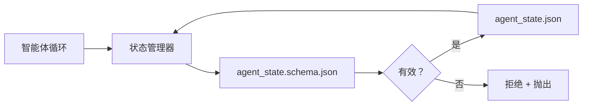

# 仓库记忆与持久状态

> 聊天历史是易失的。仓库是持久的。工作台把智能体状态存进带版本的文件里，让下一次会话、下一个智能体和下一位评审者都从同一份事实来源读取。

**类型：** 构建
**语言：** Python（标准库，`jsonschema` 可选）
**前置条件：** 第 14 阶段 · 32（最小工作台）
**时长：** ~60 分钟

## 学习目标

- 定义什么该放进仓库记忆，什么该留在聊天历史。
- 为 `agent_state.json` 和 `task_board.json` 编写 JSON Schema。
- 构建一个状态管理器，能够原子地加载、校验、修改并持久化状态。
- 在坏写入破坏工作台之前，通过 Schema 拒绝它。

## 问题

智能体结束了一个会话。聊天关闭。下一次会话开始，问该从哪里做起。模型说“让我检查一下文件”，读到过期的笔记，又把已经完成的工作重做一遍。更糟的是，它可能重写一个已经完成的文件，因为没有人告诉它这个文件已经结束了。

工作台的修复方式是仓库记忆：状态作为 JSON 文件存在于仓库中，写入时遵循 Schema，以原子方式持久化，并且在代码评审中便于审查差异。聊天只是瞬态信息流；仓库才是记录系统。

## 概念



### 什么应该放进仓库记忆

| 应该放 | 不应该放 |
|--------|----------|
| 当前活跃任务 ID | 原始聊天转录 |
| 本次会话触达的文件 | 令牌级推理轨迹 |
| 智能体做出的假设 | “用户看起来有点沮丧” |
| 未解决的阻塞项 | 采样得到的补全文本 |
| 下一步动作 | 厂商特定的模型 ID |

判断标准是“持久性”：三个月后在一次 CI 重跑里，这条信息还会有用吗？如果会，就放仓库；如果不会，就放遥测。

### 以 Schema 为先的状态

JSON Schema 是契约。没有它，每个智能体都会发明新字段，每个评审者都要学习新结构，每个 CI 脚本都得给旧版本打补丁。有了它，坏写入就是被拒绝的写入。

Schema 包括：

- 必需键。
- 允许的 `status` 值。
- 禁止值（例如数组里不允许 `null`）。
- 模式约束（任务 ID 必须匹配 `T-\d{3,}`）。
- 用于迁移的版本字段。

### 原子写入

状态写入必须能承受部分失败：先写到临时文件，`fsync`，再用 rename 覆盖目标文件。状态文件是事实来源；半写好的状态文件比没有文件更糟。

### 迁移

当 Schema 变化时，要和 Schema 升级一起发布迁移脚本。状态文件带一个 `schema_version` 字段；管理器遇到自己无法迁移的版本时，就拒绝加载。

## 动手构建

`code/main.py` 实现了：

- `agent_state.schema.json` 和 `task_board.schema.json`。
- 一个只用标准库实现的验证器（JSON Schema 的子集：required、type、enum、pattern、items）。
- `StateManager.load`、`StateManager.update`、`StateManager.commit`，使用临时文件加 rename 的原子写入。
- 一个演示：修改状态、持久化、重新加载，并证明往返一致。

运行它：

```
python3 code/main.py
```

脚本会写出 `workdir/agent_state.json` 和 `workdir/task_board.json`，在两个轮次中修改它们，并打印每一步经过校验的状态。

## 现实中的生产模式

有四个模式，能把本课的最小实现变成多智能体单仓库也扛得住的东西。

**原子的临时写入后重命名不是可选项。** 2026 年 3 月 Hive 项目的一个缺陷报告清楚展示了这种失败模式：`state.json` 通过 `write_text()` 写入，而异常被捕获后静默吞掉。部分写入让会话在损坏状态上恢复，而且毫无信号。修复方案永远是：在目标文件同目录下 `tempfile.mkstemp`，写入，`fsync`，`os.replace`（在 POSIX 和 Windows 上都是原子重命名）。本课的 `atomic_write` 做的正是这件事。

**对每一次非幂等工具调用都加幂等键。** 如果智能体在调用工具之后、写入检查点结果之前崩溃，恢复时就会重试该工具调用。对读取类调用来说安全；对发邮件、数据库插入、文件上传来说就很危险。模式是：执行前先把每次工具调用 ID 记录到 `pending_calls.jsonl`。重试时先查 ID；如果已存在，就跳过调用并使用缓存结果。Anthropic 和 LangChain 在 2026 年的指南里都明确提到这一点；LangGraph 的检查点写入器出于同样原因也会持久化待写入项。

**把大工件与状态分离。** 不要把 CSV、长转录或生成文件存进 `agent_state.json`。把工件保存成单独文件（或上传到对象存储），状态里只保留路径。检查点要保持小而快；工件可以独立增长。

**审计用事件溯源，恢复用快照。** 每次状态变更都追加到事件日志（`state.events.jsonl`）；定期快照到 `state.json`。恢复时先读快照，再重放快照时间戳之后的事件。它会多占一些磁盘，但让你可以逐字重放智能体的决策——调试长时程运行时这点至关重要。这和 Postgres 内部 WAL 的形状一致。

**要么做 Schema 迁移，要么拒绝加载。** `schema_version` 整数就是契约。管理器加载到未知版本的文件时，必须拒绝读取。要和 Schema 升级一起发布迁移脚本；`tools/migrate_state.py` 会在每次启动时幂等运行。

## 如何使用

在生产环境里：

- **LangGraph 检查点写入器。** 思路一样，只是存储不同。检查点写入器会把图状态持久化到 SQLite、Postgres 或自定义后端。本课教授的模式，就是当检查点写入器挂掉、你不得不用手读取状态时会需要的东西。
- **Letta memory blocks。** 带结构化模式的持久块（第 14 阶段 · 08）。同样的纪律，只是作用在长时间存在的人设上。
- **OpenAI Agents SDK 会话存储。** 可插拔后端、模式感知。本课的状态文件就是它的本地文件后端。

## 交付

`outputs/skill-state-schema.md` 会生成一对项目专用 JSON Schema（状态 + 看板）、一个接好原子写入的 Python `StateManager`，以及一个迁移脚手架，让下一次 Schema 升级不会打坏工作台。

## 练习

1. 增加一个 `last_human_touch` 时间戳。若人类编辑发生后五秒内有智能体写入，则拒绝。
2. 扩展验证器以支持 `oneOf`，让一个任务可以是构建任务或评审任务，并拥有不同的必填字段。
3. 加入 `schema_version` 字段，并编写从 v1 到 v2 的 migration（把 `blockers` 重命名为 `risks`）。
4. 把存储后端从本地文件迁移到 SQLite。保持 `StateManager` API 完全不变。
5. 让两个智能体同时写同一个状态文件，并制造 50 ms 的写入竞争。会出什么问题，原子重命名又是怎么救场的？

## 关键术语

| 术语 | 人们常说什么 | 它实际意味着什么 |
|------|--------------|------------------|
| 仓库记忆 | “笔记文件” | 存在仓库、受 Schema 约束的追踪状态文件 |
| 以 Schema 为先 | “先校验输入” | 在编写器之前先定义契约，并拒绝漂移 |
| 原子写入 | “直接 rename 就行” | 先写临时文件、`fsync`、再用 rename，使部分失败不会损坏文件 |
| 迁移 | “Schema 升级” | 把 vN 状态转换成 v(N+1) 的脚本 |
| 记录系统 | “事实来源” | 工作台视为权威的工件 |

## 延伸阅读

- [JSON Schema specification](https://json-schema.org/specification.html)
- [LangGraph checkpointers](https://langchain-ai.github.io/langgraph/concepts/persistence/)
- [Letta memory blocks](https://docs.letta.com/concepts/memory)
- [Fast.io, AI Agent State Checkpointing: A Practical Guide](https://fast.io/resources/ai-agent-state-checkpointing/) — 以 Schema 为先、带幂等性的检查点写入
- [Fast.io, AI Agent Workflow State Persistence: Best Practices 2026](https://fast.io/resources/ai-agent-workflow-state-persistence/) — 并发控制、TTL、事件溯源
- [Hive Issue #6263 — non-atomic state.json writes silently ignored](https://github.com/aden-hive/hive/issues/6263) — 真实项目中的失败模式
- [eunomia, Checkpoint/Restore Systems: Evolution, Techniques, Applications](https://eunomia.dev/blog/2025/05/11/checkpointrestore-systems-evolution-techniques-and-applications-in-ai-agents/) — 将操作系统历史中的 CR 原语应用到智能体
- [Indium, 7 State Persistence Strategies for Long-Running AI Agents in 2026](https://www.indium.tech/blog/7-state-persistence-strategies-ai-agents-2026/)
- [Microsoft Agent Framework, Compaction](https://learn.microsoft.com/en-us/agent-framework/agents/conversations/compaction) — 厂商检查点管理器
- 第 14 阶段 · 08 — memory blocks 与休眠期计算
- 第 14 阶段 · 32 — 本课 Schema 化的三文件最小集
- 第 14 阶段 · 40 — 从同一 Schema 读取的交接包

