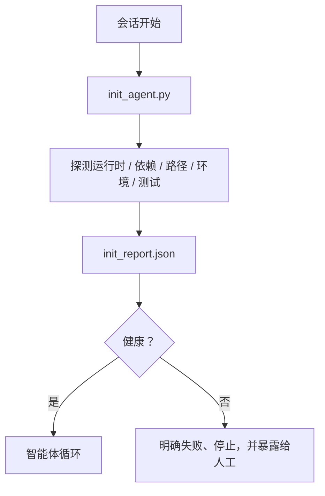

# 面向智能体的初始化脚本

> 每次冷启动的会话都要付出一笔税。智能体会读取同样的文件、重复同样的探测，并再次发现同样的路径。初始化（init）脚本只支付一次这笔税，并把答案写进状态里。

**类型：** 构建
**语言：** Python（stdlib）
**前置条件：** Phase 14 · 32（最小工作台），Phase 14 · 34（仓库记忆）
**时长：** ~45 分钟

## 学习目标

- 识别哪些工作不该让智能体在每个会话里重复做。
- 构建一个确定性的初始化脚本，用来探测运行时、依赖和仓库健康状况。
- 持久化探测结果，让智能体读取它，而不是重复运行检查。
- 在初始化失败时，快速、明确地失败，并且只留一个排查入口。

## 问题

打开一个会话。智能体去猜 Python 版本，猜测试命令，列五次仓库根目录才找到入口点，尝试导入一个根本没装的包，问用户配置文件在哪里。等它真正开始修改时，已经有上万令牌花在本该由一个脚本完成的准备工作上了。

修复办法是：在智能体执行任何事情之前运行一个初始化脚本，并写出一个 `init_report.json`，供智能体在启动时读取。

## 概念



### 初始化脚本要探测什么

| 探测项 | 为什么重要 |
|--------|------------|
| 运行时版本 | Python 或 Node 版本错误会导致静默的版本错配问题 |
| 依赖是否可用 | 漏掉一个包，后面补救的代价往往是现在发现它的十倍 |
| 测试命令 | 智能体必须知道如何验证；如果命令缺失，说明工作台已经坏了 |
| 仓库路径 | 硬编码路径会漂移；应该一次解析并固定 |
| 环境变量 | 缺少 `OPENAI_API_KEY` 是一个失败面，而不是运行时谜团 |
| 状态 + 看板新鲜度 | 来自崩溃会话的陈旧状态会变成脚枪 |
| 最近一次已知良好提交 | 作为会话结束时交接差异的锚点 |

### 明确失败、快速失败，并且只在一个地方失败

只要有一个探测失败，就应该停止并暴露给人工。不要想着“智能体会自己搞明白”。初始化的全部意义，就是在工作台坏掉时拒绝启动。

### 幂等

连续运行两次。第二次除了时间戳是新的之外，应该是空操作。幂等性让你可以把这个脚本接入 CI、钩子或某个任务前的斜杠命令。

### 初始化与启动规则

规则（Phase 14 · 33）描述的是：在行动前，什么必须为真。初始化脚本负责确保这些规则真的可被检查。没有初始化脚本的规则会退化成“多小心一点”；没有规则的初始化脚本，只是一次打磨精致的失败。

## 动手构建

`code/main.py` 实现了 `init_agent.py`：

- 五类探测：Python 版本、通过 `importlib.util.find_spec` 列举的依赖、测试命令是否可解析、必需环境变量、状态文件新鲜度。
- 每个探测都返回 `(name, status, detail)`。
- 脚本会把完整探测集写入 `init_report.json`，并在任一 `block` 级探测失败时以非零退出。

运行它：

```
python3 code/main.py
```

脚本会打印探测表，写出 `init_report.json`，并在正常路径上返回零；若有失败探测，则以非零退出并列出失败项。

## 现实中的生产模式

有三个模式，决定初始化脚本是有用工具，还是只剩仪式感。

**以最近一次已知良好提交（last-known-good commit）作为锚点。** 把当前提交与上一次成功合并时写下的 `LKG` 文件做比对。如果差异（diff）超过预算（默认 50 个文件），就拒绝启动，并要求人工确认新的基线（baseline）。这正是 Cloudflare 的 AI Code Review 用来限定评审智能体范围的方法：每次评审会话都锚定在同一个最近一次已知良好提交之上，而不会把漂移一层层叠加到后续会话里。

**带 TTL 的锁文件（lock 文件）。** 第一次成功完成探测后，写一个 `prereqs.lock`。后续 N 小时（默认 24h）内的运行都信任这个锁文件，并跳过昂贵探测。初始化脚本先读取锁文件；如果它还新鲜，且依赖清单哈希（hash）没变，就短路返回。这和 Docker 的层缓存（layer cache）是同一种模式：幂等探测 + 内容哈希 = 跳过。

**热路径里不允许有网络、LLM 或惊喜。** 初始化探测是确定性的基础设施工作。一个用 LLM 来分类失败、或访问外部服务检查许可证的探测，不是探测项（probe），而是工作流（workflow）。如果某个探测项在演练运行（dry run）中超过三秒，就把它视为工作台气味：要么移出初始化，要么缓存结果。

## 如何使用

在生产环境里：

- **Claude Code 钩子。** `pre-task` 钩子调用初始化脚本；若失败则拒绝启动智能体。
- **GitHub Actions。** 一个 `setup-agent` 任务运行初始化脚本；智能体任务依赖它。
- **Docker 入口点（entrypoint）。** 智能体容器在 `exec` 真正运行前先执行初始化脚本；失败时直接输出日志。

初始化脚本之所以可移植，是因为它不依赖任何特定框架（framework）。Bash、Make 或任务文件都能把它包起来。

## 交付

`outputs/skill-init-script.md` 会访谈项目，把它的准备工作分类成一组探测项，并输出一个项目专用的 `init_agent.py`，再加一个会在任何智能体步骤之前先运行它的 CI 工作流。

## 练习

1. 加一个探测项：比较当前提交与最近一次已知良好提交的差异，如果变更文件超过 50 个就拒绝启动。
2. 让脚本写出一个 `prereqs.lock` 文件，并在锁文件超过七天时拒绝启动。
3. 加一个 `--fix` 标志，自动安装缺失的开发依赖，但若没有审批，绝不修改运行时依赖。
4. 把探测项从硬编码函数迁移到 YAML 注册表。为这个权衡做辩护。
5. 给每个探测项加上时间预算。运行超过三秒的探测项，都是一种工作台气味。

## 关键术语

| 术语 | 人们常说什么 | 它实际意味着什么 |
|------|--------------|------------------|
| 探测项 | “一次检查” | 一个确定性函数，返回 `(name, status, detail)` |
| 初始化报告 | “准备输出” | 与状态文件并列写出的 JSON，包含探测结果 |
| 幂等 | “可安全重跑” | 连续两次运行会得到相同报告，只有时间戳不同 |
| 明确失败 | “不要吞掉错误” | 停止并暴露给人工；不做静默回退 |
| 启动成本税 | “启动成本” | 智能体在每个会话中花掉的、用于重新发现显而易见信息的令牌 |

## 延伸阅读

- [Anthropic, Effective harnesses for long-running agents](https://www.anthropic.com/engineering/effective-harnesses-for-long-running-agents)
- [GitHub Actions, composite actions for setup](https://docs.github.com/en/actions/sharing-automations/creating-actions/creating-a-composite-action)
- [microservices.io, GenAI dev platform: guardrails](https://microservices.io/post/architecture/2026/03/09/genai-development-platform-part-1-development-guardrails.html) — 作为初始化的提交前（pre-commit）与 CI 检查
- [Augment Code, How to Build Your AGENTS.md (2026)](https://www.augmentcode.com/guides/how-to-build-agents-md) — 对初始化脚本的预期
- [Codex Blog, Codex CLI Context Compaction](https://codex.danielvaughan.com/2026/03/31/codex-cli-context-compaction-architecture/) — 把会话启动当作感知压缩（compaction）的初始化
- Phase 14 · 33 — 这套脚本所支持的规则集
- Phase 14 · 34 — 这套脚本所填充的状态文件
- Phase 14 · 38 — 初始化脚本喂给它的验证闸门
- Phase 14 · 40 — 消费初始化报告中最近一次已知良好提交的交接流程

