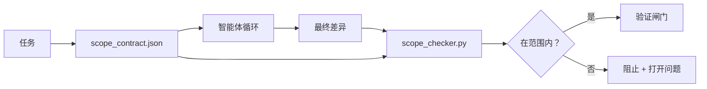

# 范围契约与任务边界

> 模型并不知道工作会在何处结束。范围契约（scope contract）是一个按任务划分的文件，用来说明工作从哪里开始、在哪里结束，以及如果范围外溢该如何回滚。它把“保持在范围内”从一种愿望变成了一项可检查的约束。

**类型：** 构建
**语言：** Python（标准库，stdlib）
**前置条件：** 第 14 阶段 · 32（最小工作台）, 第 14 阶段 · 33（作为约束的规则）
**时间：** ~50 分钟

## 学习目标

- 编写一个范围契约，让智能体在任务开始时读取，让验证器在任务结束时读取。
- 指定允许文件、禁止文件、验收标准、回滚计划，以及审批边界。
- 实现一个范围检查器，将差异与契约进行比较并标记违规项。
- 让范围蔓延变得可见、自动且可审查。

## 问题

智能体会逐渐偏离范围。任务是“修复登录缺陷”。结果差异里改动了登录路由、邮件辅助函数、数据库驱动、README 和发布脚本。回头看，每一次改动在当下似乎都有合理理由；但合在一起，它已经不再是那个被评审过的变更了。

范围蔓延是智能体工作中最缺乏监控的失败模式，因为智能体会真诚地叙述每一步。解决办法不是写一个更严格的提示词。解决办法是在磁盘上放一份契约，写清楚承诺了什么，再用检查机制把结果与承诺进行对比。

## 概念



### 范围契约中包含什么

| 字段 | 用途 |
|-------|---------|
| `task_id` | 关联到看板上的任务 |
| `goal` | 评审者可以验证的一句话目标 |
| `allowed_files` | 智能体可以写入的 glob 模式 |
| `forbidden_files` | 智能体即使误操作也绝不能触碰的 glob 模式 |
| `acceptance_criteria` | 证明任务完成的测试命令或断言语句 |
| `rollback_plan` | 如果必须中止，操作员可执行的一段回滚说明 |
| `approvals_required` | 超出范围、需要明确人工签字确认的操作 |

没有 `forbidden_files` 的契约是不完整的。负空间是契约的一半。

### 用 glob，而不是原始路径

真实仓库会移动文件。应把契约绑定到 glob（`app/**/*.py`、`tests/test_signup*.py`）上，这样即使会话之间发生重构，也不会让契约失效。

### 回滚是范围的一部分

列出如何回滚，会强迫契约作者思考哪里可能出错。一个无法回滚的契约，就是一个不该被批准的契约。

### 范围检查本质上是差异检查

智能体会产出一个差异。检查器读取差异、允许的 glob、禁止的 glob，以及任何已执行验收命令的列表。每一项违规都会成为一个带标签的发现，验证闸门可以据此拒绝放行。

## 动手构建

`code/main.py` 实现了：

- `scope_contract.json` 的模式（schema）（JSON Schema 的一个子集，包含 glob 数组）。
- 一个差异解析器，把被触碰文件列表和已运行命令列表转换成 `RunSummary`。
- 一个 `scope_check`，根据契约返回 `(violations, in_scope, off_scope)`。
- 两次演示运行：一次保持在范围内，一次发生蔓延。检查器会用精确的文件和原因标出越界。

运行：

```
python3 code/main.py
```

输出：契约、两次运行、每次运行的判定结果，以及保存下来的 `scope_report.json`。

## 真实生产中的模式

一位实践者在调用智能体之前采用“规格先行写作”（specsmaxxing，先用 YAML 写范围契约）的方法，报告说在三周内，跑偏深挖的比例从 52% 降到了 21%，而智能体本身完全没变。起作用的是契约，不是模型。要让这种收益持续，通常有三种模式。

**违规预算，而不是二元失败。** `agent-guardrails`（一个通过 MCP 被 Claude Code、Cursor、Windsurf、Codex 使用的开源合并闸门）会为每个任务提供 `violationBudget`：预算内的轻微范围偏离会作为警告浮现；只有超出预算时，合并闸门才会拒绝。可与 `violationSeverity: "error" | "warning"` 搭配使用。预算的存在，决定了这个闸门是能真正上线，还是会被讨厌它的团队直接关掉。

**按路径族区分严重级别。** 对 `docs/**` 的越界写入通常记为 `warn`；对 `scripts/**`、`migrations/**`、`config/prod/**` 的越界写入则始终记为 `block`。这种不对称必须写在契约里，而不是写死在运行时里，因为它高度依赖项目，而且会随着任务而变化。

**把时间和网络预算放在文件预算旁边。** `time_budget_minutes` 字段限制墙钟时间（wall clock）；运行时在没有重新审批的情况下，超过该时间就拒绝继续。主机名级别的 `network_egress` 允许列表可以阻止智能体悄悄访问不属于任务范围的外部 API。这些也是范围维度；文件 glob 只是必要条件，而非充分条件。

**多契约合并语义（最小权限）。** 当两份范围契约同时适用时（例如一份项目级契约加上一份任务级契约），合并规则是：`allowed_files` 取**交集**（两份契约都必须允许该路径），`forbidden_files` 取**并集**（任意一份都可以禁止），`time_budget_minutes` 取更严格的一侧（最小值），`approvals_required` 则累积。`network_egress` 中，`None` 表示不强制执行，`[]` 表示全部拒绝，`[...]` 表示允许列表；合并时，`None` 让位于另一侧，两边都是列表时取交集，而“全部拒绝”会一直保持全部拒绝。要把这些写进契约模式中，让合并变成机械、可审查的过程。

## 使用方式

生产模式：

- **Claude Code 斜杠命令。** `/scope` 命令会写出契约，并将其固定为会话上下文。子智能体在行动前都会读取契约。
- **GitHub PR。** 将契约作为 PR 正文中的 JSON 文件，或作为提交到仓库中的工件。CI 会针对合并差异运行范围检查器。
- **LangGraph 中断（interrupts）。** 一旦出现范围违规，就触发中断；处理中断的逻辑会询问人工，是需要扩展契约，还是让智能体收缩回来。

契约与任务同行。任务关闭后，契约会被归档到 `outputs/scope/closed/` 下。

## 交付

`outputs/skill-scope-contract.md` 会根据任务描述生成范围契约，以及一个可识别 glob 的检查器，在 CI 中针对每个智能体差异运行。

## 练习

1. 添加一个 `network_egress` 字段，列出允许访问的外部主机。若运行触达其他主机，则拒绝。
2. 扩展检查器：对 `docs/**` 软失败，对 `scripts/**` 硬失败。说明为什么需要这种不对称。
3. 使用静态规则集（不使用 LLM）根据 `goal` 字段推导 `allowed_files`。遇到第一个边缘情况时，会出什么问题？
4. 添加 `time_budget_minutes`，一旦墙钟时间超出就拒绝继续。
5. 让两份契约对同一个差异同时生效。当二者都适用时，正确的合并语义是什么？

## 关键术语

| 术语 | 人们常说的话 | 它真正的含义 |
|------|----------------|------------------------|
| 范围契约 | “任务简述” | 按任务划分的 JSON，列出允许/禁止文件、验收与回滚 |
| 范围蔓延 | “它还改了……” | 同一任务中，契约之外的文件也被改动了 |
| 回滚计划 | “我们可以回退” | 用于中止时的一段操作员运行手册 |
| 审批边界 | “需要签字确认” | 契约中列明必须获得明确人工批准的操作 |
| 差异检查 | “路径审计” | 将被触碰文件与契约 glob 进行比对 |

## 延伸阅读

- [LangGraph human-in-the-loop interrupts](https://langchain-ai.github.io/langgraph/concepts/human_in_the_loop/)
- [OpenAI Agents SDK tool approval policies](https://platform.openai.com/docs/guides/agents-sdk)
- [logi-cmd/agent-guardrails — merge gates and scope validation](https://github.com/logi-cmd/agent-guardrails) — 违规预算、严重级别分层
- [Dev|Journal, Preventing AI Agent Configuration Drift with Agent Contract Testing](https://earezki.com/ai-news/2026-05-05-i-built-a-tiny-ci-tool-to-keep-ai-agent-configs-from-drifting-in-my-repo/) — 无外部依赖的 `--strict` 模式
- [Agentic Coding Is Not a Trap (production logs)](https://dev.to/jtorchia/agentic-coding-is-not-a-trap-i-answered-the-viral-hn-post-with-my-own-production-logs-33d9) — 规格先行写作（specsmaxxing）记录：52% → 21%
- [OpenCode permission globs](https://opencode.ai/docs/agents/) — 细粒度、按权限划分的范围控制
- [Knostic, AI Coding Agent Security: Threat Models and Protection Strategies](https://www.knostic.ai/blog/ai-coding-agent-security) — 将范围视为最小权限的一部分
- [Augment Code, AI Spec Template](https://www.augmentcode.com/guides/ai-spec-template) — 三层边界体系（必须 / 先询问 / 禁止）
- 第 14 阶段 · 27 —— 与范围锁定配套的提示注入防御
- 第 14 阶段 · 33 —— 这份契约按任务进行特化的规则集
- 第 14 阶段 · 38 —— 检查器汇报结果所进入的验证闸门
