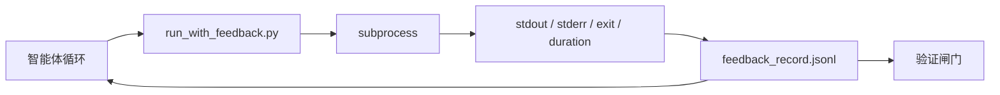

# 运行时反馈循环

> 看不到真实命令输出的智能体只能靠猜。反馈运行器（feedback runner）会把 stdout、stderr、退出码和耗时捕获到结构化记录里，供下一轮读取。这样，智能体就是在对事实作出反应，而不是对自己预测出的“事实”作出反应。

**类型：** 构建
**语言：** Python（stdlib）
**前置条件：** Phase 14 · 32（最小工作台）, Phase 14 · 35（初始化脚本）
**时间：** ~50 分钟

## 学习目标

- 区分运行时反馈与可观测性遥测。
- 构建一个反馈运行器，包装 Shell 命令并持久化结构化记录。
- 以确定性的方式截断大输出，让循环保持在令牌预算内。
- 在缺少反馈时拒绝推进循环。

## 问题

智能体说“现在开始跑测试”。下一条消息又说“所有测试都通过了”。而现实是，根本没有测试运行。它可能是凭空想象了输出，或者运行了命令却从未读取结果，又或者读取了结果，却悄悄把失败那一行截掉了。

反馈运行器可以消除这道裂缝。每条命令都必须经过运行器。每条记录都携带命令、捕获到的 stdout 与 stderr、退出码、墙钟耗时，以及智能体写下的一行备注。智能体在下一轮读取这条记录。验证闸门会在任务结束时读取这些记录。

## 概念



### 反馈记录中包含什么

| 字段 | 为什么重要 |
|-------|----------------|
| `command` | 精确的 argv，不会有 Shell 展开带来的意外 |
| `stdout_tail` | 最后 N 行，确定性截断 |
| `stderr_tail` | 最后 N 行，与 stdout 分开 |
| `exit_code` | 毫不含糊的成功信号 |
| `duration_ms` | 让慢探测和失控进程暴露出来 |
| `started_at` | 用于回放的时间戳 |
| `agent_note` | 智能体写下的、关于预期的一行说明 |

### 截断必须是确定性的

50 MB 的日志会毁掉整个循环。运行器会对头部和尾部进行截断，并插入 `...truncated N lines...` 标记，而且这种处理必须是确定性的，这样同一份输出总会生成同一条记录。不要采样；智能体最需要看到的部分（最终错误、最终摘要）都在尾部。

### 反馈与遥测

遥测（Phase 14 · 23，OTel GenAI 语义约定）服务于跨时间审查运行情况的人类操作员。反馈服务于这次运行的下一轮。二者共享一些字段，但它们位于不同文件里，保留策略也不同。

### 没有反馈就拒绝推进

如果运行器在捕获退出状态之前出错，那么记录里应携带 `exit_code: null` 和 `error: &lt;reason>`。智能体循环必须拒绝在 `null` 退出码上宣称成功。没有退出，就没有进展。

## 动手构建

`code/main.py` 实现了：

- `run_with_feedback(command, agent_note)`，它包装 `subprocess.run`，捕获 stdout/stderr/exit/duration，做确定性截断，并追加到 `feedback_record.jsonl`。
- 一个小型加载器，把 JSONL 流式读入 Python 列表。
- 一个演示，运行三条命令（成功、失败、缓慢），并打印每条命令最后一条记录。

运行：

```
python3 code/main.py
```

输出：三条反馈记录会追加到 `feedback_record.jsonl` 中，每条命令的最后一条记录会直接打印出来。多次重跑时可对该文件执行 `tail`，观察循环如何不断累积。

## 真实生产中的模式

有三种模式能把这个运行器加固到足以上线。

**在写入时脱敏，不要在读取时脱敏。** 任何接触 stdout 或 stderr 的记录都有可能泄露密钥。运行器会在追加 JSONL 之前先做一次脱敏：删除匹配 `^Bearer `、`password=`、`api[_-]?key=`、`AKIA[0-9A-Z]{16}`（AWS）、`xox[baprs]-`（Slack）的行。读取时再脱敏是个危险误区；攻击者真正能拿到的是磁盘上的文件。应按季度根据生产运行时中观察到的真实密钥格式审计脱敏模式。

**要有轮转策略，而不是只写一个文件。** 将 `feedback_record.jsonl` 限制为每个文件 1 MB；溢出后轮转到 `.1`、`.2`，并丢弃 `.5`。智能体循环只读取当前文件，因此运行时成本是有上界的。CI 工件存储则保留完整的轮转集合。没有轮转时，这个文件会在每次加载器调用时变成瓶颈。

**为重试链引入父命令 ID。** 每条记录都带 `command_id`；重试记录则带上 `parent_command_id` 指向上一次尝试。评审者的“失败尝试”列表（Phase 14 · 40）和验证闸门的审计都会沿着这条链追踪。没有这个链接，重试看起来就像彼此独立的成功，审计也会掩盖失败历史。

## 使用方式

生产模式：

- **Claude Code Bash 工具。** 该工具已经会捕获 stdout、stderr、退出码和耗时。本课里的运行器，是任何智能体产品都可以采用的、与框架无关的等价实现。
- **LangGraph 节点。** 用运行器包装任何 Shell 节点，这样记录就能持久化到图状态之外。
- **CI 日志。** 将 JSONL 输送到你的 CI 工件存储；评审者无需重跑会话，就能回放任何命令。

这个运行器是一个薄包装层，足以穿越每一次框架迁移，因为它掌握了记录的形状。

## 交付

`outputs/skill-feedback-runner.md` 会生成一个项目专属的 `run_with_feedback.py`，带上合适的截断预算、接入工作台的 JSONL 写入器，以及智能体每一轮都会读取的加载器。

## 练习

1. 为每条记录添加一个 `cwd` 字段，让同一条命令从不同目录运行时可以区分。
2. 增加一个 `redaction` 步骤，删除匹配 `^Bearer ` 或 `password=` 的行。用一条夹具记录测试它。
3. 通过轮转到 `.1`、`.2` 文件，把 `feedback_record.jsonl` 总大小限制在 1 MB。为这种轮转策略辩护。
4. 添加一个 `parent_command_id`，让重试链可见：哪条命令产出了下一条命令所消费的输入。
5. 把 JSONL 输送进一个小型终端界面（TUI），并高亮最近一次非零退出。若要让评审有用，这个界面必须展示哪八个关键特性？

## 关键术语

| 术语 | 人们常说的话 | 它真正的含义 |
|------|----------------|------------------------|
| 反馈记录 | “运行日志” | 带有命令、输出、退出码、耗时的结构化 JSONL 条目 |
| 尾部截断 | “把日志裁掉” | 用确定性的头+尾捕获，让记录能放进令牌预算 |
| `null` 即拒绝 | “缺数据就阻止” | 当 `exit_code` 为 `null` 时，循环不得继续推进 |
| 智能体备注 | “预期标签” | 智能体在读取结果前写下的一行预测 |
| 遥测拆分 | “两份日志文件” | 反馈给下一轮，遥测给操作员 |

## 延伸阅读

- [OpenTelemetry GenAI semantic conventions](https://opentelemetry.io/docs/specs/semconv/gen-ai/)
- [Anthropic, Effective harnesses for long-running agents](https://www.anthropic.com/engineering/effective-harnesses-for-long-running-agents)
- [Guardrails AI x MLflow — deterministic safety, PII, quality validators](https://guardrailsai.com/blog/guardrails-mlflow) — 将脱敏模式当作回归测试
- [Aport.io, Best AI Agent Guardrails 2026: Pre-Action Authorization Compared](https://aport.io/blog/best-ai-agent-guardrails-2026-pre-action-authorization-compared/) — 工具调用前/后的捕获
- [Andrii Furmanets, AI Agents in 2026: Practical Architecture for Tools, Memory, Evals, Guardrails](https://andriifurmanets.com/blogs/ai-agents-2026-practical-architecture-tools-memory-evals-guardrails) — 可观测性表面
- Phase 14 · 23 —— 遥测侧使用的 OTel GenAI 约定
- Phase 14 · 24 —— 智能体可观测性平台（Langfuse、Phoenix、Opik）
- Phase 14 · 33 —— 要求先有反馈才能宣告完成的规则
- Phase 14 · 38 —— 读取 JSONL 的验证闸门
