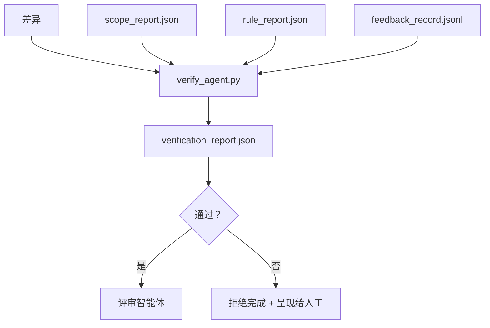

# 验证闸门

> 智能体不能自己宣布工作已经完成。验证闸门（verification gate）会读取范围契约、反馈日志、规则报告和差异，然后回答一个单一问题：这个任务真的完成了吗？如果闸门说没有，那么无论聊天记录怎么说，任务都还没完成。

**类型：** 构建
**语言：** Python（标准库，stdlib）
**前置条件：** 第 14 阶段 · 33（规则）, 第 14 阶段 · 36（范围）, 第 14 阶段 · 37（反馈）
**时间：** ~55 分钟

## 学习目标

- 将验证闸门定义为作用于工作台工件的确定性函数。
- 将规则报告、范围报告、反馈记录和差异合并成一个统一判定结果。
- 输出一个 `verification_report.json`，供评审智能体和 CI 共同读取。
- 对任何 `block` 严重级别的失败都拒绝推进任务，不作例外。

## 问题

智能体太容易宣布成功。主要有三种失败形态：

- “看起来不错。” 模型读了自己的差异，然后认定它是正确的。
- “测试通过了。” 说得很有把握，但没有任何测试实际运行过的记录。
- “满足验收。” 对验收标准的解释宽松到几乎把“任何看起来像完成的东西”都算作完成。

工作台的修复方式是：设置一个统一的验证闸门，去读取智能体已经产出的工件，并由它来拍板。闸门是确定性的。闸门受版本控制。闸门接入 CI。智能体无法收买它。

## 概念



### 闸门会检查什么

| 检查项 | 来源工件 | 严重级别 |
|-------|-----------------|----------|
| 所有验收命令都已运行 | `feedback_record.jsonl` | `block` |
| 所有验收命令都以零退出 | `feedback_record.jsonl` | `block` |
| 范围检查没有禁止写入 | `scope_report.json` | `block` |
| 范围检查没有越界写入 | `scope_report.json` | `block` 或 `warn` |
| 所有 `block` 严重级别规则都通过 | `rule_report.json` | `block` |
| 反馈中没有 `null` 退出码 | `feedback_record.jsonl` | `block` |
| 被触碰文件匹配 `scope.allowed_files` | 两者 | `warn` |

`warn` 级别发现会给判定结果加注释；`block` 级别发现会阻止 `passed: true`。

### 要确定性，不要概率性

对于同一组工件，闸门每次都必须产出相同的判定结果。不要用 LLM 做裁判。LLM 裁判应放在评审侧（第 14 阶段 · 39），那里的目标是定性评估，而不是状态判定。

### 一份报告，一条路径

每次任务收尾时，闸门只输出一份 `verification_report.json`，写到 `outputs/verification/&lt;task_id>.json` 下。CI 消费的也是这一路径。多个闸门配不同路径，就会把事实来源分叉。

### 无例外地拒绝

`block` 严重级别的发现不能被智能体自行覆盖。它们只能由人工覆盖，并且必须记录 `override_reason` 和 `overridden_by` 用户 ID。覆盖是一项签名变更，不是智能体的决定。

## 动手构建

`code/main.py` 实现了：

- 每种输入工件都有一个加载器，并且都在本地做了桩替身，因此本课可以自包含运行。
- 一个纯函数 `verify(task_id, artifacts) -> VerdictReport`。
- 一个打印器，用来展示每个检查项的结果以及最终的通过/失败。
- 一个演示，包含三种任务场景：干净通过、范围蔓延、缺失验收。

运行：

```
python3 code/main.py
```

输出：三份判定报告，每一份都会保存在脚本旁边。

## 真实生产中的模式

有四种模式，能把这个闸门从“又一个静态检查任务”提升为“真正拍板的边界”。

**纵深防御，而不是单一闸门。** 提交前钩子（pre-commit 钩子（hook））→ CI 状态检查（status check）→ 工具调用前授权钩子 → 合并前闸门（pre-merge gate）。每一层都是确定性的，因此某一层漏掉的失败，会被下一层捕获。microservices.io 在 2026 年 3 月的操作手册里说得很明确：提交前钩子是不可绕过的，因为与模型侧技能不同，它不依赖智能体是否遵从指令。验证闸门位于 CI / 合并前闸门这一层。

**用确定性检查做防御，把模型裁判（model-judge）只留给细微判断。** Anthropic 在 2026 年提出的 Hybrid Norm 搭配方式是：可验证奖励（单元测试、模式检查、退出码）回答“代码是否解决了问题？”——LLM 评分规则回答“代码是否可读、安全、符合风格？” 闸门运行第一类；评审者（第 14 阶段 · 39）运行第二类。把两者混在一起会让信号坍塌。

**要有签名覆盖日志，而不是 Slack 线程。** 每次覆盖都要在 `outputs/verification/overrides.jsonl` 中写入一行，包含：时间戳、发现代码、原因、签名用户、当前 `HEAD` 提交。运行时会拒绝任何缺少签名的覆盖；审计轨迹由 Git 跟踪。这就是“有覆盖策略”和“只有覆盖表演”之间的分界线。

**把覆盖率下限作为一级检查。** `coverage_report.json` 会为 `coverage_floor`（默认 80%）检查提供输入。如果测得覆盖率低于下限，或比上一次合并的下限低超过 1 个百分点，闸门就失败。没有这一检查时，智能体会悄悄删除失败的测试，而验证报告仍然一路绿灯。

**`--strict` 模式会把 `warn` 提升为 `block`。** 对发布分支、会阻塞上线的 PR，或者事故后的分诊处理，`--strict` 会把每一条警告都变成硬失败。这个标志是按分支选择启用的，而不是全局默认，因为“处处严格”会侵蚀日常工作流。

## 使用方式

生产模式：

- **CI 步骤。** 一个 `verify_agent` 任务会针对智能体最终产出的工件运行闸门。没有 `passed: true`，合并保护就会拒绝。
- **交接前钩子。** 智能体运行时在生成交接文档之前调用闸门。没有绿色判定，就没有交接。
- **人工分诊。** 当智能体宣称成功但人工怀疑它时，操作员会读取该报告。

闸门是工作台流程中真正拍板的边界。其他所有工作面都位于它的上游。

## 交付

`outputs/skill-verification-gate.md` 会把闸门接入某个具体项目：哪些验收命令会送进闸门，哪些规则属于 `block` 严重级别，哪些越界写入可以容忍，以及覆盖审计日志如何存储。

## 练习

1. 添加一个 `coverage_floor` 检查：测试命令必须产出覆盖率报告，且至少达到 80%。决定由哪个工件携带这个下限。
2. 支持 `--strict` 模式，把每个 `warn` 都提升为 `block`。记录下哪些场景中严格模式应成为正确默认值。
3. 让闸门除了 JSON 之外，再额外产出一个 Markdown 摘要。为哪些字段应该进入摘要进行辩护。
4. 添加一个 `time_since_last_human_touch` 检查：任何在人类按键后 60 秒内编辑的文件，都可免于越界标记。
5. 在你产品中的一份真实智能体差异上运行这个闸门。有多少发现是真问题，又有多少只是噪声？闸门应在哪些地方继续生长？

## 关键术语

| 术语 | 人们常说的话 | 它真正的含义 |
|------|----------------|------------------------|
| 验证闸门 | “那个能拦住东西的检查” | 作用于工作台工件的确定性函数，产出通过/失败判定 |
| `block` 严重级别 | “硬失败” | 一种会阻止 `passed: true` 且需要签名覆盖的发现 |
| 覆盖日志 | “为什么我们让它过去了” | 带原因和用户 ID 的签名条目，由评审审计 |
| 验收命令 | “证明” | 零退出才意味着 `done` 的 Shell 命令 |
| 单一路径报告 | “事实来源” | `outputs/verification/&lt;task_id>.json`，CI 与人工共同读取 |

## 延伸阅读

- [Anthropic, Harness design for long-running application development](https://www.anthropic.com/engineering/harness-design-long-running-apps)
- [OpenAI Agents SDK guardrails](https://platform.openai.com/docs/guides/agents-sdk/guardrails)
- [microservices.io, GenAI dev platform: guardrails](https://microservices.io/post/architecture/2026/03/09/genai-development-platform-part-1-development-guardrails.html) — 提交前与 CI 之间的纵深防御
- [ICMD, The 2026 Playbook for Agentic AI Ops](https://icmd.app/article/the-2026-playbook-for-agentic-ai-ops-guardrails-costs-and-reliability-at-scale-1776661990431) — 审批闸门阶梯（草稿 → 审批 → 达到阈值后自动放行）
- [Type-Checked Compliance: Deterministic Guardrails (arXiv 2604.01483)](https://arxiv.org/pdf/2604.01483) — Lean 4 作为确定性闸门的上界
- [logi-cmd/agent-guardrails — merge gate spec](https://github.com/logi-cmd/agent-guardrails) — 范围 + 变异测试闸门
- [Guardrails AI x MLflow](https://guardrailsai.com/blog/guardrails-mlflow) — 把确定性验证器当作 CI 评分器
- [Akira, Real-Time Guardrails for Agentic Systems](https://www.akira.ai/blog/real-time-guardrails-agentic-systems) — 工具调用前/后的闸门
- 第 14 阶段 · 27 —— 提示注入防御（闸门的对抗配对）
- 第 14 阶段 · 36 —— 本闸门所执行的范围契约
- 第 14 阶段 · 37 —— 本闸门评分的反馈日志
- 第 14 阶段 · 39 —— 闸门将工作交给它的评审智能体
