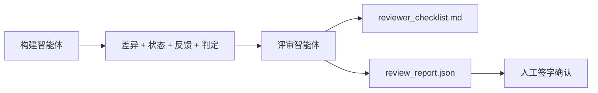

# 评审智能体：将构建者与打分者分开

> 写代码的那个智能体不能给自己的代码打分。评审者是第二个循环，拥有不同的系统提示词、不同的目标，并且对构建者产出的所有内容只有只读访问权限。构建者与评审者之间的这道间隙，承载了大部分可靠性。

**类型：** 构建
**语言：** Python（标准库，stdlib）
**前置条件：** 第 14 阶段 · 38（验证闸门）
**时间：** ~55 分钟

## 学习目标

- 说明为什么同一个智能体无法可靠地评审自己的工作。
- 构建一个评审智能体循环，消费构建者工件并产出结构化评审报告。
- 编写一个评审量表，按具体维度打分，而不是凭感觉。
- 将评审者接入工作台，让人工评审步骤从真实工件出发，而不是从零开始。

## 问题

你让智能体修一个缺陷。它编辑了四个文件，跑了测试，然后报告完成。验证闸门（第 14 阶段 · 38）确认验收已运行，范围也守住了。闸门给出 `passed: true`。你把它合并了。两天后你发现，这个修复只解决了问题的一半。

验收是必要条件，但不是充分条件。评审者会问那些验收无法提出的问题：它解决的是正确的问题吗？它是否在没有标记的情况下扩展了范围？它是否记录了本应被质疑的假设？它是否让工作台处于下一个会话可以顺畅接手的状态？

## 概念



### 评审量表

五个维度，每个维度 0 到 2 分。

| 维度 | 问题 |
|-----------|----------|
| 问题契合度 | 这次变更解决的是任务本身，而不是一个相邻问题吗？ |
| 范围纪律 | 编辑是否被限制在契约内，还是契约被有意地扩展了？ |
| 假设 | 所有隐藏假设是否都被写在某个可审查的位置？ |
| 验证质量 | 验收命令是否真的证明了目标，还是只证明了一个更弱的版本？ |
| 交接就绪度 | 下一个会话能否从当前状态干净地接手？ |

总分 10 分。低于 7 分为软失败（soft fail）；低于 5 分为硬失败（hard fail）。

### 评审者是独立角色，不一定是独立模型

你可以让评审者与构建者使用同一个模型。关键纪律在于角色分离：不同的系统提示词、不同的输入、对差异没有写权限。姿态的改变，就是信号的改变。

### 评审者不能编辑差异

评审者会读取差异、状态、反馈和判定结果。它写一份报告。它不会去修补差异。如果报告说“修这个”，那么下一轮构建者来修；评审者则继续回到评审。混合角色会破坏这道间隙。

### 评审量表与验证闸门

闸门（第 14 阶段 · 38）检查确定性事实：验收是否运行、规则是否通过、范围是否守住。评审者作出定性判断：这是不是正确的工作、是否有文档记录、交接是否可用。两者都不可缺少。

## 动手构建

`code/main.py` 实现了：

- 一个 `ReviewerInputs` 数据类（dataclass），把评审者会读取的工件打包在一起。
- 一个量表评分器，每个维度一个函数。为便于本课讲解，每个函数都是确定性的桩级实现；真实实现会调用 LLM。
- 一个 `review_report.json` 写入器，写出五个分数、总分和判定（`pass`、`soft_fail`、`hard_fail`）。
- 两个演示案例：一个干净变更，以及一个“测试正确、问题却错了”的变更。

运行：

```
python3 code/main.py
```

输出：两份写入磁盘的评审报告，以及一张展示各维度分数的控制台表格。

## 真实生产中的模式

数据摆在这里：Cloudflare 在 2026 年 4 月的 AI Code Review 系统中，30 天内在 5,169 个仓库的 48,095 个合并请求上运行了 131,246 次评审。评审完成的中位时间为 3 分 39 秒。最多会并行运行七个专家型评审者（安全、性能、代码质量、文档、发布管理、合规、Engineering Codex），再由一个评审协调者（Review Coordinator）负责去重发现并判断严重级别。最强档模型只留给协调者；专家评审者则运行在更便宜的档位上。

有四种模式能让这套机制在规模化下真正运作。

**要专家池，不要一个巨型评审者。** 对个人仓库而言，一个带 5 维量表的评审者已经够用。一旦代码库同时存在安全关键、性能关键和文档工作面，就应该拆成多个专家评审者，并为它们写更小的提示词。协调者负责去重；专家们不跑完整量表。模型分层也就顺势而出：便宜的专家，昂贵的协调者。

**偏差缓解应是设计要求，而不是优化项。** LLM 裁判存在四种稳定偏差（Adnan Masood，2026 年 4 月）：位置偏差（GPT-4 在 (A,B) 与 (B,A) 顺序下约有 40% 不一致）、冗长度偏差（更长输出大约会被多打 15% 分）、自我偏好（裁判偏爱来自同一模型家族的输出）、权威偏差（裁判会高估对知名作者的引用）。缓解手段包括：同时评估两种顺序，只统计一致胜出；使用明确奖励简洁性的 1-4 评分尺度；在不同模型家族之间轮换裁判；在评分前去掉作者名。

**要校准集，不要凭感觉。** 准备一组 10 到 20 个历史任务收尾样本，并且这些样本拥有已知正确判定。每次改提示词时，都让评审者在这组样本上跑一遍。如果与历史记录的一致率低于 80%，量表就必须修订后才能上线。所有团队最终都会重新发现这一点；不如一开始就把它建立起来。

**与闸门组成混合规范。** 验证闸门（第 14 阶段 · 38）负责确定性检查（验收是否运行、测试是否通过、范围是否守住）。评审者负责语义检查（这是不是正确的工作、假设是否有文档记录、交接是否可用）。Anthropic 在 2026 年的指导对此拆分说得很明确：不要让评审者去重做闸门已经证明的事情。

## 使用方式

生产模式：

- **Claude Code 子智能体。** 构建者关闭任务后，一个评审子智能体开始运行。它会在 PR 上发布一条带量表分数的评论。
- **OpenAI Agents SDK 交接（handoffs）。** 构建者在任务完成时交接给评审者。评审者可以带着发现列表交回去，或者继续上交给人工。
- **双模型配对。** 构建者运行在更快、更便宜的模型上。评审者运行在更强的模型上，但上下文更小，专注于判断。

当人工无法亲自完成每一次评审时，评审者就是工作台长出来的第二双眼睛。

## 交付

`outputs/skill-reviewer-agent.md` 会生成一个项目专属的评审量表、一个接到构建者工件上的评审智能体桩实现，以及与验证闸门的集成，让人工评审从一份书面报告开始，而不是面对一张白纸。

## 练习

1. 添加一个与你产品领域相关的第六维。说明为什么它不能被现有五维吸收。
2. 用两个不同的系统提示词（简洁、冗长）运行评审者。哪一种更可能产出人工愿意读的报告？
3. 为每个维度添加一个 `confidence` 字段。当最低维度的置信度低于 0.6 时，拒绝发布该报告。
4. 构建一个校准集：10 个历史任务收尾样本，并附已知正确判定。让评审者在它们上面运行。它在哪些地方与历史记录不一致？
5. 增加一个“请求更多证据”的交互：评审者可以在打分前要求构建者执行某个特定测试。怎样的退让机制才不会让它陷入循环？

## 关键术语

| 术语 | 人们常说的话 | 它真正的含义 |
|------|----------------|------------------------|
| 评审量表 | “检查清单” | 五维 0-2 评分，每个维度都有书面问题 |
| 软失败 | “需要修改” | 总分低于 7 分；构建者会收到待处理发现 |
| 硬失败 | “拒绝” | 总分低于 5 分或任一维度为 0；停止并呈现给人工 |
| 角色分离 | “不同的提示词” | 同一个模型也能担任两个角色；关键纪律在输入和姿态 |
| 置信度下限 | “不要发布低信号报告” | 当量表不确定时，拒绝输出判定 |

## 延伸阅读

- [OpenAI Agents SDK handoffs](https://platform.openai.com/docs/guides/agents-sdk/handoffs)
- [Anthropic Claude Code subagents](https://docs.anthropic.com/en/docs/agents-and-tools/claude-code/sub-agents)
- [Cloudflare, Orchestrating AI Code Review at Scale](https://blog.cloudflare.com/ai-code-review/) — 7 专家 + 1 协调者架构，30 天 / 13.1 万次运行
- [Agent-as-a-Judge: Evaluating Agents with Agents (OpenReview / ICLR)](https://openreview.net/forum?id=DeVm3YUnpj) — DevAI 基准，366 条分层解决要求
- [Adnan Masood, Rubric-Based Evaluations and LLM-as-a-Judge: Methodologies, Biases, Empirical Validation](https://medium.com/@adnanmasood/rubric-based-evals-llm-as-a-judge-methodologies-and-empirical-validation-in-domain-context-71936b989e80) — 四类偏差与缓解方法
- [MLflow, LLM-as-a-Judge Evaluation](https://mlflow.org/llm-as-a-judge) — 将构建者/评估者分离的生产工具链
- [LangChain, How to Calibrate LLM-as-a-Judge with Human Corrections](https://www.langchain.com/articles/llm-as-a-judge) — 校准集工作流
- [Evidently AI, LLM-as-a-judge: a complete guide](https://www.evidentlyai.com/llm-guide/llm-as-a-judge)
- [Arize, LLM as a Judge — Primer and Pre-Built Evaluators](https://arize.com/llm-as-a-judge/)
- 第 14 阶段 · 05 —— Self-Refine 与 CRITIC（单智能体自评基线）
- 第 14 阶段 · 30 —— 以评估驱动的智能体开发（校准集生成器）
- 第 14 阶段 · 38 —— 评审者读取的验证闸门
- 第 14 阶段 · 40 —— 评审报告所馈入的交接包
