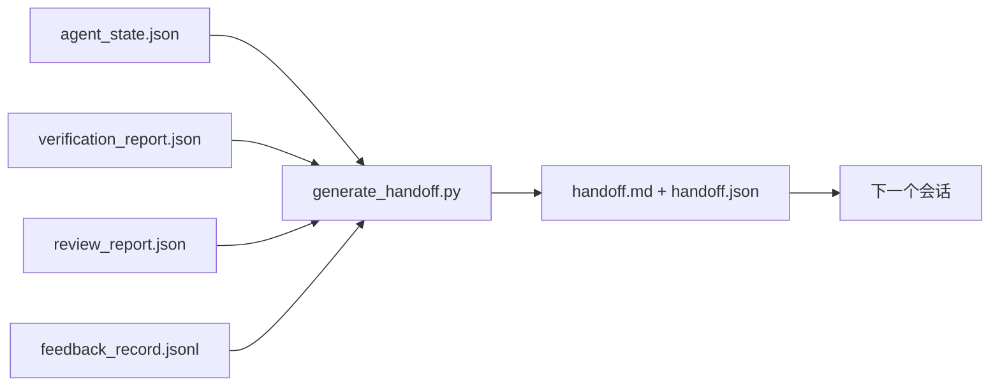

# 多会话交接

> 会话即将结束，但工作不会。交接包是一种工件，它能把“智能体工作了一小时”变成“下一个会话在第一分钟就有产出”。要有意识地构建它，而不是事后顺手补一个。

**类型：** 构建
**语言：** Python（标准库，stdlib）
**前置条件：** 第 14 阶段 · 34（仓库记忆）, 第 14 阶段 · 38（验证）, 第 14 阶段 · 39（评审）
**时间：** ~50 分钟

## 学习目标

- 识别每个交接包都需要的七个字段。
- 不手写散文，而是直接从工作台工件生成交接内容。
- 将庞大的反馈日志裁剪成交接尺寸的摘要。
- 让下一个会话的第一步变成确定性的动作。

## 问题

会话结束了。智能体说：“很好，我们取得了进展。” 下一个会话打开了。下一个智能体问：“我们上次停在哪了？” 第一个智能体的答案已经消失了。下一个智能体重新探索、重新运行相同命令、重新问人工相同问题，然后花三十分钟找回上一个会话最后三十秒的状态。

糟糕交接的成本，会在任务生命周期中的每一个会话里持续支付。解决办法是在会话结束时自动生成一个交接包：改了什么、为什么改、试过什么、什么失败了、还剩什么，以及下次首先该做什么。

## 概念



### 每个交接都携带的七个字段

| 字段 | 它回答的问题 |
|-------|---------------------|
| `summary` | 用一段话说明完成了什么 |
| `changed_files` | 一眼看懂差异 |
| `commands_run` | 实际执行了哪些命令 |
| `failed_attempts` | 试过什么、为什么没成功 |
| `open_risks` | 下个会话可能踩到什么坑，以及严重级别 |
| `next_action` | 下个会话首先采取的具体步骤 |
| `verdict_pointer` | 指向验证报告与评审报告的路径 |

`next_action` 字段是整个结构的承重件。一个除了 `next_action` 之外什么都有的交接，只是状态报告，不是交接。

### 交接是生成出来的，不是手写出来的

手写交接，意味着在艰难的一天它最容易被跳过。生成器读取工作台工件并输出交接包。智能体的职责，是把工作台留在一个生成器能够总结的状态，而不是自己去写总结。

### 两种形式：人类可读与机器可读

`handoff.md` 给人类阅读。`handoff.json` 给下一个智能体加载。两者都来自同一组源工件。如果二者发生分歧，以 JSON 为准。

### 反馈日志裁剪

完整的 `feedback_record.jsonl` 可能有数百条记录。交接包只携带最后 K 条，再加上所有非零退出的条目。下一个会话如果需要，可以加载完整日志；但交接包本身保持小巧。

## 动手构建

`code/main.py` 实现了：

- 一个加载器，把状态、判定、评审和反馈汇集成单个 `WorkbenchSnapshot`。
- 一个 `generate_handoff(snapshot) -> (markdown, payload)` 函数。
- 一个过滤器，选择最后 K 条反馈记录以及所有非零退出。
- 一次演示运行，会在脚本旁边写出 `handoff.md` 和 `handoff.json`。

运行：

```
python3 code/main.py
```

输出：打印出来的交接正文，以及磁盘上的两个文件。

## 真实生产中的模式

Codex CLI、Claude Code 和 OpenCode 各自提供了不同的上下文压缩（compaction）方案；结构化交接包则架在这三者之上。

**压缩策略可以不同；交接包模式不会变。** Codex CLI 的 POST /v1/responses/compact 是服务端的黑盒 AES 二进制块（blob，面向 OpenAI 模型的快速路径）；回退方案则是在本地追加一条 `_summary` 的用户角色消息。Claude Code 会在上下文达到 95% 时执行五阶段渐进压缩。OpenCode 则采用基于时间戳的消息隐藏，再加一个五标题的 LLM 摘要。三种不同机制，对应同一种需求：把压缩后仍需保留的内容序列化成一个可移植工件。交接包就是这个工件。

**全新会话交接不是压缩。** 压缩是在延长同一个会话；交接则是干净地结束一个会话并开启下一个。Hermes Issue #20372（2026 年 4 月）的表述是对的：当原地压缩开始损害质量时，智能体就应该写一个紧凑交接、结束当前会话，然后在全新的上下文中继续。交接包让这种切换变得便宜。错误做法是一路压缩直到质量崩塌；正确做法是提前预算一次更早、更干净的交接。

**每个分支、每个主题只保留一个活动交接。** 多智能体协作更容易被过期交接拖垮，而不是被糟糕模型输出拖垮。始终包含 `branch`、`last_known_good_commit`，以及像 `active | superseded | archived` 这样的 `status`。过期交接要归档；只有活动交接驱动下一个会话。这就是“交接作为笔记”和“交接作为状态”之间的区别。

**在上下文用到 50-75% 时就收尾，而不是撞墙再说。** 基于手写模式的操作手册（CLAUDE.md + HANDOVER.md）报告说，当会话在 50-75% 上下文预算时结束，而不是拖到 95%，效果最好。生成器会在压缩伪影污染源状态之前干净运行。上下文还完整时写它很便宜；模型已经开始迷路时写它就很昂贵。

## 使用方式

生产模式：

- **会话结束钩子。** 当用户关闭聊天时，运行时触发生成器。交接包写入 `outputs/handoff/&lt;session_id>/`。
- **PR 模板。** 生成器输出的 Markdown 也可以直接作为 PR 正文。评审者无需再打开其他五个文件。
- **跨智能体交接。** 用一个产品（Claude Code）开始，用另一个产品（Codex）继续。交接包就是通用语。

交接包小、规整、生成成本低。它节省的成本会随着每个会话不断复利。

## 交付

`outputs/skill-handoff-generator.md` 会生成一个针对项目工件路径调优过的生成器、一个在会话结束时运行它的钩子，以及一个供下一个智能体启动时读取的 `handoff.json` 模式。

## 练习

1. 添加一个 `assumptions_to_validate` 字段，暴露构建者记录过、但评审者未给出高于 1 分评价的每个假设。
2. 对失败运行与成功运行采用不同的反馈摘要裁剪方式。为这种不对称进行辩护。
3. 加入一个“给人工的问题”列表。一个问题要达到什么阈值，才能进入交接包，而不是只留在聊天消息里？
4. 让生成器具备幂等性：运行两次会产出同一个交接包。要满足这一点，哪些内容必须保持稳定？
5. 添加一个“下个会话前置条件”部分，精确列出下个会话在行动前必须加载哪些工件。

## 关键术语

| 术语 | 人们常说的话 | 它真正的含义 |
|------|----------------|------------------------|
| 交接包 | “会话摘要” | 一个生成式工件，携带七个字段，同时提供 Markdown 与 JSON |
| 下一步动作 | “先做什么” | 启动下一个会话的那一个具体步骤 |
| 反馈裁剪 | “日志摘要” | 最后 K 条记录，加上所有非零退出 |
| 状态报告 | “我们做了什么” | 一个缺少 `next_action` 的文档；有用，但不是交接 |
| 判定指针 | “凭据” | 指向验证报告与评审报告的路径，用于可追踪性 |

## 延伸阅读

- [Anthropic, Effective harnesses for long-running agents](https://www.anthropic.com/engineering/effective-harnesses-for-long-running-agents)
- [OpenAI Agents SDK handoffs](https://platform.openai.com/docs/guides/agents-sdk/handoffs)
- [Codex Blog, Codex CLI Context Compaction: Architecture, Configuration, Managing Long Sessions](https://codex.danielvaughan.com/2026/03/31/codex-cli-context-compaction-architecture/) — POST /v1/responses/compact 与本地回退方案
- [Justin3go, Shedding Heavy Memories: Context Compaction in Codex, Claude Code, OpenCode](https://justin3go.com/en/posts/2026/04/09-context-compaction-in-codex-claude-code-and-opencode) — 三家产品的压缩机制对比
- [JD Hodges, Claude Handoff Prompt: How to Keep Context Across Sessions (2026)](https://www.jdhodges.com/blog/ai-session-handoffs-keep-context-across-conversations/) — CLAUDE.md + HANDOVER.md，50-75% 上下文预算
- [Mervin Praison, Managing Handoffs in Multi-Agent Coding Sessions: Fresh Context Without Losing Continuity](https://mer.vin/2026/04/managing-handoffs-in-multi-agent-coding-sessions-fresh-context-without-losing-continuity/) — 分布式系统视角
- [Hermes Issue #20372 — automatic fresh-session handoff when compression becomes risky](https://github.com/NousResearch/hermes-agent/issues/20372)
- [Hermes Issue #499 — Context Compaction Quality Overhaul](https://github.com/NousResearch/hermes-agent/issues/499) — Codex CLI 中面向交接的提示词
- [Microsoft Agent Framework, Compaction](https://learn.microsoft.com/en-us/agent-framework/agents/conversations/compaction)
- [OpenCode, Context Management and Compaction](https://deepwiki.com/sst/opencode/2.4-context-management-and-compaction)
- [LangChain, Context Engineering for Agents](https://www.langchain.com/blog/context-engineering-for-agents)
- 第 14 阶段 · 34 —— 生成器读取的状态文件
- 第 14 阶段 · 38 —— 交接包指向的验证判定
- 第 14 阶段 · 39 —— 被打包进交接包的评审报告
