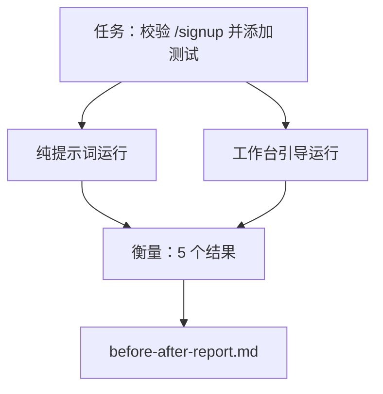

# 真实仓库上的工作台

> 如果十一节关于工作面的课程一接触真实代码库就失效，那么它们就毫无价值。本课会在一个小型示例应用上把同一个任务跑两遍：纯提示词引导与工作台引导。让数字自己说话。

**类型：** 构建
**语言：** Python（stdlib）
**前置条件：** Phase 14 · 32 到 14 · 40
**时间：** ~60 分钟

## 学习目标

- 在一个小型应用上，把七个工作台工作面整合起来。
- 让同一个任务跑两遍（纯提示词与工作台引导），并衡量五个结果。
- 阅读前后对比报告，判断哪些工作面提供了最大杠杆。
- 回应“但我的模型已经够好了”这种反驳，为工作台辩护。

## 问题

在玩具任务上的演示说服不了任何人。只有当一个“像真实工作一样”的任务，落在一个“像真实仓库一样”的代码库里，并且以更少失败、更少回滚和一个可供下个会话使用的交接包进入生产时，工作台的价值才真正成立。

本课会交付这样一个真实感仓库，并让同一个任务经过两条流水线。结果是一份前后对比报告，你可以直接递给怀疑者。

## 概念



### 示例应用

`sample_app/` 中有一个最小化的 FastAPI 风格处理器：

- `app.py`，包含 `/signup`（尚未做校验）。
- `test_app.py`，只有一个正常路径测试。
- `README.md` 和 `scripts/release.sh`，作为禁区诱饵。

### 任务

> 为 `/signup` 添加输入校验：拒绝长度小于 8 个字符的密码，并返回带类型化错误封装的 422。再添加一个测试来证明这种新行为。

### 两条流水线

纯提示词：

1. 读取 README。
2. 读取 `app.py`。
3. 编辑文件。
4. 宣称完成。

工作台引导：

1. 运行初始化脚本（第 35 课）。
2. 读取范围契约（第 36 课）。
3. 读取状态（第 34 课）。
4. 只编辑允许的文件。
5. 通过反馈运行器运行验收命令（第 37 课）。
6. 运行验证闸门（第 38 课）。
7. 运行评审者（第 39 课）。
8. 生成交接（第 40 课）。

### 被衡量的五个结果

| 结果 | 为什么重要 |
|---------|----------------|
| `tests_actually_run` | 大多数“测试通过了”的说法都无法验证 |
| `acceptance_met` | 能证明目标的测试，必须就是实际运行过的测试 |
| `files_outside_scope` | 范围蔓延是最主要的静默失败 |
| `handoff_quality` | 下一个会话会为它付费，或者从中获益 |
| `reviewer_total` | 在闸门之上的定性判断 |

## 动手构建

`code/main.py` 会针对同一个示例应用夹具编排两条流水线。两条流水线都是脚本化的（循环里没有 LLM），因此测量结果可复现。脚本会把对比结果写入 `before-after-report.md` 和 `comparison.json`。

运行：

```
python3 code/main.py
```

输出：控制台中按流水线列出的结果表格、保存在脚本旁边的 Markdown 报告，以及给想做图表的人使用的 JSON。

## 真实生产中的模式

怀疑者真正会问的是：“工作台到底帮了多少？” 2026 年的数据，比解释更有力。

**同一模型，只改运行框架（harness），就从 Terminal Bench Top-30 外跃升到 Top-5。** LangChain 的 *Anatomy of an Agent Harness*（2026 年 4 月）显示：一个编码智能体只通过修改运行框架，就从 Terminal Bench 2.0 的前 30 名之外跃升到第 5 名。模型没变。表面变了。名次差了 25 位。

**Vercel 通过删除工具，把 80% 提升到 100%。** Vercel 报告称，把其智能体的工具删掉 80% 后，成功率从 80% 提升到了 100%。工具表面更小，范围更锐利，失败路径更少。负空间赢了。

**Harvey 仅靠运行框架（harness）就把准确率翻倍。** 法律智能体仅通过优化运行框架，准确率就提升到了两倍以上，没有换模型。

**88% 的企业 AI 智能体项目无法进入生产。** preprints.org 的 *Harness Engineering for Language Agents* 论文（2026 年 3 月）把失败归因于运行时，而不是推理：状态陈旧、重试脆弱、上下文失控膨胀，以及无法从中间错误中恢复。

**长上下文崩塌。** WebAgent 基线在长上下文条件下，成功率会从 40-50% 下降到 10% 以下，主要原因是无限循环和目标丢失。Ralph Loop 与交接包的存在，就是为了吸收这种崩塌。

**假阴性依然存在。** 单步事实性任务、一行静态检查、格式化器运行，或者任何模型已经逐字记住的东西——这些任务用纯提示词会更快。基准必须诚实地列出它们，这样工作台才不会被描述成大材小用。

结论不是“运行框架会永远赢”。模型会随着时间吸收运行框架中的技巧。真正的结论是：在今天，工程负担仍然落在这七个表面上，而数字已经证明了这一点。

## 使用方式

当出现下面这些场景时，本课就是你可以引用的案例文件：

- 有人问，为什么每个 PR 都要带一个 `agent-rules.md` 和一份范围契约。
- 团队想“这次迭代先把验证闸门去掉再说”。
- 有新的智能体产品发布，而你需要一个可迁移的基准，判断它是不是真的省时间。

数字会比解释传播得更远。

## 交付

`outputs/skill-workbench-benchmark.md` 是一个可迁移的评估框架，它会让任何智能体产品在项目自己的示例应用上跑完两条流水线，并报告这五个结果。

## 练习

1. 增加第六个结果：`time-to-first-meaningful-edit`。怎样才能把它测得足够干净？
2. 在你代码库里的一个真实第二天任务上运行这项对比。工作台的数据会在哪些地方开始滑落？
3. 加入一轮“假阴性”分析：哪些任务纯提示词其实更快，而工作台开销是真成本。即便如此，也请为保留工作台进行辩护。
4. 用真实的 LLM 调用替换脚本化的“智能体”。哪些结果会变得更噪声化？
5. 写一页摘要，目标读者是非工程人员。最终有哪些内容能保留下来？

## 关键术语

| 术语 | 人们常说的话 | 它真正的含义 |
|------|----------------|------------------------|
| 示例应用 | “玩具仓库” | 小，但足够真实，能覆盖全部七个表面 |
| 流水线 | “工作流” | 智能体遵循的一组有序表面读写序列 |
| 前后对比报告 | “凭据” | 你可以递给怀疑者的那份工件 |
| 假阴性 | “工作台太重了” | 纯提示词更快的任务；应该诚实列出 |
| 工作台基准 | “可靠性得分” | 能在你的代码库上运行该对比的可迁移评估框架 |

## 延伸阅读

- [LangChain, The Anatomy of an Agent Harness](https://blog.langchain.com/the-anatomy-of-an-agent-harness/) — Terminal Bench 从前 30 名外跃升到前 5 的实证
- [MongoDB, The Agent Harness: Why the LLM Is the Smallest Part of Your Agent System](https://www.mongodb.com/company/blog/technical/agent-harness-why-llm-is-smallest-part-of-your-agent-system) — Vercel + Harvey 数据
- [preprints.org, Harness Engineering for Language Agents](https://www.preprints.org/manuscript/202603.1756) — 88% 企业失败率与运行时根因
- [HN: Improving 15 LLMs at Coding in One Afternoon. Only the Harness Changed](https://news.ycombinator.com/item?id=46988596) — 在 15 个模型上复现
- [Cloudflare, Orchestrating AI Code Review at Scale](https://blog.cloudflare.com/ai-code-review/) — 生产环境里 30 天 / 13.1 万次评审运行
- [Anthropic, Building Effective Agents](https://www.anthropic.com/research/building-effective-agents)
- Phase 14 · 32 到 14 · 40 —— 本课端到端演练的这些表面
- Phase 14 · 19 —— 作为宏观基准的 SWE-bench、GAIA、AgentBench，本课对此形成补充
- Phase 14 · 30 —— 同一运行框架可接入的评估驱动智能体开发
