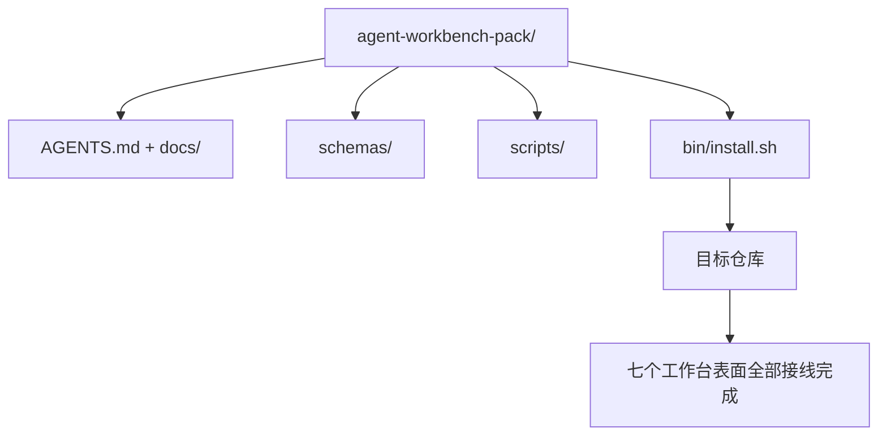

# 毕业项目：交付一个可复用的智能体工作台包

> 这条迷你主线最终会产出一个可以直接丢进任意仓库的工作台包。关于表面的十一节课，被压缩进一个你可以 `cp -r` 到任何仓库里的目录，让智能体第二天早上就能可靠工作。这个毕业项目，就是整套课程真正拿来交换价值的工件。

**类型：** 构建
**语言：** Python（stdlib）
**前置条件：** Phase 14 · 31 到 14 · 41
**时间：** ~75 分钟

## 学习目标

- 把七个工作台表面打包成一个可直接落地的目录。
- 固定模式、脚本和模板，让新仓库获得一个已知可靠的基线。
- 添加一个单一安装脚本，以幂等方式铺设整个工作台包。
- 决定哪些内容应该留在包里，哪些应该留在外面，并为每一刀裁剪进行辩护。

## 问题

如果一个工作台散落在 Google Doc、聊天历史和三个只记得一半的脚本里，那它就会每个季度被重建一次。解药是一个带版本的工作台包：一个仓库或目录，里面装着表面、模式、脚本，以及一个单命令安装器。

完成本课后，你会把 `outputs/agent-workbench-pack/` 真正交付到磁盘上，并拥有一个 `bin/install.sh`，可以把它安装到任何目标仓库中。

## 概念



### 工作台包布局

```
outputs/agent-workbench-pack/
├── AGENTS.md
├── docs/
│   ├── agent-rules.md
│   ├── reliability-policy.md
│   ├── handoff-protocol.md
│   └── reviewer-rubric.md
├── schemas/
│   ├── agent_state.schema.json
│   ├── task_board.schema.json
│   └── scope_contract.schema.json
├── scripts/
│   ├── init_agent.py
│   ├── run_with_feedback.py
│   ├── verify_agent.py
│   └── generate_handoff.py
├── bin/
│   └── install.sh
└── README.md
```

### 什么应该保留，什么应该剔除

保留：

- 表面模式。它们就是契约。
- 上面那四个脚本。它们就是运行时。
- 那四份文档。它们就是规则与量表。

剔除：

- 项目特定任务。任务属于目标仓库的看板，不属于工作台包。
- 厂商 SDK 调用。工作台包应与框架无关。
- 入门说明性文本。工作台包应与团队现有的入门文档并列存在，而不是把它包进去。

### 安装器

一个简短的 `bin/install.sh`（或 `bin/install.py`）：

1. 在没有 `--force` 时，拒绝覆盖已经存在的工作台包。
2. 将工作台包复制进目标仓库。
3. 如果存在 `.github/workflows/`，则接好 CI。
4. 打印下一步：填充看板、设置验收命令、运行初始化脚本。

### 版本控制

工作台包携带一个 `VERSION` 文件。需要迁移的模式升级和脚本变更，会提升主版本号（major）。仅文档变更，则提升补丁版本号（patch）。目标仓库中的 `agent_state.json` 会记录它最初是用哪个工作台包版本初始化的。

## 动手构建

`code/main.py` 会在课程旁边的 `outputs/agent-workbench-pack/` 中组装这个工作台包，内容来自这条迷你主线前面课程中的模式与脚本，以及你已经写好的文档。

运行：

```
python3 code/main.py
```

脚本会复制并固定这些表面、写出 README、打印工作台包树，并以零退出结束。重复运行是幂等的。

## 真实生产中的模式

只有当一个工作台包能挺过分叉、更新以及一个不友好的上游时，它才有价值。有四种模式能让这件事成立。

**`VERSION` 才是契约，不是营销说法。** 主版本号升级（major）需要状态迁移。次版本号升级（minor）需要重新运行检查器。补丁版本号升级（patch）只涉及文档。安装器每次安装时都会把 `.workbench-version` 写进目标仓库；当目标仓库中的锁定版本与工作台包的 `VERSION` 不一致时，`lint_pack.py` 会拒绝发布。这就是 `npm`、`Cargo` 和 `pyproject.toml` 能穿越十年变动的方式；智能体并不会改变这些规则。

**跨工具分发要有单一来源。** Nx 提供了一个 `nx ai-setup`，从同一份配置生成 `AGENTS.md`、`CLAUDE.md`、`.cursor/rules/`、`.github/copilot-instructions.md` 和一个 MCP 服务器。工作台包也应该如此；安装器负责发出符号链接（`ln -s AGENTS.md CLAUDE.md`），让单一事实来源扇出到每个编码智能体。为了支持某个工具而把工作台包分叉出去，本身就是一种失败模式。

**`uninstall.sh` 在遇到非平凡状态时必须拒绝执行。** 卸载工作台包时，绝不能删除用户的 `agent_state.json`、`task_board.json` 或 `outputs/`。卸载器应移除模式、脚本、文档和 `AGENTS.md`（可通过 `--keep-agents-md` 选择保留），并在状态文件存在任何未提交变更时拒绝继续。状态属于用户；工作台包并不拥有它。

**把技能当作可发布物：类似 SkillKit 的分发方式。** 工作台包可以作为一个 SkillKit 技能发布：`skillkit install agent-workbench-pack` 会从单一来源把它铺到 32 种 AI 智能体上。工作台包仓库是事实来源；SkillKit 是分发通道。厂商锁定会坍塌，而七个表面保持不变。

## 使用方式

工作台包通常以三种方式交付：

- **作为一个直接丢进仓库的目录。** `cp -r outputs/agent-workbench-pack /path/to/repo`
- **作为公开模板仓库。** 先派生再定制，用 `VERSION` 控制漂移。
- **作为 SkillKit 技能。** 接入你的智能体产品，让一条命令完成铺设。

工作台包是配方。每次安装，都是一份上桌的成品。

## 交付

`outputs/skill-workbench-pack.md` 会生成一个面向具体项目调优过的工作台包：规则根据团队历史收紧，范围 glob 模式与仓库匹配，量表维度再扩展一条领域特定项。

## 练习

1. 决定哪一份可选的第五文档值得升级进规范工作台包。为这次裁剪进行辩护。
2. 用 Python 重写安装器，并加入 `--dry-run` 标志。比较它与 Bash 的易用性。
3. 添加一个 `bin/uninstall.sh`，安全移除工作台包，并在状态文件有非平凡历史时拒绝执行。什么算“非平凡”？
4. 添加一个 `lint_pack.py`，当工作台包与 `VERSION` 漂移时让它失败。把它接入工作台包仓库自己的 CI。
5. 写一份从手工工作台迁移到这个工作台包的迁移运行手册。怎样的操作顺序能把停机时间降到最低？

## 关键术语

| 术语 | 人们常说的话 | 它真正的含义 |
|------|----------------|------------------------|
| 工作台包 | “启动套件” | 一个带版本的目录，携带全部七个表面 |
| 安装器 | “安装脚本” | 以幂等方式铺设工作台包的 `bin/install.sh` |
| 工作台包版本 | “VERSION” | 模式/脚本变更升主版本号，仅文档变更升补丁版本号 |
| 即插即用工作台包 | “cp -r 然后开跑” | 第一天无需逐仓库定制也能工作 |
| 可派生模板 | “GitHub 模板” | 可以通过 GitHub 的 “Use this template” 克隆的公开仓库 |

## 延伸阅读

- Phase 14 · 31 到 14 · 41 —— 这个工作台包打包进去的全部表面
- [SkillKit](https://github.com/rohitg00/skillkit) — 在 32 种 AI 智能体之间安装这个技能
- [Nx Blog, Teach Your AI Agent How to Work in a Monorepo](https://nx.dev/blog/nx-ai-agent-skills) — 跨六种工具的单一来源生成器
- [agents.md — the open spec](https://agents.md/) — 你的工作台包路由器必须实现的内容
- [HKUDS/OpenHarness](https://github.com/HKUDS/OpenHarness) — 与工作台包等价的参考实现
- [andrewgarst/agentic_harness](https://github.com/andrewgarst/agentic_harness) — 基于 Redis、带评估套件的参考实现
- [Augment Code, A good AGENTS.md is a model upgrade](https://www.augmentcode.com/blog/how-to-write-good-agents-dot-md-files) — 工作台包文档的质量门槛
- [Anthropic, Effective harnesses for long-running agents](https://www.anthropic.com/engineering/effective-harnesses-for-long-running-agents)
- [Anthropic, Harness design for long-running application development](https://www.anthropic.com/engineering/harness-design-long-running-apps)
- Phase 14 · 30 —— 会消费这个工作台包验证闸门的评估驱动智能体开发
- Phase 14 · 41 —— 这个工作台包要进一步改善的前后对比基准
