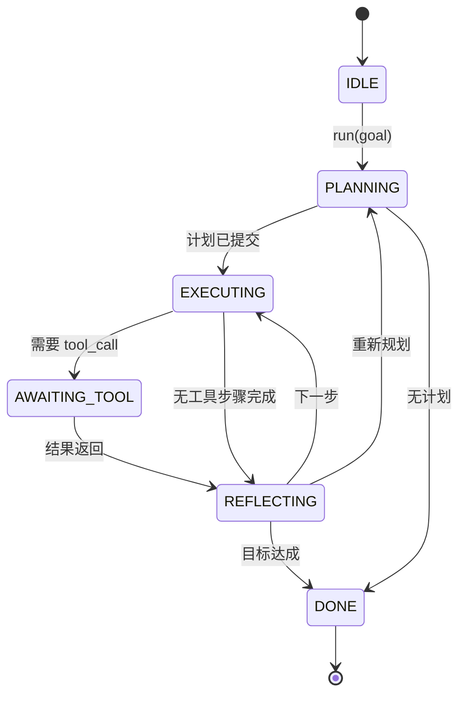

# 智能体运行框架循环契约

> 运行框架 (harness) 才是智能体 (agent)，模型 (model) 只是协处理器 (coprocessor)。本课会冻结一个循环契约，让你可以把任何模型接到里面。

**类型：** 构建
**语言：** Python
**前置条件：** 第 13 阶段课程 01-07，第 14 阶段课程 01
**时间：** ~90 分钟

## 学习目标
- 将智能体运行框架循环指定为带显式状态迁移的确定性状态机 (state machine)。
- 实现十个生命周期钩子 (lifecycle hook) 主题，供运维方接入策略、遥测和护栏。
- 定义两个拉取点 (pull point)，让循环把控制权交还给调用方，并在收到新输入后恢复。
- 在超限时，不泄露部分状态地强制执行每个会话的预算（轮次、工具调用、挂钟时间）。
- 发出包含十一种事件类型的强类型流，让下游 UI 和追踪器 (tracer) 无需直接检查循环即可订阅。

## 框架

一个能够无人值守运行四十轮的编码智能体，不是聊天循环。它是一个状态机：运维方可以拦截它的节点，也可以审计它的边。一旦你把契约写清楚，更换模型、工具或策略就不再是一次重构，而只是一次注册调用。

本课构建的就是这个契约。我们命名六个状态、十个钩子主题、两个拉取点、十一种事件类型，以及一个预算包络。运行框架中的其他部分（工具注册表、JSON-RPC 传输、调度器、规划器）都会接到这个形状上。

## 状态

循环有六个状态。五个是活跃状态，一个是终止状态。



`IDLE` 是唯一合法的入口点。`DONE` 是唯一合法的退出点。`AWAITING_TOOL` 是唯一会让出拉取点的状态。其他所有迁移都是内部行为。

这个状态机是确定性的。给定同一份事件日志，运行框架会重新进入同一个状态。正是这个性质让你可以在调试时回放会话，而不必再次调用模型。

## 钩子主题

钩子 (hook) 是运维方切入循环的接缝。运行框架会触发十个主题。每个主题都可以有任意数量的订阅者。订阅者按注册顺序触发。订阅者可以修改载荷、抛出异常以中止当前轮次，或返回一个哨兵值来跳过下一步。

```text
before_plan         after_plan
before_tool_call    after_tool_call
before_step         after_step
on_error
on_pause
on_budget_exceeded
on_complete
```

这种形状和 Claude Code、Cursor、OpenCode 到 2025 年中都收敛出的做法一致。名称是功能性的，不是品牌化的。阻止 `rm -rf` 的钩子放在 `before_tool_call`。上报 OpenTelemetry span 的钩子放在 `after_step`。在暂停会话恢复时运行的钩子放在 `on_pause`。

## 拉取点

循环会在两个时刻把控制权交出去。第一处是在 `AWAITING_TOOL`，当它没有工具结果就无法继续推进时。第二处是在 `on_pause`，当预算耗尽，或钩子显式请求人工审核时。

拉取点不是异常，而是一次返回。调用方检查运行框架状态，获取运行框架请求的内容，然后调用 `resume(payload)`。运行框架会从停止处继续。这与 Python generator 的形状相同。如何跨越这个拉取点传输，由你决定。在 TUI 中可以是按键；在 MCP 上可以是 `tools/call`；在队列里可以是 job poll。

## 事件流

循环会在契约规定的特定点，把事件追加到一个强类型流中。这个流是只追加的，订阅者可以从任意偏移开始回放。已经实现的十一种事件类型如下：

- `session.start` —— 在调用 `run(goal)` 时发出一次
- `plan.draft` —— 规划器返回草案计划时发出
- `plan.commit` —— 草案被提交为当前活动计划后发出
- `step.start` —— 每个执行步骤开始时发出
- `step.end` —— 每个执行步骤结束时发出
- `tool.call` —— 某一步需要工具并把控制权交还给调用方时发出
- `tool.result` —— 恢复时带回工具结果时发出
- `tool.error` —— 恢复时带回错误，或某个钩子中止调用时发出
- `budget.warn` —— 某个预算限制被触及时发出
- `session.pause` —— 循环因暂停（预算或钩子）而让出时发出
- `session.complete` —— 循环到达 `DONE` 时发出一次

这些事件不会复制钩子的载荷。钩子是命令式的（修改、中止）。事件是观察式的（记录、发送）。把它们视为彼此正交的两个系统。

## 预算包络

一个会话携带三个限制：轮次数、工具调用次数、挂钟秒数。每一轮把 turns 加一。每一次工具调用把 tool calls 加一。挂钟时间在每次状态迁移时检查。当任一限制被触发时，循环会触发 `on_budget_exceeded`，发出 `budget.warn`，然后在下一个拉取点以“预算超限”的原因迁移到 `IDLE`。

预算不是杀开关，而是一次让出。由调用方决定是扩展预算并恢复，还是关闭会话。

## 本课不做什么

它不会调用模型。不会注册真实工具。不会实现传输层。这些是接下来的四课内容。本课先把契约钉住，这样后面四课就可以接入，而不必重写。

`main.py` 中的确定性规划器只是占位符。它返回一个写死的三步计划，其中两步需要工具结果。重点是循环，不是计划。

## 如何阅读代码

`HarnessLoop` 是主类。它保存状态、触发钩子、发出事件。`Budget` 跟踪限制。`Event` 是流上的强类型信封。`HookRegistry` 是分发表。`_transition` 是唯一会改变状态的函数，因此状态机不变量都集中在一个地方。

按从上到下的顺序阅读 `main.py`。然后阅读 `code/tests/test_loop.py`。测试会钉住每一次状态迁移和每一个钩子的触发顺序。

## 继续深入

在生产环境里构建运行框架，最难的部分不是状态机，而是让契约可以被真正执行。契约必须能扛住规划器的热重载，扛住返回畸形 JSON 的工具，扛住在四十轮会话进行到三分之二时于 `before_tool_call` 中抛错的钩子。本课测试覆盖的就是这些失败模式。运行它们，破坏它们，继续补充案例。

下一课会加入工具注册表。再下一课加入 JSON-RPC 传输。再下一课加入调度器。到第二十四课时，这个文件中的循环就会在真实预算约束下，用真实工具去执行真实计划。

