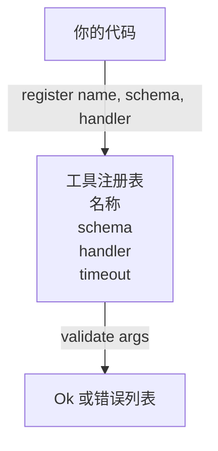

# 带 Schema 验证的工具注册表

> 智能体无法验证的工具，就是智能体无法调用的工具。先把注册表和模式检查器建好，再去构建工具本身。

**类型：** 构建
**语言：** Python
**前置条件：** 第 13 阶段课程 01-07，第 14 阶段课程 01
**时间：** ~90 分钟

## 学习目标
- 维护一个“工具名 → schema → handler”的强类型注册表，让调度器只需查询一次、之后即可信任。
- 实现一个 JSON Schema 2020-12 子集，覆盖九成工具调用真正会用到的关键字。
- 返回精确、形如 JSON Pointer 的错误路径，让模型能在一次往返内自我修正。
- 默认拒绝重复注册，除非显式 override，因为静默覆盖正是生产环境工具目录漂移的来源。
- 让验证器保持纯函数（无 I/O、无时间、无全局状态），这样它就能在回放日志上重复运行。

## 为什么注册表要先于工具

2026 年的编码智能体，注册工具的数量往往比模型一次上下文窗口里能装下的还多。一个稍有规模的运行框架会注册两百个工具，而在任意一轮里只暴露其中十到四十个。注册表 (tool registry) 是以下三个问题的唯一真相源："有哪些工具存在？"、"它们的参数长什么样？"、"我该调用哪个处理器？" 当这三个答案被钉住后，运行框架的其余部分就不用再猜。

我们要避免的错误是：发布没有 schema 的处理器，或者发布了 schema 却没有验证。这两种情况都很常见，也都会把下一层（第二十三课的调度器）变成一场猜谜游戏，而唯一的失败模式就是处理器抛出的栈追踪。

## 工具记录长什么样

```text
ToolRecord
  name        : str          (unique, lowercase alphanumeric and underscore segments separated by dots, e.g., snake_case.segment.case)
  description : str          (one line, shown to the model)
  schema      : dict         (JSON Schema 2020-12 subset)
  handler     : Callable     (async or sync, returns Any)
  idempotent  : bool         (dispatcher uses this for retry decisions)
  timeout_ms  : int          (override per-tool dispatcher default)
```

验证器唯一会接触的字段就是 schema。对它来说，handler 是黑盒。我们是刻意把二者分开的。schema 是数据，handler 是代码。把两者混在一起，会诱使你把验证逻辑塞进 handler 里，而这正是我们要阻止的 bug。

## JSON Schema 2020-12 子集

完整的 2020-12 规范像一篇论文。我们这里只需要八个关键字。

```text
type           string / number / integer / boolean / object / array / null
properties     map of property name -> schema
required       list of property names
enum           list of allowed primitive values
minLength      integer, applies to strings
maxLength      integer, applies to strings
pattern        ECMA-262-compatible regex, applies to strings
items          schema applied to every array element
```

这已经足够覆盖真实工具 API 的需求。我们没有加入的那些关键字（`oneOf`、`anyOf`、`allOf`、`$ref`、条件分支）在生产 schema 中当然合法，但它们会把验证器变成一个带环的树遍历器。我们要构建的是注册表，不是完整的 JSON Schema 引擎。

## JSON Pointer 错误路径

当验证失败时，验证器会返回一个错误列表。每个错误都带有一个指向输入数据内部位置的 JSON Pointer 路径。指针是一个以斜杠开头、由属性名和数组下标依次组成的序列。

```text
{"a": {"b": [1, 2, "x"]}}
                    ^
                    /a/b/2
```

模型读错误路径的能力，往往比读自然语言句子还强。如果某个 schema 需要 `args.user.email`，而模型传了一个整数，错误就应该是 `/user/email`，并附带 `expected_type: string`。这样模型下一次调用就能直接修好，而不用再经历一轮自然语言解释。

## 注册与覆盖

`register(name, schema, handler, **opts)` 默认拒绝重复注册。调用方必须传 `override=True` 才能替换。这是运维卫生。代码库中两个地方悄悄注册了同一个工具名，就是那种会在生产环境里花一周才定位到的问题。

注册表提供三个读取方法。`get(name)` 返回记录或抛错。`validate(name, args)` 返回一个 `Ok` 或错误列表。`names()` 按注册顺序返回所有工具名。

## 这个验证器是什么，不是什么

它是对 schema 树做单次递归遍历的实现。它是纯的。它不调用 handler。它不做类型强制转换（字符串 `"42"` 不能通过 number schema）。它也不会悄悄截断输入。

它不是安全边界。即使验证通过，恶意 handler 仍然可能胡作非为。第二十三课的调度器会加上 timeout 和 sandbox 层。注册表负责的是形状。

## 结构



## 如何阅读代码

`code/main.py` 定义了 `ToolRegistry`、`ToolRecord`、`ValidationError` 和八个验证函数。验证器根据 `schema["type"]` 分派（如果 schema 带有 `enum`，也会把它当作无类型 enum 检查）。每个类型验证器返回空列表或 `ValidationError` 列表。顶层遍历器在向下递归时会拼接错误，并在路径前面加上新的片段。

`code/tests/test_registry.py` 覆盖了注册、覆盖、验证成功、带路径的验证失败，以及子集中每一个关键字。

## 继续深入

本课落地之后，你最可能追加的两个扩展是：针对本地 definitions 块的 `$ref` 解析，以及 `additionalProperties: false` 这种严格形状约束。两者都不大，也都很常见，尤其是当工具目录增长到五十个以上时。我们把它们留在课外，只是为了让文件长度仍然保持在一次阅读能消化的范围内。

下一课（第二十二课）会构建 JSON-RPC 的 stdio 传输，把这个注册表暴露给模型客户端。再下一课（第二十三课）会在两者之上包一层带 timeout 和 retry 的调度器。

