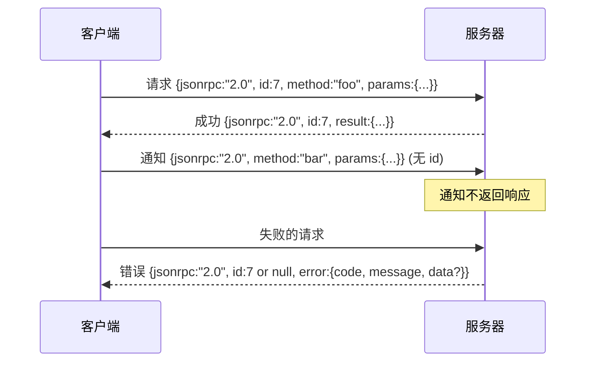

# 基于换行分隔标准输入输出 (stdio) 的 JSON-RPC 2.0

> 模型客户端与工具服务器之间的传输层，是跑在 stdio 上的 JSON-RPC。亲手实现一次，你就会知道每一层 framing 到底在为哪些问题付费。

**类型：** 构建
**语言：** Python
**前置条件：** 第 13 阶段课程 01-07，第 14 阶段课程 01
**时间：** ~90 分钟

## 学习目标
- 通过 stdin 和 stdout，用换行分隔 JSON (newline-delimited JSON) 的方式讲 JSON-RPC 2.0。
- 映射五个标准错误码（-32700、-32600、-32601、-32602、-32603），并以正确语义暴露出来。
- 在不发明新 envelope 键的前提下，区分请求、响应、通知和批处理。
- 每一行只处理一个解析错误，不让整条流被污染。
- 使用 `io.BytesIO` 构建一个会自行终止的演示，让课程无需生成子进程也能运行。

## 为什么 JSON-RPC 仍然是通用语

2026 年的一个编码智能体，在单次会话中可能要和十二个工具服务器对话。每个服务器都可能是独立进程，也可能是远程端点。自 2013 年以来，线上格式几乎没变。JSON-RPC 2.0 规范只有两页。它之所以活到现在，是因为替代方案（gRPC、每次调用一个 HTTP、自定义二进制协议）都会强加 JSON-RPC 不需要的取舍：它们往往只能在流式、批处理或传输耦合之间三选一。JSON-RPC 在 stdio、socket、websocket 和 HTTP 之间保持对称，只要双方遵守规范，客户端就能驱动一个自己从未见过的服务器。

本课构建的是它的 stdio 变体：换行分隔 JSON。每个请求占一行。每个响应占一行。传输边界就是 `\n`。

## 线上形状

一共有四种 envelope 形状。其中两种由客户端发出，两种由服务器发出。



通知没有 `id`。服务器绝不能对通知作出响应。如果服务器给通知回了响应，客户端就没有办法把它挂回某个调用点。正是这一条规则，让 framing 的计算始终简单。

批处理是一个由请求或通知组成的 JSON 数组。服务器会返回一个响应数组，顺序可以任意，但每个非通知条目都必须对应一个响应。如果批处理里的每个条目都是通知，服务器就什么也不返回。

## 五个错误码

```text
-32700  Parse error      JSON could not be parsed
-32600  Invalid Request  Envelope shape is wrong
-32601  Method not found
-32602  Invalid params
-32603  Internal error
```

-32000 到 -32099 之间的错误码保留给服务器自定义错误。其他范围则属于应用自定义。本课只使用这五个。如果你的 handler 抛错，传输层会把它包装成 -32603，并把异常类名放进 `data.exception`。

解析错误有一条特殊规则：响应里的 `id` 必须是 `null`，因为请求甚至还没成功解析到能提取 id 的程度。

## 换行 framing 与 BytesIO 演示

传输层一次读取一行。一行就是直到并包含 `\n` 的那一串字节。如果某一行无法解析，传输层就写出一个 `id: null` 的 -32700 响应，然后继续处理。流不会被污染，下一行会重新开始解析。

在本课里，我们用一对 `io.BytesIO` 包装成 stdin 和 stdout。服务器一直读请求直到 EOF，为每一个请求写出响应，然后返回。客户端再把响应读回来。不需要生成进程，不需要 timeout。之所以传输行为和真实子进程管道完全一致，是因为 Python 的 `io` 接口暴露了同样的 `.readline()` 和 `.write()` 契约。

## 方法分发

传输层并不知道有哪些方法存在。它把工作交给一个可调用对象 `handler(method, params)`，由运行框架提供。handler 要么返回结果，要么抛错。有三个异常类会映射到特定错误码。

```text
MethodNotFound -> -32601
InvalidParams  -> -32602
Anything else  -> -32603 with exception name in data
```

传输层永远看不到工具注册表。注册表位于 handler 的背后。这正是我们想要的分层：传输层负责讲 JSON-RPC，注册表负责讲工具形状，调度器（第二十三课）把两者缝起来。

## 出错时的流行为

```text
client writes              server reads             server writes
---------------            -----------              -------------
{...valid request...}      parses ok                {...response, id matches...}
{...broken json...         parse fails              {id:null, error: -32700}
{...valid request...}      parses ok                {...response, id matches...}
{...missing method...}     invalid envelope         {id:X, error: -32600}
```

一行损坏的 JSON 不会停止循环。缺失 `method` 字段也不会停止循环。handler 抛错同样不会停止循环。传输层会一直读到 EOF。

## 通知与非对称流

通知是 fire-and-forget。运行框架会把通知用于进度事件、取消信号和日志行。通知让长时间运行的工具可以流式输出状态，而不必为每次更新都走一遍往返。

本课实现了一个出站通知辅助函数 `write_notification`。服务器会用它在请求进行中发出进度。演示展示了这个模式：收到一个请求后，handler 发出两条进度通知，然后再写最终响应。

## 如何阅读代码

`code/main.py` 定义了 `StdioTransport`、解析辅助函数（`parse_request`）、三个写入辅助函数（`write_response`、`write_error`、`write_notification`），以及分发循环 `serve`。错误码常量放在模块作用域。

`code/tests/test_transport.py` 覆盖五个错误码、通知（不写响应）、批处理（数组进、数组出、跳过通知）、损坏 JSON（先报解析错误再继续），以及 handler 在调用中途写通知的非对称流。

## 继续深入

这个传输层已经足够支撑后续课程。生产级传输层还会再加三样东西：一个可以跨转发存活的关联 id 字段（你的 `id` 已经具备这个作用，但在网状拓扑里还需要外层 trace id）；一个取消通道（例如 `$/cancelRequest` 这样的通知，携带正在执行调用的 id）；以及一个内容类型协商握手，让同一个 socket 同时支持 JSON-RPC 和 Streamable HTTP。它们都不会改变线上格式，只是增加元数据。

