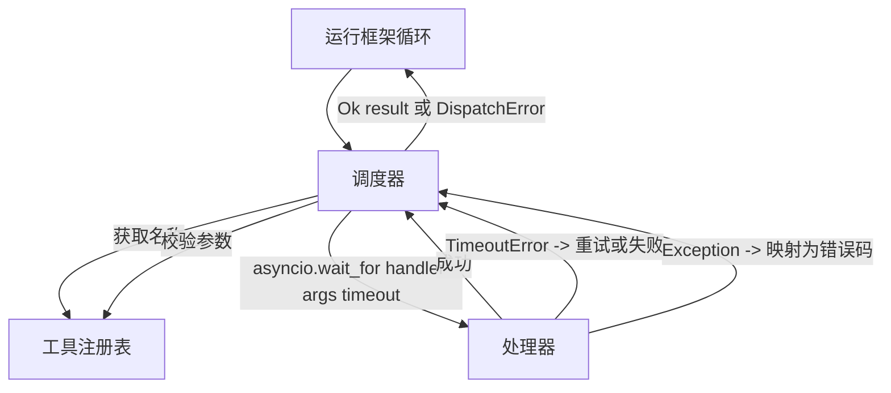
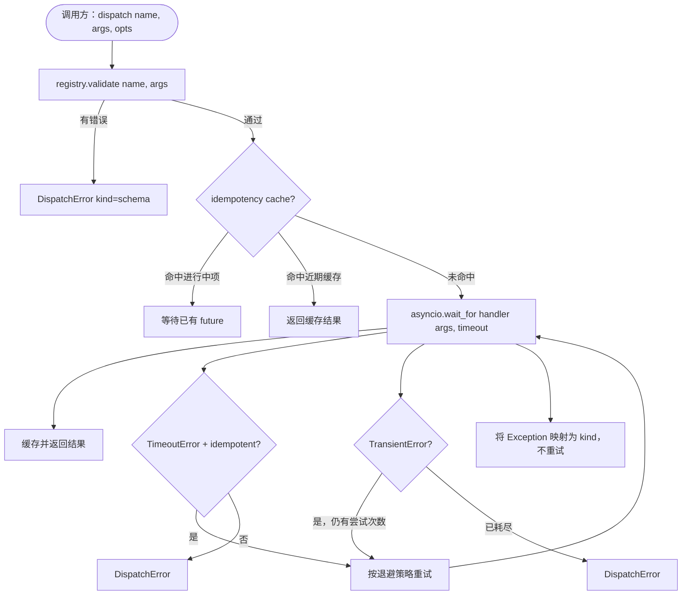

# 函数调用调度器

> 调度器 (dispatcher) 是运行框架兑现 schema 所有承诺的地方。timeout、retry、dedupe、错误映射，都集中在这一道接缝上。

**类型：** 构建
**语言：** Python
**前置条件：** 第 13 阶段课程 01-07，第 14 阶段课程 01
**时间：** ~90 分钟

## 学习目标
- 用每次调用级别的 timeout 包装工具 handler，让循环得到的是强类型错误，而不是无限挂起。
- 应用带抖动 (jitter) 的指数退避重试，并设置最大尝试次数。
- 基于幂等键 (idempotency key) 去重重试，避免慢速原调用和重试竞争时把同一件事执行两次。
- 把 handler 异常和传输故障映射到同一个错误 envelope 上，让运行框架循环可以统一理解。
- 用并发上限限制并行分发，避免四十个工具调用扇出时耗尽事件循环。

## 调度器位于哪里

它位于运行框架循环（第二十课）和工具注册表（第二十一课）之间。传输层（第二十二课）把输入送进循环。循环把工具调用交给调度器。调度器查询注册表、运行 handler，并返回结果或一个 JSON-RPC 形状的错误 envelope。



调度器是唯一知道 timer、retry 和幂等性的那一层。循环不知道，注册表不知道，handler 也不知道。隔离出这一层，本身就是重点。

## Timeout

每个工具都有一个默认 timeout。注册表记录里带有 `timeout_ms`。如果运行框架在单次调用时传入了 override，调度器就会覆盖它。我们使用 `asyncio.wait_for`。一旦超时，handler task 会被取消，调度器返回 `DispatchError(kind="timeout")`。

对于非幂等工具，timeout 默认不是可重试错误。一个超时的 `db.write` 可能已经提交，也可能没有。重试会导致重复写入。调度器会遵守注册表记录里的 `idempotent` 标志：幂等工具可以重试，非幂等工具不重试。

## 指数退避重试

重试策略最多三次尝试。退避采用带 jitter 的指数增长。

```text
attempt 1  -> delay 0
attempt 2  -> delay 0.1s * (1 + random[0..0.5])
attempt 3  -> delay 0.4s * (1 + random[0..0.5])
```

只有 `timeout` 和 `transient` 错误会触发重试。`schema`、`not_found` 或 `internal` 错误都不会重试。schema 错误是确定性的；重试不会改变结果，只会烧掉预算。

重试循环也会遵守来自运行框架的预算。如果调用方的剩余工具调用预算为零，调度器会在第一次尝试前快速失败，并返回 `kind="budget_exceeded"`。

## 幂等键去重

当原始调用仍在进行中时重试触发，这是一个真实的生产 bug。第一次调用卡在 4.9 秒（刚好低于 timeout），重试在 5 秒时发出。于是两个请求同时竞争同一个后端。如果工具是 `payments.charge`，你就扣款两次了。

调度器接受一个可选的 `idempotency_key`。如果有相同 key 的调用仍在飞行中，调度器就等待那一个 in-flight future，并直接返回它的结果。调用完成后，缓存会再保留 key 六十秒，以吸收迟到的重试。

key 的生成责任在调用方。运行框架从规划器里派生它：`f"{step_id}:{tool_name}:{hash(args)}"`。调度器自己不会发明 key，因为如果仅从参数推导 key，就会把两个语义不同的调用误判为同一个。

## 错误 envelope

一次失败的分发只返回一种形状。

```text
DispatchError
  kind        : "timeout" | "transient" | "schema" | "not_found" | "internal" | "budget_exceeded"
  message     : str
  attempts    : int
  jsonrpc_code: int   (one of -32601, -32602, -32603)
```

运行框架循环会根据 `kind` 决定下一个状态。`schema` 和 `not_found` 会进入 `on_error` 并触发重新规划。`timeout` 和 `transient` 也会进入 `on_error`，但是否重新规划取决于尝试次数。`budget_exceeded` 会触发 `on_budget_exceeded`。

## 扇出时的并发上限

`gather(*calls)` 会同时运行所有 coroutine。四十个工具调用意味着四十个打开的 socket，或四十条子进程管道。大多数后端都不喜欢单个客户端一次建立四十个并行连接。

调度器会用 semaphore 包裹 `gather`。默认并发上限是八。每次调用在分发前获取 semaphore，完成后释放。调用方看到的仍然是 `gather` 形状的输出，但实际调度是有上界的。

## 单次调用的流程



## 如何阅读代码

`code/main.py` 定义了 `Dispatcher`、`DispatchError` 和 `TransientError`。调度器在构造时接收一个注册表。异步方法 `dispatch(name, args, ...)` 是唯一入口。每次尝试的 timeout 会在 `_run_with_retries` 内联地通过 `asyncio.wait_for` 应用。`gather_bounded(calls)` 则在并发上限下运行多次分发。

`code/tests/test_dispatcher.py` 覆盖 timeout 触发、transient 错误重试、schema 错误不重试、幂等性去重（两个带相同 key 的并发调用会折叠成一次 handler 调用），以及并发限制（实际测试 semaphore 的作用）。

测试使用 `asyncio.sleep(0)` 和基于 `Counter` 的确定性 handler，因此它们会在毫秒级完成，不依赖真实挂钟时间。

## 继续深入

生产级调度器通常还会再加两个扩展。第一是每个迁移点的结构化日志（循环的事件流已经给了你一部分，但调度器本身也应该发出 `dispatch.attempt` 和 `dispatch.retry` 事件）。第二是熔断器：在某个时间窗口里连续 N 次失败后，一个工具会进入冷却期，此时分发会立刻返回 `kind="circuit_open"`，而不是继续尝试 handler。这两者都可以叠加在这个调度器之上，而不需要改变契约。

第二十四课会把调度器接到一个计划-执行智能体上，让你看到四个部件一起运转。

