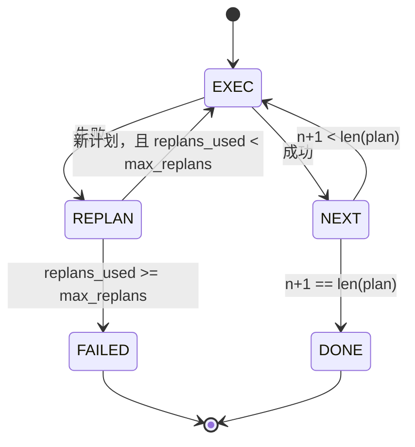

# 计划-执行控制流

> 经不起失败的计划，只是脚本。会重新规划的脚本，才是智能体。先把重规划器 (replanner) 造出来。

**类型：** 构建
**语言：** Python
**前置条件：** 第 13 阶段课程 01-07，第 14 阶段课程 01
**时间：** ~90 分钟

## 学习目标
- 把计划表示为一组有序的强类型步骤，让执行器能够理解进度与结果。
- 按顺序执行步骤，并在受控失败时把控制权交回规划器。
- 从当前游标位置，携带之前的错误上下文重新规划，让下一份计划更有信息量。
- 每次修订时发出 plan diff，让下游追踪器或 UI 能展示计划为什么发生变化。
- 强制执行两种预算：硬性的步骤上限和硬性的重新规划上限。

## Plan and execute，而不是 chain-of-thought

chain-of-thought 智能体会先吐出一串 token，再让循环去猜工具调用在什么地方结束。plan-and-execute 智能体则先产出一份结构化计划，然后再确定性地执行每个步骤。计划是运行框架可以内省的数据；执行则是运行框架把这些数据送进调度器实际跑起来。

有两个部件：产出计划的规划器，以及执行计划的执行器。真正有意思的部分，是执行器遇到失败时会发生什么。只有三种选项：

```text
1. Abort         (return failed, surface the error)
2. Skip          (mark step failed, continue with the rest)
3. Replan        (hand the error to the planner, get a new plan from the cursor)
```

Replan 才是把脚本变成智能体的那一步。

## Step 的形状

```text
Step
  id              : int           (monotonic within a plan revision)
  tool_name       : str
  args            : dict
  expected_outcome: str           (planner's stated success condition)
  result          : Any | None
  error           : str | None
```

`expected_outcome` 是规划器和步骤一起输出的一句短语。执行器不会强制检查它。它有两个用途：重规划器在修订计划时会读取它；事件流会把它发出去，让追踪器可以显示“这一步本来是要完成 X”。

## 规划器的形状

```python
def planner(goal: str, history: list[Step], last_error: str | None) -> list[Step]:
    ...
```

这是一个纯函数。`goal` 是用户目标。`history` 是已经执行过的步骤（其中的结果和错误已经填充）。`last_error` 在第一次调用时是 None，在之后的每一次调用时则是最近一次失败消息。规划器返回的是从当前游标开始的下一份计划。

规划器并不知道执行器的存在。它不知道重试，不知道 timeout，也不知道别的运行时细节。它只负责产出计划，仅此而已。

## 执行器

执行器是一个小型状态机。每个步骤都会通过调度器运行。结果只有三种：成功、可重新规划的失败、致命失败。可重新规划的失败会把控制权交还给规划器；致命失败（预算超限、重新规划次数耗尽）则返回一个 `FAILED` 会话结果。



## 修订时的计划差异

当规划器在失败后返回一份新计划时，执行器会发出一个 `plan.diff` 事件，其中包含三个字段。

```text
removed: list of step ids that were in the old plan and are not in the new
added  : list of step ids in the new plan that were not in the old
revised: list of step ids whose tool_name or args changed
```

追踪器或 UI 可以把它渲染成：被移除步骤加删除线，新加步骤高亮显示。重点不在 diff 的具体格式，而在于“修订”必须是一个可见事件，而不是静默改写。

## 两种预算，而且都必须是硬限制

`max_steps` 限制的是整个会话里总共能执行多少步骤，包括重新规划后的步骤。默认是十二。一个线性的五步计划，如果重新规划两次，并且每次都再加三步，就会执行到十六步并超出预算。此时执行器会拒绝新的重规划并返回 FAILED。

`max_replans` 限制的是首份计划之后还能再调用规划器多少次。默认是五。这其实是更重要的限制。一个规划器如果连续五次都返回同一份坏计划，否则就会一直循环到步骤预算把它拦下。给重新规划次数加上上限，会让失败发生得更快，原因也更清楚。

## 本课中的确定性规划器

本课不会调用模型。课程提供的是一个确定性规划器，它根据 `last_error` 选择计划。

```text
last_error is None    -> emit a four-step plan
last_error matches X  -> emit a three-step plan that routes around X
last_error matches Y  -> emit a two-step plan that gives up gracefully
otherwise             -> return [] (signals nothing to replan)
```

这已经足够测试执行器在所有迁移路径上的行为：成功、重规划一次、重规划两次、重规划耗尽，以及步骤预算耗尽。

## 结果形状

```text
SessionResult
  status      : "completed" | "failed"
  reason      : str     ("goal_met" | "step_budget" | "replan_budget" | "no_plan")
  history     : list[Step]
  revisions   : list[PlanDiff]
  events      : list[Event]
```

第二十课里的运行框架循环可以直接读取这个结果。第二十三课的调度器负责执行每一步。第二十一课的注册表负责校验每一步的 args。第二十二课的传输层则会通过 JSON-RPC 把整个流程暴露给模型客户端。

## 如何阅读代码

`code/main.py` 定义了 `PlanExecuteAgent`、`Step`、`PlanDiff`、`SessionResult` 以及确定性规划器。执行器只有一个 `run(goal)` 方法，它返回 `SessionResult`。plan diff 是通过比较 step id 以及 `(tool_name, args)` 元组计算出来的。

`code/tests/test_agent.py` 覆盖了一条线性成功路径、中途失败并重规划一次、重规划耗尽并返回 `failed:replan_budget`、步骤预算耗尽，以及 plan-diff 事件格式。

## 继续深入

一旦你把它接到真实模型上，就会很想加两个扩展。第一是部分计划缓存：一个六步计划前面三步成功、后面失败时，你不想重新执行前面三步。执行器已经保存了 history；规划器只需要会读它。第二是并行分支：当前执行器是严格串行的。若规划器能输出独立分支（例如 `gather_step` 而不是 `next_step`），就可以通过调度器并发执行两个工具调用。

两者都会增加真实复杂度，但只要线性执行器先被钉住，后续就容易加入。本课做的正是这件事。

