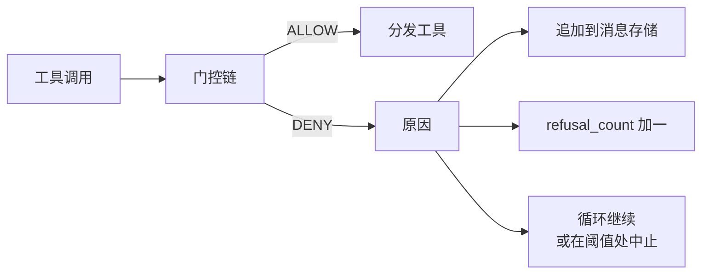
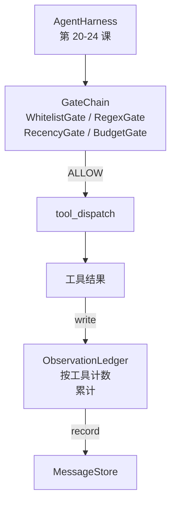

# 毕业项目课程 25：验证门 (verification gate) 与观察预算

> 没有验证层的智能体运行框架，只是披着风衣的愿望。本课构建一条确定性的门控链 (gate chain)，用来决定某次工具调用是否允许触发、智能体能看到多少输出，以及当智能体已经读得太多时循环应在何时停止。这条链由一组小而具名的门 (gate) 函数组成，外加一本观察账本 (observation ledger)，用于跟踪模型曾被展示过的每一个 token。

**类型：** 构建
**语言：** Python（stdlib）
**前置条件：** 第 19 阶段 · 20-24（Track A1：智能体循环、工具注册表、消息存储、提示构建器、模型路由器），第 14 阶段 · 33（把指令当作约束），第 14 阶段 · 36（作用域契约），第 14 阶段 · 38（验证门）
**时间：** ~90 分钟

## 学习目标

- 构建一个 `VerificationGate` 协议，提供确定性的 `evaluate(call)` 方法。
- 把 budget、recency、whitelist 和 regex gate 组合成一条具有短路语义的链。
- 使用按工具与轮次索引的 `ObservationLedger` 跟踪每一次 observation。
- 当累计观察预算即将超限时，拒绝该工具调用。
- 暴露结构化的 `GateDecision` 记录，供下游可观测性系统采集。

## 问题

当一个智能体运行框架允许模型自由调用工具时，真实使用的第一个小时内通常就会出现三类 bug。

第一类是无界观察。一次针对 20 万行仓库的 grep，会把五十万 token 的输出倾倒进下一轮。模型每千字节只真正看到一条匹配，其余上下文全被浪费。token 成本很高，而智能体对任务的表现反而更差。

第二类是陈旧时效。一个长时间运行的任务累计了五十次工具调用。模型却把第三轮的第一个 read_file 当成当前状态反复阅读。第四十七轮做出的编辑根本没出现，因为提示构建器先序列化了最早的 observations。

第三类是权限蔓延。一个研究任务先调用 `web_search`，结果不知怎么又跑去执行 `shell`，因为模型编造了一个工具名，而运行框架默认采取宽松策略。等到有人去看 trace 时，`/tmp` 里已经躺着一个垃圾文件，某个针对私有 API 的 curl 也早就跑完了。

验证门 (verification gate) 就是那个会说“不”的运行框架组件。它不是模型，不是裁判，而是对 `(call, history, ledger)` 的一个确定性函数。它只会返回 ALLOW 或 DENY，并带上原因。原因会被记录，也会告诉模型。循环随后继续或中止。

## 概念



门就是任何实现了 `evaluate(call, ctx) -> GateDecision` 方法的对象。链则是一个有序列表。求值在遇到第一个 deny 时就短路。顺序很重要：便宜的结构性 gate 要先于昂贵的 token 计数 gate 运行。

本课提供四个 gate：

- `WhitelistGate`。允许的工具名是一个显式集合。任何不在集合中的名字都会被拒绝。这是最便宜的 gate，因此最先运行。
- `RegexGate`。把工具参数与正则表达式匹配。适合拒绝带有 `rm -rf` 的 shell 调用，或者访问内网 IP 的 HTTP 调用。它只依赖调用载荷本身。
- `RecencyGate`。模型只能看到最近 N 轮的 observations。更旧的 observation 会被屏蔽。如果某个工具调用的结果只会扩展一个已经过期的观察窗口，这个 gate 就会拒绝它。
- `BudgetGate`。模型在整个会话中已读过的累计 token 有一个上限。当 ledger 表明上限已到时，之后所有工具调用都会被拒绝。

观察账本 (observation ledger) 负责记账。每次成功的工具调用都会写入一行：工具名、轮次、发出的 token 数、累计值。ledger 只回答两个问题：模型总共看了多少，以及它从某个工具 X 看了多少。budget gate 读第一个问题。一个“按工具限额”的 budget gate —— 你会把它当作练习来写 —— 会读第二个问题。

## 架构



运行框架先询问这条链。链要么点头，要么拒绝。如果点头，工具运行、ledger 记账，结果再追加到消息存储；如果拒绝，模型会收到一条系统消息形式的拒绝说明，然后由循环决定是重试还是中止。

## 你将构建什么

实现由一个 `main.py` 和测试组成。

1. `Observation` 与 `ToolCall` dataclass，定义线上形状。
2. `ObservationLedger`，记录 `(turn, tool, tokens)` 行，并回答 `cumulative()` 与 `per_tool(name)`。
3. `GateDecision`，携带 `(allow, reason, gate_name)`。
4. `VerificationGate` 协议。每个 gate 都实现 `evaluate(call, ctx)`。
5. `GateChain`，包装一个有序列表。它逐个调用 gate，返回第一个 deny；如果全部通过，则返回 allow。
6. 演示会运行一个很小的合成智能体循环。三轮。第三轮会触发 budget gate，循环以一次干净的拒绝结束，并带有非零的 refusal_count。

token 计数器故意用了一个很蠢的启发式：`len(text) // 4`。本课的重点是 gate 的管线，不是 tokenizer。生产环境里再替换成真正的 tokenizer。

## 为什么链的顺序很重要

deny 比 allow 更便宜。`WhitelistGate` 是 O(1) 的哈希查找。`RegexGate` 是 O(pattern * argv)。`RecencyGate` 读取消息存储里的一小段。`BudgetGate` 则会读取整本 ledger。你要按成本递增排序它们，这样一旦某次调用注定被拒绝，就能在做昂贵工作之前短路。

还要按影响半径来排序。whitelist 是最强的断言：这个工具根本不在契约里。regex gate 次之：这个参数不在契约里。recency 再之后：运行框架仍然关心这次调用，只是它虽然在结构上合法，却已经不再新鲜。budget 放在最后，因为从定义上讲，只有前面所有检查都通过，它才有机会触发。

## 它如何与 Track A 的其他内容组合

前面的课程给了你循环、工具注册表、消息存储、提示构建器和模型路由器。本课补上模型与工具之间的那一层。第 26 课会提供 sandbox：当 gate chain 返回 ALLOW 后，调度器就把工具调用交给它。第 27 课会提供 eval harness，把 refusal_count 记录为质量信号。第 28 课会把 gate decision 接进 OpenTelemetry span。第 29 课则把全部部件串成一个可运行的编码智能体。

## 运行方式

```bash
cd phases/19-capstone-projects/25-verification-gates-observation-budget
python3 code/main.py
python3 -m pytest code/tests/ -v
```

演示会打印逐轮 trace，其中包含每一个 gate decision，并以零退出。测试覆盖 ledger、每个 gate 的独立行为、链式短路，以及这个合成循环的端到端流程。

