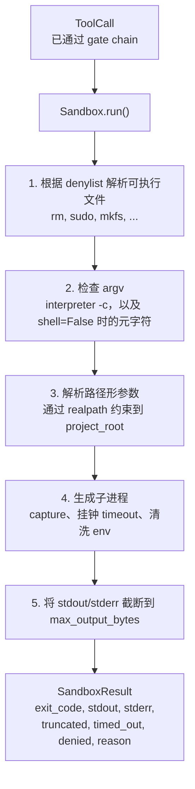
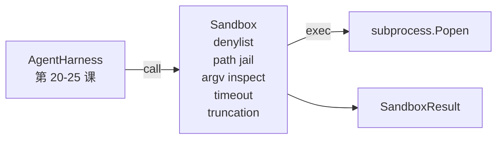

# 毕业项目课程 26：带拒绝名单与路径监牢 (path jail) 的沙箱运行器

> 验证门负责决定工具调用是否应该执行，沙箱 (sandbox) 负责决定它执行时究竟会发生什么。本课提供一个子进程运行器：它会拒绝危险的可执行文件，拒绝危险的参数向量 (argv) 形状，把每个文件路径都监禁在某个项目根目录下，截断过大的输出，并在挂钟超时后杀掉失控进程。这是模型与操作系统之间两层防线中的第二层。

**类型：** 构建
**语言：** Python（stdlib）
**前置条件：** 第 19 阶段 · 25（验证门与观察预算），第 14 阶段 · 33（把指令当作约束），第 14 阶段 · 38（验证门）
**时间：** ~90 分钟

## 学习目标

- 构建一个 `Sandbox` 类，对 `subprocess.run` 进行 timeout、capture 和 truncation 包装。
- 依据 denylist 按名称拒绝命令，并依据 argv inspector 按结构拒绝命令。
- 拒绝任何解析后落在声明项目根目录之外的路径参数。
- 在 shell mode 关闭时拒绝 shell 元字符。
- 返回结构化的 `SandboxResult`，供下游可观测性与 eval harness 采集。

## 问题

一个能够 shell out 的编码智能体，可以在一轮之内安装后门、外传密钥、把开发者笔记本搞瘫痪，或者刷爆云账单。成本最低的防御，是根本不给它 shell。第二低成本的防御，则是一个能对精确模式说“不”的沙箱。

在智能体 trace 里，三类失败会反复出现。

第一类是危险的可执行文件。一个在修路径问题时承受压力的模型，会尝试 `sudo`、`chmod -R 777`、`rm -rf`、`mkfs`、`dd`。这些都不该出现在智能体运行中。denylist 会按名字和别名把它们拦下。

第二类是 argv 花招。一个被告知“不准用 shell”的模型，会绕道解释器发动攻击：`python3 -c "import os; os.system('rm -rf /')"`、`bash -c '...'`、`node -e '...'`、`perl -e '...'`。沙箱必须理解：任何带 `-c` 这类标志的解释器调用，本质上都只是“绕了几步的 shell 调用”。

第三类是路径逃逸。模型被要求读取 `./src/main.py`，结果却去读 `../../etc/passwd`。沙箱会把每个路径参数都经由 `os.path.realpath` 解析，并检查它是否仍然位于指定前缀之下。

这个沙箱不是操作系统意义上的安全边界。一个拿到代码执行权的坚定攻击者，仍然可能逃逸。这个沙箱是开发时护栏：它会把常见失败模式大声暴露出来，并阻止智能体因为纯粹笨拙而造成破坏。

## 概念



沙箱有四个拒绝维度：名称、argv、路径、结构。每个维度都只是对调用做纯函数检查，尚未启动任何子进程。只有所有维度都通过后，子进程才会真正生成。

`SandboxResult` 的退出码遵循常见约定：0 表示成功，非零表示失败，另有三个哨兵码用于 denied（-100）、timed_out（-101）和 truncated（退出码保留真实值，只额外设置标志）。后续课程会读取这个结构化结果，而不是去解析 stderr。

## 架构



denylist 是一个由可执行文件 basename 组成的 frozenset。别名（`/bin/rm`、`/usr/bin/rm`）都会归一到同一个 basename。argv inspector 认识解释器模式：只要 argv[0] 是解释器，且后续任意参数以 `-c` 或 `-e` 开头，就会被拒绝。当调用没有显式请求 shell 时，shell 元字符（`;`、`|`、`&`、`>`、`&lt;`、反引号、`$()`）也会触发拒绝。

路径监牢 (path jail) 是最微妙的一块。沙箱构造时接收一个 `project_root`。任何看起来像路径的参数（包含 `/`，或匹配到现有文件）都会先经过 `os.path.realpath` 归一化，再和项目根目录的 realpath 做前缀检查。如果解析后的目标不在根目录下，就拒绝。符号链接逃逸（项目根内某个 symlink 指向外部）会被 realpath 检查挡住，因为我们检查的是解析结果，而不是字面路径。

## 你将构建什么

实现由 `main.py` 和一个 tests 目录组成。

1. `SandboxResult` dataclass：exit_code、stdout、stderr、truncated、timed_out、denied、reason、duration_ms。
2. `SandboxConfig` dataclass：project_root、max_output_bytes、timeout_seconds、denylist、interpreter_block。
3. `Sandbox` 类：`run(argv, *, shell=False, cwd=None)` 返回一个 `SandboxResult`。
4. 内部拒绝辅助函数：`_check_executable_denylist`、`_check_argv_interpreter`、`_check_shell_metachars`、`_check_path_jail`。
5. 输出截断：设置明确的 `truncated` 标志，并在捕获流中插入一条标记行。
6. 文件底部的演示：按顺序运行一组合法与对抗性调用，并展示各自结果。

沙箱默认使用 `subprocess.run`，并设置 `shell=False` 与 `capture_output=True`。挂钟 timeout 通过 `timeout` 参数实现；在 `TimeoutExpired` 时，沙箱会杀掉进程组并合成一个 SandboxResult。

## 为什么它不是真正的沙箱

本课的沙箱没有使用 namespace、cgroup、seccomp、gVisor、Firecracker，或任何内核级隔离。子进程能做的事，沙箱理论上也能做。这里的保护是结构性的：智能体会被拒绝执行最常见的危险调用，而拒绝记录会进入可观测性系统，而不是悄悄执行。

对于生产级智能体，你还要继续叠加：放进非特权 Docker 容器，放进 microVM，去掉 capabilities，把项目根目录只读挂载、scratch 目录读写挂载，给内存和 CPU 设 ulimit，把环境变量清洗到一个已知安全的白名单。第 29 课会做其中一部分。操作系统级隔离不在本课范围内。

## 运行方式

```bash
cd phases/19-capstone-projects/26-sandbox-runner-denylist
python3 code/main.py
python3 -m pytest code/tests/ -v
```

演示会创建一个临时目录，把一个干净文件放进去，然后跑一组调用。合法调用成功。被拒绝的调用会返回 `denied=True` 且带有 reason 的 SandboxResult。超时返回 `timed_out=True`。截断会设置 `truncated=True`。演示会打印一张 JSON 结果表，并以零退出。

## 它如何与 Track A 的其他内容组合

第 25 课产出了 gate chain。第 26 课则是在 gate ALLOW 之后真正执行的那层。第 27 课的 eval harness 会把 sandbox result 和每个任务预期的 exit code 做比较。第 28 课会围绕每次 `Sandbox.run` 调用发出一个 `gen_ai.tool.execution` span。第 29 课的端到端演示会通过这两层驱动一个真实的编码智能体。

