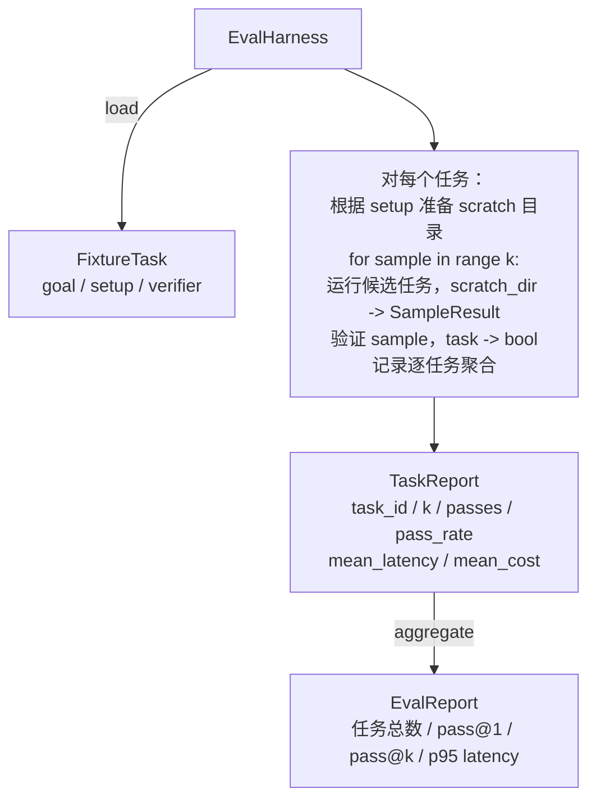

# 毕业项目课程 27：带夹具任务 (fixture task) 的评测运行框架 (eval harness)

> 一个编码智能体的好坏，只取决于你拿来衡量它的任务集合。本课构建一个评测运行框架 (eval harness)：它接收一组夹具任务文件夹，把每个任务交给候选智能体运行，再通过确定性验证器 (verifier) 判断通过或失败，最后聚合出 pass@1、pass@k、平均延迟和平均成本。这个运行框架是唯一真相源，让你区分“回归”与“重构”。

**类型：** 构建
**语言：** Python（stdlib）
**前置条件：** 第 19 阶段 · 25（验证门），第 19 阶段 · 26（沙箱运行器），第 14 阶段 · 30（以 eval 驱动的智能体开发），第 14 阶段 · 19（SWE-bench 与 GAIA 基准）
**时间：** ~90 分钟

## 学习目标

- 将夹具任务定义为目标、设置与验证器三元组。
- 为每个任务打多个 sample run 的分数，并计算 pass@1 与 pass@k。
- 将延迟与成本聚合成均值和 95 分位指标。
- 把确定性 verifier（文件 diff、退出码、正则匹配）封装成可复用函数。
- 发出结构化 JSON 报告，让回归跟踪脚本能够读取。

## 问题

没有 eval harness 的智能体基准，常会被三类失败模式困扰。

第一类是“未验证的通过”。智能体说它修好了 bug，人类看了一眼 diff，套件就被标成绿色。三周后，回归测试又把同一个 bug 翻出来。智能体只是“讲得像修好了”，并没有真的修好。

第二类是“未检测到的回归”。提示模板的一次改动，让智能体在那个高噪声任务上好 4%，却在那个安静任务上差了 14%。没有 goldset 和逐任务分数时，这种回归会一路混进 main，直到客户抱怨才暴露。

第三类是“逐任务漂移”。周一跑 eval 用了 100 个任务，周五却只跑了 95 个，因为有人改了五个 fixture 的名字。通过率看起来像提升了 5%，其实并没有。

harness 就是那个把这些失败变成事实的程序。它会每次都以可复现顺序运行每个 fixture，并把结果交给一个返回 true/false 的确定性 verifier。

## 概念

```mermaid
flowchart LR
  F1[fixtures/task_001/<br/>task.json + expected/] --> Harness
  F2[fixtures/task_002/<br/>...] --> Harness
  Harness[Harness<br/>对每个任务：<br/>setup / 运行智能体 k 次样本 /<br/>验证每个样本 /<br/>记录延迟与成本]
  Harness --> Report[EvalReport<br/>pass@1 / pass@k<br/>平均 ms / p95 ms<br/>平均成本]
```

`FixtureTask` 是一个小型 JSON 文件，加上一个可选的 `expected/` 目录。JSON 声明 `id`、`goal`（喂给智能体的 prompt）、`setup` 块（要放进 scratch 目录的文件），以及 `verifier` 块。`verifier` 块会指定 harness 的 verifier registry 中某个函数的名字，并提供它所需的参数。

三种 verifier 形状覆盖了大部分有价值的任务。

第一种是 `file_equals`。智能体运行后，把指定文件和期望内容比较。这适用于“按这种确切方式修复这个 bug”的任务。

第二种是 `regex_match`。把指定文件内容与某个正则表达式匹配。这适用于“这个函数必须存在且返回 X”这类存在多种可接受解的任务。

第三种是 `shell_exit_zero`。harness 会通过第 26 课的 sandbox 运行一个 shell 命令，只有命令以零退出时，任务才算通过。这适用于“测试必须通过”之类的任务。

harness 会把每个任务运行 `k` 次。pass@k 的计算是 `1 - (1 - p)^k`，其中 p 是经验通过率；harness 同时也报告原始计数，以便你看出方差。延迟按每个 sample 的挂钟时间计。成本则采用智能体自报的值（token 数、美元或二者皆可）；harness 会跨样本汇总它，并同时给出逐任务与整体聚合数字。

## 架构



候选对象是一个可调用项：`Callable[[FixtureTask, str], SampleResult]`。harness 通过 `tempfile.mkdtemp()` 创建 scratch 目录，并把其路径作为普通字符串传给它。harness 不关心 candidate 的内部如何工作。candidate 可以是一个确定性补丁应用器（适合做 harness 自测），也可以是真实 LLM 智能体，或者 fuzz 工具。契约只在于 `SampleResult`。

## 你将构建什么

`main.py` 提供：

1. `FixtureTask` dataclass。
2. `SampleResult` dataclass：success_self_reported、latency_ms、cost_units、edits。
3. `TaskReport`、`EvalReport` dataclass，并带 `to_dict()`。
4. `VerifierRegistry`，把 verifier 名称映射到函数。内建 verifier：file_equals、regex_match、shell_exit_zero。
5. `EvalHarness` 类。它会对一整个任务目录运行 candidate，并返回 EvalReport。
6. `tasks/` 中内置五个夹具任务：
   - `fizzbuzz` 中的 off-by-one
   - `factorial` 中缺失 return
   - 错误消息里的 typo
   - 空函数体
   - 链表遍历中的 off-by-one
7. 一个确定性的参考 candidate（`apply_known_fixes`），用于演示干净的 pass@1 = 1.0。
8. 演示会打印 EvalReport JSON，并以零退出。

夹具任务以 JSON 文件形式放在 `tasks/` 中，并配有成对的源文件目录：`tasks/<id>/buggy/` 与 `tasks/<id>/expected/`。harness 会把 buggy 复制到 scratch 目录，把该目录交给 candidate，再根据 expected 做验证。

## 为什么要看 pass@k，而不只是 pass@1

真实 LLM 智能体是随机的。pass@1 = 0.6 看起来像失败；但 pass@5 = 0.95 说明它大多数时候都能得到正确答案，只是在早期样本选择上出错。修复办法是采样与排序，而不总是更多训练。pass@k 会把这一点显式呈现出来。

之所以把 pass@k 和 pass@1 一起报告，是因为 pass@k 会掩盖一种真实失败：如果模型二十次里只答对一次，你仍然没有一个可用智能体。harness 会同时展示两者。

## 它如何与 Track A 的其他内容组合

第 25 课产出了 gate chain。第 26 课产出了 sandbox。harness 会把 sandbox 用于任何 `shell_exit_zero` verifier。第 28 课会把每次 harness run 包进一个 OTel trace。第 29 课会针对内置 fixture 之一运行端到端演示，并断言参考 candidate 的 pass@1 = 1.0。

## 运行方式

```bash
cd phases/19-capstone-projects/27-eval-harness-fixture-tasks
python3 code/main.py
python3 -m pytest code/tests/ -v
```

演示会打印 JSON 形式的 EvalReport，其中包括 pass@1、pass@5、平均延迟，以及逐任务分解。退出码为零。测试覆盖 verifier 函数、pass@k 数学、fixture 加载，以及使用内置参考 candidate 的 harness 端到端流程。

