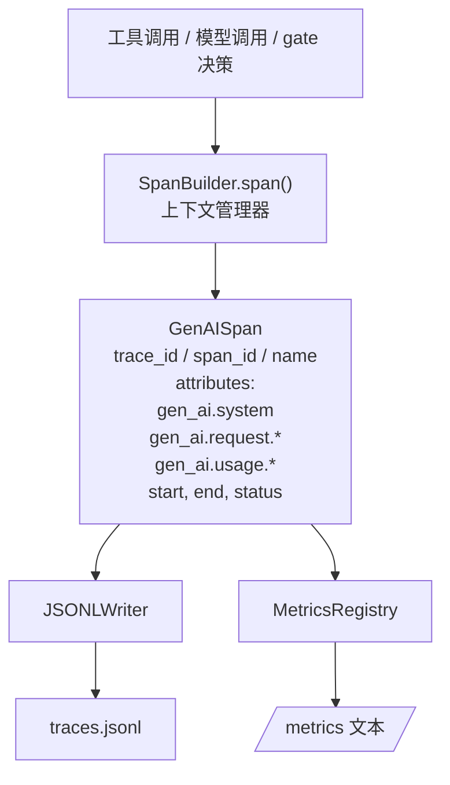
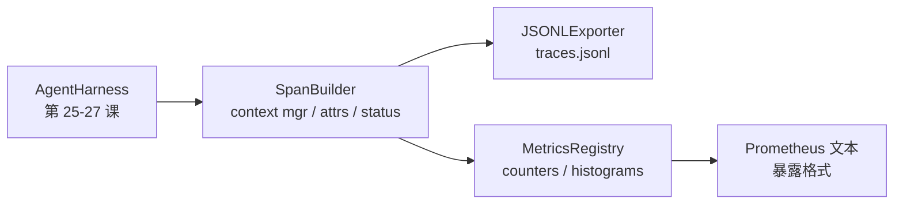

# 毕业项目课程 28：使用 OTel GenAI span 与 Prometheus 指标实现可观测性

> 没有可观测性的智能体运行框架，就是一个会烧钱的黑盒。本课手写一个 span 构建器 (span builder)：它发出符合 OpenTelemetry GenAI 语义约定 (semantic conventions) 的记录，把它们写入一个 JSON-Lines 文件（每行一个 span），并以 Prometheus 文本格式暴露 counter 与 histogram。整个实现只用 stdlib Python，并且可以离线运行。

**类型：** 构建
**语言：** Python（stdlib）
**前置条件：** 第 19 阶段 · 25（验证门），第 19 阶段 · 26（沙箱），第 19 阶段 · 27（eval harness），第 13 阶段 · 20（OpenTelemetry GenAI），第 14 阶段 · 23（OTel GenAI 约定）
**时间：** ~90 分钟

## 学习目标

- 构建一个符合 OpenTelemetry GenAI semantic conventions 形状的 span dataclass。
- 实现一个 JSONL exporter，每行写入一个自包含的 span。
- 构建带标签的 counter 与 histogram，并以 Prometheus 文本展示格式导出。
- 把任意 callable 包进一个 span context manager，记录 duration、status 与 exceptions。
- 验证发出的 span 能通过 `json.loads` 往返解析，并符合规范形状。

## 问题

生产环境中的编码智能体，每一轮都会产出三类 artifact：一次模型调用、一次工具执行，以及一次验证门决策。如果没有结构化遥测，这三者都几乎没有价值。

第一种失败模式是“缺失的 trace”。周二出了问题，但唯一留下的是一份 500 行的聊天日志。没有记录说明到底哪个工具跑了、耗时多久、多少 token 进入了 prompt，或者 gate 是否拒绝过什么。智能体作者只能猜。

第二种失败模式是“不可解析的 trace”。运行框架确实写了 span，却用了自己随意起的字段名。Grafana、Honeycomb、Jaeger，甚至本地 CLI，全都读不懂。团队栈里已有的任何可观测性工具都会因此失效，因为 span 不是标准格式。

第三种失败模式是“无法聚合的 metric”。你可以在 trace 里看到一次很慢的工具调用，却回答不了“过去一小时里 read_file 调用的 p95 延迟是多少？”因为你只有 trace，没有 metrics。

OpenTelemetry GenAI semantic conventions 存在的意义正是这个。它们定义了一组小而标准的属性键，供不同 LLM 框架的 span 发射器共享。只要你的运行框架写出这些属性，任何兼容 OTel 的后端都能读取。

## 概念



运行框架中的每个操作都会产出一个 span。span 有一个 trace id（整个智能体调用）、一个 span id（当前这次操作）、一个名字（例如 `gen_ai.chat`、`gen_ai.tool.execution`）、一组遵循 GenAI 约定的 attributes，以及开始时间、结束时间和状态。

GenAI 约定标准化了这些属性键：`gen_ai.system`（提供方，例如 `anthropic`、`openai`）、`gen_ai.request.model`（模型 id）、`gen_ai.request.max_tokens`、`gen_ai.usage.input_tokens`、`gen_ai.usage.output_tokens`、`gen_ai.response.model`、`gen_ai.response.id`、`gen_ai.operation.name`，以及工具专属键 `gen_ai.tool.name` 和 `gen_ai.tool.call.id`。

exporter 输出 JSONL，也就是每行一个 JSON 对象。这是下游工具最容易流式处理、grep 和导入的格式。真正的 OTel exporter 会走 OTLP gRPC；本课的 JSONL exporter 则是它的离线等价物，并能在任何工作站上以零退出。

metric 与 trace 并列存在。每次工具调用，counter 都会加一：`tools_called_total{tool="read_file"}`。histogram 则记录观察到的延迟：`tool_latency_ms{tool="read_file"}`。两者都会序列化成 Prometheus 的文本暴露格式，这是拉取式指标事实上的标准。

## 架构



span builder 是一个小类，提供 `span(name, attrs)` 方法，返回一个上下文管理器。该上下文管理器在进入时记录开始时间，退出时记录结束时间，若有异常则附加异常信息，并把最终完成的 span 推送给 exporter。

metrics registry 本质上是两个 dict。counter 的形状是 `{(name, frozen_labels): int}`。histogram 则把原始样本保存在列表中，并在暴露时按需序列化成 Prometheus histogram bucket。

## 你将构建什么

`main.py` 提供：

1. `GenAISpan` dataclass：trace_id、span_id、parent_span_id、name、attributes、start_unix_nano、end_unix_nano、status、status_message、events。
2. `SpanBuilder` 类，带 `span(name, attrs, parent=None)` 上下文管理器。
3. `JSONLExporter` 类，提供 `export(span)`，每次追加一行。
4. `Counter` 与 `Histogram` 类，以及 `MetricsRegistry`。
5. `prometheus_exposition(registry)`，生成文本格式输出。
6. `wrap_tool_call(name)` 装饰器，用于发出 span 并更新 metrics。
7. 演示：合成一次完整的智能体调用（在工具 span 外包一层 `gen_ai.chat` span），写出 `traces.jsonl`，打印 Prometheus 暴露文本，并以零退出。

span id 与 trace id 都是 16 字节十六进制字符串，由 `os.urandom` 生成。这与 OTel 的 W3C trace context 一致。exporter 绝不会抛异常；I/O 错误会被暴露出来，但运行框架会继续运行。

histogram 使用固定 bucket 集合（OTel 在毫秒级延迟上的默认 bucket：5、10、25、50、100、250、500、1000、2500、5000、10000、+Inf）。样本以列表保存；暴露时再按需计算各 bucket 计数。

## 为什么手写，而不是直接用 opentelemetry-sdk

OTel Python SDK 是一个真实依赖。它也意味着数千行代码、OTLP exporter 牵涉的多个进程，以及足以压垮课程预算的运行时成本。手写版本教的是线上格式。到了生产环境，你把相同属性接到真正的 SDK 上，就能免费获得 OTLP exporter、批处理与资源探测。

这些约定是稳定的。只要 OTel 不会破坏 GenAI 属性名（它们只会新增，不会改坏），本课发出的线上格式到 2030 年依然能被解析。

## 它如何与 Track A 的其他内容组合

第 25 课产出了 gate chain。第 26 课产出了 sandbox。第 27 课产出了 eval harness。第 28 课让这三者都具备可观测性。第 29 课则会把端到端演示中的每一步都包进 span，并在最后打印 Prometheus 文本。

## 运行方式

```bash
cd phases/19-capstone-projects/28-observability-otel-traces
python3 code/main.py
python3 -m pytest code/tests/ -v
```

演示会在本课工作目录中产出一个 `traces.jsonl`（结束时清理掉），然后打印三条 span 样本，再打印 counter 与 histogram 的 Prometheus 暴露文本。测试会验证：span 能往返序列化、规范中的标准 GenAI 属性都存在、counter 会正确递增，以及 histogram 暴露文本包含预期 bucket 计数。

