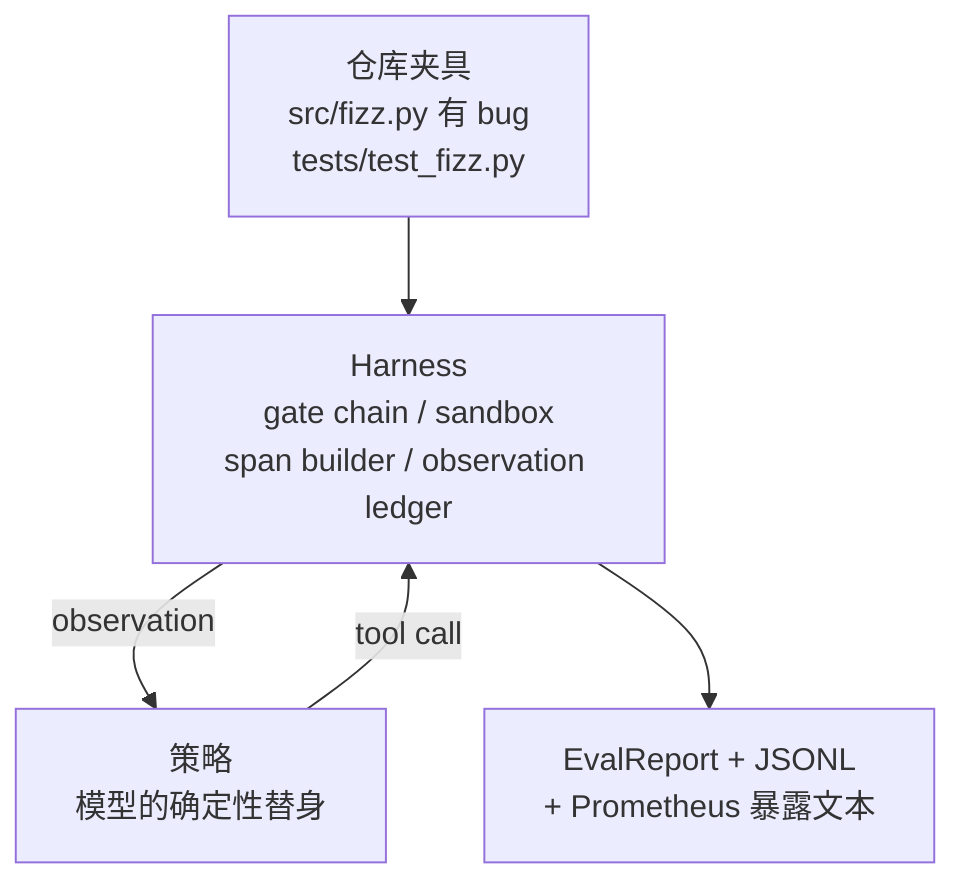
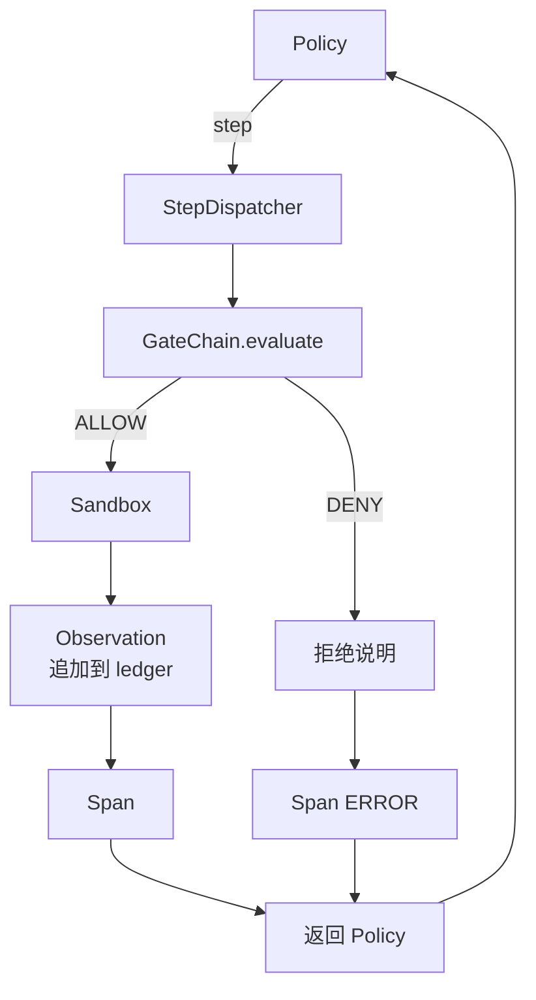

# 毕业项目课程 29：运行在运行框架上的端到端编码智能体

> 这是 Track A 的收官回报。本课把门控链 (gate chain)、沙箱 (sandbox)、评测运行框架 (eval harness) 和 OTel span 全部缝进一个可工作的编码智能体：它能在一个真实但很小、以夹具 (fixture) 为尺度的多文件 Python 项目里修复 bug。这个智能体使用的是确定性策略，而不是 LLM；这种替换让课程可复现，也证明真正有趣的一直都是运行框架本身。契约完全不变：只要在策略接缝处换成真实模型即可。

**类型：** 构建
**语言：** Python（stdlib）
**前置条件：** 第 19 阶段 · 25（验证门），第 19 阶段 · 26（沙箱），第 19 阶段 · 27（eval harness），第 19 阶段 · 28（可观测性），第 14 阶段 · 38（验证门），第 14 阶段 · 41（真实仓库工作台），第 14 阶段 · 42（智能体工作台毕业项目）
**时间：** ~90 分钟

## 学习目标

- 把 gate chain、sandbox、eval harness 和 span builder 组合成一个单一智能体循环。
- 实现一个确定性策略，借助 read_file、run_tests 和 write_file 修复一个 fixture bug。
- 在端到端运行中同时强制执行全局步骤预算与 observation token 预算。
- 为整次运行发出完整的 OTel GenAI trace 与 Prometheus metric。
- 验证智能体能在少于 12 步内解出 fixture，并且对合法工具零 gate trip。

## 问题

大多数智能体演示都只在隔离环境里看起来没问题：单独的 sandbox、单独的 eval harness、单独的 span emitter。它们各自都挺像样。一旦真正组合起来，接缝就会暴露。

gate chain 说 ALLOW，但 sandbox 却因为链根本没预料到的原因拒绝。eval harness 记录了一次通过，可 OTel span 却显示 gate 拒绝了某个智能体声称自己使用过的工具。Prometheus counter 本应加一，却加了两次。observation budget 已经超限，可智能体还在继续，因为预算只在链里被跟踪，而 sandbox 并不知道。

本课就是整个 track 的集成测试。智能体必须按顺序完成四件事：读取项目、运行测试、从测试失败中定位 bug、写入修复、再次运行测试，然后停止。每个操作都经过 gate chain。每次工具执行都经过 sandbox。每一步都包在 span 里。最后由 eval harness 给整次运行打分。

## 概念



智能体的策略是一个状态机，共五个状态。

`SURVEY`：智能体读取项目列表。下一个状态是 RUN_TESTS。

`RUN_TESTS`：智能体运行测试命令。如果测试通过，状态机就成功停止。否则下一个状态是 INSPECT。

`INSPECT`：智能体读取失败的源文件。下一个状态是 FIX。

`FIX`：智能体写入修正后的文件。下一个状态是 VERIFY。

`VERIFY`：智能体再次运行测试命令。如果测试通过，则成功停止；否则失败停止。

每个状态都对应一次工具调用。每次工具调用都要经过 gate chain。如果某次工具调用被拒绝，智能体会在 trace 中记录这次 refusal，并立即停止。

夹具 bug 是 `fizz.py` 中的一个 off-by-one。这个确定性策略会用正则从测试失败消息中识别出 bug，然后输出修正后的文件。把策略换成 LLM，不会改变运行框架契约。

## 架构



本课是自包含的。前几课中的每个原语，都会在 `main.py` 里以最小规模重新实现（gate、sandbox、ledger、span），因此本课无需导入同级目录。名称与第 25-28 课保持完全一致，使概念映射清晰明确。

## 你将构建什么

`main.py` 提供：

1. 最小化的运行框架原语，名称与第 25-28 课保持一致：`GateChain`、`Sandbox`、`ObservationLedger`、`SpanBuilder`、`MetricsRegistry`。
2. `CodingAgentPolicy` 类：一个包含五个状态的状态机。
3. `Repo` 辅助类：准备一个 scratch 目录，并放入内置的 buggy fixture。
4. `AgentRun` 类：驱动策略，通过运行框架完成分发，并返回 `AgentRunReport`。
5. 一个内置 fixture（`fixture_repo/`），包含 `src/fizz.py`、`tests/test_fizz.py` 和供 eval harness 使用的 `expected/` 树。
6. 演示：端到端运行该策略，打印逐步 trace，断言通过，再打印 metrics。

内置 fixture 的形状与第 27 课任务结构相同：一个 buggy 文件，加一个 tests 文件。测试失败消息中包含足够信息，使这个确定性策略能够识别修复方式。真实 LLM 做的是同一件事，只是更慢、召回更广，但它不会改变运行框架的期望。

## 为什么策略不是 LLM

真实 LLM 需要 API key、网络调用，以及无法验证的随机性。课程真正关心的是运行框架本身。换成确定性策略后，课程就能在任意开发者笔记本上零外部依赖运行，测试套件也可以断言精确的步骤计数。

本课中的策略，是 LLM 智能体所做事情的严格子集。策略会读取仓库、看到失败测试、定位代码行并输出修复。LLM 也走同样的循环，使用同样的运行框架契约；记账方式完全一致。

## 演示会断言什么

端到端演示在退出时会断言五件事，测试套件也会以编程方式重新断言它们。

策略在少于 12 步内解决了这个 fixture。

观察预算从未超限。

对合法工具的 gate 拒绝次数为零。（智能体从未编造被拒绝的工具名。）

`traces.jsonl` 中每一步都有对应的 span。

Prometheus 暴露文本中包含 `tools_called_total{tool="read_file"}` 条目，以及 `tool_latency_ms` histogram。

## 它如何与 Track A 的其他内容组合

本课就是集成层。第 25 课写了 gate chain。第 26 课写了 sandbox。第 27 课写了 eval harness。第 28 课写了可观测性。第 29 课证明它们作为一个系统可以协同工作。真实智能体运行框架可以从这里继续扩展：把确定性策略换成模型，把内置 fixture 换成真实仓库任务，把 JSONL exporter 换成 OTLP。

## 运行方式

```bash
cd phases/19-capstone-projects/29-end-to-end-coding-task-demo
python3 code/main.py
python3 -m pytest code/tests/ -v
```

演示会打印逐步 trace、最终 eval report，以及 Prometheus 暴露文本。退出码为零。测试覆盖策略状态迁移、对合成工具调用的 gate refusal、在内置 fixture 上的端到端运行，以及步骤预算不变量。

