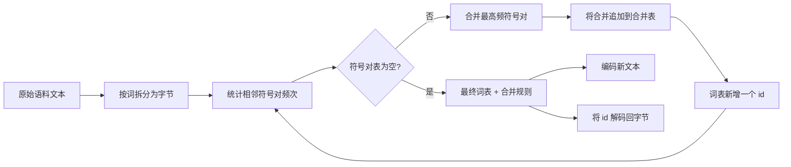
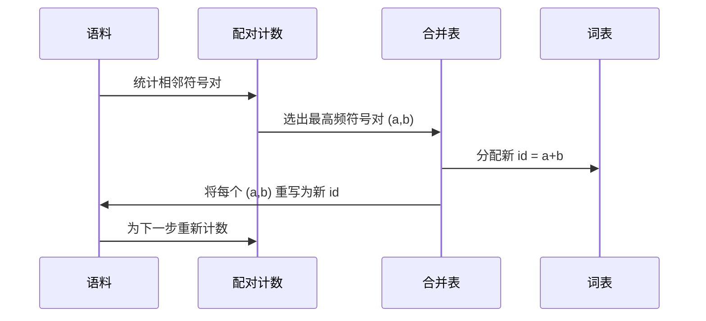

# 从零开始实现 BPE 分词器

> 输入字节，输出 id，再从 id 还原回相同的字节。构建现代文本模型至今仍作为起点的那个分词器。

**类型：** 构建
**语言：** Python
**先修要求：** 第 04 阶段课程，第 07 阶段 Transformer 课程
**时间：** ~90 分钟

## 学习目标
- 从原始文本语料库（raw text corpus）训练一个字节对编码（Byte-Pair Encoding，BPE）词表，通过反复合并最常出现的相邻符号对来完成。
- 实现一个确定性的合并表（merge table），并将其应用到新文本上，生成子词（subword）id 流。
- 在不丢失信息的前提下，把任意 UTF-8 输入往返转换为 id 再还原回来。
- 预留并保护特殊标记（special tokens）（`&lt;|endoftext|>`、`&lt;|pad|>`），让它们在训练和解码过程中保持不变。
- 理解为什么字节级字母表（byte-level alphabet）是通用分词器最合适的底层起点。

## 背景

语言模型从不直接看到文本。它看到的是整数。把字符串映射成整数列表，再从整数列表映射回字符串的这一层，就是分词器（tokenizer）。如果这一层出了错，那么训练过程中每一条损失曲线衡量的都会是错误的东西。

在通用文本模型里，占主导地位的子词分词器家族是字节对编码。这个想法很简单：从一个已知字母表开始，找出训练语料中出现频率最高的相邻符号对，把它合并成一个新符号。重复这个过程，直到词表达到目标大小。对新文本进行编码时，会按完全相同的顺序复用这份合并列表。

我们将实现字节级（byte-level）版本。它的字母表不是 Unicode 码点，而是 256 个原始字节。正是这个选择，让分词器能够处理任何 UTF-8 输入，而不用退回到未知标记（unknown token）。

## 流程管线

训练端和推理端共享同一份合并表。这种共享就是契约。如果你在推理（inference）时改变合并顺序，解码出来的就会是另一串 id 流。

## 字节字母表

前 256 个 id 预留给原始字节 `0x00` 到 `0xFF`。这保证了在任何合并发生之前，每个输入字符串都已经能够用词表表示出来。在字节块之后，我们会额外预留一小段给特殊标记。训练循环永远不会把这些 id 当作合并目标，因为我们会把它们完全排除在预分词（pretokenized）流之外。

预分词器（pretokenizer）会在训练看到语料之前，先按空白和标点边界切分。没有这一步，BPE 的合并步骤就会很乐于学习跨词边界的合并，最终让词表塞满整个常见短语。加上这一步后，合并会留在词内部，结果也就更有泛化性。

## 训练循环

每一步训练循环会做三件事。它遍历语料中的每个词，统计当前符号序列里每个相邻符号对出现了多少次，并按该词本身的出现频率加权。然后它选出计数最高的那一对，把这对符号的每一次出现都重写为一个新的单一符号，其 id 就是词表中的下一个空闲槽位。最后，它把这次合并记录下来。

如果把语料表示为符号序列列表，那么每一步的成本都与语料大小线性相关。对于一百万个词、目标词表大小为一万个 id 的情况，这个循环能在几秒内跑完，因为随着合并不断落地，符号序列本身也会越来越短。

## 编码新文本

推理时不会再调用合并计数器。它只会按学习到的原始顺序应用合并表。对于一个新词，编码器会从字节拆分开始，在当前序列中扫描排名最低的可用合并规则（也就是最早学到、且当前能应用的那条），执行这次合并，再重新扫描。当合并表中已经没有任何规则适用于当前序列时，循环结束。

按照排名顺序应用规则，是让编码结果具有确定性、并与训练时在相同输入上的行为一致的关键性质。越早学到的合并规则，就越靠近表的顶部，也就越先被应用。如果同一位置上有两条合并都能用，排名更低的那条获胜。

## 特殊标记

特殊标记是字节流永远不可能自行产生的 id。我们手动为它们预留位置。对本课来说，两个就够了。

- `&lt;|endoftext|>` 用来在预训练期间分隔文档。它告诉模型：“一个新文档从这里开始，不要让前一个文档的上下文泄漏进来。”
- `&lt;|pad|>` 用来把较短序列补齐，使一个批次能够组成规则的矩形张量。训练时会通过损失掩码把它隐藏掉。

编码器接收一个标志位，用来决定是否允许输入中出现特殊标记。关闭时，字符串 `&lt;|endoftext|>` 和 `&lt;|pad|>` 会被当作拼出它们的那些字节来分词。开启时，这些字面字符串会直接映射到预留 id，并且不参与任何合并。

## 往返保证

编码后再解码，必须精确返回输入字节。解码器会按顺序拼接每个 id 对应展开后的字节序列。由于每个 id 要么是原始字节，要么是两个先前已知 id 的拼接，因此递归展开总会在原始字节处终止。随后，解码会返回这些字节所拼成的 UTF-8 字符串。

本课的测试套件会在三个场景上检查这一性质：一个未见过的句子、一个包含 Unicode emoji 的句子，以及一个包含字面 `&lt;|endoftext|>` 标记的句子。

## 本课不做什么

本课不会像大型生产级分词器那样，构建一个由正则表达式驱动的预分词器。这里的预分词器只是一个小型的空白与标点切分器。它已经足以在小型训练语料上产生合理的合并规则，而且与后续课程链条的契约保持不变。下一课会把这个分词器当成黑盒，在它之上构建滑动窗口数据集。

本课也不会并行化配对计数器。对于几千个词规模的语料，Python 中的一个循环通常远不到一秒就能完成。对于更大的语料，显然的做法是对每个词并行计数，再做归约。

## 如何阅读代码

`main.py` 定义了四个对象。`BPETokenizer` 持有词表、合并表和特殊标记表。`train` 是训练循环。`encode` 是推理路径。`decode` 负责字节拼接。文件底部的 demo 会在内置语料上训练一个小分词器，对一条留出句子进行编码，再把 id 解码回来并打印两者。`code/tests/test_bpe.py` 中的测试固定了往返性质、特殊标记预留，以及合并顺序。

运行 demo。然后把 demo 中目标词表大小从 300 改成 600，观察那条留出句子的编码长度如何下降。这条曲线就是 BPE 的压缩曲线。
