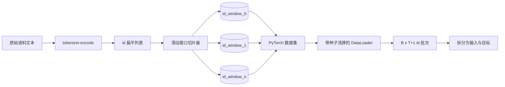
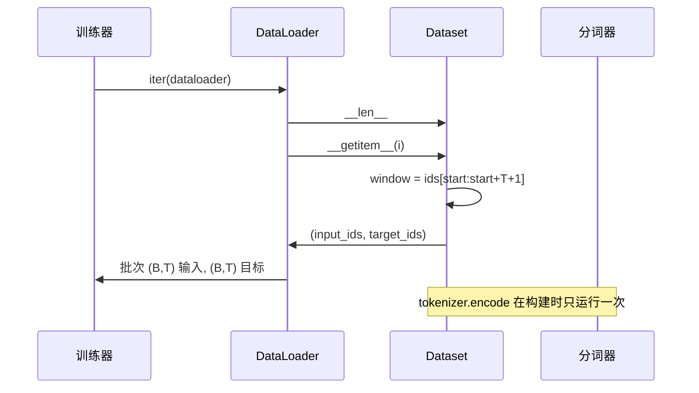

# 使用滑动窗口的分词数据集

> 一次预训练运行，本质上是从 token id 到梯度的函数。本课将构建把这些 id 持续送进去的传送带。

**类型：** 构建
**语言：** Python
**先修要求：** 第 04 阶段课程，第 07 阶段 Transformer 课程，本阶段第 30 课
**时间：** ~90 分钟

## 学习目标
- 通过调用一次分词器，把原始语料库转换为词元（token）id 流。
- 用可配置重叠步幅（stride）把 id 流切成固定长度的滑动窗口（sliding window）。
- 构建一个 PyTorch 数据集（Dataset），为下一 token 预测（next-token prediction）返回输入张量和目标张量。
- 用按 epoch 设定种子的确定性洗牌，把数据集封装进数据加载器（DataLoader）。
- 理解步幅、冗余和有效数据集大小之间的权衡。

## 背景

一次预训练（pretraining）运行会一次读取一个 token id 批次并更新模型。每个批次的形状由训练契约固定。对于因果语言模型（causal language model），批次中包含 `(B, T)` 的输入 id 和 `(B, T)` 的目标 id，其中目标是将输入整体左移一位得到的。数据管线的任务，是从可能包含数 GB 原始文本的语料中，以确定且可复现的方式，按需生成这一契约。

本课会搭建这条管线。上一课的分词器会把文本转换为一长串扁平 id 列表。滑动窗口会把这串列表切成训练样本。一个自定义 Dataset 会把这些样本暴露为张量。DataLoader 则负责把它们分批，并使用已知种子进行打乱。

## 形状契约

因果语言模型（LM）接收形状为 `(B, T)` 的 id，其中 `B` 是批大小，`T` 是上下文长度（context length）。位置 `t` 处的目标，是位置 `t+1` 处的输入。这意味着每个训练样本都覆盖 `T+1` 个原始 id。窗口步幅控制相邻样本之间有多少重叠。

切片器绝不会越过语料边界。如果最后一个窗口没有足够的 id 来填满 `T+1` 个位置，切片器就会把它丢弃。用 `&lt;|pad|>` 对尾部做填充也是一种可行选择，但那会让损失掩码变复杂。本课直接丢弃。

## 为什么要用滑动窗口

预训练语料是一整条连续的 id 流。如果模型只看到彼此不重叠的窗口，那么每个训练样本都会让它学习到同样的 `T` 个边界。调整步幅会移动这些边界，从而让模型看到更多样的“预测下一个 token”任务。

步幅为 `T` 时，会产生彼此不重叠的窗口。步幅为 `T // 2` 时，会产生 50% 的重叠，并把有效数据集规模翻倍。步幅为 `1` 时，会产生最大重叠，并把数据集扩大到 `T` 倍。代价是每个 epoch 需要更多计算。收益是边界更加多样。大多数预训练运行会让步幅等于上下文长度，因为语料本身已经远大于模型在一个 epoch 内能处理完的量，所以“边界多样性”的理由就没那么强了。

## 数据集类（Dataset）

一个 PyTorch Dataset 需要实现两个必需方法。`__len__` 返回样本数量，`__getitem__` 返回一个样本对应的一对张量。我们的 Dataset 会保存编码后的 id 流和步幅。对它做索引时，会即时计算窗口起点，因此无论步幅产生多少个样本，内存成本始终只是一份 id 流副本。

左移一位的逻辑发生在 `__getitem__` 内部。Dataset 返回 `(input, target)`，其中 `input = window[:-1]`，`target = window[1:]`。两者都是 PyTorch 的 long tensor。训练循环会把它们视为监督真值。

## 确定性洗牌

设置 `shuffle=True` 的 DataLoader 会从 PyTorch 随机生成器中读取随机性。通过传入一个按 epoch 设定种子的显式 `torch.Generator`，我们就能在每次重新启动运行时获得完全相同的洗牌顺序。当你希望比较两个只在单个超参数上不同的运行时，这一点非常重要。没有种子的话，两次运行看到的数据顺序不同，损失曲线也会因为与改动无关的原因而分叉。

本课中的种子契约很简单：`epoch_seed = base_seed + epoch_index`。基础种子在构造时传入。训练器会在每个 epoch 开始时递增 epoch 索引。只要基础种子相同，重新运行时每个 epoch 看到的顺序就始终一致。

## 批采样器

PyTorch 的默认采样器会在不放回的前提下，对索引做均匀随机抽样。这正是我们在预训练中想要的行为。对于小数据集上的微调，契约也是一样的。DataLoader 会调用 `__getitem__` 共 `B` 次，再把结果堆叠成一个批次。由于每个样本按构造都具有相同长度，因此不需要任何填充逻辑。

为简化起见，本课将 `num_workers=0`。在生产运行中，worker 会并行化 `__getitem__` 调用。对我们的这条管线而言，这几乎没有实际效果，因为工作内容只是在内存张量上做一次切片；不过同一套 Dataset API 依然能够很好地支持 worker。

## 统计样本数量

对于长度为 `N` 的 id 流、上下文长度 `T` 和步幅 `S`，样本数量为 `max(0, 1 + (N - (T + 1)) // S)`。本课把这个计算暴露为 Dataset 上的一个静态方法，这样训练器就能在不迭代数据的情况下计算每个 epoch 的总步数。

## 本课不做什么

本课不会从磁盘流式读取。语料会被完整编码到内存中，并保存为单个张量。对于几百万个 id 规模的语料，这通常还不到一百 MB，非常适合作为本课的形状。磁盘流式处理是另一个独立问题，可以通过替换底层存储接入进来，同时保持 Dataset 契约不变。

本课也不会处理多个文档。语料会被视为一条连续的 id 流。当语料由多个文档构建而成时，可以通过插入 `&lt;|endoftext|>` id 来编码“下一个文档边界”。模型会学习如何围绕这个边界做预测。

## 如何阅读代码

`main.py` 定义了两个类和一个辅助函数。`SlidingWindowDataset` 是 PyTorch Dataset。`make_dataloader` 会返回一个带已设种子生成器的配置好 DataLoader。`_encode_corpus_to_ids` 是一次性的分词器调用。文件底部的 demo 会在进程内构建一个小分词器，对内置语料进行编码，构造数据集和 dataloader，打印一个批次，并断言形状契约成立。`code/tests/test_dataset.py` 中的测试固定了窗口计数公式、左移一位性质、确定性洗牌，以及步幅权衡。

运行 demo。然后把上下文长度从 16 改成 32，观察每个 epoch 的样本数如何下降。这个数字就是你的“每个 epoch 步数预算”。
