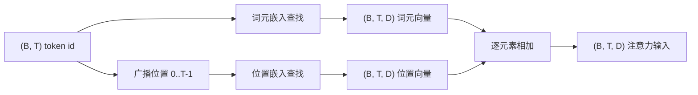
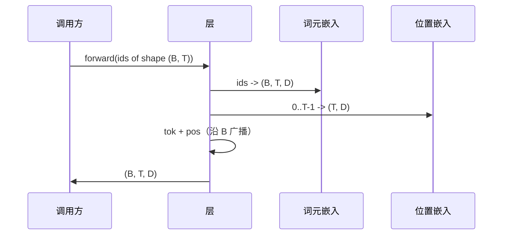

# 词元嵌入与位置嵌入

> id 是整数，模型需要的是向量。两者之间夹着两个查找表，而位置那个表的选择会塑造模型能学到什么。

**类型：** 构建
**语言：** Python
**先修要求：** 第 04 阶段课程，第 07 阶段 Transformer 课程，本阶段第 30、31 课
**时间：** ~90 分钟

## 学习目标
- 构建一个词元嵌入查找表（token-embedding lookup table），把词表 id 映射到稠密向量。
- 构建一个按位置索引的可学习位置嵌入（learned positional embedding）查找表。
- 构建一个按位置索引、没有参数的固定正弦位置嵌入（sinusoidal positional embedding）。
- 将词元嵌入与位置嵌入组合成 transformer 块（transformer block）的单一输入。
- 对比可学习嵌入与正弦嵌入在长度泛化（length generalization）和参数数量上的差异。

## 背景

模型第一次接触词元（token）id，是在词元嵌入矩阵（token-embedding matrix）中做一次按行查找。这个矩阵对每个词表 id 都有一行，对每个模型维度都有一列。这次查找会返回一个向量，模型的其余部分会把它当作该 id 的含义。反向传播（backprop）会更新前向传播中用到的那些行。随着训练推进，这些行的几何结构会学会在不同方向上编码相似性。

单独的 token id 本身不包含顺序信息。模型需要第二个信号，告诉它位置 1 和位置 17 是不同的。这个信号的两种主流选择是：可学习位置嵌入（第二个查找表，每个位置一行）以及固定正弦位置嵌入（一个没有参数的数学公式）。这个选择会带来后果。可学习表本身就是参数，并受限于模型训练时的最大上下文长度。正弦表理论上不含参数，而且公式可以扩展到任意位置；但本课中的 `SinusoidalPositionalEmbedding` 会在 `max_context_length` 处预先计算一张固定表，并且其 `forward` 在超出该范围时会报错，因此这里两个模块都会强制执行最大上下文长度限制。即使表足够大、能够完成索引，模型在超出训练长度时仍可能表现不佳。

本课会把这两种方案都实现出来，并将它们与词元嵌入组合，形成下一课注意力块的单一输入。

## 形状契约

嵌入阶段的输入，是一个形状为 `(B, T)` 的 token id 批次。输出是形状为 `(B, T, D)` 的张量，其中 `D` 是模型维度。批次中的每个样本都有相同的上下文长度 `T`，每个位置都有相同的向量维度 `D`。



这里采用的是求和，而不是拼接。求和能让整个网络中的 `D` 保持不变，并让模型在每一层都能按特征维度自行决定：当前位置是词元语义更重要，还是位置信号更重要。

## 词元嵌入矩阵

词元嵌入是一个形状为 `(V, D)` 的参数张量，其中 `V` 是词表大小。PyTorch 通过 `nn.Embedding(V, D)` 暴露它。初始化时，这些数值通常从一个小的高斯分布（Gaussian）中采样；对于 transformer 规模的模型，传统做法是均值为零、标准差约为 `0.02`。精确的初始化方式没那么重要，更重要的是在不同运行之间保持一致。

前向传播就是一次索引操作。PyTorch 通过收集对应行，把 `(B, T)` 的 int64 id 映射成 `(B, T, D)` 的浮点张量。反向传播只会把梯度累积到前向传播中真正用到的那些行里。在该批次中从未出现过的两行，在这一步得到的梯度就是零。

还有一个细节。词元嵌入和模型末尾的输出投影经常会共享权重（weight tying）。一旦这么做，每次反向传播都会通过输出侧触达嵌入矩阵的每一行。本课把两者暴露为独立模块，但在完整模型里，同一块矩阵完全可以同时承担这两个角色。

## 可学习位置嵌入

可学习位置嵌入是第二个形状为 `(max_context_length, D)` 的 `nn.Embedding`。查找时使用的位置 id 是 `0, 1, 2, ..., T-1`。前向传播会把这个位置向量沿批次维进行广播。

可学习表的缺点在于：如果模型只训练到了位置 `T-1`，那么它就无法在位置 `T` 上被查询，因为对应的那一行根本不存在。生产环境中的纯解码器语言模型（decoder-only language model）如果采用这种方案，通常会把最大上下文长度直接写死在架构里，并拒绝处理更长输入。

## 正弦位置嵌入

正弦位置嵌入是一个从位置映射到向量的函数。给定位置 `p` 和特征 `i`，得到：

```python
angle = p / (10000 ** (2 * (i // 2) / D))
emb[p, 2k]     = sin(angle)
emb[p, 2k + 1] = cos(angle)
```

这个函数没有参数。每个位置都有唯一的向量。波长会沿特征维按几何级数变化，因此较低维度编码粗粒度位置，较高维度编码细粒度位置。

把 `sin` 和 `cos` 组合起来带来的一个性质是：位置 `p + k` 处的向量，可以表示为位置 `p` 处向量的线性函数。这给注意力层提供了一条学习相对位置偏移的捷径。模型不需要额外参数，就能表达“往前看 5 个 token”。

本课会在构造时一次性计算完整的正弦表，并在前向传播时对其进行索引。

## 组合方式

输入管线会按顺序做三件事：读取 token id，查找词元向量，加上位置向量，然后返回两者之和。



在求和这一步中，`(T, D)` 的位置张量会沿批次维复制。由于位置张量在 `unsqueeze` 之后的形状是 `(1, T, D)`，PyTorch 会自动处理这件事。

## 对比分析

本课会在相同输入上运行这两种变体，并打印两个诊断结果。

第一个是参数数量。可学习变体会在词元嵌入之上额外增加 `max_context_length * D` 个参数。正弦变体则增加零个参数。

第二个是相邻位置嵌入之间的余弦相似度。由于函数是连续的，正弦变体会呈现平滑且可预测的衰减。可学习变体在初始化时的相似度则接近随机，因为每一行都是独立采样出来的。训练之后，可学习变体通常也会发展出类似的平滑结构，但那需要它从数据中自己发现。

## 本课不做什么

本课不会实现旋转位置编码（RoPE）或 AliBi。它们才是生产级 transformer 中更现代的选择。它们都遵循与这里相同的形状契约（对形状为 `(B, T, D)` 的向量施加位置相关变换），但应用位置是在注意力投影步骤，而不是输入端。下一课会构建注意力块，其中一个可选扩展就是把旋转编码折叠进那里的 query-key 投影中。

本课也不会训练嵌入层。训练需要损失，损失需要模型输出，模型输出又需要注意力和 LM head。这是下一课和下下课的内容。

## 如何阅读代码

`main.py` 定义了三个模块。`TokenEmbedding` 封装 `nn.Embedding(V, D)`。`LearnedPositionalEmbedding` 封装 `nn.Embedding(L, D)`。`SinusoidalPositionalEmbedding` 会预先计算好表并把它暴露为一个 buffer。`EmbeddingComposer` 把词元嵌入和位置嵌入绑在一起。文件底部的 demo 会打印形状、参数数量，以及相邻位置相似度的诊断结果。`code/tests/test_embeddings.py` 中的测试固定了形状、广播行为、参数数量和正弦公式。

运行 demo。然后把模型维度 `D` 从 64 改成 32，观察正弦波长带如何变化。
