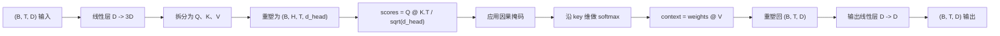
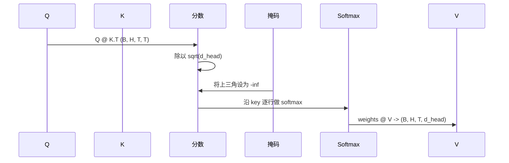

# 多头自注意力

> 一次线性投影，三种视图，H 个并行头，一个掩码。这就是模型实际使用的注意力块。

**类型：** 构建
**语言：** Python
**先修要求：** 第 04 阶段课程，第 07 阶段 Transformer 课程，本阶段第 30 到 32 课
**时间：** ~90 分钟

## 学习目标
- 将批处理的查询/键/值（Query/Key/Value，QKV）投影实现为一个拆成 H 个头的单线性层。
- 用正确的归一化和 dtype 处理来计算缩放点积注意力（scaled dot-product attention）。
- 应用因果掩码（causal mask），阻止某个位置关注未来位置。
- 检查固定输入下每个头的注意力权重（per-head attention weights），并分析每个头在看什么。
- 在一个玩具任务上训练一个小型注意力块，并观察随着各个头逐渐专门化，损失如何下降。

## 背景

注意力（attention）这个函数，让一个词元（token）的表示能够从同一序列中的其他词元拉取信息。自注意力意味着 query、key 和 value 都来自同一个输入。多头（multi-head）意味着这次投影会被拆成 H 个并行的注意力问题，它们的输出会先拼接，再投影回去。

高效实现的模式是：用一个线性层把 `D` 投影到 `3 * D`，再切成三个视图，然后重塑为 H 个头，每个头的大小都是 `D // H`。矩阵乘法、softmax 和加权求和都作为批处理（batched）张量操作执行，因此这些头可以在加速器上并行运行。

本课会构建这个块。同时还会加入因果掩码，这样同一份代码就能作为纯解码器语言模型（decoder-only language model）的注意力层使用。下一课会把这个块堆叠成完整的 transformer，再下一课会训练它。

## 形状契约

输入是 `(B, T, D)`，输出也是 `(B, T, D)`。掩码是 `(T, T)`，或者可以广播到这个形状。在块内部，中间张量的形状是 `(B, H, T, d_head)`，其中 `d_head = D // H`。约束条件是 `D % H == 0`。

这两个线性层（QKV 投影和输出投影）是这个块里仅有的参数。掩码、softmax、矩阵乘法以及重塑操作都不含参数。

## QKV 拆分

朴素实现会为 Q、K、V 分别使用三个独立线性层。高效实现则只用一个输出 `3 * D` 个特征的线性层，再对结果做拆分。两者在数学上完全等价，因为三个 `(D, D)` 权重矩阵的独立矩阵乘法，恰好等同于一次使用由它们堆叠而成的 `(3D, D)` 权重矩阵的矩阵乘法。

高效版本更快，因为加速器只需要发起一次矩阵乘法而不是三次。它也更容易初始化，因为这三个子矩阵都位于同一个参数张量里，可以一起初始化。

## 头部重塑

拆分后，Q、K、V 各自的形状都是 `(B, T, D)`。为了把它们变成 H 个并行注意力问题，我们先重塑为 `(B, T, H, d_head)`，再转置成 `(B, H, T, d_head)`。此时头维度就挨着批次维了，因此 PyTorch 会把每个头的注意力视为跨 `B * H` 个独立实例的批处理操作。

`d_head` 维保持在最后，这样打分矩阵乘法 `Q @ K.transpose(-2, -1)` 就会沿它做收缩。结果是形状为 `(B, H, T, T)` 的逐头注意力分数。

## 缩放

在 softmax 之前，分数会先除以 `sqrt(d_head)`。如果不做这个缩放，随着 `d_head` 增长，点积也会变大，进而把 softmax 推到一种极端区域：其中一个条目几乎拿走全部权重，其余条目则趋近于零。处在这种区域时，梯度会很小，学习也会停滞。除以 `sqrt(d_head)` 可以让分数的方差在不同头大小下大致保持恒定。

## 因果掩码

纯解码器语言模型在预测下一个 token 时，只能依赖过去。掩码正是用来强制执行这一点的。具体来说，在 softmax 之前，`(T, T)` 分数矩阵中所有位于对角线之上的条目都会被替换成负无穷。经过 softmax 后，这些位置的权重就会变成零。

我们会在构造时把掩码注册为一个 buffer，这样它就会和模型位于同一设备上，同时又不属于梯度图的一部分。这张掩码覆盖了该块可能看到的最大上下文长度。前向传播时，我们只切出左上角的 `(T, T)` 部分。

## 输出投影

得到逐头上下文向量 `(B, H, T, d_head)` 后，我们先转置回 `(B, T, H, d_head)`，再重塑为 `(B, T, D)`，最后应用一个 `(D, D)` 的线性投影。输出投影让模型可以混合各个头的信息。没有它，H 个头只能在更后面的层里重新组合，整个块就会受到不必要的限制。

## 注意力权重检查

本课会在前向传播上暴露一个 `return_weights=True` 标志。启用后，这个块会在输出之外，再返回形状为 `(B, H, T, T)` 的逐头注意力权重。demo 会在一个短输入上打印某个头权重的热力图，这样你就能看到因果三角结构以及每个位置的关注重点。

在训练好的模型里，不同的头会学到不同模式。有些头会关注紧邻之前的词元，有些头会关注序列开头，还有一些头会几乎均匀地分配注意力。这个检查钩子就是做这类可解释性分析的入口。

## 训练演示

`main.py` 底部的 demo 会把注意力块接到一个很小的 LM head 上，并在一个重复任务上训练整个模型。输入的每一行，都是同一个随机 id 在整个上下文中重复铺开。目标是把输入左移一位，因此模型必须学会“下一个 token 和前一个 token 相同”。损失函数是交叉熵。在 H=4、D=32、T=12、词表大小为 64 时，损失会在 CPU 上用三个 epoch 从随机水平（约 `log(64) ~ 4.16`）下降到明显低于 `1.0`。

这个 demo 的目的不是训练出一个有用模型，而是确认梯度能够流经这个块的每一个部分，并且各个头能在一个答案显而易见的问题上学到点东西。

## 本课不做什么

本课不会加入前馈块（feed-forward block）。真实模型里的 transformer 层，是注意力后接一个两层 MLP，并在两部分外侧都包上残差连接和层归一化。下一课会把这些补上。

本课也不会实现旋转或 AliBi 位置编码。它们都作用在同一个块里的 QKV 投影步骤上，但属于独立的教学单元。按这里构建出来的这个块，只要在矩阵乘法之前变换 Q 和 K，就能兼容其中任一种方案。

本课还不会实现推理用的 KV cache。在多次前向传播之间缓存 key 和 value，是让自回归解码变快的优化。它会改变 K 和 V 张量的形状契约，但不会改变 Q 的形状契约。这属于推理课程的内容。

## 如何阅读代码

`main.py` 定义了 `MultiHeadSelfAttention`。这个类持有两个线性层和一个已注册的掩码 buffer。前向传播会依次执行投影、重塑、打分、加掩码、softmax、加权、再次重塑，以及最终投影。文件底部的 demo 会构建一个小模型：它用词元嵌入、位置嵌入和一个 LM head 把注意力包起来，在一个拷贝任务上训练三个 epoch，并打印损失曲线和逐头注意力热力图。`code/tests/test_attention.py` 中的测试固定了形状契约、因果性、softmax 性质、头拆分性质，以及梯度流。

运行 demo。然后把 `n_heads` 从 4 提高到 8（保持 `d_model=32`，因此 `d_head=4`），观察热力图如何变化。
