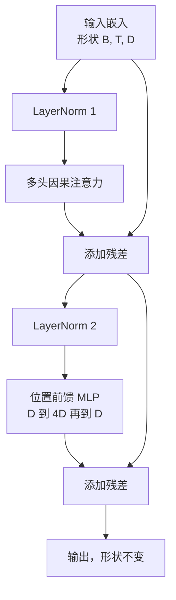
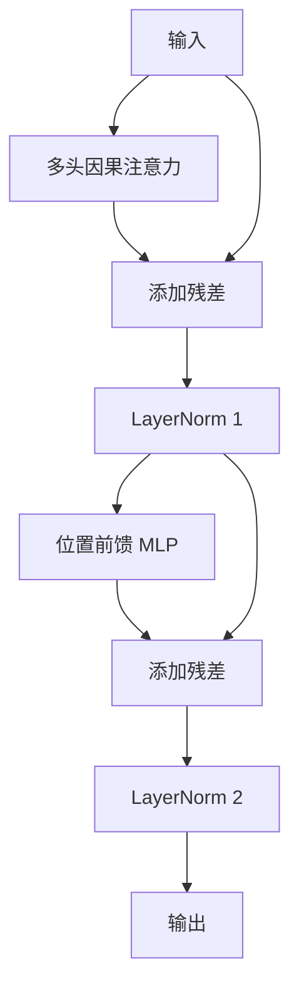

# 从零实现 Transformer 块（Transformer block）

> 一个模块（block）就是每个现代解码器 LLM 的基本单元。层归一化（LayerNorm）、多头注意力（multi-head attention）、残差（residual）、多层感知机（MLP）、残差。Pre-LN 变体无需 warmup 也能稳定训练。Post-LN 变体则是原始论文发布时采用的版本。本课会并排构建两者，并展示在常见学习率下，哪一种能在 12 层堆叠中稳定存活。

**类型：** 构建
**语言：** Python
**先修要求：** 第 19 阶段第 30 到 33 课（分词器、嵌入、注意力数学、批量数据加载器）
**时间：** 约 90 分钟

## 学习目标

- 在 PyTorch 中用四个关键部件搭建一个 Transformer 块（transformer block）：LayerNorm、多头因果注意力（multi head causal attention）、残差连接（residual connections）、位置前馈 MLP（position wise MLP）。
- 将 LayerNorm 放在两种配置中（pre-LN 和 post-LN），并解释为什么其中一种无需 warmup 也能稳定训练。
- 在多头注意力内部实现因果掩码（causal masking），使得 token `i` 无法看到 token `j > i`。
- 在 12 层堆叠上跟踪两种变体中的梯度流动，并在不含糊其辞的情况下读懂结果。
- 在下一课组装一个 1.24 亿参数 GPT 时，将这个模块作为即插即用单元复用。

## 问题

Transformer 就是同一个模块不断重复。只要这个模块错一次，再重复十二次，你交付的模型就会在第一个 epoch 发散，或者在后续训练中一直依赖 warmup 补丁。本课里你会看到的两个失败模式并不罕见。学习者第一次天真地堆叠模块时，它们就会出现。一个是注意力层看到了未来。另一个是 LayerNorm 放在了无法在深层压住残差信号的位置。

一旦看清楚，修复方法就是机械性的。这个模块恰好有两条残差路径，也恰好有两个归一化位置。把位置选对，剩下的堆叠工作就只是记账。

## 概念

每个纯解码器 Transformer 块（decoder only transformer block）都是一个函数：它接收形状为 `(batch, sequence, embedding)` 的张量，并返回相同形状的张量。内部真正做事的是两个子层。



这就是 pre-LN 变体。LayerNorm 位于残差分支内部，在子层之前。残差连接会把未归一化的信号继续向前传递。

post-LN 变体则把 LayerNorm 移到残差相加之后。



形状完全一样，训练行为却不同。在 post-LN 中，沿着残差路径回传的梯度必须穿过 LayerNorm。在 12 层深度且学习率为 `3e-4` 时，这个梯度会缩小得很快，因此需要 warmup 调度。Pre-LN 保持残差路径不做归一化，所以梯度能够干净地传播回嵌入层。也正因如此，从 GPT-2 开始发布的模型都采用 Pre-LN 配置。

### 因果多头注意力

注意力子层会把输入投影成查询（query）、键（key）、值（value）三个张量。每个张量都会从 `(B, T, D)` 变形为 `(B, H, T, D/H)`，其中 `H` 是头数。缩放点积注意力（scaled dot product attention）会对每个头计算 `softmax(Q K^T / sqrt(d_k))`，把上三角掩蔽为负无穷，通过 softmax 应用掩码，然后再与 `V` 相乘。所有头会重新拼接回一个 `(B, T, D)` 张量，并再做一次投影。这个掩码是让模型具备因果性的唯一部件。忘掉掩码，你训练出来的就是一个作弊模型。

### 多层感知机（MLP）

位置前馈 MLP 会对每个 token 独立应用同一个两层网络。隐藏层宽度是嵌入宽度的四倍，激活函数是 GELU，第二个线性层后跟一个 dropout。MLP 内部没有 token 与 token 之间的交流。所有 token 混合都发生在注意力里。

### 残差连接做了两件事

它让梯度路径在深度方向上以加法方式传播，从而让梯度范数在 12 层中维持合理尺度。它也让每个模块学习的是对当前表示的增量更新，而不是完整替换。这两个效果共同解释了为什么这种模块能够扩展。

## 动手构建

`code/main.py` 实现了：

- `class LayerNorm`：带可学习缩放与平移、带偏置 eps、按每个 token 向量应用。
- `class MultiHeadAttention`：包含 `num_heads`、`head_dim = d_model // num_heads`、融合式 QKV 投影、已注册的因果掩码，以及注意力 dropout 与残差 dropout。
- `class FeedForward`：两个线性层、GELU 激活、dropout。
- `class TransformerBlock`：带有 `pre_ln` 标志，可在两种变体之间切换。
- 一个演示：构建 6 层 pre-LN 堆栈和 6 层 post-LN 堆栈，输入完全相同，并打印 (a) 输出形状，(b) 一次 backward 之后嵌入层处的梯度范数。

运行它：

```bash
python3 code/main.py
```

输出：对两个堆栈进行形状检查，并并排显示梯度范数。在相同学习率下，pre-LN 堆栈的嵌入梯度比 post-LN 堆栈大一个数量级，这正是 pre-LN 无需 warmup 也能训练的经验信号。

## 技术栈

- `torch`：用于张量计算、自动求导（autograd）以及 `nn.Module` 框架。
- 不使用 `transformers`，也不使用预训练权重。这个模块完全由基础原语实现。

## 生产环境中的常见模式

三个模式会把教科书里的模块变成可上线的实现。

**融合式 QKV 投影。** 三个独立线性层意味着三次 kernel launch 和三次矩阵乘法。一个宽度为 `3 * d_model` 的线性层可以在一次启动中完成同样工作，然后沿最后一个轴拆分输出。融合路径在所有加速器上都更快，也符合 GPT-2、LLaMA 和 Mistral 参考实现的做法。

**已注册的因果掩码缓冲区。** 掩码只依赖最大上下文长度。构造时用 `register_buffer` 一次性分配它，在每次 forward 时切出当前活动窗口，就能避免每次调用都重新分配。忘记这样做，掩码在长上下文下就会变成分配器热点。

**Dropout 放在两个地方，而不是三个地方。** Dropout 应该放在注意力 softmax 之后（attention dropout）以及 MLP 第二个线性层之后（residual dropout）。如果直接对残差本身做 dropout，就会破坏支撑深层梯度流动的加法恒等结构。一些早期实现就在这里出错，结果训练非常脆弱。

## 使用方式

- 本课中的模块无需修改，就能直接接入第 35 课中的 GPT 组装。
- Pre-LN 变体是所有现代开放权重 LLM 使用的版本。Post-LN 变体则是 2017 年原始 attention 论文使用的版本。理解这两种形式，就足以读懂你会遇到的任何解码器架构。
- 把 GELU 换成 SiLU，你就得到 LLaMA 系列的激活函数。把 LayerNorm 换成 RMSNorm，你就得到 LLaMA 系列的归一化。骨架完全一样。

## 练习

1. 给模块中的每个线性层添加 `bias=False` 标志。现代开放权重 LLM 在线性层上通常不带 bias。测量一下在一个 12 层、768 维模型中你能节省多少参数。
2. 用手写的 RMSNorm 替换 `nn.LayerNorm`，并验证输出形状保持不变。
3. 添加一个标志，使其返回第一个头的注意力权重，形状为 `(B, T, T)`。绘制上三角，确认 softmax 之后那里为零。
4. 构建一个健全性检查：让形状为 `(2, 16, 384)`、`H=6` 的张量通过两种变体，并在权重初始化相同、dropout 设为零时断言两者 forward 输出不同（例如 `not torch.allclose`）。

## 关键术语

| 术语 | 常见说法 | 实际含义 |
|------|----------|----------|
| Pre-LN | “Pre norm” | LayerNorm 位于残差分支内部、每个子层之前；残差路径携带未归一化信号 |
| Post-LN | “Post norm” | LayerNorm 位于残差相加之后；这是 2017 年论文采用的形式，也正是需要 warmup 的形式 |
| 因果掩码 | “三角掩码” | 将注意力 logits 的上三角设为负无穷，因此当 j 大于 i 时，token i 无法读取 token j |
| 融合式 QKV | “组合投影” | 用一个宽度为 3D 的线性层替代三个宽度为 D 的线性层；一个 kernel，一次 matmul |
| 残差流 | “跳跃连接” | 从上到下穿过每个模块的未归一化张量；也是每个模块往上叠加内容的那条主流 |

## 延伸阅读

- 第 7 阶段第 02 课（从零实现 self attention），了解这个模块底层的注意力数学。
- 第 7 阶段第 05 课（完整 transformer），了解同一骨架的 encoder-decoder 版本。
- 第 10 阶段第 04 课（预训练 mini GPT），了解这个模块接入的训练流程。
- 第 19 阶段第 35 课（本路线），了解如何把这十二个模块堆成一个 GPT 模型。
