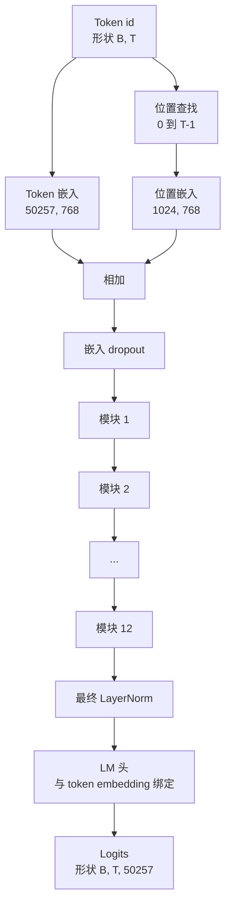
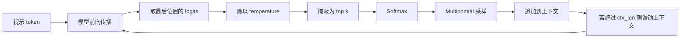

# GPT 模型组装

> 堆叠十二个模块（block）、一个 token 嵌入（token embedding）、一个可学习的位置嵌入（position embedding）、最后一个层归一化（LayerNorm），再加上一个绑定权重的语言模型头（language model head）。这就是完整的 1.24 亿参数 GPT 模型。本课会把这些部件组装成一个可运行的类，统计参数量以确认模型匹配参考版 124M 的形状，并用 multinomial 采样、temperature 和 top-k 来生成文本。

**类型：** 构建
**语言：** Python
**先修要求：** 第 19 阶段第 30 到 34 课
**时间：** 约 90 分钟

## 学习目标

- 将第 34 课中的 Transformer 块（transformer block）组装成完整的 GPT 模型：token embedding、position embedding、N 个模块、最终 LayerNorm、语言模型头。
- 复现 1.24 亿参数配置：词表 50257、上下文 1024、嵌入维度 768、十二个头、十二层。
- 将语言模型头权重与 token embedding 绑定（weight tying），并解释为什么在这个规模下能节省约 3800 万参数。
- 用 multinomial 采样、temperature 缩放和 top-k 截断从提示词生成文本，并通过滑动窗口维持上下文长度。
- 对照 124M 目标，测量参数量和前向传播成本。

## 问题

单独一个 Transformer 模块什么都做不了。你需要把 token id 变成向量，混入位置信息，让它们穿过整个堆栈，再投影回词表 logits。四步里少了任何一步，模型不是无法 forward，就是位置信息漂移，或者根本说不出话。

模型的形状同样重要。参考版 GPT-2 small 在上述配置下恰好是 1.24 亿参数。这些数字并不神秘。50257 的词表乘以 768 的嵌入维度，就是 token 表。1024 的位置数乘以 768，就是位置表。十二个模块每个大约 700 万参数，总计 8400 万。最终头通过权重绑定复用 token 表。把这些部分加总，你就得到 1.24 亿。如果你构建出的模型参数量和参考值对不上，那通常说明接线有误。

## 概念



Token id 会变成 token 向量。位置 id 会变成位置向量。两者相加后送入堆栈。最终 LayerNorm 是模块之外、在所有现代变体中都保留下来的那个部件。LM 头会复用 token embedding 矩阵，这就是所谓的权重绑定。

### 权重绑定

Token embedding 的形状是 `(vocab, d_model)`。语言模型头需要把 `d_model` 投影回 `vocab`。二者彼此正好是转置关系。把它们绑定，字面意思就是同一个参数张量被使用两次。当词表是 50257、`d_model` 是 768 时，这个矩阵就有 3800 万参数。不绑定，你要为它付两次成本；绑定，你只付一次，而且还能获得更干净一点的梯度信号，因为 embedding 和 head 会一起更新。

### 位置嵌入是可学习的，不是正弦的

GPT-2 使用的是可学习位置嵌入。位置表是一个形状为 `(1024, 768)` 的参数张量。模型在每次 forward 时查找位置 0 到 T-1，并把查找结果加到 token embedding 上。这是所有位置方案中最简单的一种（RoPE、ALiBi、T5 relative bias 都是替代方案），也是 124M 参考模型所使用的方案。

### 生成：temperature、top-k、multinomial

生成是自回归（autoregressive）的。每一步，模型都会在每个位置上返回覆盖整个词表的 logits。你只取最后一个位置，把它除以 temperature，可选地把除了 top k 之外的 logits 全部掩蔽为负无穷，通过 softmax 得到概率，再从这个分布中采样一个 token。



三个旋钮，对应三种不同的行为。Temperature 接近零时会塌缩成 greedy。Temperature 为 1 时匹配模型的自然分布。Top-k 为 1 时就是 greedy。Top-k 为 40 时会滤掉长尾。不同组合很重要；下一课讲训练时，会把生成作为定性评估信号。

## 动手构建

`code/main.py` 实现了：

- `class GPTConfig` 数据类（dataclass），带有 124M 默认配置：`vocab_size=50257`、`context_length=1024`、`d_model=768`、`num_heads=12`、`num_layers=12`、`mlp_expansion=4`、`dropout=0.1`、`use_bias=True`、`weight_tying=True`。
- `class GPTModel`：包含 token embedding、position embedding、embedding dropout、十二个 `TransformerBlock`、最终 LayerNorm，以及在标志开启时与 token embedding 绑定的 `lm_head`。
- 一个 `count_parameters` 辅助函数，返回去重后的参数量（因此会正确考虑 weight tying）。
- 一个 `generate` 函数，支持 temperature、top-k、multinomial 和滑动窗口上下文。
- 一个演示：构建模型，打印其参数量并与参考 124M 对照，再从固定提示词生成一段短序列，以展示整个流程首尾打通。

运行它：

```bash
python3 code/main.py
```

输出：参数量与 124M 参考值并排显示、从随机提示词生成的 token id，以及在启用绑定时 LM 头和 token embedding 共享存储的确认信息。

为了让演示跑得更快，脚本还会把一个小配置（`d_model=64`、`num_layers=2`）完整跑通，并直接打印生成出的 token 序列。124M 配置会被构建出来，但只会实际执行参数统计和一次 forward。

## 技术栈

- `torch`：用于张量计算、自动求导和模块框架。
- `code/main.py` 在本地重新实现了与第 34 课相同的模块模式。

## 生产环境中的常见模式

三个模式决定了一个模型只是能跑，还是能真正上线。

**把残差投影初始化得更小。** 注意力的输出投影和 MLP 的第二个线性层都会直接送入一次残差相加。如果它们和其他所有线性层使用相同的标准差初始化，残差流就会随着深度增长，并把最终 LayerNorm 推入高压区。把这两个投影的标准差按 `1 / sqrt(2 * num_layers)` 缩放；这样残差流在十二层中都能保持在合理范围内。

**缓存位置 id 张量，不要重复计算。** `torch.arange(T)` 每次 forward 都会分配新的内存。在 `__init__` 中针对最大上下文一次性分配好它，每次调用时只切出前 T 个条目，就能省掉一次分配器往返。

**在参数层面做权重绑定，而不是只复制数值。** 设置 `lm_head.weight = token_embedding.weight` 会共享同一个张量；复制不会。优化器需要更新一个参数，autograd 图也只需要一次累加。如果你只是复制，head 会逐渐偏离 embedding，权重绑定也就失去意义。

## 使用方式

- 本课中的模型类和下一课训练时使用的模型形状完全一致。
- 把可学习位置嵌入替换成 RoPE，就能得到 LLaMA 家族，而无需改动模块或 head。
- 把 GELU 替换成 SiLU，再把 LayerNorm 替换成 RMSNorm，就得到了 LLaMA 家族其余的变化。
- 生成函数适用于任何 logits 来源，不只适用于这个模型。你可以在第 37 课从预训练 GPT-2 文件中取出 logits，并复用同一个生成循环。

## 练习

1. 解除 LM 头与 token embedding 的绑定，然后重新统计参数。验证差值是 50257 乘以 768，也就是 3800 万。
2. 用一个在构造时计算好的正弦表替换可学习位置嵌入。确认模型依然可以 forward，且参数量减少 786,432。
3. 给生成过程添加 `greedy=True` 标志，使其跳过采样并直接选择 argmax。确认序列在多次运行间是确定的。
4. 添加一个 `repetition_penalty` 旋钮：在 softmax 之前，将提示词或生成历史中任意 token 的 logit 除以一个常数。用固定提示词展示：当该值大于 1 时，输出中的重复次数会减少。
5. 在 `top_k` 旁边加入 `top_p`（nucleus）采样。用两行检查代码确认保留下来的 token 概率和超过 `top_p`。

## 关键术语

| 术语 | 常见说法 | 实际含义 |
|------|----------|----------|
| 权重绑定 | “绑定嵌入” | LM 头和 token embedding 共享同一个参数张量；可节省 vocab × d_model 个参数，并匹配 GPT-2 参考实现 |
| 位置嵌入 | “学习到的位置” | 一个形状为 (context length, d_model) 的独立表，被加到 token 向量上；端到端学习得到 |
| 滑动窗口上下文 | “上下文上限” | 当提示词加上已生成 token 超过上下文长度时，丢弃最旧的 token，让当前活动窗口仍能装下 |
| Top-k 采样 | “K 截断” | 保留数值最高的 K 个 logits，把其余部分掩蔽为负无穷，再对剩余项做 softmax |
| Temperature | “采样温度” | 在 softmax 前把 logits 除以 T；T 小于 1 会变尖锐，T 等于 1 保持自然分布，T 大于 1 会变平坦 |

## 延伸阅读

- 第 19 阶段第 34 课，了解这个模型所堆叠的模块。
- 第 19 阶段第 36 课，了解如何用交叉熵损失驱动这个模型的训练循环。
- 第 19 阶段第 37 课，了解如何把预训练 GPT-2 权重加载到这个完全一致的架构中。
- 第 7 阶段第 07 课（GPT 因果语言建模），了解 next token prediction 的数学原理。
- 第 10 阶段第 04 课（预训练 mini GPT），了解同一架构上的原始训练流程。
