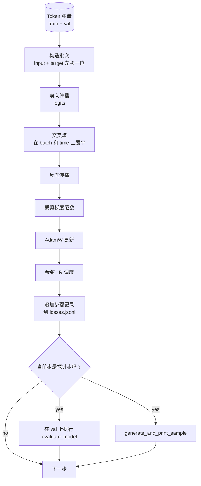

# 训练循环与评估

> 不做测量的循环，就是会撒谎的循环。本课会构建驱动 GPT 模型的训练循环：带权重衰减分组（weight decay split）的 AdamW、warmup 加余弦学习率调度（cosine learning rate schedule）、`calc_loss_batch` 辅助函数、在留出数据（held out data）上运行的 `evaluate_model`、每隔 K 步执行一次的 `generate_and_print_sample` 定性探针，以及可供后续绘图的 JSONL 损失日志。同一套骨架适用于你今后构建的每一个解码器 LLM。

**类型：** 构建
**语言：** Python
**先修要求：** 第 19 阶段第 30 到 35 课
**时间：** 约 90 分钟

## 学习目标

- 构建一个训练循环，在 next token prediction 中使用正确的输入与目标对齐方式来计算交叉熵损失（cross entropy loss）。
- 配置 AdamW，使权重衰减应用于权重张量，而不应用于 LayerNorm 或 bias 张量。
- 实现一个包含线性 warmup 和余弦衰减的学习率调度，并读懂 LR 随时间的变化。
- 通过 `evaluate_model` 在留出划分上做评估，让 eval loss 在不同运行之间可比较。
- 每隔 K 步用 `generate_and_print_sample` 生成一个定性样本，在损失曲线发出信号之前就捕捉到发散。
- 将每一步的损失持久化到 JSONL，这样你就能重新加载、绘图，并把训练日志作为可交付成果提交。

## 问题

一个只打印损失、除此之外什么都不做的训练脚本，会在三个方面失效。它无法告诉你损失是否因为正确原因而下降（模型可能只是过拟合训练集，却从未真正学会）。它无法告诉你发散是否正在开始（损失可能只在某一步飙升后恢复，也可能某一步飙升后直接崩溃）。它无法告诉你模型到底学到了什么（损失只是一个标量；生成样本却是一整段文字）。如果训练循环不做测量，这三种失败都会被隐藏起来。

本课中的循环会用三种方式测量。每一步记录训练 batch 上的损失。每隔 K 步记录一次留出 batch 上的损失。每隔 K 步从固定提示词生成一次续写。训练日志最终写入 JSONL，因此这个工件就是训练循环自己的证词。

## 概念



这里有两个不那么显然的关键点：损失对齐和 AdamW 的衰减分组。

### 损失对齐

模型会在每个位置预测下一个 token。如果输入 batch 是 `[t0, t1, t2, t3]`，那么目标 batch 就必须是 `[t1, t2, t3, t4]`。交叉熵是在展平后的 `(batch * seq, vocab)` 形状上，对照展平后的目标 `(batch * seq,)` 来计算的。忘了这一步位移，你训练的就是让模型预测它自己；那样虽然会收敛到零损失，却学不到任何有用的东西。

### AdamW 衰减分组

权重衰减会正则化权重张量，但不该作用于归一化缩放参数或 bias。把衰减施加到 LayerNorm 的缩放上，会慢慢把缩放推向零，从而破坏归一化。把衰减施加到 bias 上在数学上虽然无害，但只是浪费算力。标准做法是：矩阵形状的张量（线性层权重、嵌入表）使用衰减；任何看起来像缩放或平移的参数都不使用。

### 预热（warmup）加余弦调度

Warmup 会在前几百步里把学习率从零逐步拉升到目标值，这样优化器状态就有时间被填充。余弦衰减会在剩余步数中把学习率再慢慢降回接近零，从而让最后阶段用更小步长微调权重。这种组合是开放权重 LLM 训练中最常见的调度方式，因为它能去掉前一千步和最后一千步中大多数脆弱时刻。

### 留出评估

`evaluate_model` 会从验证集划分中运行固定数量的 batch，累计损失，再除以 batch 数后返回。没有梯度。没有 dropout。在相同随机种子和相同划分下，这个数值在不同运行之间是可复现的。把留出损失和训练损失并排报告，就是你发现过拟合的方式。

### 作为早期信号的定性采样

如果一个模型的训练损失看起来下降得很好，但生成样本全是同一个 token，那它就是坏的。反过来，如果损失曲线看起来很平，但生成样本开始变成连贯的词语，那它就是在学习。定性探针比通读整条曲线更快，也能抓住那些标量指标遗漏的模式。

## 动手构建

`code/main.py` 实现了：

- `make_batches(token_ids, batch_size, context_length)`：把一长条 token 张量切成输入和目标对。
- `calc_loss_batch(model, inputs, targets)`：执行 forward、展平并返回标量交叉熵。
- `evaluate_model(model, val_loader, max_batches)`：在无梯度条件下迭代固定数量的验证 batch，并返回平均损失。
- `generate_and_print_sample(model, prompt, max_new_tokens)`：调用第 35 课中的生成函数，对固定提示词运行并打印结果。
- `build_param_groups(model, weight_decay)`：生成两组式 AdamW 参数列表。
- `cosine_with_warmup(step, warmup_steps, total_steps, max_lr, min_lr)`：返回给定 step 的 LR。
- `train(...)`：运行训练循环，持久化 `outputs/losses.jsonl`，并每隔 `eval_every` 步打印 eval loss 和一个样本。
- 一个演示：在合成数据上训练一个小模型若干步，写出 JSONL 日志，并在探针点打印 eval loss 和样本。这个演示在 CPU 上不到一分钟就能跑完。

运行它：

```bash
python3 code/main.py
```

输出：每一步的损失行、每个探针步上的 eval loss、每个探针步上的生成样本，以及最终的 `outputs/losses.jsonl`，你可以逐行用 `json.loads` 加载它。

## 技术栈

- `torch`：用于自动求导、优化器和模块。
- `main.py` 在本地重新实现了第 35 课中的 `GPTModel` 及其配套模块。

## 生产环境中的常见模式

三个模式会把教科书式的循环，变成你可以放心整夜运行的循环。

**梯度范数裁剪不可妥协。** 一个坏 batch（异常数据、LR 尖峰、数值边界情况）就会产生巨大的梯度，抹掉数小时训练成果。在 `backward` 之后、`step` 之前调用 `torch.nn.utils.clip_grad_norm_(params, max_norm=1.0)`，能让优化器保持在安全范围内。裁剪值是一个自由参数；1.0 是能在多数设置中活下来的默认值。

**使用可恢复的 JSONL 日志，而不是 pickled state。** 以 `{"step": int, "train_loss": float, "lr": float}` 形式写入 JSONL 的逐步损失记录非常耐用：任何崩溃都会留下可读工件，你可以 grep，可以用三十行 Python 画图，也可以通过读取最后一步来恢复训练。Pickled state 则会把你绑死在生成该文件时的模块布局上，一旦重构就很脆弱。

**评估 batch 来自固定切片。** 验证 token 会在脚本启动时被切成 batch，而不是临时现切。可复现性依赖于每次运行中的 eval batch 完全一致；否则比较两次运行的 eval loss，测到的就既有模型差异，也有 batch shuffle 差异。

## 使用方式

- 本课中的循环与训练真实数据上的 124M 模型所用骨架完全一致。把合成 token 张量换成 `datasets` 风格的加载器，循环本身无需改动。
- JSONL 日志是把一次训练运行变成证据的可交付物。下一课会用它来比较一个新训练的 checkpoint 和一个预训练 checkpoint。
- 定性样本探针是标量损失无法替代的总兜底机制。

## 练习

1. 给 `weight_decay_groups()` 添加单元测试，确认缩放参数和 bias 会落到 no decay 组，而线性层与嵌入权重会落到 decay 组。
2. 用一个小文本文件中的字节替换合成随机 token，让演示训练在可读内容上进行。验证生成样本只使用文件中出现过的字符。
3. 给余弦调度加上一个 `min_lr` 下限，设为 `max_lr` 的 10%，然后重新绘图。
4. 除 JSONL 日志外，再每隔 `eval_every` 步保存一个 checkpoint。添加 `resume_from` 标志，用于重新加载模型状态和优化器状态。
5. 在损失旁边记录每一步吞吐量（每秒 token 数），并确认它保持在一个稳定区间内。

## 关键术语

| 术语 | 常见说法 | 实际含义 |
|------|----------|----------|
| 损失对齐 | “左移一位” | 输入 token 位于位置 0..T-1，目标 token 位于位置 1..T；交叉熵在展平后的形状上计算 |
| 衰减分组 | “两组参数” | AdamW 会接收一组带权重衰减的矩阵形张量，以及一组不带衰减的缩放或 bias 张量 |
| Warmup | “爬坡” | 学习率在固定步数内从零爬升到目标值，让优化器状态有时间完成填充 |
| Eval batches | “留出批次” | 验证 token 张量中的固定切片，只在脚本开始时切一次，并在每个探针点完全一致地使用 |
| 定性探针 | “打印样本” | 每隔 K 步从固定提示词生成一小段内容，用来捕捉仅靠损失看不出的失败模式 |

## 延伸阅读

- 第 19 阶段第 35 课，了解这个循环所驱动的模型。
- 第 19 阶段第 37 课，了解如何把预训练权重加载到同一个模型中。
- 第 10 阶段第 04 课（预训练 mini GPT），了解真实数据上的训练流程。
- 第 10 阶段第 10 课（评估），了解超越交叉熵损失的更广泛评估面。
