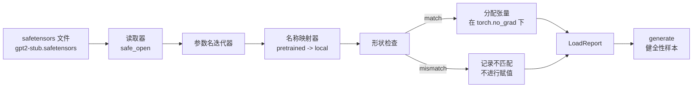

# 加载预训练权重

> 从零开始训练一个拥有 1.24 亿参数的模型，是预算层面的决策；加载一个已经发布的检查点 (checkpoint)，则只是周二要做的日常工作。本课会把一个 safetensors 文件中的 GPT-2 风格预训练权重 (pretrained weights) 加载到第 35 课中的同款架构里，逐项讲清参数名称映射 (parameter name mapping)，并通过生成一段续写来验证加载是否成功。无须联网，无须第三方加载器，也没有任何黑箱魔法。

**类型：** 构建
**语言：** Python
**前置要求：** 第 19 阶段第 30 到 36 课
**耗时：** ~90 分钟

## 学习目标

- 使用 `safetensors` Python 库读取 safetensors 文件，并检查张量名称与形状。
- 将每个预训练参数名映射到第 35 课 GPT 模型中的对应参数。
- 处理已发布的 GPT-2 权重与本课程模型之间两套不同的命名约定：`wte/wpe/h.N.attn.c_attn/c_proj` 与 `mlp.c_fc/c_proj`，以及本地命名的 `tok_embed/pos_embed/blocks.N.attn.qkv/out_proj` 与 `mlp.fc1/fc2`。
- 在任何权重赋值发生之前，检测并明确拒绝形状不匹配 (shape mismatch)，并给出清晰错误信息。
- 用已加载的权重生成一小段续写，并确认这些词元来自已加载的分布，而不是随机初始化后的分布。

## 问题

已发布的权重并不是按你的架构来打包的。它们沿用原始实现中的名称。预训练文件里有形状为 `(2304, 768)` 的 `transformer.h.0.attn.c_attn.weight`；而你的模型可能期望的是形状同为 `(2304, 768)` 的 `blocks.0.attn.qkv.weight`（也就是同一个矩阵，只是采用了不同的布局约定），或者你的模型使用 `nn.Linear`，它会以转置后的方式存储矩阵。于是，同一个参数会以三种略有差别的身份出现（名字、形状、字节布局），加载器必须把这三者统一起来。

一个盲目复制的加载器会把正确的张量放进错误的位置，最终得到一个只能生成胡言乱语的模型。一个在形状不匹配时拒绝复制、却什么都不记录的加载器，则会让你完全不知道到底是哪一个张量没落到位。本课中的加载器是显式的：每一次赋值都会记录、每一个形状都会检查，并用 `LoadReport` 汇总命中、缺失和形状不匹配的情况，让你能清楚读出整个过程发生了什么。

## 核心概念



名称映射器本质上只是一个把字符串映射到字符串的函数。形状检查就是一个 if。赋值发生在 `torch.no_grad()` 内部，因此 autograd 不会跟踪这次加载。报告会保存每个名称的结果。

### GPT-2 命名约定

已发布的 GPT-2 权重通常使用如下名称：

| 预训练名称 | 形状 | 含义 |
|-----------------|-------|---------|
| `wte.weight` | (50257, 768) | 词元嵌入 |
| `wpe.weight` | (1024, 768) | 位置嵌入 |
| `h.N.ln_1.weight` | (768,) | 第 N 个块中 LayerNorm 1 的缩放参数 |
| `h.N.ln_1.bias` | (768,) | 第 N 个块中 LayerNorm 1 的平移参数 |
| `h.N.attn.c_attn.weight` | (768, 2304) | 融合 QKV 线性层权重 |
| `h.N.attn.c_attn.bias` | (2304,) | 融合 QKV 线性层偏置 |
| `h.N.attn.c_proj.weight` | (768, 768) | 注意力输出投影 |
| `h.N.attn.c_proj.bias` | (768,) | 注意力输出投影偏置 |
| `h.N.ln_2.weight` | (768,) | LayerNorm 2 缩放参数 |
| `h.N.ln_2.bias` | (768,) | LayerNorm 2 平移参数 |
| `h.N.mlp.c_fc.weight` | (768, 3072) | MLP fc1 权重 |
| `h.N.mlp.c_fc.bias` | (3072,) | MLP fc1 偏置 |
| `h.N.mlp.c_proj.weight` | (3072, 768) | MLP fc2 权重 |
| `h.N.mlp.c_proj.bias` | (768,) | MLP fc2 偏置 |
| `ln_f.weight` | (768,) | 最终 LayerNorm 缩放参数 |
| `ln_f.bias` | (768,) | 最终 LayerNorm 平移参数 |

这里有两个需要提前考虑的意外点。`c_attn`、`c_proj`、`c_fc` 这些线性层所存储的矩阵，相对于 `nn.Linear.weight` 的期望格式是转置的，因此加载器在赋值时会做转置。LM 头根本不在文件里；模型依赖与 `wte` 的权重绑定，所以在 `wte` 落位之后，头部会通过别名方式设定。

### 本地命名约定

本课程中的模型使用更具描述性的名称：

| 本地名称 | 含义 |
|------------|---------|
| `tok_embed.weight` | 词元嵌入 |
| `pos_embed.weight` | 位置嵌入 |
| `blocks.N.ln1.scale` | 第 N 个块中 LayerNorm 1 的缩放参数 |
| `blocks.N.ln1.shift` | LayerNorm 1 的平移参数 |
| `blocks.N.attn.qkv.weight` | 融合 QKV |
| `blocks.N.attn.qkv.bias` | 融合 QKV 偏置 |
| `blocks.N.attn.out_proj.weight` | 注意力输出投影 |
| `blocks.N.attn.out_proj.bias` | 输出投影偏置 |
| `blocks.N.ln2.scale` | LayerNorm 2 缩放参数 |
| `blocks.N.ln2.shift` | LayerNorm 2 平移参数 |
| `blocks.N.mlp.fc1.weight` | MLP fc1 |
| `blocks.N.mlp.fc1.bias` | MLP fc1 偏置 |
| `blocks.N.mlp.fc2.weight` | MLP fc2 |
| `blocks.N.mlp.fc2.bias` | MLP fc2 偏置 |
| `final_ln.scale` | 最终 LayerNorm 缩放参数 |
| `final_ln.shift` | 最终 LayerNorm 平移参数 |

这种映射是一个固定函数。本课以字典形式提供，供加载器迭代使用。

### 存根夹具

真实的 GPT-2 权重有 0.5 GB。这个演示不会下载它们；它会在首次运行时生成一个小型 safetensors 夹具，采用完全相同的 GPT-2 命名约定，并使用适用于 12 层、`d_model` 为 192（而不是 768）的形状。这个夹具具备正确的结构，足以覆盖加载器中的每一条代码路径。把这个夹具换成真实文件后，加载器无需修改就能工作。

## 动手构建

`code/main.py` 实现了：

- 第 35 课 `GPTModel` 的一个小型复刻版，因此本课是自包含的。
- `make_pretrained_to_local(num_layers)`，用于展开逐层条目。
- `load_safetensors(model, path)`，它会遍历名称、完成映射、检查形状、转置 conv1d 风格的权重，并在 `torch.no_grad()` 下赋值。它返回一个 `LoadReport`。
- `make_stub_safetensors(path, cfg)`，用于生成一个严格遵循预训练命名约定的夹具文件。
- 一个演示程序：首次运行时创建 `outputs/gpt2-stub.safetensors`，构建一个全新模型，先从随机初始化状态生成一次续写，再加载存根文件，生成另一段续写，打印两者，并验证它们确实不同（说明加载真的改变了模型）。

运行方式：

```bash
python3 code/main.py
```

输出内容包括：夹具路径、逐名称加载日志、`LoadReport` 摘要、加载前的续写、加载后的续写，以及夹具中人为注入的一个错误张量所触发的单次形状不匹配，用来覆盖失败路径。

## 技术栈

- `safetensors`：用于磁盘格式与流式读取器。
- `torch`：用于模型和赋值时的数学计算。
- 不使用 `transformers`，不使用 `huggingface_hub`，也不进行网络调用。

## 生产环境中的常见模式

有三种模式，能让这个加载器在面对不是你自己生成的权重时依然可靠。

**在任何赋值之前，始终先验证文件。** 打开文件，列出每个张量的名称、dtype 和形状，完整跑一遍映射与形状检查，只有全部通过后才开始赋值。半加载状态的模型就是沉默的失败机器。

**记录每一次赋值，包括源名称和目标名称。** 一旦哪里看起来不对，日志会告诉你哪个张量落到了哪里；否则你只能去读十六进制转储。本课中的 `LoadReport` 数据类会跟踪 `loaded`、`missing`、`unexpected` 和 `shape_mismatch` 列表，并在最后打印摘要。

**LM 头是权重绑定别名，而不是一份独立拷贝。** 在加载 `tok_embed` 之后设置 `model.lm_head.weight = model.tok_embed.weight`，这是标准做法。把嵌入矩阵复制到一个新的 `lm_head.weight` 参数里会破坏绑定关系，还会悄悄把参数量翻倍。

## 使用方式

- 只要 safetensors 文件采用预训练命名约定，这个加载器就能工作。真实的 GPT-2 文件（small / medium / large / xl）无需修改代码即可使用；变化的只有模型配置。
- 一旦你更新了名称映射，这一模式同样可以扩展到 LLaMA、Mistral、Qwen 权重。形状检查和报告逻辑都保持不变。
- 加载后的健全性生成是一道快速闸门：如果加载后的样本看起来和加载前一样，那就说明这次加载没有改变模型，也就意味着映射过程静默地漏掉了所有张量。

## 练习

1. 给加载器增加一个 `dtype` 参数，使其在赋值时把每个张量转换为目标 dtype（`bfloat16`、`float16`、`float32`）。确认一个 `float32` 模型可以下转换为 `bfloat16` 后仍然生成内容。
2. 增加一个 `expected_layers` 参数，当检查点中的 `h.N` 索引与模型的 `num_layers` 不一致时拒绝加载。
3. 把加载器接入第 35 课的生成函数，并排生成两个样本：一个来自随机初始化，一个来自已加载的夹具。
4. 增加一条导出路径：使用预训练命名约定，把当前模型状态写入一个新的 safetensors 文件。让加载器跑一次往返测试，并确认报告中的形状不匹配为零。
5. 扩展 `NAME_MAP` 以处理 LLaMA 的命名约定（无偏置、RMSNorm、融合 qkv 布局），然后在你生成的一个 LLaMA 存根夹具上重新运行加载器。

## 关键术语

| 术语 | 常见说法 | 实际含义 |
|------|-----------------|------------------------|
| 名称映射 (Name map) | “Key remapping” | 从预训练张量名称到本地参数名称的映射函数；通常就是一个字面量字典，并在循环中按层索引展开 |
| 形状不匹配 (Shape mismatch) | “Bad shape” | 预训练张量在映射后的名称下确实存在，但它的维度与本地参数不一致；加载器会拒绝赋值并记录这对信息 |
| 加载时转置 (Transpose-on-load) | “Conv1d layout” | 已发布的 GPT-2 会把注意力和 MLP 投影按 `nn.Linear` 期望格式的转置形式存储；加载器会在赋值时进行转置 |
| 权重绑定别名 (Weight tying alias) | “Shared LM head” | 通过设置 `model.lm_head.weight = model.tok_embed.weight` 让头部与嵌入共享存储；也正因此文件里没有单独的头部 |
| 加载报告 (Load report) | “Coverage summary” | 一个小型数据类，用于跟踪 `loaded`、`missing`、`unexpected` 和 `shape_mismatch` 列表；打印它就是判断加载是否成功的方法 |

## 延伸阅读

- 第 19 阶段第 35 课：接收这些权重的模型架构。
- 第 19 阶段第 36 课：会产出同形状检查点的训练循环。
- 第 10 阶段第 11 课（量化）：当内存紧张时，如何处理已加载的权重。
- 第 10 阶段第 13 课（构建完整 LLM 管线）：围绕加载与推理的完整生命周期。
