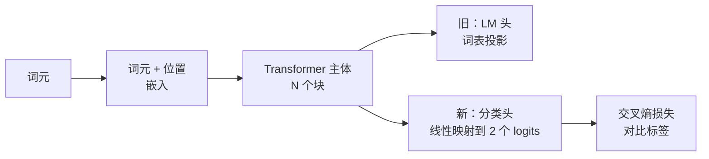
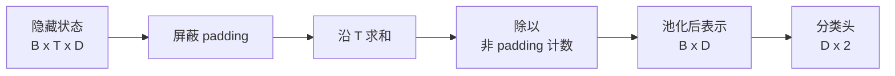
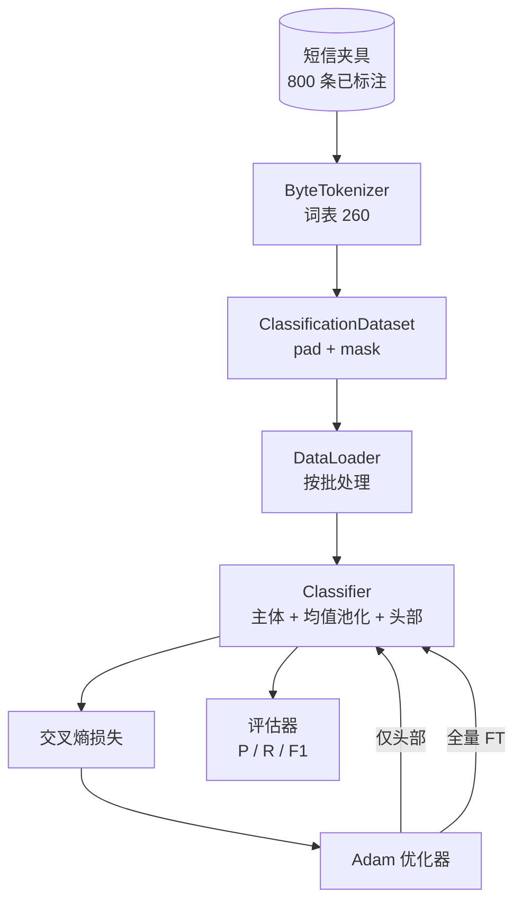

# 毕业项目课 38：通过头部替换进行分类器微调

> B 轨的第一个毕业项目。一个预训练语言模型 (pretrained language model) 是一叠以词元预测头 (token-prediction head) 收尾的自注意力 (self-attention) 模块。当你想做的是 spam vs ham 时，头部不对，但主体大体是对的。本课会把原来的头拆掉，把一个两分类线性层 (linear layer) 接到池化表示 (pooled representation) 上，并用两种方式训练分类器：只训练最后一层，以及全量微调 (fine-tuning)。评估指标是保留划分上的 precision、recall 和 F1。你将学会每种策略能带来什么，以及它分别要付出什么代价。

**类型：** 构建
**语言：** Python (torch, numpy)
**前置要求：** 第 19 阶段第 30-37 课（NLP LLM 轨道：tokenizer、embedding table、attention block、transformer body、pre-training loop、checkpointing、generation、perplexity）
**耗时：** ~90 分钟

## 学习目标

- 在不重新初始化主体的前提下，把语言模型头替换成分类头。
- 实现两种训练方案：冻结主体（仅训练头部）和全量微调，并共享同一个训练循环。
- 构建一个理解 tokenizer 的数据管线，能够完成填充、屏蔽 padding，并对注意力输出进行池化。
- 从原始 logits 计算 precision、recall、F1 和混淆矩阵。
- 理解参数数量、训练时间与上限空间之间的权衡。

## 问题

你已经在一个通用语料上预训练了一个小型 transformer。输出头会把最后一个隐藏状态投影到一个 1000 词元的词表上。现在你有 800 条标注为 spam 或 ham 的短信，希望把它变成一个二分类器。一共有三种选择。

错误的选择，是在这 800 个样本上从零训练一个全新的分类器。预训练模型的主体已经编码了很多有用的结构：词身份、位置、简单共现。把这些全部扔掉，就是浪费掉构建它时已经付出的算力。

正确的两种选择是：替换头部并冻结主体，以及替换头部并让主体可训练。仅训练头部的方式速度快，几乎不额外占内存，而且在这么少的数据上很少过拟合。全量微调更慢，在小数据上也可能过拟合，但当下游领域与预训练语料发生偏移时，它往往能达到更高的准确率。

本课会把两种方式都做出来，这样你就能在同一个夹具上直接比较它们。

## 核心概念

模型是一个函数 `f_theta(tokens) -> hidden_states`。头部是一个函数 `g_phi(hidden) -> logits`。替换头部，意味着保留 `theta`、替换 `g_phi`。主体参数才是昂贵的部分。头部只是一个线性层。

有两组可训练参数最关键：

- `theta`（主体）：每个注意力块里都有数以万计的权重。
- `phi`（头部）：`hidden_dim * num_classes` 个权重外加一个偏置。

在仅训练头部时，你只对 `phi` 计算梯度，并把 `theta` 的梯度归零。PyTorch 允许你通过给主体参数设置 `requires_grad=False` 来做到这一点。这样优化器只会看到头部，主体会保持冻结。

在全量微调中，你会让梯度回流穿过整个堆栈。主体权重会漂移，以适配分类目标。风险在于：在小数据上会发生灾难性遗忘，主体在预训练中学到的东西会被过拟合噪声冲掉。

## 池化问题

分类器需要的是“每个序列一个向量”，而不是“每个词元一个向量”。常见的三种选择是：

- **均值池化 (mean pool)**：沿序列维度对隐藏状态求平均，并用 attention mask 加权。
- **CLS 池化 (CLS pool)**：在开头添加一个特殊词元，只使用它的输出。这是 BERT 的做法。
- **最后词元池化 (last-token pool)**：使用最后一个非 padding 词元。这是 GPT 类分类器的做法。

本课采用显式 attention-mask 加权的均值池化。它最简单，能够在不同序列长度上提供稳定信号，而且不需要预训练一个 CLS 词元。

## 数据

在 `code/main.py` 中，会以确定性方式生成 800 条短信，其中 400 条 spam、400 条 ham，类别平衡。生成器使用固定随机种子，抽取模板并替换槽位内容，输出长度在 5 到 25 个词元之间的消息。真实数据集会有这个夹具没有的噪声。这个夹具的重点在于可复现性。

数据按 80/20 划分：640 条训练、160 条测试。划分采用分层抽样，因此测试集保持 50/50 的平衡。拥有已知类别比例的保留集，才能让 precision 和 recall 读起来是真实可信的数字。

## 指标

这是一个二分类任务，类别 1 是正类（spam）。四个计数分别是：

- `TP`：预测为 spam，实际也是 spam。
- `FP`：预测为 spam，实际是 ham。
- `FN`：预测为 ham，实际是 spam。
- `TN`：预测为 ham，实际也是 ham。

三个核心指标：

- `precision = TP / (TP + FP)`。被标记为 spam 的消息里，实际真的是 spam 的比例是多少？
- `recall = TP / (TP + FN)`。所有真实 spam 中，模型成功标出来的比例是多少？
- `F1 = 2 * P * R / (P + R)`。它们两者的调和平均数。

混淆矩阵会把这四个计数打印成一个 2x2 网格。演示程序会把两种训练方案的结果都写到 stdout。

## 架构

主体被刻意设计成一个很小的 transformer：词表 260、隐藏维度 64、4 个头、2 个块、最大序列长度 32。它足够小，能让两种训练方案都在 CPU 上九十秒内收敛。本课并不会直接提供预训练好的主体；相反，`pretrain_quick` 辅助函数会在同一个夹具文本上做 5 个 epoch 的 LM 训练，为主体提供一个非平凡的起点。这样这节课就是自包含的。

## 你将构建什么

实现内容是一个 `main.py` 加一个测试模块（`code/tests/test_main.py`）。

1. `ByteTokenizer`：把字节映射到 id，并保留一个 pad id。
2. `Block`：一个带多头注意力和前馈层的 transformer block，采用 pre-norm。
3. `LMBody`：词元嵌入 + 位置嵌入，再加上一叠 block，返回隐藏状态。
4. `MeanPool`：沿序列轴做带 mask 权重的平均。
5. `Classifier`：主体、池化层、线性头。两种训练方案共用同一个主体实例。
6. `freeze_body` 和 `unfreeze_body`：切换主体参数上的 `requires_grad`。
7. `train_classifier`：共享训练循环。它接收模型，以及一个已经针对当前可训练参数组配置好的优化器。
8. `evaluate`：运行测试集，并返回 `Metrics(precision, recall, f1, confusion)`。
9. `run_demo`：先对主体做简短预训练，再训练并评估仅头部方案，然后训练并评估全量方案，打印两份报告，并以零状态退出。

## 为什么这个比较很重要

仅训练头部通常收敛更快，也会以更温和的方式欠拟合。在这个夹具上，你通常会看到：仅训练头部 20 个 epoch 后，precision 接近 0.9，recall 接近 0.85。全量微调大约要多花三倍时间，最终结果则会因随机种子不同而上下浮动几个点。

本课不会直接宣布谁是赢家。它要教你读懂数字，也读懂代价。对于 800 个样本和一个小主体来说，仅训练头部是正确选择。对于 80,000 个样本和更大的主体，全量微调就开始体现价值了。你从这节课带走的核心契约其实是 API：同一个 `train_classifier` 函数可以处理这两种情况，而切换方式只需要一行调用。

## 延伸目标

- 增加第三种方案：只解冻最后一个 block。这通常叫部分微调。它比全量 FT 成本更低，但又比仅训练头部学得更多。
- 增加一个学习率调度器。对头部使用余弦调度、对主体使用更小的恒定学习率，是生产环境中常见的配置。
- 把均值池化替换为一个可学习的注意力池化：使用一个带单个可学习查询向量的小注意力层。在更长序列上，它通常比均值池化更强。

实现已经把这些钩子都留给你了。测试把契约钉住了。接下来就看你把数字推到什么位置。
