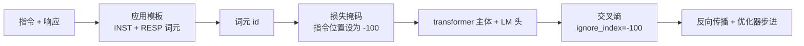
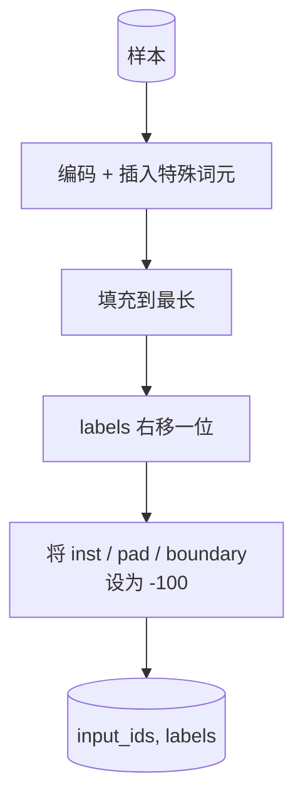
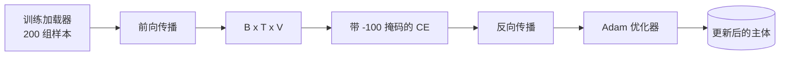

# 毕业项目课 39：通过监督式微调进行指令微调

> 一个预训练基础模型可以延长序列，但不会遵循指令。修复这一点的最小改动，就是监督式微调 (Supervised Fine-Tuning, SFT)：给模型喂入成对的指令和期望响应示例，并训练主体去预测响应词元。诀窍在于，你只希望损失函数统计响应，而不是指令。本课会构建一个 Alpaca 风格的 SFT 循环，配上自定义 collate 函数 (collate function)，用 `ignore_index=-100` 屏蔽指令词元，在 200 组指令-响应样本上训练，并在保留划分上用精确匹配 (exact-match) 进行评估。

**类型：** 构建
**语言：** Python (torch, numpy)
**前置要求：** 第 19 阶段第 30-37 课（NLP LLM 轨道：tokenizer、embedding table、attention block、transformer body、pre-training loop、checkpointing、generation、perplexity）
**耗时：** ~90 分钟

## 学习目标

- 把成对的指令-响应数据格式化为一个带显式边界词元 (boundary tokens) 的单一因果序列 (causal sequence)。
- 构建一个 collate 函数，对指令词元做掩码，使交叉熵只统计响应词元。
- 在 SFT 目标下训练一个小型 transformer 主体，并观察评估指标如何变化。
- 实现尊重响应起始边界的贪心生成与温度采样生成。
- 对生成结果在保留集上计算 exact-match。

## 问题

一个通过下一个词元预测训练出来的基础模型，并不知道什么叫“指令”。把字符串 `"What is the capital of France?"` 给它，它会继续把问题写下去，或者凭空编造一句新话。模型掌握了语言，却没有掌握格式契约。

SFT 的契约其实就是一个字符串模板。每个训练样本都会变成一个包含三个区域的单一序列：

```text
<INST> What is the capital of France? <RESP> The capital of France is Paris.
```

这些边界词元是训练时预留出来的特殊词元。模型会学到：`&lt;RESP>` 之后的所有内容都是响应，而真正被评分的也是响应。基础模型的下一个词元目标依然成立；只不过它现在是在一个“每个样本都具有这种形状”的语料上训练。

但这里有个陷阱。如果你把整个序列直接喂给普通的交叉熵损失，你其实也在训练模型去预测指令词元。可指令本来就是已知输入。你想要这些位置的梯度为零。解决方法就是掩码。

## 核心概念



`ignore_index` 是 `torch.nn.functional.cross_entropy` 的一个特性。任何目标位置只要等于 `ignore_index`，就会贡献零损失和零梯度。PyTorch 的惯例值是 `-100`。collate 函数会为每个样本构建两个张量：`input_ids`（完整序列）和 `labels`（`input_ids` 的一份副本，但把指令位置覆写成 `-100`）。

模型在前向传播时会看到整个序列；注意力可以看见指令。损失函数只会统计响应词元。这正是你想要的：以指令为条件，去预测响应。

## 数据

在 `main.py` 中，会以确定性方式生成 200 组指令-响应样本。它们覆盖六类任务：

- 单轮事实问答（X 的首都是哪里）
- 算术
- 列表提取
- 单句摘要
- 代码（print、sort）
- 定义

每类任务都有模板化指令和确定性的响应。这是有意为之。exact-match 很脆弱，因此本课采用一个夹具：正确答案就是唯一的特定字符串。真实的 SFT 数据集需要更模糊的指标；原理完全相同。

划分方式是 160 条训练、40 条测试。测试集覆盖全部六类任务，因此可以报告按类别拆分的 exact-match。

## 分词与填充

这个 tokenizer 是字节级的，并保留了三个特殊 id：

- `INST_ID = 256`：标记指令区域开始。
- `RESP_ID = 257`：标记指令与响应之间的边界。
- `PAD_ID = 258`：用于可变长度 batch 的填充。

序列形式为 `[INST] inst_bytes [RESP] resp_bytes [PAD]*`。collate 函数会：

1. 对每个样本做分词。
2. 把 batch 中的每个样本都填充到该 batch 的最长序列长度。
3. 构建 `labels = input_ids` 向右平移一位后的结果（causal LM 目标），并执行：
   - 将指令区域替换为 `-100`。
   - 将 padding 区域替换为 `-100`。
   - 将 `RESP_ID` 边界位置本身替换为 `-100`（你不训练模型去预测边界词元；模型应该预测的是它后面的内容）。



这个 shift 是标准的因果技巧：`input_ids` 的位置 `i` 负责预测位置 `i+1`，因此 `labels[i] = input_ids[i+1]`（输入去掉最后一个位置，目标去掉第一个位置）。掩码是在 shift 之后再应用的，这样才能落在正确的位置上。

## 训练



这个循环就是标准的 PyTorch SFT 循环。Adam，学习率大约在 3e-4 到 1e-3 之间，在这个夹具上训练 10 到 20 个 epoch，不使用调度器。模型足够小（隐藏维度 96、2 个块、最大长度 64），因此能在 CPU 上两分钟内收敛。

每隔五个 epoch，循环就会在保留集上跑一个很小的评估，并打印 exact-match。看着 exact-match 从第 1 个 epoch 的 0.0，涨到第 15 个 epoch 左右的 0.85，这正是本课的回报：你能亲眼看到模型同时学会格式和答案。

## 生成

在评估阶段，模型会接收指令前缀 `[INST] inst_bytes [RESP]`，并持续生成词元，直到发生以下任一情况：

- 序列达到 `max_len`，或者
- 模型触发一个特殊的停止启发式：连续输出两个句末字节（`.`, `!`, `?`）。

本课提供贪心解码，并额外支持可选的温度采样器。exact-match 使用贪心解码，因为温度会让指标变成随机的。真实系统通常会先采样，再用模糊标准去判断；那条管线会在第 41 课讲到。

## 精确匹配评估

exact-match 是最严格的文本指标。预测得到的响应字符串会先被规范化（转小写、去掉首尾空白、合并双空格），然后与同样经过规范化的参考响应进行比较。每个样本的指标不是 1 就是 0。整体结果取平均值。

真实的 SFT 管线通常会用词元级 F1（第 41 课）和 judge model 来补充 exact-match。但 exact-match 依然有价值，因为它没有歧义；如果它是 0.7，就表示测试指令中有且仅有 70% 逐字符地产生了 gold 响应。

## 你将构建什么

实现内容是一个 `main.py` 加若干测试。

1. `InstructionTokenizer`：带保留特殊词元的字节级编码器。既可以编码指令前缀，也可以编码完整样本对。
2. `make_dataset`：使用固定随机种子，生成跨六类任务的 200 组样本。
3. `SFTDataset`：对每个样本返回 `(input_ids, labels)`，并且已经准备好掩码。
4. `sft_collate`：动态填充，构建 batch 张量，并在指令和 pad 位置设置 `-100`。
5. `TinyGPT`：transformer 主体，加上绑定或未绑定的 LM 头。
6. `train_sft`：SFT 训练循环，带逐 epoch 的评估钩子。
7. `generate`：从前缀开始做因果解码，可贪心、可采样，并带停止启发式。
8. `exact_match`：规范化字符串比较，返回 `[0, 1]` 中的浮点数。
9. `run_demo`：构建数据，训练 20 个 epoch，评估，打印按类别拆分的结果，并在成功时以零状态退出。

## 为什么掩码很重要

没有掩码时，损失会把指令词元也当作目标。模型会去学习预测指令。这是一个不同的目标，而且会从两个方面让模型变差。第一，模型容量被浪费在重建那些用户本来就会提供的输入上。第二，在大多数 batch 中，指令词元都比响应词元更多，所以在梯度求和里，响应部分的损失占比更小；优化器真正施加在你关心部分上的有效学习率，会比你想要的更低。掩码不是锦上添花；它就是目标本身。

## 延伸目标

- 增加学习率预热，然后接余弦衰减。与预训练相比，SFT 对 LR 更敏感。
- 增加逐词元损失日志，并绘制训练过程中的损失曲线。注意：早期 epoch 往往主要由模板词元（`&lt;RESP>`、常见前缀）主导，后期 epoch 才主要由实际答案词元主导。
- 把评估扩展到 BLEU-1 或 chrF。exact-match 会低估那些用不同表述给出相同答案的模型。
- 增加一个支持多轮格式的 chat template，并在包含追问的夹具上训练。

这份实现把格式契约、掩码和训练循环都交给你了。从基础模型变成指令跟随者，目标函数上的变化其实只是一个 collate 函数。
