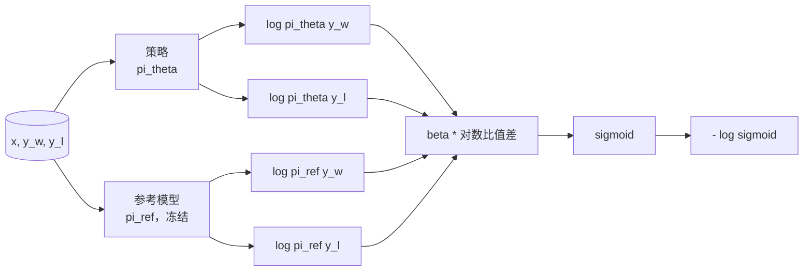
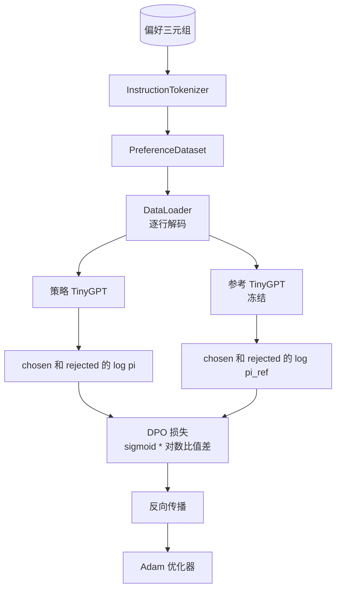

# 毕业项目课程 40：从零实现直接偏好优化

> 奖励模型（reward model）和 PPO 是经典的 RLHF 技术栈。直接偏好优化（Direct Preference Optimization，DPO）把这套栈压缩为一个单一的监督损失，直接用偏好对来拟合策略（policy）。本课将从奖励差分恒等式推导 DPO 损失，交付一个可运行的参考模型（reference model）与策略模型，计算逐词元对数概率，并在包含选中（chosen）与拒绝（rejected）补全的小型偏好样例上训练一个微型 Transformer。测试会固定损失数学和梯度方向，让你确认实现与论文一致。

**类型：** 实战
**语言：** Python (torch, numpy)
**先修要求：** 第 19 阶段课程 30-37（NLP LLM 路线：分词器、嵌入表、注意力块、Transformer 主体、预训练循环、检查点、生成、困惑度）
**时长：** ~90 分钟

## 学习目标

- 将 DPO 损失推导为一个作用于缩放对数比值差上的 sigmoid，并把它与隐式奖励联系起来。
- 构建由冻结参考模型和可训练策略模型组成的参考模型 + 策略模型配对。
- 在两个模型下计算序列级对数概率，并屏蔽提示词元。
- 在 `(prompt, chosen, rejected)` 三元组上训练策略，并观察选中答案相对于拒绝答案的对数概率上升。
- 用损失数学、梯度符号和参考不变性的测试来固定行为。

## 问题

你已经有了一个 SFT 模型。它能遵循指令，但输出质量并不稳定；有些补全清晰，有些则冗长或错误。你还有一个小型偏好对数据集：对于同一个提示，人类把一个补全标记为选中，另一个标记为拒绝。

经典的 RLHF 答案是两阶段流水线：先在偏好数据上训练奖励模型，再用 PPO 按奖励优化策略。这能工作，但代价高昂：PPO 期间内存里要同时放两个模型，要做 KL 控制以让策略接近参考模型，而且当奖励模型脆弱时还会出现奖励劫持（reward hacking）。

DPO 用一个单一的监督损失替代了这两个阶段。奖励模型不再显式存在。策略直接在偏好对上训练，同时通过一个朝向 SFT 参考模型的显式 KL 惩罚进行约束。在 Bradley-Terry 偏好模型下它有相同的最优解，但代码量小得多。

## 概念

从 Bradley-Terry 模型开始。给定提示 `x` 与两个补全 `y_w`（选中）和 `y_l`（拒绝），人类偏好 `y_w` 的概率是

```text
P(y_w > y_l | x) = sigmoid( r(x, y_w) - r(x, y_l) )
```

其中 `r` 是某个潜在奖励函数。RLHF 先根据偏好拟合 `r`，然后在带有 KL 锚点的目标下训练策略 `pi` 去最大化 `r`：

```text
max_pi   E_{x, y~pi} [ r(x, y) ] - beta * KL(pi || pi_ref)
```

DPO 的推导观察到：在这个目标下的最优策略 `pi*` 可以用 `r` 写成闭式形式：

```text
pi*(y | x) = (1/Z(x)) * pi_ref(y | x) * exp( r(x, y) / beta )
```

把式子重排，解出 `r`：

```text
r(x, y) = beta * ( log pi*(y | x) - log pi_ref(y | x) ) + beta * log Z(x)
```

`log Z(x)` 项对 `y_w` 和 `y_l` 来说相同（它依赖 `x`，不依赖 `y`），因此在你计算偏好差分时会相互抵消：

```text
r(x, y_w) - r(x, y_l) = beta * ( log pi_theta(y_w|x) - log pi_ref(y_w|x)
                                - log pi_theta(y_l|x) + log pi_ref(y_l|x) )
```

把它代入 Bradley-Terry 的 sigmoid，并对偏好对取负对数似然：

```text
L_DPO(theta) = - E_{(x, y_w, y_l)} [
  log sigmoid( beta * ( log pi_theta(y_w|x) - log pi_ref(y_w|x)
                       - log pi_theta(y_l|x) + log pi_ref(y_l|x) ) )
]
```

这就是损失。它对每个样本只需要一个标量，再由四个对数概率计算得出并送入 sigmoid。没有单独的奖励模型。没有 PPO。损失里也没有额外的 KL 项；KL 约束已经内嵌在闭式推导里。



## 梯度的符号

在任何训练运行之前，这都是一个很好用的健全性检查。对 `log pi_theta(y_w | x)` 求梯度：

```text
d L_DPO / d log pi_theta(y_w | x) = - beta * (1 - sigmoid(z))
```

其中 `z` 是 sigmoid 的输入。对所有 `z` 来说它都为负，这意味着：提高策略对选中补全的对数概率会降低损失。对称地，关于 `log pi_theta(y_l | x)` 的梯度为正：提高拒绝补全的对数概率会增大损失。训练会把选中项往上推，把拒绝项往下压。参考模型是冻结的；它不会移动。

## 数据

本课随附十二个偏好三元组。每个都是 `(prompt, chosen, rejected)`。选中补全简短而准确；拒绝补全则冗长、离题或错误。这些样本覆盖与第 39 课相同的任务族（首都、算术、列表），因此从 SFT 基座出发的策略会有一个合理的起点。

这个样例集刻意保持很小。生产环境中的 DPO 通常会处理成千上万条偏好对；在这里，重点是让损失数学和训练循环能在一个小数据集上端到端跑通，并且让“选中 vs 拒绝”的对数概率间隙肉眼可见地增长。

## 参考不变性

DPO 实现必须谨慎处理参考模型。参考模型就是被冻结的 SFT 模型。有三个性质必须成立：

- 参考模型参数永远不接收梯度。
- 参考模型的对数概率在各个 epoch 之间永远不变。
- 策略从与参考模型完全相同的权重开始。（最优 `theta` 是“参考模型 + 学到的更新”；因此把策略初始化为参考模型的拷贝，是定义明确的起点。）

实现通过以下方式保证这些性质：

- 在前向传播期间用 `torch.no_grad()` 包裹参考模型。
- 对每个参考参数设置 `requires_grad=False`。
- 在构建好参考模型之后，通过 `policy.load_state_dict(reference.state_dict())` 来构造策略。

## 架构



模型与第 39 课使用的 TinyGPT 相同（仅解码器、因果式、字节分词器）。参考模型和策略共享同一架构；训练过程中策略权重会偏离参考模型，而参考模型始终保持不变。

## 你将构建什么

实现由一个 `main.py` 和测试组成。

1. `InstructionTokenizer`：带有 `INST` 和 `RESP` 特殊标记的字节分词器。结构与第 39 课相同。
2. `TinyGPT`：仅解码器 Transformer。结构与第 39 课相同，因此即使你跳过了 39，本课也仍然自洽。
3. `make_preferences`：返回十二个 `(prompt, chosen, rejected)` 三元组。
4. `sequence_log_prob`：给定模型、提示前缀和补全，返回补全部分上逐个下一词元对数概率的总和（不包含提示位置的贡献）。
5. `dpo_loss`：接收四个对数概率和 `beta`，返回逐样本损失张量，以及用于日志记录的隐式奖励差值。
6. `train_dpo`：逐 epoch 的循环，在策略和参考模型下分别计算 chosen 与 rejected 的对数概率，应用损失，并执行 Adam 更新。
7. `evaluate_margins`：返回任意时刻策略下“选中减拒绝”对数概率边际的均值。
8. `run_demo`：从一个小型预热预训练模型构建参考模型与策略，复制权重，训练三十步，打印每步的损失和边际，并在成功时以零状态码退出。

## 为什么 DPO 有效

在 Bradley-Terry 偏好模型下，DPO 在数学上等价于 RLHF，只是奖励的参数化方式不同。隐式奖励 `r(x, y) = beta * (log pi(y|x) - log pi_ref(y|x))` 可以从偏好中识别出来，但只精确到一个 `x` 的函数；而这个函数会在差分中抵消。闭式策略使你可以跳过显式奖励模型。KL 约束则以结构化方式得到保证：任何 `pi` 偏离 `pi_ref` 的行为都会让对数比值变大，而 sigmoid 会逐渐饱和，因此当策略走得太远时梯度会被抑制。参考模型就是你的安全网。

## 延伸目标

- 为对数概率总和加入长度归一化：除以补全长度。长度偏置是 DPO 已知的失败模式之一，因为模型可能会偏向更短的补全，仅仅因为它们的对数概率绝对值更大。
- 加入 IPO 变体损失：把 `sigmoid + log` 替换为 `(z - 1)^2`。比较它在样例集上的收敛情况。
- 加入标签平滑参数，在硬性的“选中-拒绝”标签与均匀的 0.5 之间做插值。
- 用一个更小、更便宜的模型替代参考模型（知识蒸馏风格）。

这个实现交付了损失、参考不变性和训练循环。数学是这节课的核心。代码让数学变得具体。
