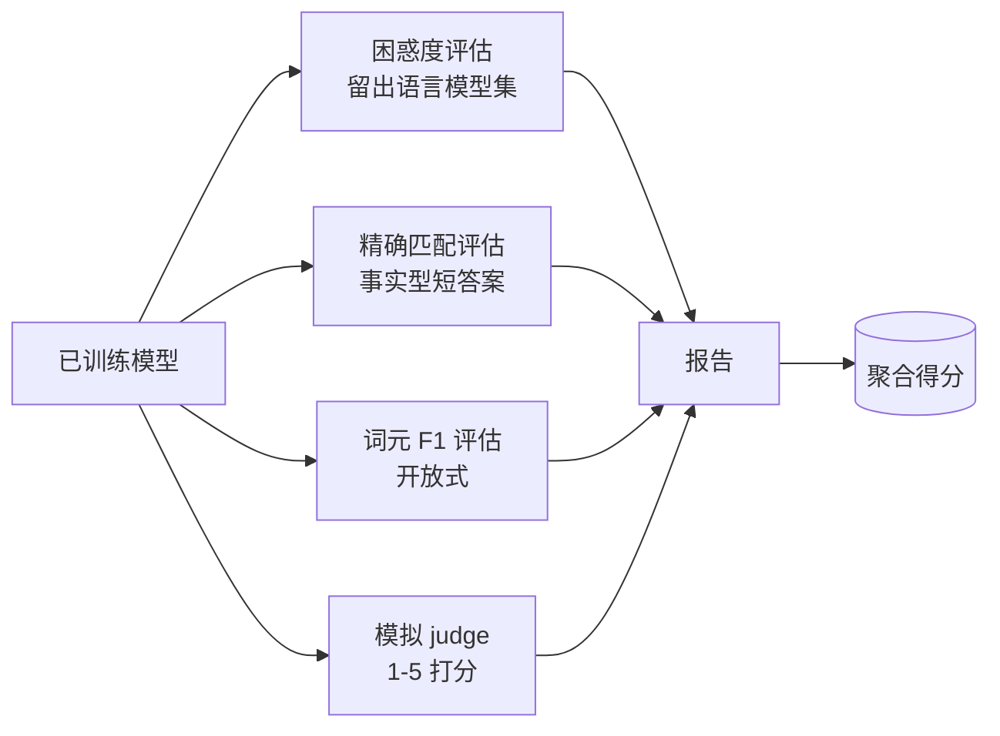
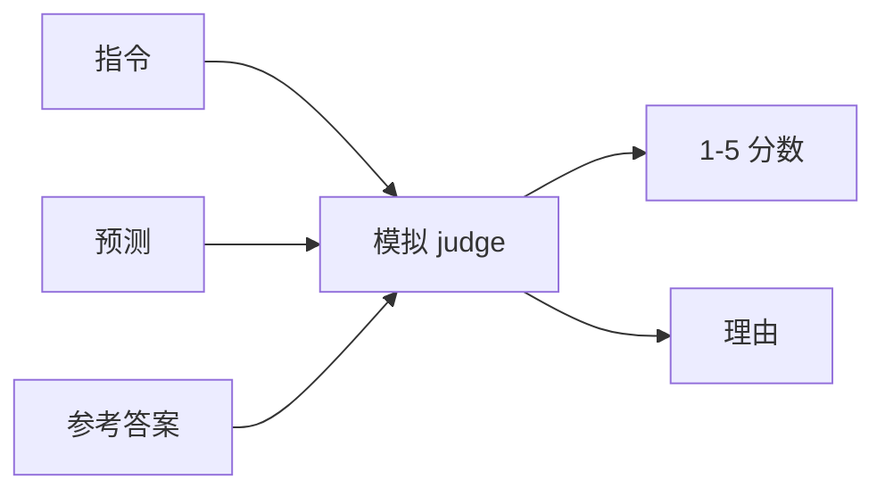
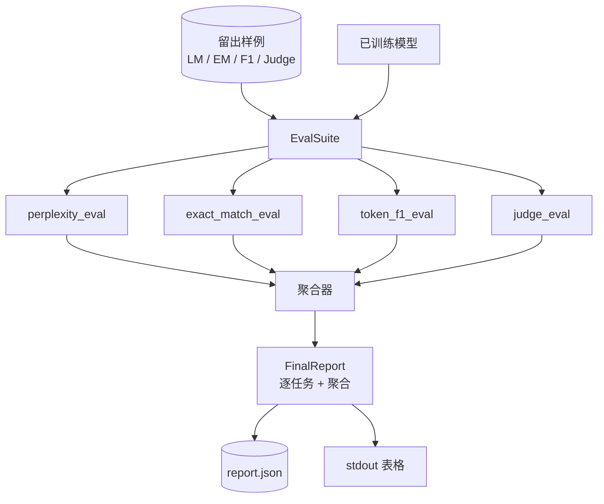

# 毕业项目课程 41：完整评估流水线

> 训练是你可以用损失曲线监控的部分，评估（evaluation）则是你必须亲自设计的部分。本课构建一条统一的评估流水线（evaluation pipeline）：它接收任意已训练语言模型，在其上运行四种异构评估，将结果汇总成按任务划分的报告，并提供一个本地模拟的 LLM-as-judge，让整个闭环无需联网即可运行。这四类评估覆盖了任何要交付模型都需要的维度：语言建模（困惑度，perplexity）、短式正确性（精确匹配，exact-match）、开放式相似度（词元 F1，token F1），以及定性评分（judge）。

**类型：** 实战
**语言：** Python (torch, numpy)
**先修要求：** 第 19 阶段课程 30-37（NLP LLM 路线：分词器、嵌入表、注意力块、Transformer 主体、预训练循环、检查点、生成、困惑度）
**时长：** ~90 分钟

## 学习目标

- 在一个微型 Transformer 上，使用带掩码的词元计数来计算留出集困惑度。
- 在短格式事实型提示上运行精确匹配评估。
- 在归一化后的预测字符串与参考字符串之间计算词元级 F1。
- 构建一个本地模拟的 LLM-as-judge，以 1-5 分对模型输出打分。
- 将这四类评估汇总为一个带任务拆分的单一加权报告。

## 问题

单一指标永远无法完整描述一个语言模型。困惑度告诉你模型对语言分布拟合得有多好，但完全无法说明它是否会回答问题。精确匹配能判断模型是否生成了标准答案字符串，却会惩罚正确的改写。词元 F1 会宽容改写，但也会被错误内容中的词汇重叠所欺骗。LLM-as-judge 能捕捉定性维度，但代价高且具有随机性。

你真正想要的流水线必须同时拥有这四种评估。每一种都覆盖了其他评估缺失的一个维度。每一种都运行在为该指标专门设计的不同留出子集上。最终报告会并排展示各任务分数和聚合结果，让审阅者一眼就能看出模型正在做出哪些权衡。

本课会把这条流水线从头到尾构建出来，而且全部放在一个文件中。

## 概念

每个评估都是一个从 `(model, dataset) -> EvalResult` 的函数。结果中带有指标值、便于检查的逐样本细节，以及供聚合使用的名称。流水线通过一份配置把这些评估组合起来，这份配置说明要运行哪些评估、各自权重是多少。

## 正确计算困惑度

困惑度是 `exp(mean negative log-likelihood per token)`。实现里有两个陷阱：

- 均值必须对真实词元位置求，而不是对 batch * sequence 求。填充词元必须从分母中排除，否则困惑度看起来会比实际更好。
- 模型预测的是下一个词元，因此位置 `i` 上的 logits 预测的是位置 `i+1` 的词元。这里的一位偏移错误往往悄无声息：损失仍能训练，但指标会失去意义。

该评估会按 batch 计算非 pad 位置上 `-log p(token)` 的总和，以及对应的词元总数，最后再做除法。这比先求每个 batch 的困惑度再取平均在数值上更安全（那样会低估短序列的权重），也与教材定义一致。

## 带归一化的精确匹配

这个评测框架会在比较前先对预测和参考都做归一化：

- 转成小写。
- 去掉首尾空白。
- 把内部连续空白折叠为一个空格。
- 如果双方仅在末尾标点上不同，则去掉句末标点（`.`, `!`, `?`）。

归一化让精确匹配在实践中真正可用。模型回答 `"Paris"` 是对的；回答 `"Paris."` 也是对的；回答 `"  paris  "` 仍然是对的。这个指标依然要求答案在归一化后成为同一个字符串。

## 以正确方式计算词元 F1

词元 F1 是在词袋（bag-of-tokens）上计算精确率与召回率后得到的调和平均。步骤如下：

1. 对预测和参考做归一化（规则与精确匹配相同）。
2. 将两者分别拆成词元列表（按空白分词）。
3. 统计多重集合交集。
4. 精确率 = `intersection_count / len(pred_tokens)`。召回率 = `intersection_count / len(ref_tokens)`。F1 = 调和平均。

如果预测和参考都为空，F1 记为 1（真空匹配）。如果只有一边为空，F1 记为 0。这个模式与 SQuAD 评估参考实现一致，并能在改写场景下给出稳定数值。

## 本地模拟 LLM-as-Judge

真实的 judge 是一个通过 API 提供服务的前沿模型。而在本课里，judge 必须离线运行。这个模拟 judge 是一个确定性打分器，它接收 instruction、模型预测和参考答案，返回 `{1, 2, 3, 4, 5}` 中的一个分数，以及一行理由。评分规则是显式写出的：

- 如果归一化后的预测与归一化后的参考完全相同，记 5 分。
- 如果预测与参考之间的词元 F1 至少为 0.8，记 4 分。
- 如果词元 F1 落在 `[0.5, 0.8)`，记 3 分。
- 如果词元 F1 落在 `[0.2, 0.5)`，记 2 分。
- 否则记 1 分。

这不是真正的 judge，但接口是对的。以后只需替换一个函数，就能接入真实模型。流水线本身并不关心。

## 聚合

聚合结果是归一化评估分数的加权平均。每个评估都会把自己的数值报告到 `[0, 1]`：

- 困惑度：按 `1 / (1 + log(perplexity))` 归一化。困惑度为 1 时映射到 1，正无穷映射到 0。
- 精确匹配：天然就在 `[0, 1]`。
- 词元 F1：天然就在 `[0, 1]`。
- Judge：除以 5。

权重可配置。默认组合是 0.2 困惑度、0.3 精确匹配、0.3 词元 F1、0.2 judge。如何设置权重本质上是产品决策；本课把这个旋钮暴露出来，方便你实验。

## 架构

`EvalSuite` 是一个很薄的协调器。每个独立评估都是一个自由函数，接收 `(model, tokenizer, dataset, config)` 并返回一个 `EvalResult`。`Aggregator` 负责收集结果并生成最终报告。演示程序会打印表格，并写出一个 JSON 副本，供下游 CI 摄取。

## 你将构建什么

实现由一个 `main.py` 和测试组成。

1. `TinyGPT`：与第 38-40 课相同的仅解码器架构；这里一并包含，使本课能够独立阅读。
2. `InstructionTokenizer`：带有 INST / RESP / PAD 特殊标记的字节分词器。
3. 四组样例：一个 LM 语料集、一个 EM 集、一个 F1 集和一个 judge 集。每组各二十个样本，且完全确定。
4. `perplexity_eval`：返回带有困惑度数值和逐词元损失直方图的 `EvalResult`。
5. `exact_match_eval`：返回平均 EM 以及逐样本记录。
6. `token_f1_eval`：返回平均词元 F1 以及逐样本记录。
7. `mock_judge` 和 `judge_eval`：逐样本分数与理由，以及整个集合上的平均分。
8. `Aggregator.normalise`：逐评估的归一化规则。
9. `Aggregator.aggregate`：加权平均和拼装后的报告。
10. `run_demo`：先短暂训练一个微型模型，再运行全部四项评估，打印报告表格并写出 JSON，成功时以零状态码退出。

## 如何阅读报告

报告有三层。最上层是聚合分数。其下是四个逐评估数值。再往下是用于诊断的逐样本拆分。CI 运行失败时通常只关心聚合分数，但如果审阅者在追踪回归问题，就需要查看逐样本拆分，以了解模型到底在哪些输入上出了错。

JSON 导出使用稳定的键名，因此 CI 仪表盘可以跨版本绘制趋势线。格式化打印的表格则是给训练运行结束后盯着终端的人看的。

## 延伸目标

- 加入校准评估：模型的 softmax 概率是否与其准确率匹配？按置信度分桶，并报告每个桶中的经验准确率。
- 加入鲁棒性评估：为每个样本打上扰动标签（typo、paraphrase、distractor），并报告每种扰动下的指标下降。
- 用通过 HTTP 调用的真实模型替换模拟 judge。函数签名不变。
- 加入逐任务权重学习：不再使用固定权重，而是根据模型之间的目标偏好顺序来拟合权重。

这个实现交付了四类评估、聚合器和报告。真实评估流水线会在其上继续叠加更多维度；但模式保持不变：每个评估一个函数，一个聚合器，一个报告。
