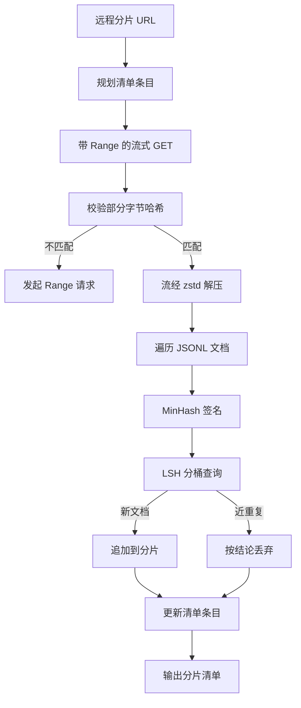

# 大型语料库下载器

> 训练语言模型早在第一次前向传播之前就开始了。语料必须先落到磁盘上、完成解压、去重并可被寻址，而且在网络于 4% 处断开之前，就得把断点续传方案设计好。本课将构建一个流式下载器（streaming downloader）：它拉取压缩分片（shard），使用 Zstandard 边下载边解压，通过 MinHash 加上局部敏感哈希（locality-sensitive hashing，LSH）为近重复文档生成指纹，并写出一份可供流水线其余部分信任的分片清单（manifest）。

**类型：** 实战
**语言：** Python
**先修要求：** 第 19 阶段课程 30-37
**时长：** ~90 分钟

## 学习目标

- 使用 `urllib` 流式拉取远程分片，并用 `zstandard` 解压，而不把整个文件缓冲进内存。
- 通过对已验证字节偏移发起 HTTP `Range` 请求来续传部分下载。
- 为每个文档构建 MinHash 签名，并使用 LSH 对其分桶，让近重复项发生碰撞。
- 输出分片清单，记录内容哈希、字节大小、文档数量与去重结论。

## 问题

第一次在 200 GB 语料上训练时，网络会在 41% 处掉线，脚本以 `urllib` 异常退出。第二次会在 78% 处掉线。到 99% 时，你已经把循环重写了三遍。从第一分钟起你就必须为两类失败设计方案：部分下载后的断点续传，以及重复文档的移除。这两者都有成熟解法；但它们经常被跳过，因为流水线一开始只是一个一行的 `requests.get` 调用，后来却越长越复杂。

续传是一个 HTTP 问题。服务器必须支持 `Range`，客户端必须针对磁盘记录跟踪“已验证偏移”，而这个已验证偏移还必须在进程死亡后仍然存在。如果偏移与文件内容哪怕只差一个字节，续传就会写入垃圾数据，从而以一种只有在分词时才暴露出来的方式损坏语料。

去重是一个签名问题。精确哈希去重会漏掉近重复：同一篇 Wikipedia 文章可能带着三种不同的样板页脚出现；同一个代码文件可能只换了许可证头；同一篇博客文章可能在每个链接上都带了不同的跟踪参数。MinHash + LSH 能以次线性代价抓住这些情况。代价是每个文档一份签名，以及每份签名一次桶查询。

## 概念



### 使用 `urllib` 进行流式处理

标准库中的 `urllib.request.urlopen` 会返回一个类文件对象。把它包装进 `zstandard.ZstdDecompressor().stream_reader`，字节流就会从网络穿过解压器流入文档迭代器，全程都不需要在内存中物化压缩分片或解压后的分片。唯一的内存开销是行缓冲、当前文档的 MinHash 签名，以及 LSH 索引。

### 使用 `Range` 进行续传

下载器为每个分片写两个文件：分片本身，以及一个 `.partial.json` 检查点。检查点会记录 `verified_bytes`、`expected_size`、`sha256_prefix`（对前 `verified_bytes` 个字节计算得到）和源 URL。启动时，下载器会读取检查点，对磁盘上的字节重新计算 `sha256_prefix`，只有在重新计算出的哈希匹配时才会续传。如果哈希不对，部分文件就会被丢弃，下载从字节零重新开始。静默损坏不可能发生，因为已验证字节是被检查出来的，而不是被假定出来的。

### MinHash 加上 LSH

MinHash 能在固定空间内估计两个集合的 Jaccard 相似度。对于文档来说，这个集合就是其文本的 shingles（重叠 n-gram）。签名由 `k` 个最小哈希值组成，每个独立哈希函数对应一个。若两个文档的 Jaccard 相似度为 `s`，那么它们在签名任一单独分量上相同的概率就是 `s`。

随后，LSH 会把这 `k` 个分量分成 `b` 个 band，每个 band 有 `r` 行，其中 `k = b * r`。两个文档至少在一个 band 中发生碰撞的概率为 `1 - (1 - s^r)^b`，这会在你用 `(b, r)` 调好的 `s` 附近形成一个陡峭阈值。典型语料去重的阈值是 `s = 0.8`；LSH 研究文献通常用 `k = 128`、`b = 32`、`r = 4` 达到这一点。

### 将分片清单视为契约

下载器唯一持久化的输出就是清单。清单按分片记录 URL、解压后的字节数、文档数、去重后的唯一文档数，以及最终分片文件的 sha256。下游分词阶段读取的是清单，而不是目录列表。如果某个分片缺失，或者它的 sha256 错了，清单会告诉下一阶段拒绝启动。清单是“数据已经下载好”和“数据已经下载好且可验证”之间的决定性边界。

## 构建它

`code/main.py` 实现了：

- `ShardPlanner` - 读取分片 URL 列表，并产出计划中的清单条目。
- `StreamingDownloader` - 用可选的 `Range` 打开 `urllib` 流，写入临时文件，在每个 chunk 上更新 `.partial.json` 检查点，并在续传时验证 sha256 前缀。
- `ZstdDocIterator` - 将类文件流包装进 `zstandard.ZstdDecompressor`，并按行产出文档。
- `MinHasher` - 使用固定哈希种子族为字符串生成一个 `k` 分量签名。
- `LSHIndex` - 按 band 对签名分桶并报告碰撞。
- `Dedup` - 组合 hasher 与 index，为每个文档标记 `keep` 或 `near_duplicate`，并附上匹配分片 id。
- `ManifestWriter` - 汇总每个分片的统计信息，并写出 `manifest.json`。

文件底部的演示会在磁盘上构建一个小型合成语料，用 `zstandard` 把它压缩，通过 `file://` URL 下载，对其去重，并打印清单。

运行方式：

```bash
python3 code/main.py
```

脚本会以零状态码退出，并打印清单摘要。

## 生产模式

有四种模式可以把本课扩展到真实语料。

**先检查点，后写入。** `.partial.json` 必须在字节追加到分片之前执行 `fsync`。否则一旦断电，顺序就会反过来：分片字节已经落盘，检查点却还没记录它们；下一次续传会以为自己验证过的字节比实际更少，于是重复的后缀字节会损坏文件。先写检查点，再写数据。这与预写日志（write-ahead log）的纪律相同。

**分片化 LSH 索引。** 在整个语料上维护单个 LSH 索引，在 200 GB 规模时放不进 RAM。可以按第一个 band 哈希来切分 LSH 索引，把各个分区存到磁盘，只查询新签名将要落入的那个分区。代价是每个文档多一次磁盘读取；收益是 LSH 索引不再成为刚性的内存上限。

**立碑，不删除。** 被丢弃的重复项会在清单中以 `near_duplicate` 结论记录下来，并带上它所碰撞到的文档分片 id。直接删除会丢失重复项与保留项之间的链接。立碑可以保留审计轨迹，也允许下游流程事后改变对阈值的看法。

**清单中记录每个分片的 sha256，再加上清单自己的 sha256。** 清单本身也要有内容哈希。下游阶段在信任各个分片条目之前，先验证清单哈希。否则，清单就会成为静默攻击面：攻击者只要能编辑一个文件，就能破坏整条流水线。

## 使用它

生产模式：

- **在每次 CI 运行中都支持续传。** CI runner 是临时性的。下载器必须假设每次运行都是一块全新的磁盘，并且能够从缓存或远端恢复。`--cache-dir` 应该是一等标志。
- **在分词之前去重。** 分词很昂贵。同一文档跑两次，成本翻倍，但损失曲线不变。去重应该位于分词上游，而不是下游。
- **把清单作为合并门。** 训练运行从固定 commit 中读取清单 sha256。新的数据集版本必须对应新的清单 commit。代码与数据之间的链接应当是 git，而不是口口相传。

## 交付它

在真实项目中，`outputs/skill-corpus-downloader.md` 会说明哪些 URL 会喂给下载器、检查点目录如何布局、去重使用的 shingle 宽度和 `(k, b, r)` 三元组是什么，以及清单在版本控制里放在哪里。本课交付的是这台引擎。

## 练习

1. 添加 `--shingle-width` 标志，并测量在宽度 3、5、9 下去重结论如何变化。为你选择的默认值做出论证。
2. 在 zstd 旁边加入 gzip 支持，通过检测魔数字节来判断编码。下载器不应要求调用方显式指定编解码器。
3. 添加 `--resume-only` 模式：如果未发现检查点，则拒绝启动全新下载。这在 CI 中很有用，可避免某次运行意外重新拉取 200 GB。
4. 把 LSH 索引迁移到 shelf 或 sqlite 文件中，并测量它相对于内存版本的吞吐量。
5. 在启动时加入清单 sha256 校验。如果磁盘上的清单与 `manifest.lock` 里的清单哈希不一致，下载器应该以失败闭合的方式停止。

## 关键术语

| 术语 | 人们怎么说 | 它真正的含义 |
|------|------------|----------------|
| 分片（Shard） | “一个文件” | 语料的一个自包含切片，拥有自己的 sha256，并作为续传和去重的基本单位 |
| MinHash 签名（MinHash signature） | “指纹” | 一个集合的 `k` 分量草图，其中每个分量都是该集合在某个独立哈希下的最小值 |
| LSH band（LSH band） | “桶” | 由 `r` 个签名分量组成的一组，用作碰撞检测的单一桶键 |
| 已验证字节（Verified bytes） | “续传偏移” | 磁盘上其 sha256 前缀与检查点一致的字节；这是唯一安全的续传起点 |
| 清单（Manifest） | “索引” | 下载器产出内容的唯一持久记录，其中包括内容哈希 |

## 延伸阅读

- [RFC 7233](https://datatracker.ietf.org/doc/html/rfc7233) - HTTP `Range` 请求，也就是续传协议
- [Zstandard format specification](https://datatracker.ietf.org/doc/html/rfc8478) - 使流式解压安全可行的帧格式
- [MinHash](https://en.wikipedia.org/wiki/MinHash) - 本课使用的签名族
- [Locality-sensitive hashing](https://en.wikipedia.org/wiki/Locality-sensitive_hashing) - 支撑去重阈值的 banding 方案
- 第 19 阶段 · 43 - 下载器所供给的 HDF5 词元化语料
- 第 19 阶段 · 44 - 在该语料上训练的 cosine 调度
- 第 19 阶段 · 45 - 消费该调度的 AMP 循环
